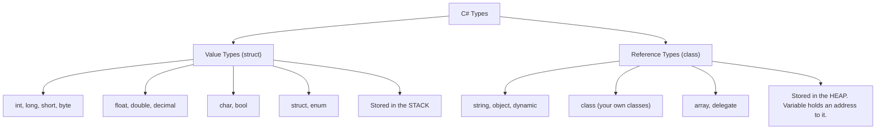
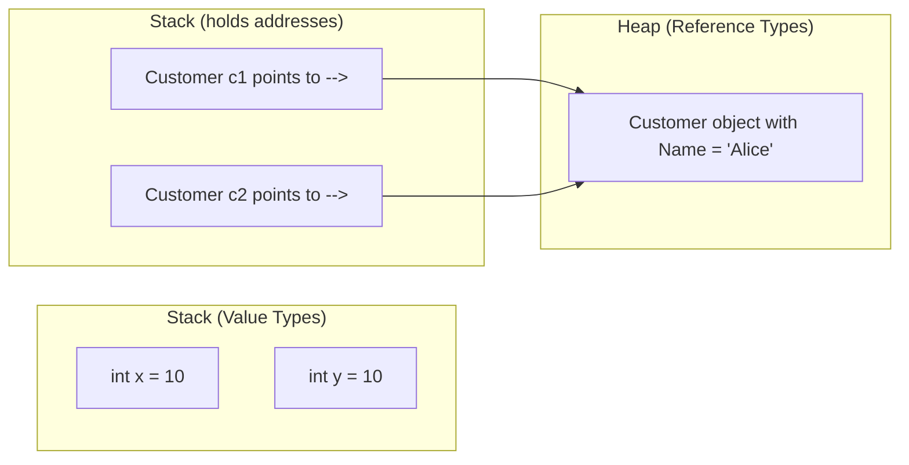
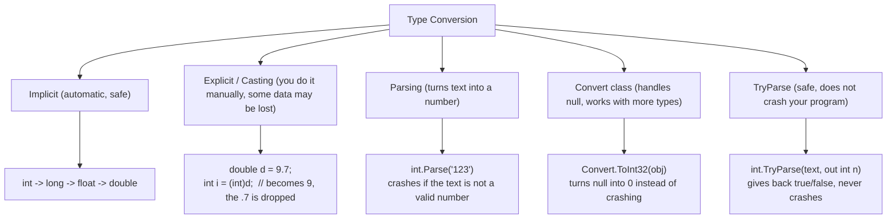
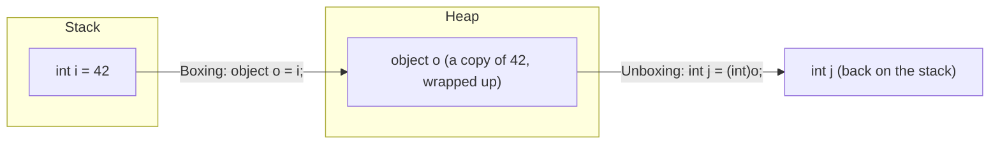

# C# Learning Track — Topic 1: Data Types & Variables (Simple English)

> **Goal:** Learn strong C# for backend jobs (ASP.NET Core, Web API, EF Core) and interviews.
> **Order:** Topic 1 (this file) → Topic 2 (Methods) → Topic 3 (Constructors)
> **Rule:** Answers to the 50 questions are NOT given yet. You try first. Then I check your answer.

---

## 1. What is a Data Type?

A **data type** tells the computer two things:
1. How much memory (space) to use for a value.
2. What you are allowed to do with that value.

For example, you cannot multiply two `true`/`false` values. But you can multiply two numbers.

C# checks types **before** the program runs. This is called **static typing**. If you write wrong types, C# will show an error before you even run the code. This helps you catch mistakes early — very useful for backend apps that must not crash.

### The most important idea: Value Type vs Reference Type



- **Value type**: the variable holds the **actual value**.
- **Reference type**: the variable holds an **address** that points to the value (the value lives somewhere else, in the heap).

**Why this is important for backend work:**
If you send a `struct` (value type) into a method, C# makes a **copy**. If you send a `class` object (like `Customer`) into a method, C# sends the **address**, not a copy. So both the method and the caller point to the **same object**.



If you change `y`, `x` does not change. But if you change something through `c2`, `c1` will also see the change, because they point to the **same** object.

---

## 2. Basic Syntax

```csharp
// General pattern
dataType variableName = value;

// Examples
int age = 30;
string name = "Alice";
bool isActive = true;
```

---

## 3. Built-in C# Data Types — Simple Table

| Group | Type | Size | Notes | Example |
|---|---|---|---|---|
| Whole number | `byte` | 1 byte | 0 to 255 only | `byte b = 200;` |
| Whole number | `short` | 2 bytes | small numbers | `short s = 1000;` |
| Whole number | `int` | 4 bytes | most common whole number type | `int i = 42;` |
| Whole number | `long` | 8 bytes | for very big numbers | `long l = 9000000000L;` |
| Decimal number | `float` | 4 bytes | less accurate, use `f` at the end | `float f = 3.14f;` |
| Decimal number | `double` | 8 bytes | more accurate, default type for decimals | `double d = 3.14;` |
| Decimal number | `decimal` | 16 bytes | most accurate, use `m` at the end — **use for money** | `decimal price = 19.99m;` |
| Text | `char` | 2 bytes | one single letter/symbol | `char c = 'A';` |
| Text | `string` | reference | many characters together (a word/sentence) | `string s = "hello";` |
| Yes/No | `bool` | 1 byte | only `true` or `false` | `bool flag = true;` |
| Special | `object` | reference | can hold any type | `object o = 5;` |
| Special | `dynamic` | reference | type is checked only when the program runs, not before | `dynamic d = 5;` |

### Why we use `decimal` for money, and not `float` or `double`

`float` and `double` store numbers in **binary** form. Some simple decimal numbers (like `0.1`) cannot be stored **exactly** in binary. This causes small errors. These small errors become big problems in money calculations.

`decimal` stores numbers in a way made **specially for money**. It is exact. Always use `decimal` for prices, salaries, totals, etc.

```csharp
double a = 0.1 + 0.2;      // gives 0.30000000000000004  ❌ bad for money
decimal b = 0.1m + 0.2m;   // gives exactly 0.3           ✅ correct for money
```

---

## 4. Nullable Types

Normally, a value type (like `int`) **cannot** be empty (`null`). It must always have a value.

But sometimes we need to say "this value is not known" or "this value is missing." For this, we use **nullable types**.

```csharp
int? age = null;                 // short way to write Nullable<int>
Nullable<int> age2 = null;       // same thing, written the long way

if (age.HasValue)
    Console.WriteLine(age.Value);

int result = age ?? 0;           // if age is null, use 0 instead
```

**Real example:** In a database, a column can allow `NULL`. In your C# code, you write:
`public DateTime? DeletedAt { get; set; }` — this means "this order has not been deleted yet" when the value is `null`.

---

## 5. `var` — Let C# Guess the Type

```csharp
var count = 10;          // C# understands this is an int
var name = "Alice";      // C# understands this is a string
```

Important point: `var` does **not** mean "any type" or "changeable type." C# still fixes the type at compile time (before running). It just lets you skip writing the type yourself — C# figures it out from the value on the right side.

Simple way to remember: **`var` is not lazy typing. It is C# reading the value and deciding the type for you, one time, at the start.**

Rules:
- You must give a value on the same line when you use `var`.
- You cannot write `var x;` and give the value later.

When to use `var`: use it when the type is obvious from the right side, like `var list = new List<Order>();`
When NOT to use `var`: use the real type name when it helps you understand the code better, like `int rowsAffected = ExecuteQuery();`

---

## 6. Constants (`const`) and `readonly`

```csharp
const double Pi = 3.14159;         // value is fixed at compile time, never changes, ever
readonly int maxRetries;           // value can be set once, usually in the constructor
```

| Point | `const` | `readonly` |
|---|---|---|
| When is the value set? | Before the program runs (compile time) | While the program runs (in the constructor) |
| Can different objects have different values? | No — same for everyone | Yes — each object can have its own value |
| Can it be a complex type (like a class)? | No — only simple types and string | Yes — any type |

---

## 7. Declaring and Setting Variables

```csharp
int x;              // just declaring, no value yet
x = 5;               // now giving it a value

int y = 10;          // declaring and giving value together

int a = 1, b = 2, c = 3;   // three variables in one line
```

### Default values (used automatically, if you don't set a value yourself)

| Type | Default value |
|---|---|
| `int`, `long`, `short`, `byte` | `0` |
| `float`, `double`, `decimal` | `0.0` |
| `bool` | `false` |
| `char` | `'\0'` (empty character) |
| Reference types (`string`, `object`, your own classes) | `null` |

⚠️ **Important:** This default value rule works only for **fields** (variables that belong to a class). For **local variables** (variables inside a method), C# does **not** give a default value. You must set a value yourself before using it, or C# will show an error.

---

## 8. Type Conversion (Changing One Type to Another)



```csharp
// Implicit — happens automatically, safe, no data lost
int i = 100;
long l = i;          // int becomes long automatically, nothing is lost

// Explicit — you must write the cast yourself, some data can be lost
double d = 9.99;
int cutValue = (int)d;      // becomes 9 (the decimal part .99 is just removed, not rounded!)

// Parsing — turns text into a number, CRASHES if text is not a valid number
int parsed = int.Parse("123");          // works fine, becomes 123
int bad = int.Parse("abc");             // crashes with an error, because "abc" is not a number

// TryParse — the SAFE way, used in real backend code
if (int.TryParse(userInput, out int value))
{
    Console.WriteLine($"Good number: {value}");
}
else
{
    Console.WriteLine("This is not a valid number");
}

// Convert class — handles null safely, useful when reading from a database
object dbValue = null;
int result = Convert.ToInt32(dbValue);   // gives back 0, does NOT crash
```

**Important rule for interviews and real jobs:** When reading data given by a user (from a web form, URL, etc.), always use `TryParse`. Never use plain `Parse`. This is because bad user input should not crash your app.

---

## 9. Boxing and Unboxing



```csharp
int i = 42;
object o = i;        // BOXING: the value 42 is copied and wrapped inside an object, placed on the heap
int j = (int)o;      // UNBOXING: the value is copied back out into a normal int
```

- Boxing and unboxing cost extra time and memory. This is why `List<int>` is **faster** than the old `ArrayList` for storing numbers — `ArrayList` boxes every number, but `List<int>` does not box anything.
- A common interview question is: *"Why is `List<T>` faster than `ArrayList` when storing integers?"* → Answer: because `List<int>` avoids boxing completely.

---

## 10. Scope and Lifetime (Where a Variable Can Be Used, and How Long It Lives)

```csharp
public class Order
{
    private decimal _total;             // FIELD — lives as long as the object lives

    public decimal Total                // PROPERTY — a wrapper around the field, adds extra logic
    {
        get => _total;
        set => _total = value;
    }

    public decimal CalculateTax()
    {
        decimal taxRate = 0.08m;        // LOCAL VARIABLE — only lives while this method is running
        return _total * taxRate;
    }
}
```

| Type | Where it is written | How long it lives |
|---|---|---|
| Local variable | Inside a method or a block (like `if`, `for`) | Created when the method runs, destroyed when the method finishes |
| Field | Inside a class, outside any method | Lives as long as the object exists |
| Property | Inside a class, wraps around a field | Same lifetime as its field |
| Parameter | Inside the method's `( )` brackets | Same as a local variable — lives only during that one call |

A variable made inside an `if` block or a `for` loop **cannot** be used outside that block. This confuses a lot of beginners, so remember it well.

---

## 11. Common Mistakes and Good Habits

| Mistake | Why it is wrong | How to fix it |
|---|---|---|
| Using `float`/`double` for money | Small errors happen and add up | Use `decimal` instead |
| Using `Parse` on data from a user | It can crash your app if the data is wrong | Use `TryParse` instead |
| Thinking `(int)someDouble` rounds the number | It does NOT round. It just cuts off (removes) the decimal part | Use `Math.Round()` first, if you want proper rounding |
| Forgetting to set a value for a local variable before using it | C# will show a compile error | Always give it a value first |
| Using `dynamic` too much | You lose type checking, code suggestions, and speed | Use normal types. Only use `dynamic` for special cases |
| Mixing up `const` and `readonly` | `const` cannot use a value that is only known while running | Use `readonly` when the value comes from the constructor |
| Thinking `string` is a value type | `string` is actually a reference type. It just "feels" like a value type because it cannot be changed after creation | Understand: giving a string a new value creates a brand-new string object |

---

## 12. Interview Questions (Think about these — we will discuss them together)

1. What is the difference between value types and reference types? Where does each one live in memory?
2. Why do we use `decimal` and not `double` for money?
3. What happens when a value type is "boxed"? Why is it slower?
4. What is the difference between `int.Parse`, `int.TryParse`, and `Convert.ToInt32`?
5. Is `string` a value type or a reference type? Why does it behave like it cannot be changed?
6. What is the difference between `const` and `readonly`?
7. Why is `var` still considered "static typing," and not dynamic typing?
8. What is the default value of an `int` field, compared to an `int` local variable that has not been given a value?
9. What is the difference between implicit and explicit type conversion? Give one example of each.
10. What is a nullable value type? Why would you use `int?` instead of just `int`?

---

## 13. Practice Questions (50 Questions)

**How this works:**
- Try to solve each question yourself first.
- Send me your answer/code.
- I will check it: is it correct, what mistakes are there, how to improve it, a better solution with the reason why, a score out of 10, and what you should practice next.
- I will **not** give you the answer straight away.

### Beginner (1–10)

1. Make an `int`, a `double`, a `string`, and a `bool` variable, give each one a value, and print each with `Console.WriteLine`.
2. Make two whole numbers and print their sum, difference, product, and division result.
3. Make a `char` variable with your first letter/initial in it, and print it together with a greeting message.
4. Make a `string` variable without giving it a value right away. Give it a value on the next line, then print it.
5. Make three variables in one line, using the multiple-variable syntax (`int a = 1, b = 2, c = 3;`), and print their total sum.
6. Make a `bool` variable for `isLoggedIn`, and print a different message depending on if it is `true` or `false`, using an `if` statement.
7. Make a class with an `int` field that you don't give a value to. Print it from a method. See and explain what the default value is.
8. Use `var` to make three separate variables: one holding a whole number, one holding text, and one holding a decimal number. Print the actual type of each using `.GetType()`.
9. Make a `const` for the number of days in a week, and use it to calculate the number of days in `n` weeks.
10. Write a small program that swaps (exchanges) the values of two `int` variables, using a third, temporary variable.

### Basic (11–20)

11. Make a `float` and a `double`, both with the same decimal value. Print both to 10 decimal places, and explain what difference you see.
12. Write code showing an implicit conversion from `int` to `long` to `double`. Print the value and the type at each step.
13. Write code that explicitly changes (casts) a `double` (for example `9.99`) into an `int`. Print the result, and explain what happened to the decimal part.
14. Use `int.Parse` to change a fixed piece of text into a number. Then, on purpose, give it a bad piece of text, and see (and explain) the error that happens.
15. Rewrite question 14, but this time use `int.TryParse` so that bad input does not crash your program.
16. Make a `decimal` variable for a product's price, and a `double` variable with the exact same number. Multiply both by `3`, and compare the two results.
17. Make an `int?` (nullable int) variable, set it to `null`, then use the `??` operator to give a default value when you print it.
18. Show boxing and unboxing clearly in code: box an `int` into an `object`, then unbox it back into an `int`. Print the value at each step.
19. Write a small program with a local variable made inside an `if` block. Show (using a comment) why you cannot use this variable outside that block.
20. Make a `char` variable, and show how to change it to its numeric (ASCII/Unicode) value using an explicit cast to `int`.

### Intermediate (21–30)

21. Write a `Product` class with fields `Name` (string), `Price` (decimal), and `Quantity` (int). Make one object, do not set any field yourself, and print all fields. This shows the default values for a class.
22. Write a method that takes a `string` (a user's typed age) and safely changes it into an `int` using `TryParse`. If it fails, return `-1` as a fallback value.
23. Show and explain the difference between using `Convert.ToInt32(null)` on a null object, versus trying `(int)nullObject` with a direct cast. Explain the difference in behavior.
24. Make two `object` variables, and box the same number `5` into each one separately. Prove (using `ReferenceEquals` or similar) that they are two different boxed objects in the heap.
25. Write a program that pretends to read three column values from a CSV row (as text/strings), and safely converts them into `int`, `decimal`, and `DateTime` using the correct safe conversion methods.
26. Explain and show, with code, why `0.1m + 0.2m == 0.3m` gives `true` for `decimal`, but `0.1 + 0.2 == 0.3` gives `false` for `double`.
27. Write a `BankAccount` class with a `readonly decimal` field called `InterestRate`, set only in the constructor. Show (as a comment) that trying to change it later does not compile.
28. C# does not allow a `const` array. Show this limitation, and instead show the correct way to do it: using `static readonly` for a fixed list of tax brackets.
29. Write code that gives a `dynamic` variable an `int` value, then later changes it to hold a `string` value. Print its actual type after each change, and explain why this is allowed to compile.
30. Make a `Customer` class (a reference type) and a `Point` struct (a value type) with similar-looking fields. Write two methods, `ModifyClass` and `ModifyStruct`, that each try to change a field. Show and explain why one change is visible outside the method, and the other is not.

### Advanced (31–40)

31. Design an `Employee` class using the correct data types for: `Id` (int), `FullName` (string), `Salary` (decimal), `HireDate` (DateTime), `IsActive` (bool), `TerminationDate` (nullable DateTime). In comments, explain why you chose each type.
32. Write a helper method `SafeDivide(int numerator, int denominator)` that returns `int?`. It should return `null` instead of crashing when dividing by zero.
33. Pretend you are reading 10 price values (as text) coming from an outside API, and some of them are broken/invalid. Use `TryParse` in a loop to build a `List<decimal>` of only the valid ones, and count how many failed.
34. Show a real bug that happens when you use `float` for a running total, adding `0.1f` one hundred times in a loop, and compare the result to the expected `10.0`.
35. Show (in comments, no need to actually run a speed test) the performance difference between storing 100,000 whole numbers in an old-style `ArrayList` (which boxes every number) versus a `List<int>` (which does not box). Explain why the generic `List<int>` is faster.
36. Build a small `Money` struct, holding a `decimal Amount` and a `string CurrencyCode`. Show that assigning one `Money` variable to another **copies the value**, instead of sharing the same object.
37. Write a method that takes `object value` (as if it came from a loosely typed API response), and safely converts it into an `int`. Use pattern matching (`is int i`), and if that fails, try `Convert.ToInt32`, and also handle the case where `value` is a string using `TryParse`.
38. Show a tricky bug that happens with the implicit conversion from `int` to `float` when the number is very large (like `int.MaxValue`), causing loss of precision. Explain why this happens.
39. Write a class `InventoryItem` that uses `int?` for `StockCount`, meaning "we have not counted the stock yet," as different from `0`, meaning "we counted it, and there are zero items." Write logic that behaves differently for these two cases, and explain in comments why this difference matters in a real inventory system.
40. Explain and show, with code, the difference between `default(int)`, `default(int?)`, and `default(string)` using the `default` keyword.

### Complex / Real-World (41–50)

41. You are building the backend for an online shop's checkout page. Design the correct data types for an `Order` object: `OrderId`, `SubTotal`, `TaxAmount`, `ShippingCost`, `Discount`, `Total`, `PlacedAtUtc`, `IsPaid`, `CouponCode` (nullable). Explain each choice, and write code that calculates `Total` correctly from the other money fields, never using `double` or `float` for money.
42. Write a method that takes a raw form submission (all values come in as `string`, just like real HTTP form data) for `RegisterUserRequest` (Age, Email, IsSubscribed, SignupDate). Safely convert each value into its correct strongly-typed field, and instead of crashing, collect any conversion problems into a `List<string>` of error messages.
43. Pretend you are reading a database row where a nullable column `decimal? DiscountPercentage` can be `null` (meaning "no discount"). Write logic that only applies the discount when a value is actually present, using the `??` and `?.` null-safe patterns.
44. Build a simple `Currency Converter` that takes a `decimal amount`, a `double exchangeRate` (like what you get from an outside exchange rate API), and returns a `decimal` result. In comments, explain why you must first convert the `double` rate before multiplying it with the `decimal` amount, and what small precision risk still remains.
45. Design a `HospitalPatient` class, balancing correctness and memory usage: `PatientId` (int), `Name` (string), `HeightCm` (float — small errors are okay here), `WeightKg` (float), `BloodType` (char or a small enum), `AdmissionDate` (DateTime), `DischargeDate` (nullable DateTime), `OutstandingBalance` (decimal — must be exact, since it involves money). Explain your type choice for every field.
46. Write a method that reads a batch-uploaded CSV file of transaction amounts (as text, sometimes with currency symbols like `"$1,234.56"`), and converts them into `decimal` values. Remove invalid characters first, and use `TryParse` with the correct `NumberStyles`, keeping track of which rows failed and why.
47. Show, with a real example, a bug in a busy API method that boxes millions of `int` values per second — for example, by storing them in an old-style non-generic collection, or by using `object`-typed parameters when it wasn't needed. Then fix the code to remove the boxing completely.
48. Design a `LibraryBook` system where `CopiesAvailable` (int) should never go below zero, and `Isbn` uses the correct type (string, because ISBN numbers can have leading zeros and hyphens). Write a method `CheckOutBook()` that safely reduces the count by one, using the correct types, and protecting against invalid situations.
49. You receive a `dynamic` object (from JSON, sent by an outside webhook) with an unpredictable shape/structure. Write code that safely takes a numeric `Amount` field out of it and turns it into a `decimal`. Handle these cases: the field is missing, the field is a string, and the field is already a number — without letting a `RuntimeBinderException` crash your webhook handler.
50. Design the full list of fields (with comments explaining your choice) for a `BankTransaction` record, made for a real banking system. It must correctly separate `Pending` amounts from `Posted` amounts, support multiple currencies, completely avoid floating-point rounding risk, and correctly represent an optional `ReversedAt` timestamp. Then write one method, `ApplyTransaction(Account account)`, that uses these types correctly.

---

## What happens next

Send me your answer to **Question 1** (or any question you like — you don't need to go in order, but beginner-to-complex is the best way). I will check it for:

1. ✅ Does it work correctly?
2. 🐛 Any mistakes or bugs?
3. 💡 Ways to improve it
4. 🏆 A better way to write it, and why it is better
5. ⭐ A score out of 10
6. 📌 What to practice next

Once you have done a good number of Topic 1 questions, we move to **Topic 2: C# Methods**.
