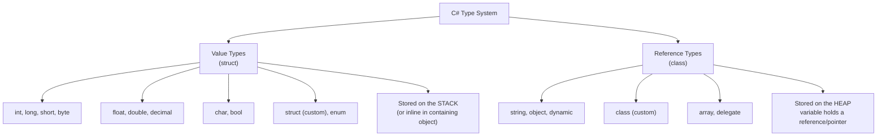
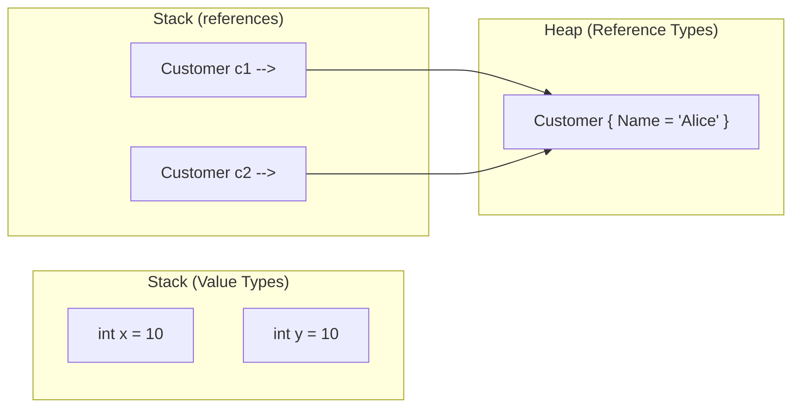
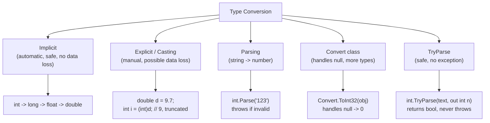
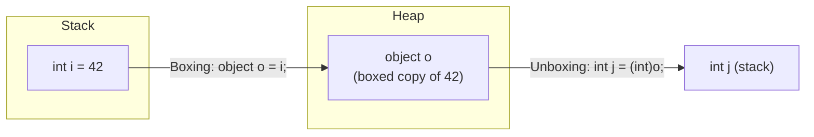

# C# Mastery Track — Topic 1: Data Types & Variable Declaration

> **Track goal:** Strong backend C# skills (ASP.NET Core, Web API, EF Core) + interview readiness.
> **Progression:** Topic 1 (this file) → Topic 2 (Methods) → Topic 3 (Constructors)
> **Rule:** We stay on Topic 1 until you've worked through it. Solutions to the 50 exercises are **withheld** — submit your attempts and I'll review them.

---

## 1. Concept

A **data type** tells the compiler two things about a piece of data:
1. **How much memory** to reserve for it.
2. **What operations** are legal on it (you can't multiply two `bool`s, but you can multiply two `int`s).

C# is **statically typed** — every variable's type is known at compile time, which is why the compiler can catch type errors before your app ever runs (a big advantage over dynamically typed languages when you're building backend systems that must be reliable).

### The single most important mental model: Value Types vs Reference Types



**Why this matters in real backend code:** when you pass a `struct` (value type) into a method, C# copies it. When you pass a `class` (reference type) like your `Customer` entity into a method, C# copies the *reference* — both the caller and the method point at the same object in memory. This is one of the top 3 things interviewers probe for.



If you change `y`, `x` is untouched. If you change a property through `c2`, `c1` sees the change too — because both point at the *same* object.

---

## 2. Syntax

```csharp
// Basic declaration
dataType variableName = value;

// Examples
int age = 30;
string name = "Alice";
bool isActive = true;
```

---

## 3. Built-in C# Data Types — Reference Table

| Category | Type | Size | Range / Notes | Example |
|---|---|---|---|---|
| Integer | `byte` | 1 byte | 0 to 255 (unsigned) | `byte b = 200;` |
| Integer | `short` | 2 bytes | -32,768 to 32,767 | `short s = 1000;` |
| Integer | `int` | 4 bytes | ~-2.1B to 2.1B | `int i = 42;` |
| Integer | `long` | 8 bytes | Very large | `long l = 9000000000L;` |
| Floating | `float` | 4 bytes | ~7 digit precision, suffix `f` | `float f = 3.14f;` |
| Floating | `double` | 8 bytes | ~15-16 digit precision (default for decimals) | `double d = 3.14;` |
| Floating | `decimal` | 16 bytes | 28-29 digit precision, suffix `m` — **use for money** | `decimal price = 19.99m;` |
| Text | `char` | 2 bytes | Single UTF-16 character | `char c = 'A';` |
| Text | `string` | reference | Sequence of chars (immutable) | `string s = "hello";` |
| Logical | `bool` | 1 byte | `true` / `false` | `bool flag = true;` |
| Special | `object` | reference | Base type of everything | `object o = 5;` |
| Special | `dynamic` | reference | Type checked at **runtime**, not compile time | `dynamic d = 5;` |

### Why `decimal` for money, never `float`/`double`
`float`/`double` are **binary floating point** — they cannot represent many decimal fractions exactly (e.g., `0.1`), causing rounding errors that compound in financial calculations. `decimal` is **base-10** floating point, built exactly for currency. In an ASP.NET Core e-commerce API, `OrderTotal` should always be `decimal`.

```csharp
double a = 0.1 + 0.2;      // 0.30000000000000004  ❌ dangerous for money
decimal b = 0.1m + 0.2m;   // 0.3                   ✅ exact
```

---

## 4. Nullable Types

Value types normally **cannot** be `null` (a `struct` always has a value). Nullable types let you represent "no value" — essential when mapping database columns that allow `NULL`.

```csharp
int? age = null;                 // shorthand for Nullable<int>
Nullable<int> age2 = null;       // explicit form (same thing)

if (age.HasValue)
    Console.WriteLine(age.Value);

int result = age ?? 0;           // null-coalescing: use 0 if null
```

**Real-world use:** Entity Framework Core entity property `public DateTime? DeletedAt { get; set; }` — `null` means "not deleted."

---

## 5. `var` — Implicit Typing

```csharp
var count = 10;          // compiler infers int
var name = "Alice";      // compiler infers string
```

- `var` is **still statically typed** — the type is locked in at compile time, it's just inferred instead of written.
- Must be initialized on the same line it's declared.
- Cannot be `var x;` then assign later.
- Style guidance: use `var` when the right side makes the type obvious (`var list = new List<Order>();`); prefer explicit types when it improves readability (`int rowsAffected = ExecuteQuery();`).

---

## 6. Constants (`const`) and Read-only

```csharp
const double Pi = 3.14159;         // must be set at compile time, never changes
readonly int maxRetries;           // can be set once, in constructor, per-instance
```

| Feature | `const` | `readonly` |
|---|---|---|
| When set | Compile time | Runtime (in field declaration or constructor) |
| Can vary per instance | No (always same for all) | Yes |
| Can be non-primitive | No (only primitives + string) | Yes (any type) |

---

## 7. Variable Declaration & Initialization

```csharp
int x;              // declaration only
x = 5;               // initialization

int y = 10;          // declaration + initialization together

int a = 1, b = 2, c = 3;   // multiple variables, one line
```

### Default values (when a field is not explicitly initialized)

| Type | Default |
|---|---|
| `int`, `long`, `short`, `byte` | `0` |
| `float`, `double`, `decimal` | `0.0` |
| `bool` | `false` |
| `char` | `'\0'` |
| Reference types (`string`, `object`, custom classes) | `null` |

⚠️ **Important distinction:** this default-value behavior applies to **fields** (class members). **Local variables** inside a method must be explicitly assigned before use — C# will not compile if you read an unassigned local variable.

---

## 8. Type Conversion



```csharp
// Implicit — safe widening, compiler does it for you
int i = 100;
long l = i;          // int -> long, no data loss

// Explicit — you must cast, data can be lost
double d = 9.99;
int truncated = (int)d;      // 9 (fraction discarded, not rounded!)

// Parsing — string to number, THROWS on bad input
int parsed = int.Parse("123");          // ok
int bad = int.Parse("abc");             // throws FormatException

// TryParse — the SAFE, production-grade way
if (int.TryParse(userInput, out int value))
{
    Console.WriteLine($"Valid: {value}");
}
else
{
    Console.WriteLine("Invalid input");
}

// Convert class — handles nulls gracefully, useful with DB values
object dbValue = null;
int result = Convert.ToInt32(dbValue);   // returns 0, doesn't throw on null
```

**Interview-critical rule:** In a Web API controller receiving user input (query strings, form data), **always use `TryParse`**, never bare `Parse` — you don't want unhandled exceptions crashing a request pipeline over bad input.

---

## 9. Boxing and Unboxing



```csharp
int i = 42;
object o = i;        // BOXING: value type copied onto the heap, wrapped in an object
int j = (int)o;      // UNBOXING: heap value copied back to a value type on the stack
```

- Boxing/unboxing has a **performance cost** (heap allocation + copy). It's a classic reason generic collections (`List<int>`) outperform non-generic ones (`ArrayList`) — `ArrayList` boxes every value type it stores.
- Interviewers often ask: *"Why is `List<T>` faster than `ArrayList` for storing integers?"* → because `List<int>` avoids boxing entirely.

---

## 10. Scope and Lifetime

```csharp
public class Order
{
    private decimal _total;             // FIELD — lives as long as the object

    public decimal Total                // PROPERTY — wraps a field, adds logic
    {
        get => _total;
        set => _total = value;
    }

    public decimal CalculateTax()
    {
        decimal taxRate = 0.08m;        // LOCAL VARIABLE — lives only during this method call
        return _total * taxRate;
    }
}
```

| Kind | Where declared | Lifetime |
|---|---|---|
| Local variable | Inside a method/block | Created on call, destroyed when the block/method exits |
| Field | Inside a class, outside any method | Lives as long as the containing object exists |
| Property | Inside a class (get/set wrapping a field) | Same lifetime as its backing field |
| Parameter | In a method signature | Same as a local variable — lives for that call |

A variable declared inside an `if` or `for` block is **not visible outside that block** — this trips up a lot of beginners.

---

## 11. Common Mistakes & Best Practices

| Mistake | Why it's wrong | Fix |
|---|---|---|
| Using `float`/`double` for money | Rounding errors accumulate | Use `decimal` |
| Using `Parse` on untrusted input | Throws and can crash a request | Use `TryParse` |
| Assuming `(int)someDouble` rounds | It **truncates**, doesn't round | Use `Math.Round()` first if you want rounding |
| Forgetting locals must be assigned before use | Compiler error (CS0165) | Always initialize before reading |
| Overusing `dynamic` | Loses compile-time safety, IntelliSense, performance | Prefer strong typing; reserve `dynamic` for COM interop / truly dynamic JSON |
| Confusing `const` with `readonly` | `const` can't depend on runtime values | Use `readonly` for values set in a constructor |
| Thinking `string` is a value type because it "acts" immutable | `string` is a reference type (just immutable) | Understand: reassigning a string variable creates a *new* string object |

---

## 12. Interview Questions (Conceptual — think through these, we'll discuss)

1. What's the difference between value types and reference types, and where is each stored?
2. Why is `decimal` preferred over `double` for financial calculations?
3. What happens when you box a value type? What's the performance implication?
4. Explain the difference between `int.Parse`, `int.TryParse`, and `Convert.ToInt32`.
5. Is `string` a value type or reference type? Why does it *behave* like a value type (immutability)?
6. What's the difference between `const` and `readonly`?
7. Why does `var` not make C# a dynamically typed language?
8. What is the default value of an uninitialized `int` field vs an uninitialized local `int`?
9. What's the difference between implicit and explicit conversion? Give an example of each.
10. What is a nullable value type, and why would you use `int?` instead of `int`?

---

## 13. Practical Exercises (50 Questions)

**Rules:**
- Attempt each one yourself first.
- Post your code/answer and I'll review it: correctness, errors, improvements, a better solution with explanation, a 1–10 rating, and what to practice next.
- I will **not** give solutions up front.

### Beginner (1–10)

1. Declare an `int`, a `double`, a `string`, and a `bool` variable, initialize them with sample values, and print each using `Console.WriteLine`.
2. Declare two integers and print their sum, difference, product, and quotient.
3. Write code that declares a `char` variable holding your first initial and prints it alongside a greeting message.
4. Declare a `string` variable without initializing it immediately, then assign a value on the next line, then print it.
5. Declare three variables on a single line using the multiple-declaration syntax (`int a = 1, b = 2, c = 3;`) and print their sum.
6. Create a `bool` variable representing whether a user `isLoggedIn`, and print a message that changes based on its value using an `if` statement.
7. Declare an uninitialized `int` field in a class and print it from a method — observe and explain the default value.
8. Use `var` to declare a variable holding an integer, a string, and a double (three separate variables) and print the runtime type of each using `.GetType()`.
9. Declare a `const` for the number of days in a week and use it in a calculation of how many days are in `n` weeks.
10. Write a program that swaps the values of two `int` variables using a temporary third variable.

### Basic (11–20)

11. Declare a `float` and a `double` with the same fractional value, print both to 10 decimal places, and explain any difference you observe.
12. Write code demonstrating implicit conversion from `int` to `long` to `double`, printing the value and type at each stage.
13. Write code that explicitly casts a `double` (e.g., `9.99`) to an `int` and print the result — explain what happened to the fractional part.
14. Use `int.Parse` to convert a hardcoded numeric string to an `int`; then deliberately pass an invalid string and observe/explain the exception.
15. Rewrite exercise 14 using `int.TryParse` so that invalid input is handled gracefully without a crash.
16. Declare a `decimal` variable for a product price and a `double` variable with the same numeric value; multiply each by `3` and compare the outputs.
17. Create an `int?` (nullable int) variable, assign it `null`, then use the null-coalescing operator (`??`) to provide a default value when printing it.
18. Demonstrate boxing and unboxing explicitly: box an `int` into an `object`, then unbox it back into an `int`, printing the value at each step.
19. Write a small program with a local variable declared inside an `if` block, and show (with a comment explaining the compiler error) why it can't be accessed outside that block.
20. Declare a `char` and demonstrate converting it to its underlying numeric (ASCII/Unicode) value using an explicit cast to `int`.

### Intermediate (21–30)

21. Write a `Product` class with fields for `Name` (string), `Price` (decimal), and `Quantity` (int). Instantiate it, leave all fields at their defaults, and print them to demonstrate default value behavior for a class.
22. Write a method that accepts a `string` representing user-entered age and safely converts it to an `int` using `TryParse`, returning a sensible fallback (e.g., `-1`) on failure.
23. Demonstrate the difference between `Convert.ToInt32(null)` behavior on a nullable `object` vs what happens if you tried `(int)nullObject` via casting — explain the difference in behavior.
24. Create two `object` variables that box the same integer value `5` independently, and prove (using reference comparison or `ReferenceEquals`) that they are two separate boxed objects on the heap.
25. Write a program simulating reading three "column values" from a fake CSV row (as strings) and converting them into `int`, `decimal`, and `DateTime` using appropriate safe conversion methods.
26. Explain and demonstrate with code why `0.1m + 0.2m == 0.3m` is `true` for `decimal` but `0.1 + 0.2 == 0.3` is `false` for `double`.
27. Write a class `BankAccount` with a `readonly decimal` field `InterestRate` set only via constructor, and show that attempting to modify it after construction fails to compile (as a comment).
28. Declare a `const` array is not allowed in C# — demonstrate this restriction and instead show the correct alternative (`static readonly`) for a fixed lookup array of tax brackets.
29. Write code that takes a `dynamic` variable, assigns it an `int`, then reassigns it a `string`, printing its runtime type after each assignment — explain why this compiles.
30. Given a `Customer` class (reference type) and a `Point` struct (value type) with the same-looking fields, write two methods `ModifyClass` and `ModifyStruct` that each try to change a field, and demonstrate/explain why one modification is visible to the caller and the other isn't.

### Advanced (31–40)

31. Design an `Employee` class using appropriate data types for: `Id` (int), `FullName` (string), `Salary` (decimal), `HireDate` (DateTime), `IsActive` (bool), `TerminationDate` (nullable DateTime). Justify each type choice in a comment.
32. Write a utility method `SafeDivide(int numerator, int denominator)` returning `int?` — it should return `null` instead of throwing when dividing by zero.
33. Simulate parsing a batch of 10 strings representing prices from an external API, some of which are malformed. Use `TryParse` in a loop to build a `List<decimal>` of only the valid values, and count how many failed.
34. Demonstrate a real bug caused by using `float` for a running total in a loop that adds `0.1f` a hundred times, comparing the result to the mathematically expected `10.0`.
35. Write code showing the performance-relevant difference between storing 100,000 integers in a non-generic `ArrayList` (boxing every element) vs a generic `List<int>` (no boxing) — explain (in comments, no need to literally benchmark) why the generic version is faster.
36. Build a small `Money` struct wrapping a `decimal Amount` and a `string CurrencyCode`, demonstrate that assigning one `Money` variable to another performs a value copy (not a reference share).
37. Write a method that accepts `object value` (as if received from a loosely-typed API payload) and safely converts it to an `int` using pattern matching (`is int i`) combined with fallback to `Convert.ToInt32` and `TryParse` for string cases.
38. Demonstrate the subtle bug of implicit `int` to `float` conversion causing precision loss for very large integers (e.g., `int.MaxValue` converted to `float`), and explain why this happens.
39. Write a class `InventoryItem` that uses nullable `int?` for `StockCount` (meaning "unknown/not yet counted") vs `0` (meaning "confirmed zero in stock"), and write logic that behaves differently for each case — explain why this distinction matters in a real inventory system.
40. Explain and demonstrate with code the difference between `default(int)`, `default(int?)`, and `default(string)` using the `default` keyword.

### Complex / Real-World (41–50)

41. You're building a backend for an e-commerce checkout API. Design the data types for an `Order` object: `OrderId`, `SubTotal`, `TaxAmount`, `ShippingCost`, `Discount`, `Total`, `PlacedAtUtc`, `IsPaid`, `CouponCode` (nullable). Justify each choice, and write code that calculates `Total` from the other monetary fields, ensuring no `double`/`float` is used for money.
42. Write a method that ingests a raw form submission (all fields as `string`, as they'd arrive from an HTTP form) for a `RegisterUserRequest` (Age, Email, IsSubscribed, SignupDate) and safely converts each into its proper strongly-typed field, collecting any conversion errors into a `List<string>` of validation messages instead of throwing.
43. Simulate reading a row from a database where a nullable `decimal?` `DiscountPercentage` column can be `null` (meaning no discount). Write logic that correctly applies the discount to a price only when a value is present, using the `??` and `?.`-style null-safe patterns.
44. Build a simplified `Currency Converter` that takes a `decimal amount`, a `double exchangeRate` (as often returned by external forex APIs), and returns a `decimal` result — explain in comments why you must explicitly convert the `double` rate before multiplying with the `decimal` amount, and what precision risk remains.
45. Design a `HospitalPatient` class balancing correctness and memory: `PatientId` (int), `Name` (string), `HeightCm` (float — approximate is fine), `WeightKg` (float), `BloodType` (char or small enum), `AdmissionDate` (DateTime), `DischargeDate` (nullable DateTime), `OutstandingBalance` (decimal — must be exact). Explain your type choice for each.
46. Write a method that parses a batch-uploaded CSV of transaction amounts (strings, possibly containing currency symbols like `"$1,234.56"`) into `decimal` values, stripping invalid characters and using `TryParse` with the appropriate `NumberStyles`, tracking which rows failed and why.
47. Demonstrate, with a concrete boxing scenario, a realistic bug in a hot-path API method that boxes millions of `int` values per second by storing them in a non-generic collection or by using `object`-typed parameters unnecessarily — then refactor it to eliminate the boxing.
48. Design a `LibraryBook` system where `CopiesAvailable` (int) must never go negative and `Isbn` uses the correct type (string, since ISBNs can have leading zeros/hyphens) — write a method `CheckOutBook()` that safely decrements the count, using appropriate types and guarding against invalid states.
49. You receive a `dynamic` JSON-deserialized object from a third-party webhook with unpredictable shape. Write code that safely extracts a numeric `Amount` field from it into a `decimal`, handling the cases where the field is missing, is a string, or is already numeric — without letting a `RuntimeBinderException` crash your webhook handler.
50. Design the full type layout (fields only, with justifying comments) for a `BankTransaction` record supporting a real banking system: it must correctly distinguish `Pending` vs `Posted` amounts, support multi-currency, avoid all floating-point rounding risk, and correctly model an optional `ReversedAt` timestamp. Then write one method `ApplyTransaction(Account account)` that uses these types correctly.

---

## How we'll proceed

Submit your solution to **Question 1** (or any question — you can work in any order, though beginner → complex is recommended) and I'll review it against:

1. ✅ Does it work / compile logically?
2. 🐛 Errors or bugs
3. 💡 Improvements
4. 🏆 A stronger idiomatic solution + why it's better
5. ⭐ Rating out of 10
6. 📌 What to practice next

Once you've worked through a good chunk of Topic 1, we move to **Topic 2: C# Methods**.
