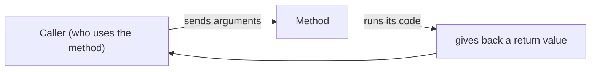
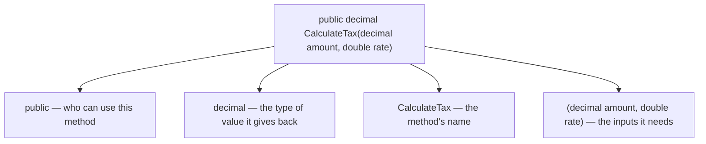
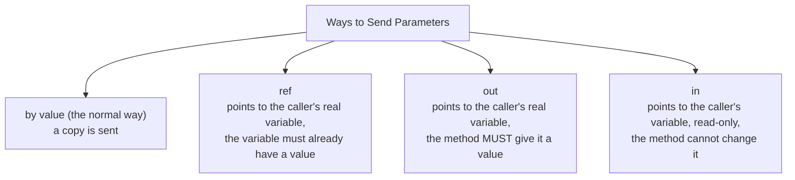
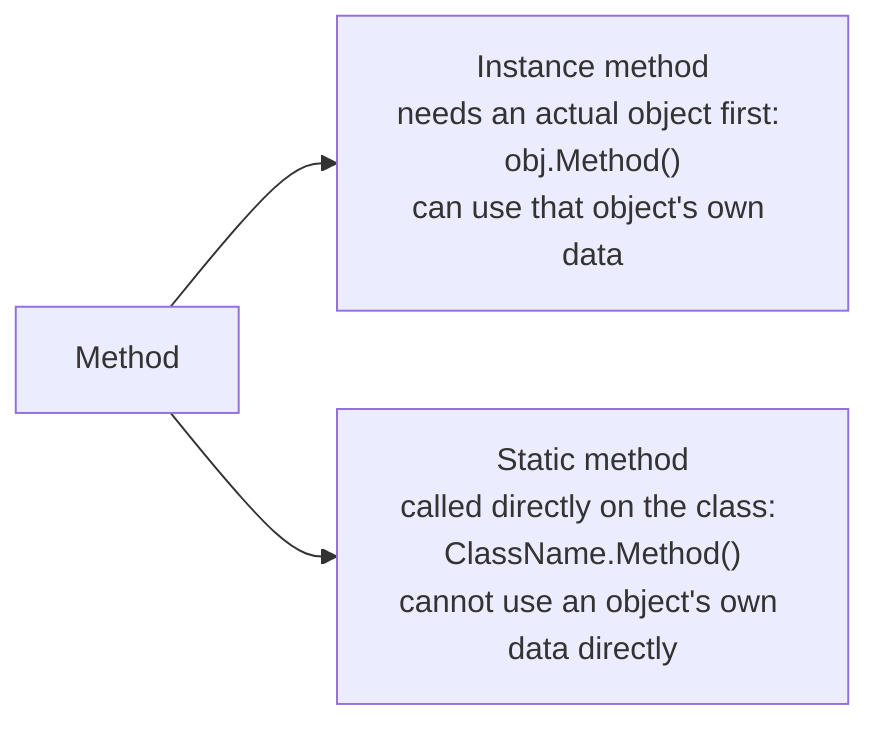

# C# Learning Track — Topic 2: Methods (Simple English)

> **Goal:** Learn strong C# for backend jobs (ASP.NET Core, Web API, EF Core) and interviews.
> **Order:** Topic 1 (Data Types) → Topic 2 (this file) → Topic 3 (Constructors)
> **Rule:** Answers to the 50 questions are NOT given yet. You try first. Then I check your answer.

---

## 1. What is a Method?

A **method** is a named block of code that does one job. You can call (use) it many times. Methods help you break a big program into small, simple, reusable pieces. Every controller action, service, and repository in a backend app is built from methods.



Every method has four parts: **access modifier**, **return type**, **name**, and **parameter list**.



---

## 2. Basic Syntax

```csharp
accessModifier returnType MethodName(parameterList)
{
    // the method's code
    return value; // skip this line if returnType is void
}
```

```csharp
public int Add(int a, int b)
{
    return a + b;
}

public void PrintMessage(string message)
{
    Console.WriteLine(message);   // no return value -> use void
}
```

---

## 3. Access Modifiers (Who Can Use the Method)

| Modifier | Who can see/use it |
|---|---|
| `public` | Anyone, from anywhere |
| `private` | Only code inside the same class (this is the default if you write nothing) |
| `protected` | The same class, and any class that inherits from it |
| `internal` | Only code inside the same project |
| `protected internal` | Same project, OR any inheriting class, even in another project |
| `private protected` | Only inheriting classes, and only inside the same project |

**Real example:** Controller action methods are `public`, because the framework needs to call them from outside. Small helper logic inside a service is often `private`.

---

## 4. Parameters vs Arguments

```csharp
public int Multiply(int x, int y)   // x, y are PARAMETERS (placeholders written in the method)
{
    return x * y;
}

int result = Multiply(3, 4);        // 3, 4 are ARGUMENTS (the real values you send when calling)
```

### Ways to pass values: by value, `ref`, `out`, `in`



```csharp
// by value (default) — a COPY is sent, so changes do NOT affect the caller's variable
void TryDouble(int x) { x *= 2; }
int a = 5; TryDouble(a);  // a is still 5, unchanged

// ref — changes DO affect the caller's variable; the variable must have a value before calling
void DoubleIt(ref int x) { x *= 2; }
int b = 5; DoubleIt(ref b); // b is now 10

// out — used when a method needs to give back more than one result;
// the caller's variable does not need a value first, but the method MUST set it before finishing
bool TryDivide(int num, int den, out int result)
{
    if (den == 0) { result = 0; return false; }
    result = num / den;
    return true;
}
if (TryDivide(10, 2, out int quotient)) Console.WriteLine(quotient);

// in — send a big struct efficiently, but STOP the method from changing it
void PrintPoint(in Point p) { Console.WriteLine(p.X); /* p.X = 5; this line would NOT compile */ }
```

**Important difference for interviews:** `ref` needs the variable to already have a value before you call the method. `out` does not need this — but the method must set a value for it before returning. This is why `TryParse`-style methods use `out`.

---

## 5. Optional Parameters, Named Arguments, Default Values

```csharp
public void CreateUser(string name, int age = 18, bool isAdmin = false)
{
    Console.WriteLine($"{name}, {age}, {isAdmin}");
}

CreateUser("Alice");                          // age=18, isAdmin=false (defaults used)
CreateUser("Bob", 25);                        // isAdmin=false (default used)
CreateUser("Carol", isAdmin: true);           // named argument, skips the age value, uses its default
```

**Rule:** all optional parameters must be written **after** the required (non-optional) parameters.

---

## 6. Returning Values — Even Multiple Values, Using Tuples

```csharp
// One value returned
public double Square(double n) => n * n;   // this short style is called an expression-bodied method

// More than one value returned, using a tuple
public (int Min, int Max) GetMinMax(int[] numbers)
{
    return (numbers.Min(), numbers.Max());
}

var result = GetMinMax(new[] { 3, 7, 1, 9 });
Console.WriteLine($"Min: {result.Min}, Max: {result.Max}");
```

Tuples are a light, modern way to send back more than one value. It is better than using `out` parameters, or making a whole new small class just to hold two values. You will see this often in service classes, like `(bool Success, string ErrorMessage)`.

---

## 7. Static Methods vs Instance Methods



```csharp
public class MathHelper
{
    public static int Square(int n) => n * n;     // like Math.Sqrt — no object needed
}
int s = MathHelper.Square(5);

public class Order
{
    public decimal Total;
    public decimal ApplyDiscount(decimal pct) => Total -= Total * pct;  // needs this object's own data
}
```

**Real example:** Simple helper logic that does not depend on any object's own data (like validation, formatting, or calculations) is a good fit for `static`. Anything that needs an object's own data (like the business logic of a database entity) must be an instance method.

---

## 8. Method Overloading

You can have many methods with the **same name**, but with **different parameter lists** (different types, different number of parameters, or different order). Just changing the return type is **not enough** — you must change the parameters too.

```csharp
public int Add(int a, int b) => a + b;
public double Add(double a, double b) => a + b;
public int Add(int a, int b, int c) => a + b + c;
```

---

## 9. Recursive Methods (a Method That Calls Itself)

A recursive method calls itself again and again, until it reaches a **base case** (a stopping point).

```csharp
public int Factorial(int n)
{
    if (n <= 1) return 1;              // base case, stops the recursion
    return n * Factorial(n - 1);       // recursive case, calls itself
}
```

⚠️ If you forget the base case, or write it wrong, your program will crash with a `StackOverflowException`.

---

## 10. Sending Reference Types (Like a Class Object) Into a Method

```csharp
public void AddItem(List<string> items)
{
    items.Add("new item");   // this changes the SAME list that the caller has
}

var myList = new List<string> { "a", "b" };
AddItem(myList);
// myList now has "a", "b", "new item" — because List<T> is a reference type
```

But if you **replace** the reference completely inside the method, this change does **not** go back to the caller:

```csharp
public void Replace(List<string> items)
{
    items = new List<string> { "replaced" };   // this only changes the method's LOCAL copy of the address
}
Replace(myList);
// myList is UNCHANGED — still "a", "b", "new item"
```

This difference (changing the contents vs. replacing the whole reference) is a very common interview trick question.

---

## 11. Common Mistakes and Good Habits

| Mistake | Why it is wrong | How to fix it |
|---|---|---|
| Using `out`/`ref` too much, when a tuple or return value would be simpler | It makes the code harder to read | Use return values/tuples unless you have a real reason for `ref`/`out` |
| Forgetting that `out` parameters must be given a value on every path | This causes a compiler error | Set the `out` parameter's value before every `return` line |
| Thinking that replacing a reference-type parameter changes the caller's variable | It does not. Only changing the contents does | Understand: the parameter is a copy of the address, not the object itself |
| Deep or unlimited recursion, on a large input | The program crashes with a stack overflow | Use a loop instead, or make sure recursion cannot go too deep |
| Too many parameters (6 or more) in one method | Hard to read, easy to call wrong | Group related values into a class/record/DTO |
| Making everything `static`, just for convenience | Leads to tightly connected, hard-to-test code | Use instance methods and dependency injection for anything that has state or dependencies |

---

## 12. Interview Questions

1. What is the difference between a parameter and an argument?
2. Explain the difference between `ref`, `out`, and `in`.
3. Why can you not have two methods with the same name and same parameters, but only a different return type?
4. What is an expression-bodied method? When would you use one?
5. Why does changing a `List<T>`'s content inside a method affect the caller, but replacing the whole list inside the method does not?
6. When would you choose a `static` method instead of an instance method?
7. What happens if a recursive method has no base case, or the base case is never reached?
8. Compare tuples to `out` parameters for returning more than one value. What is good and bad about each?
9. What is the rule about the order of optional parameters in a method?
10. Why can a service class with many `static` methods be harder to test than one using instance methods with dependency injection?

---

## 13. Practice Questions (50 Questions)

Try each one yourself first. Send me your answer/code, and I will check it (correctness, mistakes, improvements, a better version with reasons, a score out of 10, what to practice next).

### Beginner (1–10)

1. Write a method `Greet(string name)` that returns a greeting text. Call it with two different names.
2. Write a method `IsEven(int number)` that returns `bool`. Test it with a few different numbers.
3. Write a `void` method `PrintSeparator()` that prints a line of dashes. Call it three times in a row.
4. Write a method `Add(int a, int b)` that returns their sum. Print the result of three different calls.
5. Write a method `GetFullName(string first, string last)` that returns the full name as one string.
6. Write a method with no parameters that returns today's date, as a `DateTime`.
7. Write a method `Square(double n)` using the short expression-bodied syntax.
8. Write a method `PrintStars(int count)` that prints `count` number of stars (`*`) on one line, using a loop.
9. Write a method that takes a `string` and returns its length as an `int`, without using `.Length` directly in the calling code.
10. Write a method `Max(int a, int b)` that returns the bigger of the two values (do not use `Math.Max`).

### Basic (11–20)

11. Write a method `CalculateAverage(int a, int b, int c)` that returns their average as a `double`.
12. Write two overloaded `Add` methods: one for two `int`s, one for two `double`s.
13. Write a method `DescribeAge(int age = 18)` showing an optional parameter. Call it both with and without giving a value.
14. Write a method `CreateAccount(string name, bool isAdmin = false, int startingBalance = 0)`. Call it using named arguments, in an order that is different from how it was written.
15. Write a method `Increment(ref int value)` that adds 1 to a number using `ref`. Show that the caller's variable changed.
16. Write a method `TryParseAge(string input, out int age)`, made in the same style as `int.TryParse`. It should return `bool` for success, and use `out` for the parsed value.
17. Write a static method `IsPrime(int number)`, and test it with a few values, including tricky ones like 0, 1, and 2.
18. Write a method that returns a tuple `(int Sum, int Product)` from two numbers. Print both values from the code that calls it.
19. Write a recursive method `CountDown(int from)` that prints numbers going down from `from` to `0`.
20. Write a method `AppendItem(List<int> numbers, int item)` that changes the given list. Show, in the calling code, that the original list has changed.

### Intermediate (21–30)

21. Write a static class `StringHelper` with a static method `Reverse(string input)`, which returns the input text reversed. Do not use `Array.Reverse` — write the logic yourself.
22. Write a recursive `Factorial(int n)` method, and also a separate **loop-based (iterative)** version. Compare them, and explain in a comment why recursion could be risky here.
23. Write a method `Divide(int numerator, int denominator, out string errorMessage)` that returns a nullable `int?` result. Use `out` for an error message, and correctly handle dividing by zero without crashing the program.
24. Write three overloaded methods: `Log(string message)`, `Log(string message, Exception ex)`, and `Log(string message, int severityLevel)`. Call all three from a small test method.
25. Write a method `ApplyDiscount(in decimal price, decimal discountRate)` using `in`, so the caller's `price` cannot be changed inside the method. Show, in a comment, what the compiler would reject if you tried to change `price` inside.
26. Write a method `Replace(List<string> items)` that gives the local parameter a brand-new list inside the method. Show, in the calling code, that the original list is not affected. Explain why, in a comment.
27. Write a recursive method `Fibonacci(int n)`, and explain in a comment why it becomes very slow for bigger values of `n`. You do not need to fix it yet.
28. Write a method `SplitFullName(string fullName)` that returns a tuple `(string First, string Last)`. Handle the case where there is no space in the name (return an empty last name in that case).
29. Write a static method `GetDiscountedPrice(decimal price, double discountPercent = 0.1)`. Call it from several places with different discount values, including one call that uses only the default value.
30. Write a method `SumAll(params int[] numbers)` using the `params` keyword. Call it with zero, one, and many numbers.

### Advanced (31–40)

31. Write a loop-based version of your Fibonacci method from Question 27, that avoids the slow behavior (using a loop, or by saving already-calculated results). Explain briefly why it is faster.
32. Write a method `ValidateUser(string email, string password, out List<string> errors)`. It should fill a list with error messages using `out`, and return an overall `bool` for whether the input is valid. It must correctly handle more than one problem happening at the same time.
33. Write a method `Swap<T>(ref T a, ref T b)` — this is a **generic** method that uses `ref` — which swaps any two values of the same type. Test it with both `int` and `string`.
34. Write a class with a `private` helper method and a `public` method that uses it. Explain, in a comment, why the helper method should be `private`.
35. Write several overloaded `CalculateArea` methods for a `Circle` (radius), a `Rectangle` (width, height), and a `Triangle` (base, height). All should have the same name, but different parameters.
36. Write a method `ProcessOrder(Order order)` (imagine a simple `Order` class with a `Total` field). Inside this method, both change a field on `order`, AND separately replace the local variable `order` with a new object. Show, and explain, which of these two changes the caller actually sees.
37. Write a method `BinarySearch(int[] sortedArray, int target)` that returns the found index, or `-1`. Write it using recursion.
38. Write a method `TryGetConfigValue(string key, out string value)`, pretending to read from a fake in-memory config dictionary. Correctly handle the "key not found" case using the `out`/`bool` pattern, instead of crashing the program.
39. Write a static method `Chunk<T>(List<T> source, int chunkSize)` that returns `List<List<T>>`, splitting one big list into smaller, equal-sized groups (the last group may be smaller). This is a common real-world tool for batching data.
40. Write a method `Retry(Func<bool> action, int maxAttempts)` that calls a given function up to `maxAttempts` times, until it returns `true`. This shows that methods themselves can be passed around as values (using delegates/`Func`).

### Complex / Real-World (41–50)

41. Design a `PaymentService` class with a method `ProcessPayment(decimal amount, string currency, out string transactionId)`. It should pretend to call a payment gateway, correctly use `out` for the generated ID, and return `bool` for success. Also include basic checks (amount must be more than 0, currency must not be empty).
42. Write a method `CalculateShipping(decimal weightKg, string destinationCountry, bool isExpress = false)`, with sensible overloads or default values. This should model how a real online shop's checkout calculates shipping cost, based on different weight ranges.
43. Write a method `BulkImportUsers(List<string> rawCsvLines, out List<string> failedLines)` that processes many raw CSV rows at once, turning each one into a `User`-like object. Collect the rows that fail into an `out` list, instead of crashing on the first bad row. Test with at least 3 good rows and 2 bad rows.
44. Write a recursive method `FlattenOrders(List<Order> orders)`, where an `Order` can contain a `List<Order> SubOrders` (nested orders, like a bundle deal). It should return one flat `List<Order>` containing every order and every sub-order.
45. Design a static helper method `ExecuteWithRetry<T>(Func<T> operation, int maxRetries, TimeSpan delay)`. It should retry a risky action (like a flaky call to an outside API) up to `maxRetries` times, and return the result, or throw the error again after the last failed attempt. This is a common pattern for making backend services more reliable.
46. Write a method `MergeCarts(List<CartItem> cart1, List<CartItem> cart2)` (imagine `CartItem` has `ProductId` and `Quantity`). It should return a **new** merged list, adding together the quantities for any product that appears in both carts, without changing either of the original input lists. Explain, in a comment, why not changing the inputs matters here.
47. Write a method `AuthenticateUser(string username, string password, out string token, out string errorMessage)`, showing multiple `out` parameters for a login process. In a comment, discuss whether using a tuple return type would be cleaner than using two `out` parameters here.
48. Write a static method `CalculateLoanPayment(decimal principal, double annualInterestRate, int termMonths)`, using the real loan payment formula. Be careful with converting between `decimal` and `double`, keeping the numbers accurate throughout.
49. Write a method `DeduplicateAndValidateOrders(List<Order> orders, out int duplicatesRemoved, out List<string> validationErrors)`, for an order-processing pipeline. It should remove any duplicate `OrderId`s, check each remaining order, and report both results using `out` parameters.
50. Design a small `InventoryReservationService`, with a method `TryReserveStock(string sku, int quantity, out string failureReason)`. It should be written so it could later be made safe to run at the same time by multiple users (you can assume single-user for now, but write it in a clean way that would allow this later). Correctly protect against: negative stock, a missing SKU, and not enough quantity available — and give a clear failure reason using `out` when it cannot reserve stock.

---

## What happens next

Send me your answer to any question, and I will check it for:
1. ✅ Correctness  2. 🐛 Mistakes/bugs  3. 💡 Improvements  4. 🏆 A better version, with reasons  5. ⭐ A score out of 10  6. 📌 What to practice next

Once you have done a good number of Topic 2 questions, we move to **Topic 3: Constructors**.
