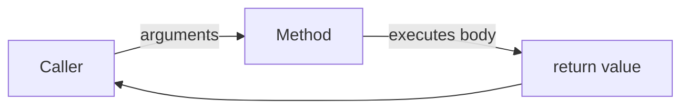
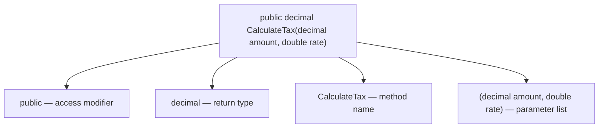
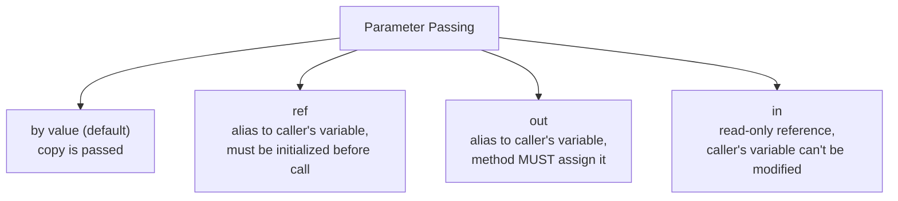
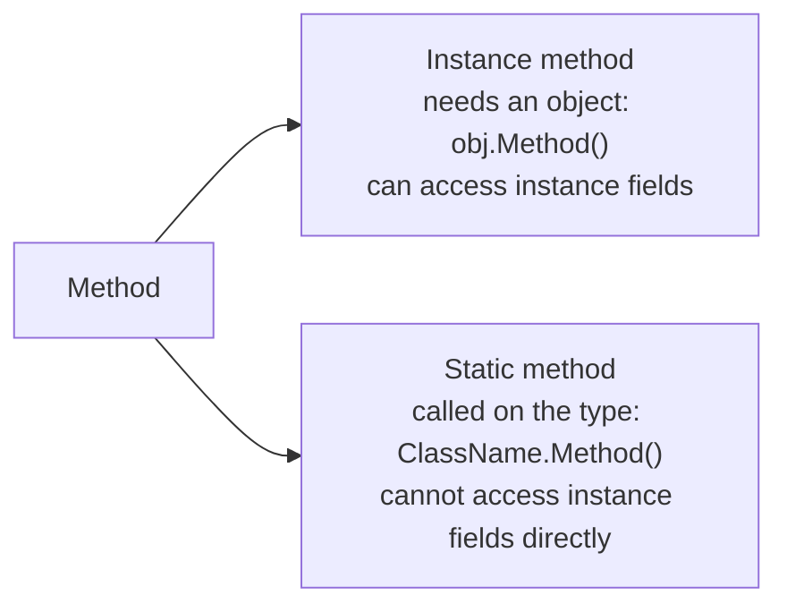

# C# Mastery Track — Topic 2: Methods

> **Track goal:** Strong backend C# skills (ASP.NET Core, Web API, EF Core) + interview readiness.
> **Progression:** Topic 1 (Data Types) → **Topic 2 (this file)** → Topic 3 (Constructors)
> **Rule:** Solutions to the 50 exercises are **withheld** — submit your attempts and I'll review them.

---

## 1. Concept

A **method** is a named, reusable block of code that performs a task. Methods are how you break a program into small, testable, composable pieces — the backbone of every controller action, service class, and repository in a backend app.



Every method has four parts: **access modifier**, **return type**, **name**, and **parameter list**.



---

## 2. Syntax

```csharp
accessModifier returnType MethodName(parameterList)
{
    // method body
    return value; // omit if returnType is void
}
```

```csharp
public int Add(int a, int b)
{
    return a + b;
}

public void PrintMessage(string message)
{
    Console.WriteLine(message);   // no return value -> void
}
```

---

## 3. Access Modifiers

| Modifier | Visible from |
|---|---|
| `public` | Anywhere |
| `private` | Only within the same class (default if omitted) |
| `protected` | Same class + derived classes |
| `internal` | Same assembly (project) |
| `protected internal` | Same assembly OR derived classes anywhere |
| `private protected` | Derived classes, but only within the same assembly |

**Backend relevance:** controller action methods are `public` (the framework must call them); helper logic inside a service is often `private`.

---

## 4. Parameters vs Arguments

```csharp
public int Multiply(int x, int y)   // x, y are PARAMETERS (placeholders in the definition)
{
    return x * y;
}

int result = Multiply(3, 4);        // 3, 4 are ARGUMENTS (actual values passed at the call site)
```

### Passing mechanisms: value, `ref`, `out`, `in`



```csharp
// value (default) — a COPY is passed, changes don't affect the caller
void TryDouble(int x) { x *= 2; }
int a = 5; TryDouble(a);  // a is still 5

// ref — changes DO affect the caller; variable must already have a value
void DoubleIt(ref int x) { x *= 2; }
int b = 5; DoubleIt(ref b); // b is now 10

// out — used for methods that need to return more than one value; caller's variable
// doesn't need to be initialized beforehand, but the method MUST assign it
bool TryDivide(int num, int den, out int result)
{
    if (den == 0) { result = 0; return false; }
    result = num / den;
    return true;
}
if (TryDivide(10, 2, out int quotient)) Console.WriteLine(quotient);

// in — pass a large struct by reference for performance, but PREVENT the method from modifying it
void PrintPoint(in Point p) { Console.WriteLine(p.X); /* p.X = 5; would NOT compile */ }
```

**Interview-critical distinction:** `ref` requires the variable to be initialized before the call; `out` does not (but the callee must assign it before returning). `TryParse`-style APIs use `out` for exactly this reason.

---

## 5. Optional Parameters, Named Arguments, Defaults

```csharp
public void CreateUser(string name, int age = 18, bool isAdmin = false)
{
    Console.WriteLine($"{name}, {age}, {isAdmin}");
}

CreateUser("Alice");                          // age=18, isAdmin=false
CreateUser("Bob", 25);                        // isAdmin=false
CreateUser("Carol", isAdmin: true);           // named argument, skips age default
```

**Rule:** all optional parameters must come **after** required parameters in the signature.

---

## 6. Returning Values — Including Multiple Values via Tuples

```csharp
// Single return
public double Square(double n) => n * n;   // expression-bodied method

// Multiple return values via a tuple
public (int Min, int Max) GetMinMax(int[] numbers)
{
    return (numbers.Min(), numbers.Max());
}

var result = GetMinMax(new[] { 3, 7, 1, 9 });
Console.WriteLine($"Min: {result.Min}, Max: {result.Max}");
```

Tuples are the modern, lightweight alternative to `out` parameters or creating a small class purely to bundle a couple of return values — very common in service-layer methods (e.g., `(bool Success, string ErrorMessage)`).

---

## 7. Static vs Instance Methods



```csharp
public class MathHelper
{
    public static int Square(int n) => n * n;     // Math.Square-style utility, no object needed
}
int s = MathHelper.Square(5);

public class Order
{
    public decimal Total;
    public decimal ApplyDiscount(decimal pct) => Total -= Total * pct;  // needs instance data
}
```

**Backend relevance:** stateless utility/helper logic (validation, formatting, calculations with no dependency on object state) is a great candidate for `static`. Anything touching an instance's own data (like an EF Core entity's business logic) must be an instance method.

---

## 8. Method Overloading

Multiple methods with the **same name** but **different parameter lists** (different type, number, or order of parameters). Return type alone is **not** enough to overload.

```csharp
public int Add(int a, int b) => a + b;
public double Add(double a, double b) => a + b;
public int Add(int a, int b, int c) => a + b + c;
```

---

## 9. Recursive Methods

A method that calls itself, with a **base case** to stop the recursion.

```csharp
public int Factorial(int n)
{
    if (n <= 1) return 1;              // base case
    return n * Factorial(n - 1);       // recursive case
}
```

⚠️ Missing/incorrect base case → `StackOverflowException`.

---

## 10. Passing Reference Types to Methods

```csharp
public void AddItem(List<string> items)
{
    items.Add("new item");   // mutates the SAME list the caller has
}

var myList = new List<string> { "a", "b" };
AddItem(myList);
// myList now contains "a", "b", "new item" — because List<T> is a reference type
```

But **reassigning** the reference inside the method does *not* affect the caller:

```csharp
public void Replace(List<string> items)
{
    items = new List<string> { "replaced" };   // only changes the LOCAL copy of the reference
}
Replace(myList);
// myList is UNCHANGED — still "a", "b", "new item"
```

This distinction (mutating contents vs reassigning the reference) is one of the most common C# interview trip-ups.

---

## 11. Common Mistakes & Best Practices

| Mistake | Why it's wrong | Fix |
|---|---|---|
| Overusing `out`/`ref` when a tuple or return value would be clearer | Hurts readability | Prefer return values/tuples unless performance-critical or `TryX` pattern |
| Forgetting `out` params must be assigned on every path | Compiler error | Assign `out` param before every `return` |
| Assuming reassigning a reference-type parameter affects the caller | It doesn't — only mutation does | Understand copy-of-reference semantics |
| Deep/unbounded recursion for large inputs | Stack overflow | Use iteration, or ensure recursion depth is bounded |
| Long parameter lists (6+ params) | Hard to read/call correctly | Bundle related parameters into a class/record/DTO |
| Making everything `static` for convenience | Leads to tightly coupled, hard-to-test code | Use instance methods + dependency injection for anything with state/dependencies |

---

## 12. Interview Questions

1. What's the difference between a parameter and an argument?
2. Explain the difference between `ref`, `out`, and `in`.
3. Why can't you overload two methods that differ only by return type?
4. What is an expression-bodied method, and when would you use one?
5. Why does mutating a `List<T>` passed into a method affect the caller, but reassigning the parameter inside the method does not?
6. When would you choose a `static` method over an instance method?
7. What happens if a recursive method has no base case (or an unreachable one)?
8. How do tuples compare to `out` parameters for returning multiple values? What are the trade-offs?
9. What's the rule about ordering optional parameters in a method signature?
10. Why might a service class with many `static` methods be harder to unit test than one using instance methods and dependency injection?

---

## 13. Practical Exercises (50 Questions)

Attempt each yourself first — post your solution and I'll review it (correctness, bugs, improvements, stronger idiomatic version, rating 1–10, what to practice next).

### Beginner (1–10)

1. Write a method `Greet(string name)` that returns a greeting string, and call it with two different names.
2. Write a method `IsEven(int number)` returning `bool`, and test it with a few values.
3. Write a `void` method `PrintSeparator()` that prints a line of dashes, and call it three times in a row.
4. Write a method `Add(int a, int b)` returning their sum, and print the result of three different calls.
5. Write a method `GetFullName(string first, string last)` returning the combined name as a string.
6. Write a method with no parameters that returns today's date as a `DateTime`.
7. Write a method `Square(double n)` using expression-bodied syntax.
8. Write a method `PrintStars(int count)` that prints `count` asterisks on one line using a loop.
9. Write a method that takes a `string` and returns its length as an `int`, without using `.Length` directly in the caller.
10. Write a method `Max(int a, int b)` that returns the larger of the two values (without using `Math.Max`).

### Basic (11–20)

11. Write a method `CalculateAverage(int a, int b, int c)` returning a `double` average.
12. Write an overloaded pair of `Add` methods: one for two `int`s, one for two `double`s.
13. Write a method `DescribeAge(int age = 18)` demonstrating an optional parameter, and call it both with and without an argument.
14. Write a method `CreateAccount(string name, bool isAdmin = false, int startingBalance = 0)` and call it using named arguments in a different order than declared.
15. Write a method `Increment(ref int value)` that increments a variable by 1 using `ref`, and show the caller's variable changed.
16. Write a method `TryParseAge(string input, out int age)` modeled after `int.TryParse`, returning `bool` success and using `out` for the parsed value.
17. Write a static method `IsPrime(int number)` and test it against several values including edge cases (0, 1, 2).
18. Write a method that returns a tuple `(int Sum, int Product)` from two integers, and print both values from the caller.
19. Write a recursive method `CountDown(int from)` that prints numbers from `from` down to `0`.
20. Write a method `AppendItem(List<int> numbers, int item)` that mutates the passed-in list, and prove from the caller that the original list changed.

### Intermediate (21–30)

21. Write a static utility class `StringHelper` with a static method `Reverse(string input)` that returns the reversed string (without using `Array.Reverse` — implement the logic yourself).
22. Write a recursive `Factorial(int n)` method, and separately an **iterative** version — compare them and explain when recursion could be risky here.
23. Write a method `Divide(int numerator, int denominator, out string errorMessage)` that returns a nullable `int?` result, uses `out` for an error message, and correctly handles division by zero without throwing.
24. Write three overloads of a method `Log(string message)`, `Log(string message, Exception ex)`, and `Log(string message, int severityLevel)` — call all three from a small `Main`-style test.
25. Write a method `ApplyDiscount(in decimal price, decimal discountRate)` using `in` to prevent the caller's `price` from being modified, and demonstrate (in a comment) what the compiler would reject if you tried to modify `price` inside the method.
26. Write a method `Replace(List<string> items)` that reassigns the local parameter to a brand-new list, then in the caller show that the original list is untouched — explain why in a comment.
27. Write a recursive method `Fibonacci(int n)` and identify (in a comment) why it becomes extremely slow for larger `n` — no need to fix it yet.
28. Write a method `SplitFullName(string fullName)` returning a tuple `(string First, string Last)`, handling the case where there's no space (return an empty last name).
29. Write a static method `GetDiscountedPrice(decimal price, double discountPercent = 0.1)` and call it from multiple places with different discount rates, including one call relying purely on the default.
30. Write a method `SumAll(params int[] numbers)` using the `params` keyword, and call it with zero, one, and many arguments.

### Advanced (31–40)

31. Write an iterative rewrite of your Fibonacci method from Q27 that avoids the exponential slowdown (using a loop, or memoization), and briefly explain the performance difference.
32. Write a method `ValidateUser(string email, string password, out List<string> errors)` that populates a list of validation error messages via `out` and returns `bool` overall validity — must correctly handle multiple simultaneous validation failures.
33. Write a method `Swap<T>(ref T a, ref T b)` — a **generic** method using `ref` — that swaps any two values of the same type, and test it with both `int` and `string`.
34. Write a class with a private helper method and a public method that calls it, demonstrating proper encapsulation — explain in a comment why the helper is `private`.
35. Write overloaded `CalculateArea` methods for a `Circle` (radius), `Rectangle` (width, height), and `Triangle` (base, height) — all named the same, differing only by parameter list.
36. Write a method `ProcessOrder(Order order)` (assume a simple `Order` class with a `Total` field) that both mutates a field on `order` AND reassigns a local field reference inside — demonstrate and explain which changes the caller actually sees.
37. Write a method `BinarySearch(int[] sortedArray, int target)` returning the index or `-1`, implemented recursively.
38. Write a method `TryGetConfigValue(string key, out string value)` simulating reading from a fake in-memory config dictionary, correctly handling the "key not found" case via the `out`/`bool` pattern rather than throwing.
39. Write a static method `Chunk<T>(List<T> source, int chunkSize)` returning `List<List<T>>`, splitting a list into equal-sized chunks (last chunk may be smaller) — a common real-world batching utility.
40. Write a method `Retry(Func<bool> action, int maxAttempts)` that calls a passed-in function up to `maxAttempts` times until it returns `true`, demonstrating methods as first-class values (delegates/`Func`).

### Complex / Real-World (41–50)

41. Design a `PaymentService` class with a method `ProcessPayment(decimal amount, string currency, out string transactionId)` that simulates calling a payment gateway, correctly using `out` for the generated ID and returning `bool` success — include basic input validation (amount > 0, currency not empty).
42. Write a method `CalculateShipping(decimal weightKg, string destinationCountry, bool isExpress = false)` with sensible overloads/defaults, modeling how an e-commerce checkout API would compute shipping cost based on tiered rules (e.g., different rate per weight bracket).
43. Write a method `BulkImportUsers(List<string> rawCsvLines, out List<string> failedLines)` that processes a batch of raw CSV rows, parsing each into a `User`-like structure, collecting failures into an `out` list rather than throwing on the first bad row — simulate at least 3 valid and 2 invalid rows.
44. Write a recursive method `FlattenOrders(List<Order> orders)` where an `Order` can contain a `List<Order> SubOrders` (nested orders, e.g., a bundle) — return a flat `List<Order>` of every order and sub-order.
45. Design a `RetryPolicy` static helper method `ExecuteWithRetry<T>(Func<T> operation, int maxRetries, TimeSpan delay)` that retries a risky operation (e.g., a flaky external API call) up to `maxRetries` times, returning the result or rethrowing after the final failure — a realistic pattern for resilient backend services.
46. Write a method `MergeCarts(List<CartItem> cart1, List<CartItem> cart2)` (assume `CartItem` has `ProductId` and `Quantity`) that returns a new merged list, summing quantities for items appearing in both carts, without mutating either input list — explain why not mutating the inputs matters here.
47. Write a method `AuthenticateUser(string username, string password, out string token, out string errorMessage)` demonstrating multiple `out` parameters for a realistic login flow, and discuss (in a comment) whether a tuple return would be cleaner than two `out` params here.
48. Write a static method `CalculateLoanPayment(decimal principal, double annualInterestRate, int termMonths)` implementing the real amortization formula, being careful about `decimal`/`double` conversions and precision throughout.
49. Write a method `DeduplicateAndValidateOrders(List<Order> orders, out int duplicatesRemoved, out List<string> validationErrors)` for an order-processing pipeline: it should remove duplicate `OrderId`s, validate each remaining order, and report both counts via `out` parameters.
50. Design a small `InventoryReservationService` with a method `TryReserveStock(string sku, int quantity, out string failureReason)` that must be safe to call concurrently in spirit (assume single-threaded for now, but structure it so it *could* be made thread-safe later) — correctly guard against negative stock, missing SKUs, and insufficient quantity, returning a clear failure reason via `out` when it can't reserve.

---

## How we'll proceed

Submit your solution to any question and I'll review it against:
1. ✅ Correctness  2. 🐛 Errors/bugs  3. 💡 Improvements  4. 🏆 Stronger idiomatic version + why  5. ⭐ Rating 1–10  6. 📌 What to practice next

Once you've worked through a good chunk of Topic 2, we move to **Topic 3: Constructors**.
