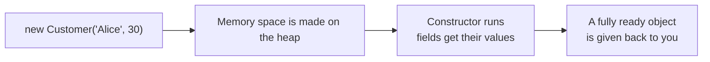
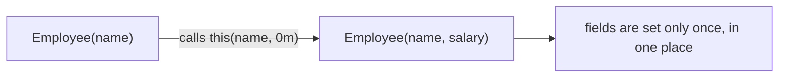
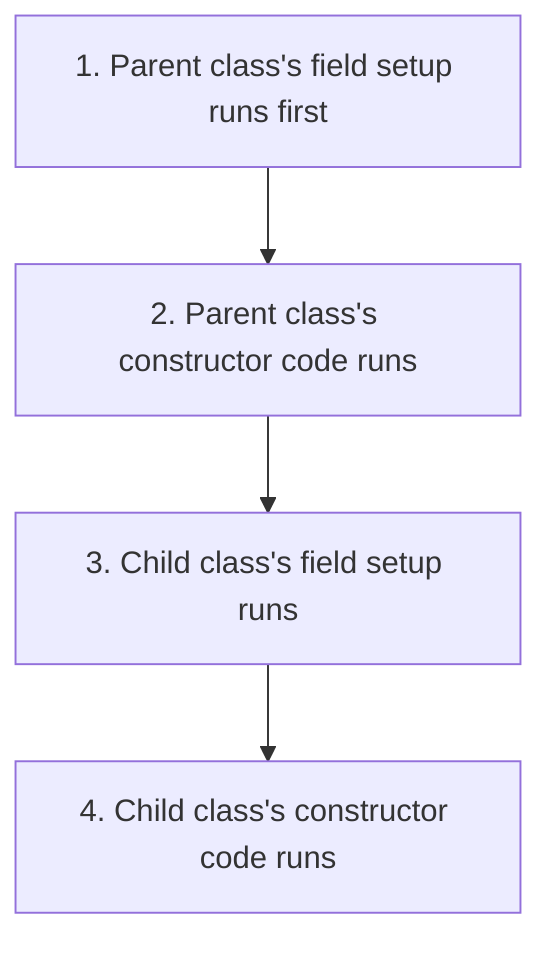

# C# Learning Track — Topic 3: Constructors (Simple English)

> **Goal:** Learn strong C# for backend jobs (ASP.NET Core, Web API, EF Core) and interviews.
> **Order:** Topic 1 (Data Types) → Topic 2 (Methods) → Topic 3 (this file)
> **Rule:** Answers to the 50 questions are NOT given yet. You try first. Then I check your answer.

---

## 1. What is a Constructor?

A **constructor** is a special method that runs automatically when you create an object using `new`. Its job is to set up the object with correct, valid starting values — setting fields, checking input, connecting to other needed objects — before anyone else can use it.



**Why this matters for backend work:** In ASP.NET Core, **constructor injection** is the main way a class receives the other objects it needs to work (like `DbContext`, `ILogger`, or other services). Understanding constructors well means understanding how dependency injection really works.

---

## 2. Basic Constructor Syntax

```csharp
public class Customer
{
    public string Name;
    public int Age;

    // Constructor: same name as the class, NO return type (not even void)
    public Customer(string name, int age)
    {
        Name = name;
        Age = age;
    }
}

var c = new Customer("Alice", 30);
```

---

## 3. Default Constructor

If you do **not** write any constructor at all, C# quietly gives you a free one: a public, empty constructor that takes no parameters. It just lets all the fields keep their default values.

```csharp
public class Point
{
    public int X;
    public int Y;
    // no constructor written -> C# gives you: public Point() { }
}
var p = new Point();   // X = 0, Y = 0
```

⚠️ **Important:** As soon as you write even one constructor yourself, this free empty constructor **disappears**. If you still want a plain, empty constructor along with your own one, you must write it yourself.

---

## 4. Parameterized Constructors and Overloading

```csharp
public class Employee
{
    public string Name;
    public decimal Salary;

    public Employee(string name)                    // version 1
    {
        Name = name;
        Salary = 0m;
    }

    public Employee(string name, decimal salary)     // version 2
    {
        Name = name;
        Salary = salary;
    }
}
```

Just like normal methods, constructors can be **overloaded**. This means you can have several constructors with the same name (the class name), but with different parameters.

---

## 5. Constructor Chaining with `this()`

You can avoid writing the same setup code twice, by having one constructor call **another constructor in the same class**.



```csharp
public class Employee
{
    public string Name;
    public decimal Salary;

    public Employee(string name) : this(name, 0m)   // this calls the other constructor
    {
    }

    public Employee(string name, decimal salary)
    {
        Name = name;
        Salary = salary;
    }
}
```

---

## 6. Chaining to the Base (Parent) Class with `base()`

```csharp
public class Person
{
    public string Name;
    public Person(string name) { Name = name; }
}

public class Employee : Person
{
    public decimal Salary;

    public Employee(string name, decimal salary) : base(name)   // calls Person's constructor first
    {
        Salary = salary;
    }
}
```

**Rule:** A child class's constructor **always** calls a constructor from its parent class first. This happens either:
- **Manually**, by you writing `base(...)`, OR
- **Automatically**, using the parent's empty constructor, if you write nothing.

If the parent class has **no** empty constructor, then you are **forced** to write `base(...)` yourself.

---

## 7. Constructor Running Order (A Common Interview Question)



```csharp
public class Base
{
    public Base() { Console.WriteLine("Base ctor"); }
}
public class Derived : Base
{
    public Derived() { Console.WriteLine("Derived ctor"); }
}
new Derived();
// Output:
// Base ctor
// Derived ctor
```

The parent class **always** finishes first, before the child class begins its own work. This makes sure any values from the parent are ready and safe to use, before the child tries to use them.

---

## 8. Static Constructors

This runs **only once**, by itself, before the class is used for the very first time (either when the first object is made, OR when a static member of the class is used for the first time). You can never call it yourself. It has no parameters, and no access modifier.

```csharp
public class AppConfig
{
    public static readonly string ConnectionString;

    static AppConfig()                    // static constructor
    {
        ConnectionString = LoadFromEnvironment();
        Console.WriteLine("AppConfig initialized once.");
    }

    private static string LoadFromEnvironment() => "Server=...;";
}
```

**Real example:** Loading configuration settings, setting up a cache, or preparing fixed lookup data one single time, for the whole life of your app.

---

## 9. Private Constructors

This stops other code, outside the class, from creating objects of this class. It is used for the **Singleton pattern** (only ever having one object of this class), or for classes that only give out objects through special static methods.

```csharp
public class Logger
{
    private static readonly Logger _instance = new Logger();
    public static Logger Instance => _instance;

    private Logger() { }   // no outside code can call `new Logger()`
}

Logger.Instance.Log("Hello");   // this is the only way to get one
```

---

## 10. Copy Constructors

C# does not have a special built-in syntax for a "copy constructor" like some other languages do. But you can write one yourself — a constructor that takes an object of the same type, and copies its values.

```csharp
public class Point
{
    public int X, Y;
    public Point(int x, int y) { X = x; Y = y; }

    public Point(Point other)              // copy constructor
    {
        X = other.X;
        Y = other.Y;
    }
}

var p1 = new Point(3, 4);
var p2 = new Point(p1);   // p2 is an independent copy — changing p2 does not affect p1
```

---

## 11. Constructors in Abstract Classes

Abstract classes **can** have constructors. This is true even though you cannot use `new` to directly create an abstract class object. This is because the constructor still runs when a real (concrete) child class is created, through `base()`.

```csharp
public abstract class Shape
{
    public string Color;
    protected Shape(string color) { Color = color; }   // runs via base() when a child is created
    public abstract double Area();
}

public class Circle : Shape
{
    public double Radius;
    public Circle(string color, double radius) : base(color) { Radius = radius; }
    public override double Area() => Math.PI * Radius * Radius;
}
```

---

## 12. Constructors and Dependency Injection

This is one of the most useful, real-world reasons to understand constructors deeply. ASP.NET Core's built-in dependency injection (DI) system creates your service objects by calling their constructors, and automatically gives (injects) the required dependency objects.

```csharp
public class OrderService
{
    private readonly AppDbContext _db;
    private readonly ILogger<OrderService> _logger;

    // The DI system sees this constructor, and automatically supplies both parameters
    public OrderService(AppDbContext db, ILogger<OrderService> logger)
    {
        _db = db;
        _logger = logger;
    }
}
```

This is called **constructor injection**. It is the most common and most recommended way to do dependency injection in ASP.NET Core.

---

## 13. Object Initializer Syntax (Often Confused with Constructors)

```csharp
public class Product
{
    public string Name;
    public decimal Price;
}

var p = new Product { Name = "Widget", Price = 9.99m };  // calls the empty constructor first, then sets each value
```

This runs the (empty) constructor **first**, and then sets each listed value one by one afterward. This is **not** a constructor itself. It also cannot **force** certain fields to be required — a real parameterized constructor can do that, but this cannot.

---

## 14. Constructor vs Method — Quick Comparison

| | Constructor | Normal Method |
|---|---|---|
| Name | Same as the class name | Any name you choose |
| Return type | None at all (not even `void`) | Needed (or `void`) |
| How it is called | Automatically, using `new` | You call it directly, by name |
| Job | Sets up the object's starting values | Performs an action or task |
| Can it be inherited? | No (but it can be chained with `base()`) | Yes (can also be overridden, if marked `virtual`) |
| Can it be overloaded? | Yes | Yes |

---

## 15. Common Mistakes and Good Habits

| Mistake | Why it is wrong | How to fix it |
|---|---|---|
| Writing a parameterized constructor, and assuming `new Thing()` still works | The free empty constructor disappears once you write any constructor yourself | Write your own empty constructor too, if you need one |
| Repeating the same field-setting code in more than one constructor | Breaks the "don't repeat yourself" rule, and is easy to get wrong later | Chain constructors together using `this(...)` |
| Forgetting that a parent class with no empty constructor forces you to write `base(args)` | This causes a compiler error | Always write `base(...)` explicitly, when it is required |
| Doing slow or heavy work (like a database call) inside a constructor | Makes creating the object slow and unpredictable, and hard to test | Keep constructors simple and fast. Do heavy work in a separate setup method |
| Confusing a static constructor with a static factory method | A static constructor cannot take parameters, and cannot be called by hand | Use a normal static method (like `Create(...)`) if you need parameters |
| Relying on object-initializer syntax to force required fields | Nothing actually stops someone from skipping a field | Use a parameterized constructor when a field is truly required |
| Thinking a child class's constructor runs before the parent's | It is always the opposite — parent, then child | Remember the running order diagram from section 7 |

---

## 16. Interview Questions

1. What happens to the free, automatically-given constructor once you write your own constructor?
2. Explain constructor chaining with `this()`. Why is it useful?
3. When is the parent (base) class's constructor called, if you do not write `base(...)` yourself?
4. What is a static constructor? How is it different from a normal constructor, or from a static method?
5. Why would you make a constructor `private`? Give a real design pattern that needs this.
6. What is the running order between a parent class's field setup, its constructor, and a child class's constructor?
7. Why does C# not have a special built-in copy constructor, like C++ does? How do you get the same result yourself?
8. How does ASP.NET Core's dependency injection system use constructors, behind the scenes?
9. Can an abstract class have a constructor, even though it can never be directly created with `new`? Explain why.
10. What is the risk of putting slow work (like a database call) directly inside a constructor?

---

## 17. Practice Questions (50 Questions)

Try each one yourself first. Send me your answer/code, and I will check it (correctness, mistakes, improvements, a better version with reasons, a score out of 10, what to practice next).

### Beginner (1–10)

1. Write a `Student` class with fields `Name` and `Grade`, and a constructor that sets both from the given values. Make two objects and print their values.
2. Write a `Product` class with an empty (parameterless) constructor that sets `Name = "Unnamed"` and `Price = 0`. Create one, and print the default values.
3. Write a `Book` class with fields `Title` and `Author`, and print a message from inside the constructor, confirming that the object was created.
4. Write a `Vehicle` class with a constructor that needs only `Make`. Show, in a comment, what happens (a compiler error) if you try `new Vehicle()` afterward.
5. Write a `BankAccount` class with a constructor that requires an `AccountHolder` name, and an initial `Balance`. Make `Balance` default to `0` if not given, using an optional parameter this time, not overloading.
6. Write a `Customer` class with two constructors: one that only takes `Name`, and another that takes `Name` and `Email`. Do not chain them yet — keep them separate and independent for now.
7. Write an `Order` class with a constructor that checks `Quantity > 0`, and throws an `ArgumentException` if this is not true. Test it with both a valid and an invalid value.
8. Write a `Point` class with a constructor `Point(int x, int y)`. Print the coordinates of two different points.
9. Write a `Person` class with a constructor. Separately, also make a second `Person` object using object-initializer syntax. Compare the two approaches in a comment.
10. Write an `Animal` class whose constructor prints "Animal created". Create three animal objects, and watch the printed output.

### Basic (11–20)

11. Rewrite your `Customer` class from Question 6, so the `Name`-only constructor **chains** to the `Name`+`Email` constructor, using `this(...)`. Make the email default to an empty string.
12. Write a `Product` class with three overloaded constructors: `Product()`, `Product(name)`, and `Product(name, price)` — all chaining down step by step to the most complete one.
13. Write a `Shape` base class with a constructor that takes `Color`, and a `Circle` child class whose constructor calls `base(color)`, and also sets `Radius`.
14. Write a class `AppSettings` with a **static constructor** that prints "Settings loaded", and sets up a static readonly field. Show that it only runs once, even if you use the class more than one time.
15. Write a `Singleton` class `ConfigManager` with a `private` constructor, and a public static `Instance` property. Show, from your calling code, that you cannot write `new ConfigManager()`.
16. Write a `Point` class with a **copy constructor**, `Point(Point other)`. Show that changing the copy does not affect the original.
17. Write an `Employee` class with a constructor that requires `Name` and `Department`. In a comment, explain why using only object-initializer syntax would not be enough to force these two fields to be required.
18. Write a `Rectangle` class whose constructor checks that both `Width` and `Height` are positive numbers, throwing an error if not. Test it with both valid and invalid input.
19. Write a `Base` class and a `Derived` class, with each constructor printing a message. Run the code, and confirm (by watching the output) the parent-then-child running order explained in this module.
20. Write a `Library` class whose constructor takes a `List<string>` of starting book titles, and saves a **copy** of the list (not the same list/reference). Explain in a comment why copying matters here.

### Intermediate (21–30)

21. Write a `Vehicle` base class, with a constructor that requires `Make` and `Model`. Then write a `Car` child class that adds `NumberOfDoors`, with a constructor that chains through `base(make, model)`.
22. Write a `HospitalPatient` class with a constructor that checks `Age >= 0` and a non-empty `Name`. Instead of stopping at the first problem, collect **all** the validation errors, and include them together in one error message.
23. Write a `ShoppingCart` class whose constructor takes no parameters, but sets up an internal `List<CartItem>` inside it. In a comment, explain why this setup belongs in the constructor, instead of just leaving the list as `null` by default.
24. Write an abstract class `PaymentMethod`, with a constructor that takes `AccountHolderName`. Then write two child classes, `CreditCardPayment` and `BankTransferPayment`, each adding their own extra constructor parameters, and both correctly chaining through `base(...)`.
25. Write a `Money` struct/class with a constructor that checks `Amount >= 0`, and that `CurrencyCode` is not null, throwing the correct errors for bad input.
26. Write a class `ReportGenerator` with a static constructor that loads a (pretend) lookup table only once, and an instance constructor that takes a `ReportType` parameter. Show that both run, in the correct order, when the first object is created.
27. Write an `Order` class with a **copy constructor** that makes a **deep copy** of an internal `List<OrderLine>` (not just copying the reference to the same list). Show that changing the copy's lines does not affect the original's lines.
28. Write a `Person` class and a `Student : Person` child class, where `Person` has **no** empty constructor. Show (with real working code) that `Student`'s constructor is therefore forced to call `base(...)` itself.
29. Write a `DatabaseConnection` class with a `private` constructor, and a public static factory method `Create(string connectionString)` that checks the input before returning a new object. Explain why this is better than a public constructor in this case.
30. Write an `Employee` class using this pattern: "required fields go through the constructor, optional fields are left as settable properties for object-initializer syntax." The constructor should require `Name` and `Id`. `Department` and `ManagerName` should be plain public properties, left for optional setting later.

### Advanced (31–40)

31. Write a `BankAccount` class whose constructor takes a starting deposit, and pretends to immediately write an "account opened" record into a fake, in-memory audit log list. In a comment, discuss why doing real work (like an actual database write) directly inside a constructor is risky, and how you would redesign it to be safer.
32. Design a small class hierarchy: `Shape` (abstract, constructor takes `Color`) → `Polygon` (abstract, constructor takes `Color` and `NumberOfSides`, chains to `Shape`) → `Square` (constructor takes `Color` and `SideLength`, chains to `Polygon` with a fixed `NumberOfSides = 4`). Show the full three-level chain running, in the correct order.
33. Write an `Order` class whose constructor takes a `Customer` (a reference type) and stores it directly inside. Show that if you change a property on `Customer` **after** the `Order` was made, this change is still visible through `order.Customer`. Explain why, connecting it back to what you learned about reference types in Topic 1.
34. Write a generic `Cache<T>` class with a `private` constructor, a public static `Instance` singleton property (using `Lazy<T>` to make it safe for multiple threads), and a method `GetOrAdd(string key, Func<T> factory)`.
35. Write a `Product` class using a copy constructor for a deep copy, where `Product` has a nested `List<string> Tags`. Make sure that cloning it gives you a genuinely separate, independent `Tags` list.
36. Write an abstract class `ServiceBase`, with a constructor that takes an `ILogger`-like interface as a parameter (you can make a small fake interface for this). Store it in a `protected readonly` field. Write two child classes, both chaining through `base(logger)`, and both using the logger inside their own methods.
37. Write a `ValueRange` struct with a constructor that checks `Min <= Max`, throwing an error otherwise. In a comment, explain why struct constructors have some extra rules that class constructors do not (for example, historically not being allowed a custom empty constructor, and needing every field to be set).
38. Design an `Order` class where the **only** public constructor requires `CustomerId` and a starting `List<OrderLine>`. This forces every order to begin in a valid, non-empty state. In a comment, explain why this is safer than allowing an empty default constructor for `Order`.
39. Write an `EmailAddress` class whose constructor checks the input text against a simple format rule (has exactly one `@`, with text on both sides of it), throwing a clear error message if it fails. Write test cases for one valid email, and several different invalid ones.
40. Write a static class `EntityFactory` (or a set of static factory methods) that hides several `private` constructors behind clear, well-named static methods, like `CreateNewCustomer(...)` and `CreateFromDatabaseRow(...)`. Each one should set up fields differently (for example, one generates a brand-new ID, and the other uses an existing ID). Explain why this factory-method style is often cleaner than having many overloaded public constructors.

### Complex / Real-World (41–50)

41. Design a simple, pretend `AppDbContext`-style class whose constructor takes a `DbContextOptions`-like parameter (make a small fake class for this). Explain, with comments, how ASP.NET Core's dependency injection system would use this constructor automatically, when giving `AppDbContext` to a controller or service.
42. Design an `OrderService` class with a constructor that requires an `IOrderRepository` and an `IPaymentGateway` (make small fake interfaces for these). This is exactly the constructor-injection pattern used everywhere in real ASP.NET Core apps. Write the constructor, and one method that uses both of the given dependencies.
43. Write a `BankAccount` class hierarchy: `Account` (abstract base class, its constructor checks the `AccountNumber` format and that `Balance` is not negative) → `SavingsAccount` (adds `InterestRate`, chains through `base`) → `CheckingAccount` (adds `OverdraftLimit`, chains through `base`). Make one object of each, and confirm that all the checks run correctly for both valid and invalid inputs.
44. Design an immutable `Money` class — every field is `readonly`, and can only be set through the constructor. Support addition through a method that returns a **new** `Money` object, instead of changing the existing one. Explain why being immutable here, using constructor-only setup, stops a whole category of bugs in money-related code.
45. Write a `Customer` class whose constructor takes a `List<Order>` of the customer's existing orders, and saves a safe **copy** of it. Also write a copy constructor, `Customer(Customer other)`, that does a full deep copy, including the nested orders list. Show the difference between a shallow (reference-only) copy and your deep copy.
46. Design a `ShoppingCart` class where the **only** way to add items is through the constructor, plus one `AddItem` method (there should be no public way to directly set the internal list from outside). The constructor should optionally accept a starting `List<CartItem>` of existing items, defaulting to empty if none is given. This shows the "encapsulated construction" pattern, which is common in real backend code.
47. Write an `Order` class with a static factory method, `Order.CreateFromCart(ShoppingCart cart, string customerId)`, that hides a `private` constructor. It should do all needed checks (the cart is not empty, the customer ID is valid) before returning a fully-formed `Order`. Explain why this is better than exposing a public, multi-parameter constructor directly.
48. Design a `HospitalPatientRecord` class hierarchy, where `PatientRecordBase` (abstract) has a constructor that requires `PatientId` and `CreatedAtUtc` (defaulting to `DateTime.UtcNow`, if not given). The `InpatientRecord` and `OutpatientRecord` child classes should each add their own required fields, through constructors that chain to `base`. Make sure `CreatedAtUtc` can never accidentally be set to a future date — check this inside the base constructor.
49. Write an `InventoryItem` class whose constructor takes `Sku` and `InitialStock`, and checks that `Sku` matches a required format (for example, 3 letters followed by 4 digits). Then write a **static constructor** on a companion class, `SkuValidator`, that builds a `Regex` only once, so it can be reused safely and quickly for every check afterward. This connects static constructors to a real performance benefit.
50. Design the constructors for a small, realistic **online shop checkout system**: `Order` (constructor requires `CustomerId`, a non-empty `List<OrderLine>`, and calculates and stores an unchangeable `SubTotal` at the moment it is created), `Payment` (constructor requires `OrderId`, `Amount`, and checks that `Amount` matches the order's total), and `Shipment` (constructor requires `OrderId`, `Address`, and defaults `Status` to `"Pending"`). Write a small `Main`-style flow that creates all three, in the correct order, and explain in comments how each constructor's checks stop an invalid combination of objects from ever being created.

---

## What happens next

Send me your answer to any question, and I will check it for:
1. ✅ Correctness  2. 🐛 Mistakes/bugs  3. 💡 Improvements  4. 🏆 A better version, with reasons  5. ⭐ A score out of 10  6. 📌 What to practice next

Once you have worked through Topics 1, 2, and 3, we can move on to whatever comes next in your backend learning path — for example: inheritance and polymorphism, interfaces, collections/LINQ, async/await, or Web API/EF Core specifics. Just tell me what you want to do next.
