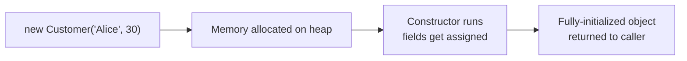
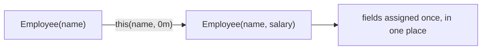
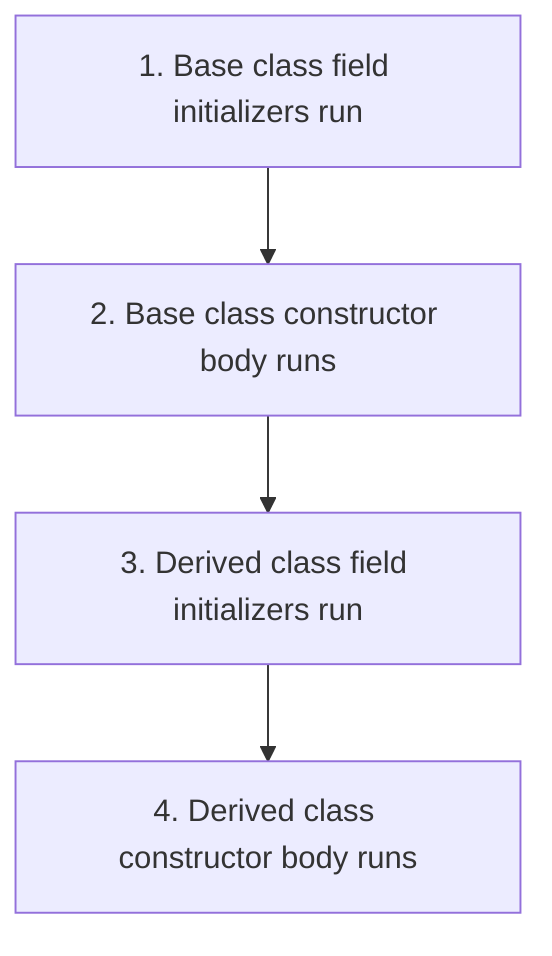

# C# Mastery Track — Topic 3: Constructors

> **Track goal:** Strong backend C# skills (ASP.NET Core, Web API, EF Core) + interview readiness.
> **Progression:** Topic 1 (Data Types) → Topic 2 (Methods) → **Topic 3 (this file)**
> **Rule:** Solutions to the 50 exercises are **withheld** — submit your attempts and I'll review them.

---

## 1. Concept

A **constructor** is a special method that runs automatically when an object is created with `new`. Its job is to put the object into a **valid initial state** — assigning fields, validating input, wiring up dependencies — before anyone can use it.



**Why constructors matter in backend code:** in ASP.NET Core, **constructor injection** is the primary way services receive their dependencies (`DbContext`, `ILogger`, other services). Understanding constructors deeply is directly understanding how dependency injection works.

---

## 2. Constructor Syntax

```csharp
public class Customer
{
    public string Name;
    public int Age;

    // Constructor: same name as the class, NO return type (not even void)
    public Customer(string name, int age)
    {
        Name = name;
        Age = age;
    }
}

var c = new Customer("Alice", 30);
```

---

## 3. Default Constructor

If you write **no** constructor at all, C# silently gives you a public, parameterless one that does nothing beyond letting fields take their default values.

```csharp
public class Point
{
    public int X;
    public int Y;
    // no constructor written -> compiler provides: public Point() { }
}
var p = new Point();   // X = 0, Y = 0
```

⚠️ **The moment you write any constructor yourself, the compiler-provided parameterless one disappears.** If you still want a parameterless constructor alongside your custom one, you must write it explicitly.

---

## 4. Parameterized Constructors & Overloading

```csharp
public class Employee
{
    public string Name;
    public decimal Salary;

    public Employee(string name)                    // overload 1
    {
        Name = name;
        Salary = 0m;
    }

    public Employee(string name, decimal salary)     // overload 2
    {
        Name = name;
        Salary = salary;
    }
}
```

Just like methods, constructors can be **overloaded** — same name (the class name), different parameter lists.

---

## 5. Constructor Chaining with `this()`

Avoid duplicating initialization logic by having one constructor call another **in the same class**.



```csharp
public class Employee
{
    public string Name;
    public decimal Salary;

    public Employee(string name) : this(name, 0m)   // chains to the other constructor
    {
    }

    public Employee(string name, decimal salary)
    {
        Name = name;
        Salary = salary;
    }
}
```

---

## 6. Chaining to the Base Class with `base()`

```csharp
public class Person
{
    public string Name;
    public Person(string name) { Name = name; }
}

public class Employee : Person
{
    public decimal Salary;

    public Employee(string name, decimal salary) : base(name)   // calls Person's constructor first
    {
        Salary = salary;
    }
}
```

**Rule:** a derived class's constructor **always** invokes some constructor of its base class — either explicitly via `base(...)`, or implicitly (the base's parameterless constructor) if you don't specify one. If the base class has **no** parameterless constructor, you're **forced** to call `base(...)` explicitly.

---

## 7. Constructor Execution Order (interview favorite)



```csharp
public class Base
{
    public Base() { Console.WriteLine("Base ctor"); }
}
public class Derived : Base
{
    public Derived() { Console.WriteLine("Derived ctor"); }
}
new Derived();
// Output:
// Base ctor
// Derived ctor
```

Base **always** finishes before derived begins its own body — this guarantees inherited fields are ready before the subclass tries to use them.

---

## 8. Static Constructors

Runs **once**, automatically, before the class is used for the first time (first instance created OR first static member accessed) — never called manually, takes no parameters, no access modifier.

```csharp
public class AppConfig
{
    public static readonly string ConnectionString;

    static AppConfig()                    // static constructor
    {
        ConnectionString = LoadFromEnvironment();
        Console.WriteLine("AppConfig initialized once.");
    }

    private static string LoadFromEnvironment() => "Server=...;";
}
```

**Backend relevance:** loading configuration, initializing a cache, or setting up static lookup tables exactly once per application lifetime.

---

## 9. Private Constructors

Prevents the class from being instantiated from outside — used for **Singleton** patterns and classes exposing only static factory methods.

```csharp
public class Logger
{
    private static readonly Logger _instance = new Logger();
    public static Logger Instance => _instance;

    private Logger() { }   // nobody outside can call `new Logger()`
}

Logger.Instance.Log("Hello");   // only way to get one
```

---

## 10. Copy Constructors

C# has no built-in copy constructor syntax (unlike C++), but you write one manually — a constructor that takes an instance of the same type and copies its fields.

```csharp
public class Point
{
    public int X, Y;
    public Point(int x, int y) { X = x; Y = y; }

    public Point(Point other)              // copy constructor
    {
        X = other.X;
        Y = other.Y;
    }
}

var p1 = new Point(3, 4);
var p2 = new Point(p1);   // independent copy — changing p2 doesn't affect p1
```

---

## 11. Constructors in Abstract Classes

Abstract classes **can** and often **do** have constructors — even though you can't `new` an abstract class directly, its constructor still runs when a concrete subclass is instantiated (via `base()`).

```csharp
public abstract class Shape
{
    public string Color;
    protected Shape(string color) { Color = color; }   // runs via base() from subclasses
    public abstract double Area();
}

public class Circle : Shape
{
    public double Radius;
    public Circle(string color, double radius) : base(color) { Radius = radius; }
    public override double Area() => Math.PI * Radius * Radius;
}
```

---

## 12. Constructors and Dependency Injection

This is **the** real-world payoff of understanding constructors deeply — ASP.NET Core's built-in DI container instantiates your services by calling their constructors and automatically supplying registered dependencies.

```csharp
public class OrderService
{
    private readonly AppDbContext _db;
    private readonly ILogger<OrderService> _logger;

    // The DI container sees this constructor and supplies both parameters automatically
    public OrderService(AppDbContext db, ILogger<OrderService> logger)
    {
        _db = db;
        _logger = logger;
    }
}
```

This is called **constructor injection** — the most common and recommended form of dependency injection in ASP.NET Core.

---

## 13. Object Initializer Syntax (related, often confused with constructors)

```csharp
public class Product
{
    public string Name;
    public decimal Price;
}

var p = new Product { Name = "Widget", Price = 9.99m };  // calls parameterless ctor, then sets properties
```

This calls the (parameterless) constructor **first**, then assigns each listed member — it is *not* a constructor itself, and cannot enforce required fields the way a parameterized constructor can.

---

## 14. Constructor vs Method — Quick Comparison

| | Constructor | Regular Method |
|---|---|---|
| Name | Same as the class | Any valid identifier |
| Return type | None (not even `void`) | Required (or `void`) |
| Called | Automatically via `new` | Explicitly by name |
| Purpose | Initialize object state | Perform an action/behavior |
| Can be inherited | No (but chained via `base()`) | Yes (can be overridden if `virtual`) |
| Overloading | Yes | Yes |

---

## 15. Common Mistakes & Best Practices

| Mistake | Why it's wrong | Fix |
|---|---|---|
| Writing a parameterized constructor and assuming `new Thing()` still works | The default parameterless ctor disappears once you add any constructor | Add an explicit parameterless one if you need it |
| Duplicating field-assignment logic across overloaded constructors | Violates DRY, easy to get out of sync | Chain with `this(...)` |
| Forgetting a base class with no parameterless constructor forces `base(args)` | Compiler error (CS7036) | Always call `base(...)` explicitly when required |
| Doing heavy/expensive work (I/O, DB calls) inside a constructor | Makes object creation slow/unpredictable, hard to test | Keep constructors cheap; do heavy work in explicit init methods |
| Confusing a static constructor with a static factory method | Static constructor can't take parameters or be called manually | Use a static method (e.g., `Create(...)`) if you need parameters |
| Relying on object initializers to enforce "required" data | Nothing stops someone from leaving a field unset | Use a parameterized constructor for truly required data |
| Assuming constructor order runs derived-then-base | It's always base-then-derived | Remember the execution order diagram above |

---

## 16. Interview Questions

1. What happens to the compiler-generated default constructor once you add your own constructor?
2. Explain constructor chaining with `this()` — why is it useful?
3. When is a base class constructor called if you don't explicitly write `base(...)`?
4. What is a static constructor, and how is it different from a regular constructor or a static method?
5. Why would you make a constructor `private`? Give a real design pattern that relies on this.
6. What is the execution order between a base class's field initializers, its constructor, and a derived class's constructor?
7. Why doesn't C# have built-in copy constructor syntax like C++, and how do you replicate the behavior?
8. How does ASP.NET Core's dependency injection container use constructors under the hood?
9. Can an abstract class have a constructor if it can never be instantiated directly? Explain.
10. What's the risk of putting expensive logic (like a database call) inside a constructor?

---

## 17. Practical Exercises (50 Questions)

Attempt each yourself first — post your solution and I'll review it (correctness, bugs, improvements, stronger idiomatic version, rating 1–10, what to practice next).

### Beginner (1–10)

1. Write a `Student` class with fields `Name` and `Grade`, and a constructor that sets both from parameters. Create two instances and print their values.
2. Write a `Product` class with a default (parameterless) constructor that sets `Name = "Unnamed"` and `Price = 0`. Instantiate it and print the defaults.
3. Write a `Book` class with fields `Title` and `Author`, and print a message from inside the constructor confirming the object was created.
4. Write a `Vehicle` class with a constructor taking only `Make`, and demonstrate what happens (compiler error, as a comment) if you try `new Vehicle()` afterward.
5. Write a `BankAccount` class with a constructor requiring an `AccountHolder` name and an initial `Balance`, defaulting `Balance` to `0` if not provided (use an optional parameter, not overloading, for this one).
6. Write a `Customer` class with two constructors: one taking just `Name`, another taking `Name` and `Email` — no chaining yet, just two independent constructors.
7. Write an `Order` class with a constructor that validates `Quantity > 0`, throwing an `ArgumentException` if not — test both a valid and an invalid call.
8. Write a `Point` class with a constructor `Point(int x, int y)` and print the coordinates of two different points.
9. Write a `Person` class with a constructor, then use object initializer syntax separately to create a second `Person` and compare the two approaches in a comment.
10. Write an `Animal` class whose constructor prints "Animal created" — instantiate three animals and observe the output.

### Basic (11–20)

11. Rewrite your `Customer` class from Q6 so the `Name`-only constructor **chains** to the `Name`+`Email` constructor using `this(...)`, defaulting email to an empty string.
12. Write a `Product` class with three overloaded constructors (`Product()`, `Product(name)`, `Product(name, price)`), all chaining down to the most complete one.
13. Write a `Shape` base class with a constructor taking `Color`, and a `Circle` subclass whose constructor calls `base(color)` and also sets `Radius`.
14. Write a class `AppSettings` with a **static constructor** that prints "Settings loaded" and initializes a static readonly field — demonstrate it only runs once even if you reference the class multiple times.
15. Write a `Singleton` class `ConfigManager` with a `private` constructor and a public static `Instance` property, and prove from calling code that you cannot do `new ConfigManager()`.
16. Write a `Point` class with a **copy constructor** `Point(Point other)`, and demonstrate that modifying the copy doesn't affect the original.
17. Write an `Employee` class with a constructor requiring `Name` and `Department`, and explain (in a comment) why using object-initializer syntax alone wouldn't be sufficient to enforce these as required.
18. Write a `Rectangle` class whose constructor validates that `Width` and `Height` are both positive, throwing an exception otherwise — test with valid and invalid input.
19. Write a `Base` and `Derived` class pair, each constructor printing a message, and run the code to confirm/observe the base-then-derived execution order discussed in the module.
20. Write a `Library` class whose constructor takes a `List<string>` of initial book titles and stores a **copy** of the list (not the same reference) — demonstrate why copying matters here.

### Intermediate (21–30)

21. Write a `Vehicle` base class with a constructor requiring `Make` and `Model`, and a `Car` subclass adding `NumberOfDoors`, with a constructor that chains via `base(make, model)`.
22. Write a `HospitalPatient` class with a constructor that validates `Age >= 0` and a non-empty `Name`, collecting **multiple** validation errors (not just throwing on the first one) into an exception message.
23. Write a `ShoppingCart` class whose constructor accepts no parameters but initializes an internal `List<CartItem>` — explain in a comment why this initialization belongs in the constructor rather than being left `null` by default.
24. Write an abstract class `PaymentMethod` with a constructor taking `AccountHolderName`, and two subclasses `CreditCardPayment` and `BankTransferPayment`, each with their own additional constructor parameters, both correctly chaining via `base(...)`.
25. Write a `Money` struct/class with a constructor validating `Amount >= 0` and a non-null `CurrencyCode`, throwing appropriate exceptions for invalid input.
26. Write a class `ReportGenerator` with a static constructor that loads a (simulated) static lookup dictionary once, and an instance constructor that takes a `ReportType` parameter — demonstrate both running, in the correct order, when the first instance is created.
27. Write an `Order` class with a **copy constructor** that performs a **deep copy** of an internal `List<OrderLine>` (not just copying the list reference) — demonstrate that modifying the copy's lines doesn't affect the original's lines.
28. Write a `Person` class and a `Student : Person` subclass where `Person` has **no** parameterless constructor — demonstrate (as a working example) that `Student`'s constructor is therefore forced to call `base(...)` explicitly.
29. Write a `DatabaseConnection` class with a `private` constructor and a public static factory method `Create(string connectionString)` that performs validation before returning a new instance — explain why this is preferable to a public constructor here.
30. Write an `Employee` class implementing a "required fields via constructor, optional fields via object initializer" pattern: constructor requires `Name` and `Id`; `Department` and `ManagerName` are public settable properties left for optional initializer-syntax assignment.

### Advanced (31–40)

31. Write a `BankAccount` class whose constructor takes an initial deposit and simulates immediately writing an "account opened" record to a (fake, in-memory) audit log list — then discuss in a comment why doing real I/O (e.g., an actual database write) directly in a constructor is risky, and how you'd redesign it.
32. Design a small class hierarchy `Shape` (abstract, constructor takes `Color`) → `Polygon` (abstract, constructor takes `Color` + `NumberOfSides`, chains to `Shape`) → `Square` (constructor takes `Color` + `SideLength`, chains to `Polygon` with a fixed `NumberOfSides = 4`) — demonstrate the full three-level chain executing in order.
33. Write an `Order` class whose constructor accepts a `Customer` (reference type) and stores it directly — then demonstrate that changing a property on the `Customer` *after* the `Order` was constructed is still visible through `order.Customer`, and explain why (tie this back to Topic 1's reference-type concepts).
34. Write a `Cache<T>` generic class with a `private` constructor, a public static `Instance` singleton property (using `Lazy<T>` for thread-safety), and a method `GetOrAdd(string key, Func<T> factory)`.
35. Write a `Product` class implementing `ICloneable`-style deep copy via a copy constructor, where `Product` has a nested `List<string> Tags` — ensure cloning produces a genuinely independent `Tags` list.
36. Write a class `ServiceBase` (abstract) with a constructor that takes an `ILogger`-like interface parameter (you can define a minimal fake interface) and stores it in a `protected readonly` field — then write two subclasses that both chain via `base(logger)` and use the logger in their own methods.
37. Write a `ValueRange` struct with a constructor validating `Min <= Max`, throwing otherwise — and explain (in a comment) why struct constructors have some restrictions that class constructors don't (e.g., historically no parameterless custom constructor allowed on structs, and all fields must be assigned).
38. Design an `OrderBuilder`-style pattern (not full Builder pattern, just the constructor-related core) where `Order`'s only public constructor requires `CustomerId` and an initial `List<OrderLine>`, forcing every order to start in a valid, non-empty state — demonstrate why this is safer than allowing an empty default constructor for `Order`.
39. Write a `EmailAddress` class whose constructor validates the input string against a simple format check (contains exactly one `@`, not empty on either side) and throws a descriptive exception otherwise — write test instantiations for both valid and multiple invalid cases.
40. Write a static class `EntityFactory` (or a set of static factory methods) that hides several private constructors behind clearly named static methods like `CreateNewCustomer(...)` vs `CreateFromDatabaseRow(...)`, each initializing fields differently (e.g., one generates a new ID, the other accepts an existing one) — explain why this factory-method approach is often cleaner than many overloaded public constructors.

### Complex / Real-World (41–50)

41. Design a simplified `AppDbContext`-style class whose constructor takes a `DbContextOptions`-like parameter (define a minimal fake class) and demonstrate, with comments, how ASP.NET Core's DI container would use this constructor automatically when injecting `AppDbContext` into a controller or service.
42. Design an `OrderService` class with a constructor requiring an `IOrderRepository` and an `IPaymentGateway` (define minimal fake interfaces) — this is the constructor-injection pattern used throughout real ASP.NET Core apps; write the constructor and one method that uses both injected dependencies.
43. Write a `BankAccount` class hierarchy: `Account` (abstract base, constructor validates `AccountNumber` format and non-negative `Balance`) → `SavingsAccount` (adds `InterestRate`, chains via `base`) → `CheckingAccount` (adds `OverdraftLimit`, chains via `base`) — instantiate one of each and verify the full validation runs correctly for both valid and invalid inputs.
44. Design an immutable `Money` class (all fields `readonly`, only settable through the constructor) supporting addition via a method that returns a **new** `Money` instance rather than mutating — explain why immutability here, enforced via constructor-only initialization, prevents a whole category of bugs in financial code.
45. Write a `Customer` class whose constructor takes a `List<Order>` of existing orders and stores a defensive **copy**, plus write a copy constructor `Customer(Customer other)` that performs a full deep copy including the nested orders list — demonstrate the difference between a shallow reference copy and your deep copy.
46. Design a `ShoppingCart` class where the **only** way to add items is through the constructor plus an `AddItem` method (no public setter for the internal list), and where the constructor optionally accepts a `List<CartItem>` of pre-existing items (defaulting to empty) — this models "encapsulated construction," a common real backend pattern.
47. Write an `Order` class implementing a static factory method `Order.CreateFromCart(ShoppingCart cart, string customerId)` that hides a `private` constructor, performing all necessary validation (cart not empty, valid customer ID) before returning a fully-formed `Order` — explain why this is preferable to exposing a public multi-parameter constructor directly to calling code.
48. Design a `HospitalPatientRecord` class hierarchy where `PatientRecordBase` (abstract) has a constructor requiring `PatientId` and `CreatedAtUtc` (defaulting to `DateTime.UtcNow` if not provided), and `InpatientRecord`/`OutpatientRecord` subclasses each add their own required fields via constructors chaining to `base` — ensure `CreatedAtUtc` can't accidentally be set to a future date (validate in the base constructor).
49. Write a `InventoryItem` class whose constructor takes `Sku`, `InitialStock`, and enforces via validation that `Sku` matches a required format (e.g., 3 letters + 4 digits) — then write a **static constructor** on a companion class `SkuValidator` that pre-compiles a `Regex` once for reuse across all validations (tying together static constructors + real-world validation performance).
50. Design the constructors for a small realistic **e-commerce checkout system**: `Order` (constructor requires `CustomerId`, non-empty `List<OrderLine>`, computes and stores an immutable `SubTotal` at construction time), `Payment` (constructor requires `OrderId`, `Amount`, validates `Amount` matches the order's total), and `Shipment` (constructor requires `OrderId`, `Address`, defaults `Status` to `"Pending"`) — wire a small `Main`-style flow that constructs all three in the correct order and explain, in comments, how each constructor's validation prevents an invalid object graph from ever existing.

---

## How we'll proceed

Submit your solution to any question and I'll review it against:
1. ✅ Correctness  2. 🐛 Errors/bugs  3. 💡 Improvements  4. 🏆 Stronger idiomatic version + why  5. ⭐ Rating 1–10  6. 📌 What to practice next

Once you've worked through Topics 1–3, we can move on to whatever comes next in your backend track (e.g., inheritance/polymorphism, interfaces, collections/LINQ, async/await, or Web API/EF Core specifics) — just say the word.
