# C# OOP Mastery — 0% to 100% in 3 Days (Simple English)

> **Goal:** Learn Object-Oriented Programming (OOP) in C#, from complete beginner to advanced/interview level.
> **Style:** Very simple English. Many examples. Many diagrams. Practice questions and real scenarios at the end of each day.
> **Plan:** Day 1 = Foundations. Day 2 = Inheritance & Polymorphism. Day 3 = Advanced OOP + Real Backend Use.
> **Rule:** Answers to practice questions are NOT given immediately. You try first. Then I check your answer.

---

# 📅 DAY 1 — OOP Foundations (0% → 35%)

## 1.1 What is OOP? (In Very Simple Words)

**OOP** means **Object-Oriented Programming**. It is a way of writing code where you think about your program as a group of **objects**, instead of just a list of steps.

Think about the real world:
- A **Car** has properties (color, speed, brand) and can do things (start, stop, accelerate).
- A **Student** has properties (name, age, grade) and can do things (study, submit homework).
- A **BankAccount** has properties (balance, owner) and can do things (deposit, withdraw).

In OOP, we write code that models these real things directly. We call them **objects**.

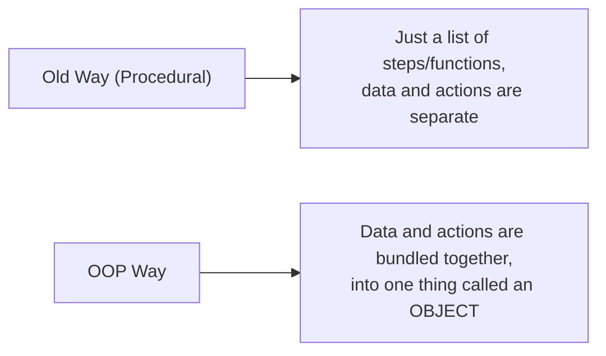

### Why do we use OOP?

| Reason | Simple Explanation |
|---|---|
| Organized code | Related data and actions stay together, in one place |
| Reusable | You write a class once, and create many objects from it |
| Easy to maintain | Fixing a bug in one class does not break unrelated code |
| Matches real life | Easier to think about, plan, and explain to others |
| Used everywhere in backend | ASP.NET Core, Entity Framework, and almost all real C# apps are built using OOP |

---

## 1.2 Class vs Object (The Most Basic Idea in OOP)

This is the very first thing you must understand clearly.

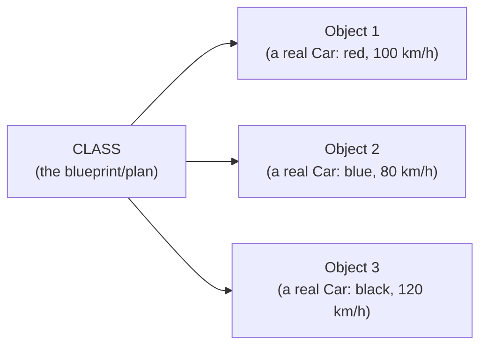

- A **class** is like a **blueprint** or a **recipe**. It describes what something should look like and what it should be able to do. It is not a real thing by itself.
- An **object** is a **real thing**, made from that blueprint. You can make many objects from one class.

### Simple Example

```csharp
// This is the CLASS — the blueprint
public class Car
{
    public string Color;
    public int Speed;

    public void Accelerate()
    {
        Speed += 10;
    }
}
```

```csharp
// These are OBJECTS — real things, made from the blueprint
Car car1 = new Car { Color = "Red", Speed = 0 };
Car car2 = new Car { Color = "Blue", Speed = 0 };

car1.Accelerate();
Console.WriteLine(car1.Speed); // 10
Console.WriteLine(car2.Speed); // 0 (car2 is a totally separate object)
```

**Easy way to remember:** A class is like the word "Car" written in a dictionary. An object is an actual car parked outside your house.

---

## 1.3 Fields, Properties, and Methods

A class usually contains three kinds of things:

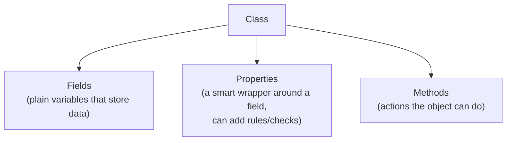

```csharp
public class Student
{
    // FIELD — plain data storage
    private string _name;

    // PROPERTY — controlled access to the field, can add rules
    public string Name
    {
        get { return _name; }
        set
        {
            if (string.IsNullOrEmpty(value))
                throw new ArgumentException("Name cannot be empty");
            _name = value;
        }
    }

    // METHOD — something the object can DO
    public void Study()
    {
        Console.WriteLine($"{Name} is studying.");
    }
}
```

Modern shortcut, same idea, less code (called an **auto-property**):
```csharp
public class Student
{
    public string Name { get; set; }   // C# creates the hidden field for you automatically

    public void Study()
    {
        Console.WriteLine($"{Name} is studying.");
    }
}
```

**Simple rule for beginners:** Use plain `{ get; set; }` properties when you don't need special rules. Write the full version (with a private field) only when you need to add checks, like not allowing an empty name.

---

## 1.4 The Four Pillars of OOP (The Big Picture)

Everything in OOP is built on four main ideas. We will cover all of them across these 3 days.

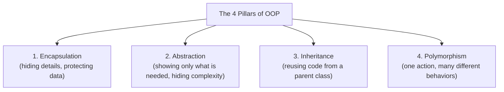

Today (Day 1), we focus mainly on **Encapsulation**. Day 2 covers **Inheritance** and **Polymorphism**. Day 3 covers **Abstraction** deeply, plus advanced topics.

---

## 1.5 Pillar 1: Encapsulation (Protecting Your Data)

**Encapsulation** means: keep an object's data **private**, and only allow it to be changed through **controlled ways** (like properties and methods), instead of letting anyone change it directly.

### Why does this matter?

Imagine a `BankAccount` class where the `Balance` is completely open (public), with no protection:

```csharp
// ❌ BAD — no protection at all
public class BankAccount
{
    public decimal Balance;
}

var account = new BankAccount();
account.Balance = -5000;   // Nothing stops this! A balance should never be negative like this.
```

Anyone, anywhere, can set `Balance` to anything, even wrong or dangerous values. This is a real bug risk in a backend system.

### The Encapsulation Fix

```csharp
// ✅ GOOD — protected with a private field and a controlled property
public class BankAccount
{
    private decimal _balance;

    public decimal Balance
    {
        get { return _balance; }
        private set { _balance = value; }   // only this class itself can directly set it
    }

    public void Deposit(decimal amount)
    {
        if (amount <= 0)
            throw new ArgumentException("Deposit amount must be positive");
        _balance += amount;
    }

    public void Withdraw(decimal amount)
    {
        if (amount <= 0)
            throw new ArgumentException("Withdraw amount must be positive");
        if (amount > _balance)
            throw new InvalidOperationException("Not enough balance");
        _balance -= amount;
    }
}
```

Now, the **only** way to change `Balance` is through `Deposit()` and `Withdraw()`, and both have safety checks. This is encapsulation in action.

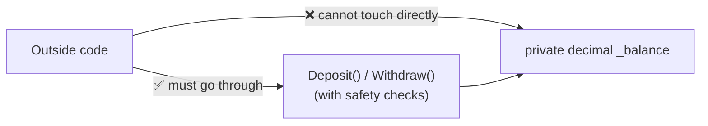

### Access Modifiers (The Tools of Encapsulation)

| Modifier | Who can use it? |
|---|---|
| `public` | Anyone, from anywhere |
| `private` | Only code inside the same class |
| `protected` | The same class, and any class that inherits from it |
| `internal` | Only code inside the same project |

**Simple rule:** Make everything `private` by default. Only make something `public` if other code genuinely needs to use it directly.

---

## 1.6 The `this` Keyword

`this` means "the current object I am working with right now." It is mostly used to avoid confusion between a parameter name and a field name.

```csharp
public class Person
{
    public string Name;

    public Person(string name)
    {
        this.Name = name;   // "this.Name" is the field, "name" is the parameter
    }
}
```

---

## 1.7 More Beginner Examples

### Example: Product Class

```csharp
public class Product
{
    public string Name { get; set; }
    public decimal Price { get; set; }
    public int StockCount { get; set; }

    public void PrintDetails()
    {
        Console.WriteLine($"{Name} - ${Price} - {StockCount} in stock");
    }

    public bool IsInStock()
    {
        return StockCount > 0;
    }
}
```

### Example: Rectangle Class

```csharp
public class Rectangle
{
    public double Width { get; set; }
    public double Height { get; set; }

    public double GetArea()
    {
        return Width * Height;
    }

    public double GetPerimeter()
    {
        return 2 * (Width + Height);
    }
}
```

---

## 1.8 Common Mistakes on Day 1

| Mistake | Why it's wrong | Fix |
|---|---|---|
| Making all fields `public` | No protection, anyone can set wrong values | Use `private` fields with controlled `public` properties |
| Confusing a class with an object | A class is just a plan; it does nothing by itself | Remember: class = blueprint, object = real thing |
| Forgetting that each object has its own separate data | Beginners sometimes think all objects share the same data | Each `new ClassName()` creates a completely separate object |
| Writing logic outside the class instead of inside a method | Makes code messy and hard to reuse | Put related actions inside the class as methods |
| Not validating input inside setters/methods | Allows invalid data (like a negative balance) | Add checks (`if` statements) before accepting new values |

---

## 1.9 Day 1 Practice Questions (20 Questions)

Try each one yourself first. Send me your code, and I will check it.

### Beginner (1–10)

1. Create a `Person` class with `Name` and `Age` properties. Make two objects with different values, and print both.
2. Create a `Car` class with `Brand`, `Color`, and `Speed`. Add a method `Accelerate()` that increases `Speed` by 10. Call it twice and print the result.
3. Create a `Book` class with `Title`, `Author`, and `Pages`. Add a method `Describe()` that prints all three values in a sentence.
4. Create a `Circle` class with a `Radius` property, and a method `GetArea()` that returns the area (`3.14159 * Radius * Radius`).
5. Create a `Light` class with a `bool IsOn` property, and methods `TurnOn()` and `TurnOff()`. Test both.
6. Create a `Dog` class with a `Name` property and a method `Bark()` that prints `"{Name} says Woof!"`. Make three dogs and make them all bark.
7. Create a `Rectangle` class (like the example above), and print the area and perimeter for two different rectangles.
8. Create a `Employee` class with `Name` and `Salary`. Add a method `GiveRaise(decimal amount)` that increases the salary.
9. Create a `Movie` class with `Title`, `DurationMinutes`, and `Rating`. Print a formatted description using all three.
10. Create two different `Student` objects from the same `Student` class, and prove (by printing) that changing one student's `Name` does not affect the other student's `Name`.

### Basic / Encapsulation Focus (11–20)

11. Rewrite your `BankAccount` idea: make `Balance` `private`, and add `Deposit(decimal amount)` and `Withdraw(decimal amount)` methods with proper checks (amount must be positive, cannot withdraw more than the balance).
12. Create a `Temperature` class where the property `Celsius` cannot be set below `-273.15` (absolute zero) — throw an error if someone tries.
13. Create a `Password` class where the property can only be set if the new password is at least 8 characters long, otherwise throw an error.
14. Create an `Age` class where the property `Value` cannot be set to a negative number.
15. Create a `ShoppingCartItem` class where `Quantity` cannot be set below `1` — always throw an error for `0` or negative values.
16. Create a `Percentage` class where the value must always stay between `0` and `100` — reject anything outside that range.
17. Create a `Username` class where the value cannot contain spaces — reject it with an error message if it does.
18. Create an `Employee` class where `Salary` can only be increased, never decreased, through a `GiveRaise()` method (no direct public setter allowed).
19. Create a `Temperature` class with two properties, `Celsius` and a **calculated** (read-only) `Fahrenheit` that is always based on `Celsius` (no separate field for Fahrenheit).
20. Create a `Library` class with a `private List<string> _bookTitles` field, and public methods `AddBook(string title)` and `RemoveBook(string title)` — do NOT expose the list directly as public, this protects it from outside code adding items in the wrong way.

---

# 📅 DAY 2 — Inheritance & Polymorphism (35% → 70%)

## 2.1 Pillar 3: Inheritance (Reusing Code From a Parent)

**Inheritance** lets one class (called the **child** or **derived class**) reuse the fields, properties, and methods of another class (called the **parent** or **base class**).

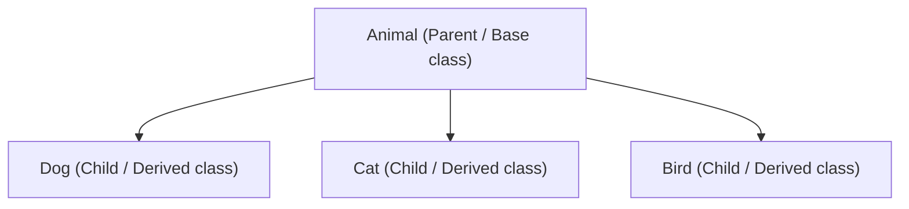

### Why use inheritance?

Imagine you have `Dog`, `Cat`, and `Bird` classes. All of them have a `Name` and an `Age`, and all of them can `Eat()` and `Sleep()`. Instead of writing this code three times, you write it **once**, in a parent class called `Animal`, and let the others **inherit** it.

### Basic Syntax

```csharp
// PARENT class
public class Animal
{
    public string Name { get; set; }
    public int Age { get; set; }

    public void Eat()
    {
        Console.WriteLine($"{Name} is eating.");
    }

    public void Sleep()
    {
        Console.WriteLine($"{Name} is sleeping.");
    }
}

// CHILD class — inherits everything from Animal, using the ":" symbol
public class Dog : Animal
{
    public void Bark()
    {
        Console.WriteLine($"{Name} says Woof!");
    }
}
```

```csharp
Dog myDog = new Dog { Name = "Rex", Age = 3 };
myDog.Eat();     // works! inherited from Animal
myDog.Sleep();   // works! inherited from Animal
myDog.Bark();    // works! defined in Dog itself
```

**Simple rule:** `Dog : Animal` means **"Dog IS AN Animal, plus some extra things."** This is called an **"is-a" relationship**. Always check: does it make real sense to say "X is a Y"? A `Dog` is an `Animal` — yes, that makes sense. A `Car` is an `Engine` — no, that doesn't make sense (a car **has an** engine, this is different, we cover this on Day 3).

---

## 2.2 `protected` — A Special Access Level for Inheritance

We learned `private` and `public` on Day 1. There is a third important one for inheritance: `protected`.

```csharp
public class Animal
{
    protected int _energy = 100;   // visible to Animal AND any class that inherits from it, but not outside code
}

public class Dog : Animal
{
    public void Run()
    {
        _energy -= 10;   // ✅ allowed, because Dog inherits from Animal
    }
}

Dog d = new Dog();
// d._energy = 5;   // ❌ NOT allowed from outside code, even though Dog can see it internally
```

---

## 2.3 Constructors and Inheritance (Quick Recap Link)

Remember from Topic 3 (Constructors): a child class's constructor always calls a parent constructor first, using `base(...)`.

```csharp
public class Animal
{
    public string Name;
    public Animal(string name) { Name = name; }
}

public class Dog : Animal
{
    public string Breed;
    public Dog(string name, string breed) : base(name)   // sends "name" up to Animal's constructor
    {
        Breed = breed;
    }
}
```

---

## 2.4 Method Overriding — `virtual` and `override`

Sometimes, a child class needs to change **how** an inherited method works, not just add new methods. This is called **overriding**.

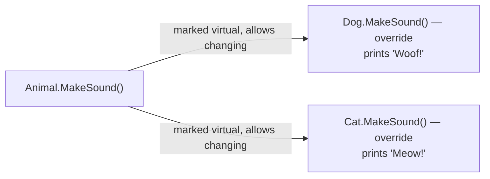

```csharp
public class Animal
{
    public virtual void MakeSound()      // "virtual" means "child classes are allowed to change this"
    {
        Console.WriteLine("Some generic animal sound");
    }
}

public class Dog : Animal
{
    public override void MakeSound()     // "override" means "I am changing the parent's version"
    {
        Console.WriteLine("Woof!");
    }
}

public class Cat : Animal
{
    public override void MakeSound()
    {
        Console.WriteLine("Meow!");
    }
}
```

**Rule:** the parent method must say `virtual`. The child method must say `override`. Without `virtual` in the parent, the child cannot use `override`.

---

## 2.5 Pillar 4: Polymorphism (One Action, Many Behaviors)

**Polymorphism** is a big word for a simple idea: **"the same method call can behave differently, depending on the actual object."**

### The Most Powerful Example

```csharp
List<Animal> animals = new List<Animal>
{
    new Dog(),
    new Cat(),
    new Animal()
};

foreach (Animal a in animals)
{
    a.MakeSound();   // same line of code, but DIFFERENT output for each one!
}

// Output:
// Woof!
// Meow!
// Some generic animal sound
```

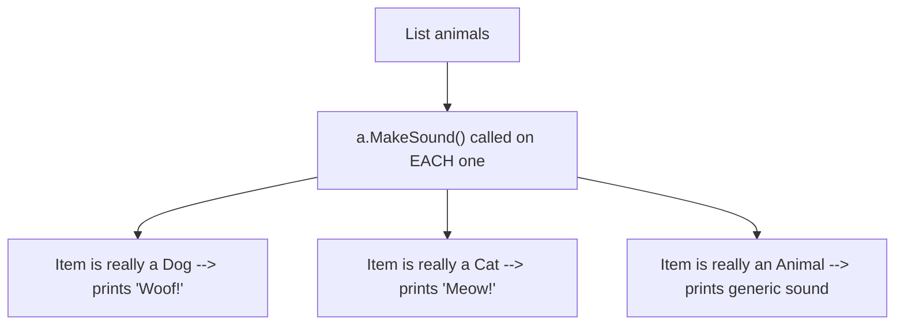

Even though every item in the list is *treated* as `Animal`, C# is smart enough to remember what each object **really** is underneath, and calls the correct, **overridden** version. This is called **runtime polymorphism**.

**Why this matters for backend work:** imagine a list of `PaymentMethod` objects (some are `CreditCardPayment`, some are `PayPalPayment`). You can call `paymentMethod.Process()` on every single one, in one simple loop, and each one correctly handles its own type of payment. This is a huge reason OOP is used in real systems.

---

## 2.6 Two Kinds of Polymorphism

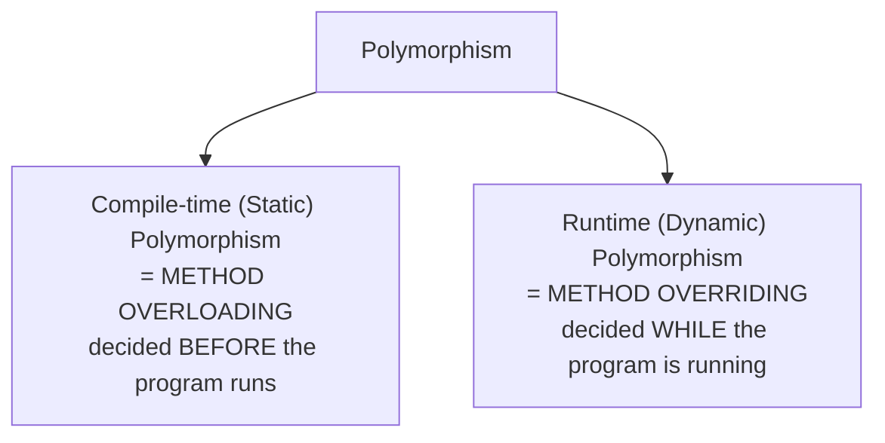

```csharp
// Compile-time polymorphism — OVERLOADING (same name, different parameters)
public class Calculator
{
    public int Add(int a, int b) => a + b;
    public double Add(double a, double b) => a + b;
}

// Runtime polymorphism — OVERRIDING (same signature, child changes the behavior)
public class Animal
{
    public virtual void MakeSound() => Console.WriteLine("...");
}
public class Dog : Animal
{
    public override void MakeSound() => Console.WriteLine("Woof!");
}
```

---

## 2.7 Method Hiding with `new` (Different From Overriding — a Common Trap!)

```csharp
public class Animal
{
    public void Move() => Console.WriteLine("Animal moves");
}

public class Bird : Animal
{
    public new void Move() => Console.WriteLine("Bird flies");   // "new" HIDES the parent's method, does NOT override it
}

Animal a = new Bird();
a.Move();   // prints "Animal moves" !! NOT "Bird flies" — because there is no "virtual", so no real overriding happens

Bird b = new Bird();
b.Move();   // prints "Bird flies" — because we're calling it directly as a Bird
```

**This is a very common interview trap.** Without `virtual`/`override`, C# looks at the **variable's type** (`Animal`), not the real object underneath. With `virtual`/`override`, C# always looks at the **real object**, no matter what type the variable says. Always prefer `virtual`/`override` over `new` unless you have a very specific reason.

---

## 2.8 `sealed` — Stopping Further Changes

```csharp
public class Dog : Animal
{
    public sealed override void MakeSound()   // "sealed" stops any further class from overriding this again
    {
        Console.WriteLine("Woof!");
    }
}

// public class Puppy : Dog
// {
//     public override void MakeSound() { } // ❌ NOT allowed, because Dog sealed it
// }
```

You can also seal an entire class: `public sealed class FinalClass { }` — this stops anyone from inheriting from it at all.

---

## 2.9 More Inheritance & Polymorphism Examples

### Example: Shape Hierarchy

```csharp
public abstract class Shape          // "abstract" — more on this on Day 3
{
    public abstract double GetArea();   // no body here — every child MUST provide their own
}

public class Circle : Shape
{
    public double Radius;
    public override double GetArea() => Math.PI * Radius * Radius;
}

public class Square : Shape
{
    public double Side;
    public override double GetArea() => Side * Side;
}

List<Shape> shapes = new List<Shape> { new Circle { Radius = 2 }, new Square { Side = 3 } };
foreach (var shape in shapes)
{
    Console.WriteLine(shape.GetArea());   // polymorphism — each shape calculates its own area correctly
}
```

### Example: Employee Hierarchy

```csharp
public class Employee
{
    public string Name;
    public virtual decimal CalculateSalary() => 3000;
}

public class Manager : Employee
{
    public override decimal CalculateSalary() => 5000;
}

public class Director : Employee
{
    public override decimal CalculateSalary() => 8000;
}
```

---

## 2.10 Common Mistakes on Day 2

| Mistake | Why it's wrong | Fix |
|---|---|---|
| Forgetting `virtual` in the parent method | `override` in the child won't be allowed to compile | Always mark the parent method `virtual` if children should be able to change it |
| Using `new` instead of `override` by accident | Causes confusing bugs — the "wrong" version runs depending on the variable's type | Always use `override`, unless you have a specific, understood reason for `new` |
| Inheriting just to "reuse code," even when the "is-a" rule doesn't make sense | Leads to confusing, badly designed class structures | Ask: "Is X really a Y?" If not, don't use inheritance — consider composition (Day 3) |
| Making everything `virtual` "just in case" | Can hurt performance slightly, and makes the design unclear | Only mark methods `virtual` when you actually expect children to change them |
| Forgetting that a `sealed` method/class cannot be changed further | Causes compiler errors when trying to override/inherit | Only use `sealed` when you are sure no future class should extend it |

---

## 2.11 Day 2 Practice Questions (15 Questions)

### Basic Inheritance (1–5)

1. Create an `Animal` class with `Name` and a method `Eat()`. Create a `Cat` class that inherits from `Animal`, and add its own method `Meow()`. Test both methods on a `Cat` object.
2. Create a `Vehicle` class with `Make` and `Model`. Create a `Motorcycle` class that inherits from it, adding `HasSidecar` (bool). Print all details for a motorcycle object.
3. Create a `Person` class with a constructor requiring `Name`. Create a `Teacher` class that inherits from it, with its own constructor requiring `Name` and `Subject`, correctly using `base(name)`.
4. Create a `Shape` class with a `protected` field `_color`. Create a `Triangle` class that inherits from it, and prove (with a method inside `Triangle`) that it can access `_color`, but outside code cannot.
5. Create three classes: `Employee` (parent), `Manager` and `Intern` (children). Give `Employee` a `Name` field, and let both children inherit it, each adding one extra field of their own.

### Overriding & Polymorphism (6–10)

6. Create an `Animal` class with a `virtual` method `MakeSound()`. Create `Dog` and `Cat` classes that each `override` it differently. Put all three in a `List<Animal>` and loop through, calling `MakeSound()` on each.
7. Create a `Shape` class with a `virtual` method `GetArea()` returning `0`. Create `Circle` and `Rectangle` classes that override it correctly. Test with a `List<Shape>`.
8. Recreate the `Animal`/`Bird` example from section 2.7 yourself (using `new` instead of `override`), and show, with your own printed output, why the wrong method gets called when using an `Animal`-typed variable.
9. Create an `Employee` class with a `virtual` method `CalculateBonus()` returning a fixed value. Create a `SalesEmployee` child class that overrides it to calculate a different bonus. Show both behaviors.
10. Create a `PaymentMethod` class with a `virtual` method `Process(decimal amount)`. Create `CreditCardPayment` and `PayPalPayment` children, each overriding it with a different printed message. Loop through a `List<PaymentMethod>` and call `Process()` on each, proving polymorphism works.

### Mixed / Slightly Harder (11–15)

11. Create a 3-level class chain: `Vehicle` → `Car` → `SportsCar`, where each level adds one new field, and `SportsCar` correctly chains its constructor all the way up using `base(...)` at each level.
12. Create an `Animal` class with a `sealed` method (you decide which one makes sense), and show, as a comment, what would happen if a child tried to override it again.
13. Create a `Shape` class with method overloading: two versions of `Describe()` — one with no parameters (prints a generic message), and one that takes a `string extraInfo` parameter (prints the generic message plus the extra info). Explain why this is compile-time polymorphism.
14. Create a `Bird` class that overrides `ToString()` (a method every C# class already has) to return `"{Name} the bird"` instead of the default text. Print a `Bird` object directly with `Console.WriteLine(myBird)` and see the custom text appear.
15. Design a small `Notification` class hierarchy: `Notification` (parent, virtual `Send()` method), `EmailNotification`, and `SmsNotification` (children, each overriding `Send()` differently). Loop through a `List<Notification>` containing both types, and call `Send()` on each.

---

# 📅 DAY 3 — Advanced OOP & Real Backend Use (70% → 100%)

## 3.1 Pillar 2: Abstraction (Showing Only What's Needed)

**Abstraction** means: show only the **important, simple** details to the outside world, and hide the **complicated inside details**.

**Real-life example:** When you drive a car, you use the steering wheel and pedals. You don't need to know exactly how the engine burns fuel internally. The car **abstracts away** (hides) that complexity from you.

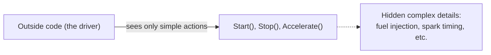

In C#, we achieve abstraction mainly using **abstract classes** and **interfaces**.

---

## 3.2 Abstract Classes (Deep Dive)

An **abstract class** is a class that:
- **Cannot** be directly made into an object using `new`.
- Can have some methods **fully written** (normal methods).
- Can have some methods **left empty on purpose** (`abstract` methods) — every child class **must** provide its own version.

```csharp
public abstract class Shape
{
    public string Color;

    // Normal method — has a real body, inherited as-is
    public void PrintColor()
    {
        Console.WriteLine($"Color: {Color}");
    }

    // Abstract method — NO body here, every child MUST implement this themselves
    public abstract double GetArea();
}

public class Circle : Shape
{
    public double Radius;
    public override double GetArea() => Math.PI * Radius * Radius;   // required!
}

// Shape s = new Shape();  ❌ NOT allowed — Shape is abstract
Shape s = new Circle { Radius = 5, Color = "Red" };   // ✅ allowed, through a child class
```

**When to use an abstract class:** when you have a group of closely related classes (like different `Shape`s) that should share some common code, but each one must also provide its own specific behavior for certain parts.

---

## 3.3 Interfaces (Deep Dive)

An **interface** is like a **contract** or a **checklist**. It says: "any class that uses me MUST provide these methods." An interface itself contains **no actual code**, just the **names and shapes** of methods (and sometimes properties).

```csharp
public interface IPayable
{
    void Pay(decimal amount);
}

public class Invoice : IPayable
{
    public void Pay(decimal amount)     // MUST implement this, or the code won't compile
    {
        Console.WriteLine($"Paid {amount} for invoice.");
    }
}
```

### Interface Naming Rule
By convention, interface names start with a capital `I`, like `IPayable`, `ILogger`, `IRepository`.

### A Class Can Implement MANY Interfaces (Unlike Inheritance!)

```csharp
public interface IPayable { void Pay(decimal amount); }
public interface IPrintable { void Print(); }

public class Invoice : IPayable, IPrintable   // implementing BOTH interfaces
{
    public void Pay(decimal amount) { Console.WriteLine($"Paid {amount}"); }
    public void Print() { Console.WriteLine("Printing invoice..."); }
}
```

A C# class can only inherit from **one** parent class, but it can implement **as many interfaces as it needs**. This is a very important difference.

---

## 3.4 Abstract Class vs Interface — Full Comparison

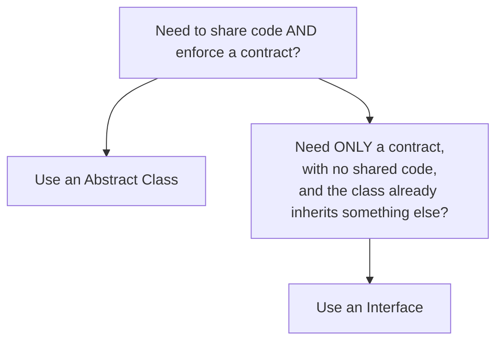

| | Abstract Class | Interface |
|---|---|---|
| Can have real, working methods? | Yes | Mostly no (some modern C# versions allow default methods, but this is rare/advanced) |
| Can have fields? | Yes | No |
| Can a class use more than one? | No — only one parent class allowed | Yes — a class can implement many interfaces |
| Can you make an object directly from it? | No | No |
| Use it when... | Classes are closely related, and share common code | You just need to guarantee "this class can do X," possibly across very different, unrelated classes |

**Real backend example:** `ILogger`, `IRepository<T>`, `IPaymentGateway` are all interfaces — this is exactly how ASP.NET Core's dependency injection works. You depend on the **interface** (the contract), not on one specific class, so you can easily swap implementations later (like swapping a real payment gateway for a fake/test one).

---

## 3.5 Composition — "Has-A" Instead of "Is-A" (Very Important!)

We learned inheritance means "is-a" (`Dog` **is an** `Animal`). But sometimes, the real relationship is "has-a" instead.

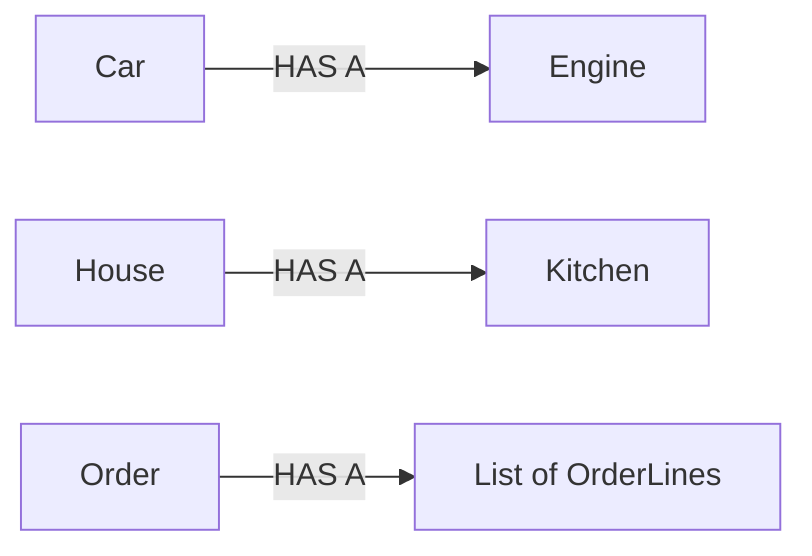

A `Car` is **not** an `Engine` — that would be wrong to model with inheritance. Instead, a `Car` **has an** `Engine` as a part of it. This is called **composition**.

```csharp
public class Engine
{
    public int Horsepower;
    public void Start() => Console.WriteLine("Engine starting...");
}

public class Car
{
    public Engine Engine { get; set; } = new Engine();   // Car HAS AN Engine (composition)

    public void Start()
    {
        Engine.Start();   // Car uses its engine's behavior, without inheriting from Engine
        Console.WriteLine("Car is moving.");
    }
}
```

**Famous OOP design advice:** *"Favor composition over inheritance."* This means: before using inheritance, always ask "does this really make sense as an IS-A relationship?" If not, use composition (put one class as a field inside another) instead.

---

## 3.6 Static Members — Recap and Deeper Look

```csharp
public class MathHelper
{
    public static int Square(int n) => n * n;   // belongs to the CLASS itself, not to any one object
}

int result = MathHelper.Square(5);   // no "new MathHelper()" needed!
```

| | Static member | Instance member |
|---|---|---|
| Belongs to | The class itself | Each individual object |
| Called using | `ClassName.Member` | `objectVariable.Member` |
| Can access instance fields? | No, not directly | Yes |
| Good for | Pure utility logic, no shared state needed | Anything that uses an object's own data |

---

## 3.7 Overriding `ToString()`, `Equals()` — Object Identity

Every class in C# automatically inherits from a built-in class called `object`. This gives every class some free methods, like `ToString()` and `Equals()`.

```csharp
public class Product
{
    public string Name;
    public decimal Price;

    public override string ToString()   // overriding the built-in method
    {
        return $"{Name} - ${Price}";
    }
}

Product p = new Product { Name = "Laptop", Price = 999 };
Console.WriteLine(p);   // automatically uses your custom ToString() -> "Laptop - $999"
```

Without overriding `ToString()`, printing an object directly would just print its class name — not very useful. This is why many backend classes override `ToString()` for easier debugging and logging.

---

## 3.8 SOLID Principles (A Simple Introduction)

SOLID is a set of 5 simple rules that help you design good, clean OOP code. You will hear about these constantly in real backend jobs and interviews.

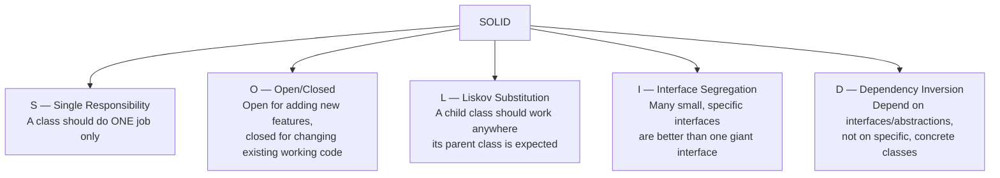

### Simple Example for Each

**S — Single Responsibility:**
```csharp
// ❌ BAD — this class does TOO MANY jobs (saving AND sending email)
public class Order
{
    public void Save() { /* save to database */ }
    public void SendConfirmationEmail() { /* send email */ }
}

// ✅ GOOD — split into two classes, each with ONE job
public class Order { public void Save() { /* save to database */ } }
public class OrderEmailSender { public void SendConfirmationEmail(Order order) { /* send email */ } }
```

**D — Dependency Inversion (very common in real backend code):**
```csharp
// ✅ GOOD — OrderService depends on an INTERFACE, not a specific class
public interface IEmailSender { void Send(string to, string message); }

public class OrderService
{
    private readonly IEmailSender _emailSender;   // could be ANY class that implements IEmailSender
    public OrderService(IEmailSender emailSender)
    {
        _emailSender = emailSender;
    }
}
```

This is exactly why interfaces matter so much in real backend apps — they let you plug in different implementations (a real email sender, or a fake one for testing) without changing `OrderService` at all.

---

## 3.9 Full Real-World Example — Putting It All Together

```csharp
// ABSTRACTION + ENCAPSULATION
public interface INotificationSender
{
    void Send(string message);
}

// INHERITANCE + POLYMORPHISM
public abstract class NotificationBase : INotificationSender
{
    protected string Recipient;

    protected NotificationBase(string recipient)
    {
        Recipient = recipient;
    }

    public abstract void Send(string message);
}

public class EmailNotification : NotificationBase
{
    public EmailNotification(string recipient) : base(recipient) { }

    public override void Send(string message)
    {
        Console.WriteLine($"Sending EMAIL to {Recipient}: {message}");
    }
}

public class SmsNotification : NotificationBase
{
    public SmsNotification(string recipient) : base(recipient) { }

    public override void Send(string message)
    {
        Console.WriteLine($"Sending SMS to {Recipient}: {message}");
    }
}

// COMPOSITION + DEPENDENCY INVERSION (SOLID)
public class OrderNotifier
{
    private readonly INotificationSender _sender;   // depends on the INTERFACE, not one exact class

    public OrderNotifier(INotificationSender sender)
    {
        _sender = sender;
    }

    public void NotifyOrderPlaced()
    {
        _sender.Send("Your order has been placed!");
    }
}

// Using it — POLYMORPHISM in action
List<INotificationSender> senders = new List<INotificationSender>
{
    new EmailNotification("alice@mail.com"),
    new SmsNotification("+1234567890")
};

foreach (var sender in senders)
{
    var notifier = new OrderNotifier(sender);
    notifier.NotifyOrderPlaced();
}
```

This one example uses **all four pillars**, plus composition and dependency inversion — this is exactly the style of code you will write in real ASP.NET Core backend projects.

---

## 3.10 Common Mistakes on Day 3

| Mistake | Why it's wrong | Fix |
|---|---|---|
| Using inheritance when composition fits better | Creates confusing, unrealistic "is-a" relationships | Ask "is-a" or "has-a"? Use composition for "has-a" |
| Making an interface with too many methods | Forces classes to implement things they don't need | Split into smaller, focused interfaces (Interface Segregation) |
| Depending directly on a specific class, instead of an interface | Makes code hard to test and hard to change later | Depend on interfaces (`IEmailSender`, not `EmailSender`) |
| Forgetting abstract classes cannot be instantiated | Causes a compiler error | Always create objects from a concrete (non-abstract) child class |
| Putting too many responsibilities in one class | Makes the class hard to understand, test, and change | Follow Single Responsibility — one class, one clear job |

---

## 3.11 Day 3 Practice Questions (15 Questions)

### Abstraction & Interfaces (1–6)

1. Create an abstract class `Shape` with an abstract method `GetArea()` and a normal method `PrintInfo()`. Create two child classes (`Circle`, `Square`) and test both.
2. Create an interface `IFlyable` with a method `Fly()`. Create a `Bird` class and an `Airplane` class, both implementing `IFlyable` in their own way.
3. Create an interface `IPayable` and an interface `IRefundable`, each with one method. Create an `Order` class that implements **both** interfaces.
4. Create an abstract class `Employee` with an abstract method `CalculateSalary()`. Create `FullTimeEmployee` and `PartTimeEmployee` children, each calculating salary differently.
5. Explain, in your own words (a short paragraph, not code), when you would choose an abstract class over an interface, using a real example.
6. Create an interface `IValidator<T>` with a method `bool Validate(T item)`. Create a class `EmailValidator` implementing it for `string` input.

### Composition & Static (7–10)

7. Create a `House` class that has a `Kitchen` object inside it (composition), where `Kitchen` has its own method `Cook()`. Call `Cook()` through the `House` object.
8. Create a static class `Logger` with a static method `Log(string message)` that prints the message with a timestamp in front of it.
9. Create a `Computer` class composed of a `CPU` object and a `RAM` object (both separate classes), and a method `PowerOn()` that uses both.
10. Explain, using your own small code example, the difference between a `static` method and an `instance` method, and when you would choose each.

### Real-World / SOLID (11–15)

11. Take a class that breaks Single Responsibility (you design it: a class doing 2–3 unrelated jobs), then refactor it into 2–3 smaller classes, each with one job.
12. Design an `IPaymentGateway` interface, and two classes implementing it: `StripeGateway` and `PayPalGateway`. Create an `OrderService` class that depends on `IPaymentGateway` (not on a specific gateway class) through its constructor.
13. Create a `List<INotificationSender>` (using the pattern from section 3.9), containing at least 3 different notification types, and loop through, sending a message with each — proving polymorphism.
14. Create an abstract class `Report` with an abstract method `Generate()`, and a normal method `Save()` shared by all reports. Create `PdfReport` and `ExcelReport` children.
15. Design a small `IRepository<T>` interface with methods `Add(T item)` and `GetAll()`. Create a class `InMemoryRepository<T>` implementing it, using a `List<T>` internally to store items.

---

# 🎯 FINAL SECTION — Scenario-Based Real Tasks (10 Scenarios)

These combine everything from all 3 days. Try to design full working code for each. Send me your solutions, and I will review them.

**Scenario 1 — E-commerce Product Catalog**
Design `Product` (base class) and two child classes `DigitalProduct` (no shipping needed) and `PhysicalProduct` (has `WeightKg`, needs shipping). Use an abstract method `CalculateShippingCost()` that returns `0` for digital products, and a real calculation for physical ones.

**Scenario 2 — Employee Payroll System**
Design an abstract `Employee` class with `CalculateSalary()`. Create `FullTimeEmployee`, `PartTimeEmployee`, and `ContractEmployee`, each calculating salary differently (fixed monthly, hourly rate × hours worked, and per-project fee). Loop through a `List<Employee>` and print all their salaries.

**Scenario 3 — Notification System for a Backend App**
Design an `INotificationSender` interface (like section 3.9), with `EmailNotification`, `SmsNotification`, and `PushNotification` classes. Build a small `NotificationService` class that takes a `List<INotificationSender>` and sends the same message through all of them.

**Scenario 4 — Bank Account Hierarchy**
Design an abstract `Account` class with `Balance` (protected, encapsulated) and abstract method `ApplyMonthlyFee()`. Create `SavingsAccount` (no fee) and `CheckingAccount` (fixed monthly fee) children, correctly using encapsulation so `Balance` can never be set directly from outside code.

**Scenario 5 — Shape Area Calculator for a Reporting Tool**
Design an abstract `Shape` class with `GetArea()` and `GetPerimeter()` as abstract methods. Create `Circle`, `Rectangle`, and `Triangle`. Write a method `PrintReport(List<Shape> shapes)` that loops through and prints the area and perimeter of each, using polymorphism.

**Scenario 6 — Logging System with Multiple Outputs**
Design an `ILogger` interface with a method `Log(string message)`. Create `ConsoleLogger` and `FileLogger` (just simulate writing to a file with a printed message) classes. Build an `OrderService` class that depends on `ILogger` through its constructor (Dependency Inversion), and calls `Log()` whenever an order is placed.

**Scenario 7 — Vehicle Rental System**
Design a `Vehicle` base class with `DailyRate`. Create `Car`, `Bike`, and `Truck` children, each overriding a method `CalculateRentalCost(int days)` with their own pricing rules (for example, trucks might have an extra daily fee). Test with a `List<Vehicle>`.

**Scenario 8 — Discount Strategy for a Shopping Cart**
Design an `IDiscountStrategy` interface with a method `decimal ApplyDiscount(decimal total)`. Create `NoDiscount`, `PercentageDiscount`, and `FixedAmountDiscount` classes implementing it. Build a `ShoppingCart` class that takes an `IDiscountStrategy` through its constructor, and uses it to calculate the final total — showing how you can easily swap discount rules without changing `ShoppingCart` itself.

**Scenario 9 — Hospital Staff Management**
Design an abstract `StaffMember` class with `Name` and an abstract method `GetDailySchedule()`. Create `Doctor` and `Nurse` children, each returning a different kind of schedule description. Also give `Doctor` a composition relationship with a `List<Patient>` (a simple `Patient` class with just a `Name`), representing the doctor's assigned patients.

**Scenario 10 — Full Mini Order System (Combines Everything)**
Design a small but complete system: an `Order` class (encapsulated `Total`, calculated only through methods, never set directly), an abstract `PaymentMethod` class with `CreditCardPayment` and `BankTransferPayment` children (each overriding a `Process(decimal amount)` method), and an `IOrderNotifier` interface with an `EmailOrderNotifier` implementation. Wire them together: when an order is placed, it should be paid using any `PaymentMethod`, and then a notification should be sent using any `IOrderNotifier` — all connected through constructors (Dependency Inversion), not hardcoded inside each other.

---

## How We'll Review Your Work

For each practice question and scenario, send me your code, and I will check:
1. ✅ Does it work / compile logically?
2. 🐛 Errors, bugs, or wrong OOP usage
3. 💡 Ways to improve it
4. 🏆 A stronger, more idiomatic version, and why it's better
5. ⭐ A score out of 10
6. 📌 What OOP concept you should practice next

**Suggested pace:**
- **Day 1:** Finish sections 1.1–1.9, and attempt at least 10 of the 20 questions.
- **Day 2:** Finish sections 2.1–2.11, and attempt at least 8 of the 15 questions.
- **Day 3:** Finish sections 3.1–3.11, attempt at least 8 of the 15 questions, and try at least 3 of the 10 final scenarios.

Once you're comfortable with OOP, we can move on to Collections & LINQ, async/await, or dive into ASP.NET Core / Web API / Entity Framework Core specifically — just tell me what you'd like next.
