# 📘 Object-Oriented Programming (OOP) in C# — From Zero to Expert & Interview Level

> **Who is this for?** Anyone who knows *nothing* about OOP and wants to become confident enough to design real systems and pass C# interviews.
>
> **C# version used:** All code is **C# 7.3-compatible** (works in .NET Framework 4.7.2+ and all .NET Core / .NET versions). When a newer feature is mentioned, it is clearly labeled.
>
> **How to use this guide:** Read in order. Type every code example yourself. Answer the interview questions *out loud* before reading the answers.

---

## 📑 Table of Contents

- [Part 0 — Before We Start](#part-0--before-we-start)
- [Part 1 — Foundations](#part-1--foundations)
  - [1. What is OOP?](#1-what-is-oop)
  - [2. Why Do We Need OOP?](#2-why-do-we-need-oop)
  - [3. Class](#3-class)
  - [4. Object](#4-object)
  - [5. Fields](#5-fields)
  - [6. Properties](#6-properties)
  - [7. Methods](#7-methods)
  - [8. Constructors](#8-constructors)
  - [9. The `this` Keyword](#9-the-this-keyword)
- [Part 2 — The Four Pillars](#part-2--the-four-pillars)
  - [10. Access Modifiers](#10-access-modifiers)
  - [11. Encapsulation](#11-encapsulation)
  - [12. Inheritance (Base & Derived Classes)](#12-inheritance-base--derived-classes)
  - [13. The `base` Keyword](#13-the-base-keyword)
  - [14. Polymorphism](#14-polymorphism)
  - [15. Method Overloading](#15-method-overloading-compile-time-polymorphism)
  - [16. virtual / override (Method Overriding)](#16-virtual--override-method-overriding)
  - [17. Method Hiding with `new`](#17-method-hiding-with-new)
  - [18. Sealed Classes and Methods](#18-sealed-classes-and-methods)
  - [19. Abstraction](#19-abstraction)
  - [20. Abstract Classes](#20-abstract-classes)
  - [21. Interfaces](#21-interfaces)
- [Part 3 — Beyond the Pillars](#part-3--beyond-the-pillars)
  - [22. Static Members](#22-static-members)
  - [23. Object Relationships Overview](#23-object-relationships-overview)
  - [24. Association](#24-association)
  - [25. Aggregation](#25-aggregation)
  - [26. Composition](#26-composition)
  - [27. Dependency](#27-dependency)
  - [28. Composition vs Inheritance](#28-composition-vs-inheritance)
  - [29. SOLID Principles](#29-solid-principles)
  - [30. Real-World OOP Design Process](#30-real-world-oop-design-process)
- [Part 4 — Scenario-Based Examples](#part-4--scenario-based-examples)
- [Part 5 — Coding Problems (Simple → Complex)](#part-5--coding-problems-simple--complex)
- [Part 6 — Interview Preparation](#part-6--interview-preparation)
- [Part 7 — Common Interview Traps](#part-7--common-interview-traps)
- [Part 8 — Final Interview Question Bank](#part-8--final-interview-question-bank)
- [Part 9 — Final Revision Section](#part-9--final-revision-section)

---

# Part 0 — Before We Start

## How every concept is taught

Every concept in this guide follows the same 8-step pattern:

| Step | Section | Purpose |
|------|---------|---------|
| A | Simple Definition | The interview-ready one-liner |
| B | Real-Life Example | Connect to something you already know |
| C | Visual Diagram | See it |
| D | Simple C# Example | Code it |
| E | Line-by-Line Explanation | Understand every line |
| F | How It Works Internally | What the computer actually does |
| G | Common Mistakes | Avoid the traps |
| H | Interview Questions | Easy → Hard |

## Minimum C# you need

You only need to know:
- How to write `Console.WriteLine("Hello");`
- Variables: `int age = 20; string name = "Ali";`
- `if`, `for`, and simple methods

That's it. Everything else is taught here.

## A note about diagrams

Diagrams use **Mermaid**, which renders automatically on GitHub, GitLab, VS Code (with the Markdown Preview Mermaid extension), Obsidian, and Notion. Colors are used consistently:

| Color | Meaning |
|-------|---------|
| 🟦 Blue | Class / Blueprint |
| 🟩 Green | Object / Instance |
| 🟧 Orange | Base / Parent class |
| 🟪 Purple | Interface / Abstract |
| 🟥 Red | Private / Hidden data |

---

# Part 1 — Foundations

## 1. What is OOP?

### A. Simple Definition

> **Object-Oriented Programming (OOP) is a programming style that organizes code into *objects* — units that combine *data* (what something has) and *behavior* (what something does).**

### Detailed explanation

Before OOP, programs were mostly written as a long list of instructions and functions working on separate data (this is called **procedural programming**). As programs grew, it became hard to know *which* function changes *which* data.

OOP solves this by **grouping related data and functions together**. For example, a "Car" object *has* a color and speed (data) and *can* start, accelerate, and brake (behavior).

OOP is built on **four pillars**:

1. **Encapsulation** — hide internal details, protect data.
2. **Inheritance** — reuse code from a parent.
3. **Polymorphism** — one name, many forms.
4. **Abstraction** — show only what is necessary.

### B. Real-Life Example

Think of a **TV remote**:
- **Data:** current channel, volume, battery level.
- **Behavior:** change channel, volume up, power on/off.
- You press buttons (behavior) without knowing the electronics inside (abstraction + encapsulation).

### C. Visual Diagram

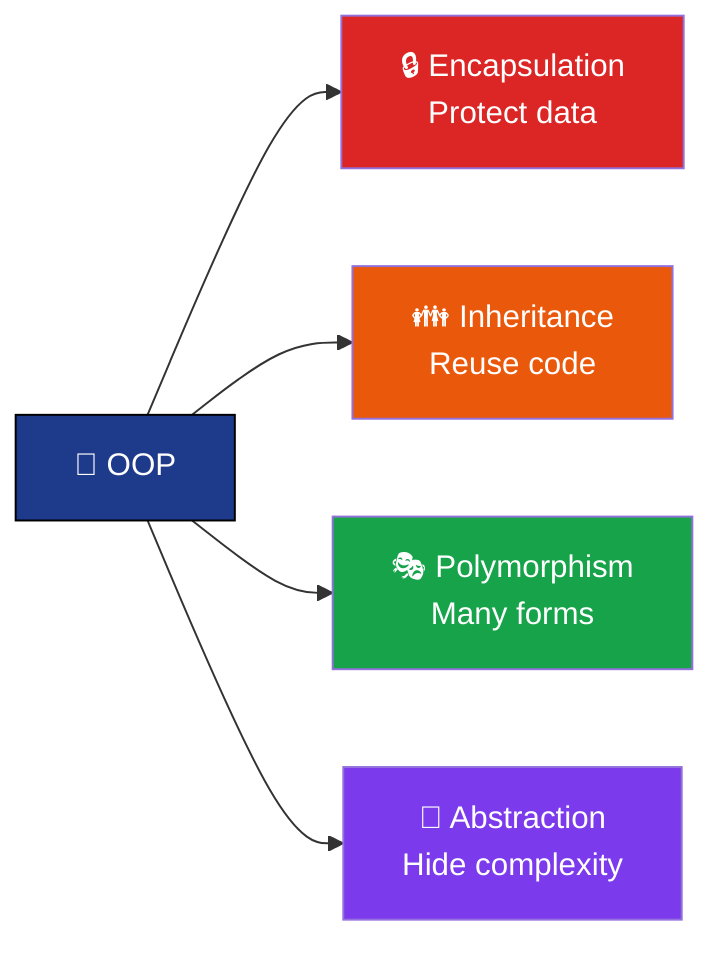

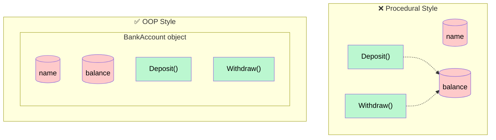

### D. Simple C# Example

```csharp
using System;

class Car                          // 1. Blueprint
{
    public string Color;           // 2. Data
    public void Drive()            // 3. Behavior
    {
        Console.WriteLine(Color + " car is driving.");
    }
}

class Program
{
    static void Main()
    {
        Car myCar = new Car();     // 4. Create object
        myCar.Color = "Red";       // 5. Set data
        myCar.Drive();             // 6. Call behavior
    }
}
```

**Output:**
```
Red car is driving.
```

### E. Line-by-Line Explanation

| Line | Meaning |
|------|---------|
| `class Car` | We describe what a car is (a blueprint). No car exists yet. |
| `public string Color;` | Every car will have a color. |
| `public void Drive()` | Every car can drive. |
| `Car myCar = new Car();` | `new` actually builds a car in memory. `myCar` points to it. |
| `myCar.Color = "Red";` | We give *this* car a color. |
| `myCar.Drive();` | We ask *this* car to drive. It uses its own color. |

### F. How It Works Internally

- The **class** definition is loaded once by the .NET runtime (CLR).
- `new Car()` allocates memory on the **heap** for the object's data (`Color`).
- `myCar` is a **reference** (like an address) stored on the **stack** that points to the heap object.
- Methods are *not* copied per object — all objects share the same method code. The method knows *which* object's data to use through a hidden reference called `this`.

### G. Common Mistakes

- Thinking OOP is "just using classes". Using classes with everything `public static` is still procedural.
- Confusing class and object (a class is the recipe, an object is the cake).
- Thinking OOP is always better. For tiny scripts, simple procedural code is fine.

### H. Interview Questions

1. **What is OOP?** → A programming paradigm that organizes software around objects that contain data and behavior.
2. **What are the four pillars of OOP?** → Encapsulation, Inheritance, Polymorphism, Abstraction.
3. **Is C# a pure object-oriented language?** → Not 100% pure. It has primitive-like value types (`int`, `bool`) and static methods that don't need objects. However, even `int` is an alias for `System.Int32`, which derives from `System.Object`, so C# is *very strongly* object-oriented.
4. **Difference between procedural and object-oriented programming?** → Procedural separates data and functions and focuses on steps; OOP bundles data with the functions that act on it and focuses on objects and their interactions.
5. **(Hard) What are the disadvantages of OOP?** → More code/boilerplate for small problems, can lead to deep, rigid inheritance hierarchies, slight performance overhead (heap allocations, virtual calls), and poor design can create tight coupling.

---

## 2. Why Do We Need OOP?

### A. Simple Definition

> **We need OOP to make large programs easier to understand, reuse, change, and test, by modeling code around real-world things.**

### Detailed explanation

Imagine writing a banking app with 500 functions and 200 global variables. Changing one variable could break 50 functions. OOP helps with:

| Problem | How OOP helps |
|---------|---------------|
| Code is hard to understand | Code is grouped into meaningful objects (Customer, Account) |
| Data is changed by mistake | Encapsulation protects data |
| Same code written many times | Inheritance and composition allow reuse |
| Adding new features breaks old code | Polymorphism and interfaces let you add new types without changing old code |
| Hard to test | Objects can be tested in isolation and replaced with fakes |
| Hard for teams to work together | Each team owns different classes |

### B. Real-Life Example

A **company** is organized into departments (HR, Finance, IT). Each department has its own data and responsibilities. You don't ask Finance to hire people. OOP organizes code the same way.

### C. Visual Diagram

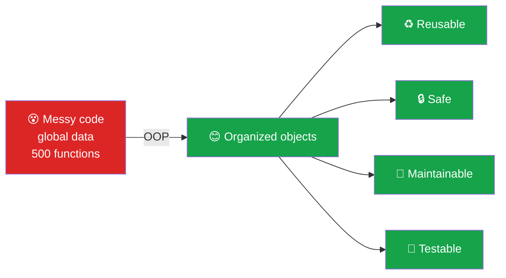

### D. Simple C# Example — Without vs With OOP

**Without OOP (procedural):**
```csharp
string account1Name = "Ali";
decimal account1Balance = 1000;
string account2Name = "Sara";
decimal account2Balance = 500;

// Anyone can do this by mistake:
account1Balance = -99999;
```

**With OOP:**
```csharp
class BankAccount
{
    private decimal balance;              // protected data
    public string Owner { get; private set; }

    public BankAccount(string owner, decimal openingBalance)
    {
        Owner = owner;
        balance = openingBalance;
    }

    public void Withdraw(decimal amount)
    {
        if (amount > balance)
        {
            Console.WriteLine("Insufficient funds");
            return;
        }
        balance -= amount;
    }

    public decimal GetBalance() { return balance; }
}

// Usage
BankAccount a1 = new BankAccount("Ali", 1000);
BankAccount a2 = new BankAccount("Sara", 500);
a1.Withdraw(5000);           // Insufficient funds
// a1.balance = -99999;      // ❌ Compile error: balance is private
Console.WriteLine(a1.GetBalance());
```

**Output:**
```
Insufficient funds
1000
```

### E. Line-by-Line Explanation

- Procedural version: each account needs its own set of variables, and nothing stops invalid values.
- OOP version: `balance` is `private` — only code *inside* `BankAccount` can change it. `Withdraw` enforces a rule. Creating 1000 accounts is just 1000 `new` calls.

### F. How It Works Internally

The compiler enforces `private` at **compile time**. Code outside the class that tries to access `balance` will not even compile. This moves bugs from *runtime* (dangerous) to *compile time* (safe).

### G. Common Mistakes

- Over-engineering: creating 10 classes and 5 interfaces for a 20-line program.
- Making everything public, which removes the protection OOP gives.

### H. Interview Questions

1. **Why do we use OOP?** → Reusability, maintainability, security of data (encapsulation), scalability, easier testing, and modeling real-world problems.
2. **What problems of procedural programming does OOP solve?** → Uncontrolled access to shared data, poor code reuse, and difficulty maintaining large codebases.
3. **(Hard) When would you *not* use OOP?** → Small scripts, performance-critical tight loops, or data-transformation pipelines where functional style is clearer.

---

## 3. Class

### A. Simple Definition

> **A class is a blueprint (template) that defines the data (fields/properties) and behavior (methods) that its objects will have.**

### Detailed explanation

A class does **not** hold real data by itself. It only *describes*. Just like a house blueprint describes rooms but you cannot live in the blueprint — you must build a house first.

A class can contain:
- **Fields** – variables that store data
- **Properties** – controlled access to data
- **Methods** – actions
- **Constructors** – setup code run when an object is created
- **Events, indexers, nested types** (advanced)

A class is a **reference type** in C#.

### B. Real-Life Example

A **cookie cutter** is a class. Each cookie made from it is an object. All cookies have the same shape, but each can have different toppings (data).

### C. Visual Diagram

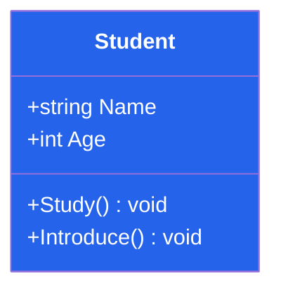

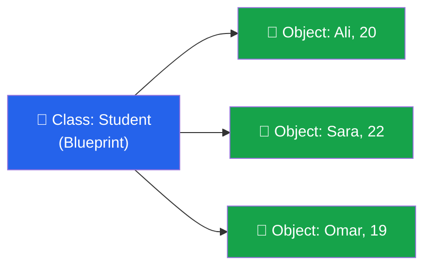

### D. Simple C# Example

```csharp
public class Student            // Line 1
{                               // Line 2
    public string Name;         // Line 3
    public int Age;             // Line 4

    public void Introduce()     // Line 5
    {
        Console.WriteLine("Hi, I am " + Name + " and I am " + Age + " years old.");
    }
}
```

### E. Line-by-Line Explanation

| Line | Explanation |
|------|-------------|
| 1 | `public` = accessible from anywhere. `class` = we're defining a class. `Student` = the name (PascalCase by convention). |
| 2 | Opening brace — the class body starts. |
| 3 | A field named `Name` of type `string`. |
| 4 | A field named `Age` of type `int`. |
| 5 | A method `Introduce` that returns nothing (`void`) and prints the student's details. |

### F. How It Works Internally

- The compiler turns the class into **IL (Intermediate Language)** and stores its **metadata** (names, types, members) in the assembly (.dll/.exe).
- At runtime, the CLR creates one **type object (Method Table)** per class. Every object of that class points to this shared method table, which lists its methods.
- No memory for `Name` or `Age` is used until an object is created.

### G. Common Mistakes

- Thinking a class uses memory for its fields before objects exist (it doesn't — except `static` fields).
- Naming classes as verbs (`CalculateSalary`). Classes should be **nouns** (`SalaryCalculator`).
- Putting too many unrelated responsibilities in one class ("God class").

### H. Interview Questions

1. **What is a class?** → A blueprint that defines data and behavior for objects.
2. **Does a class occupy memory?** → Its metadata and method code are loaded once, but instance fields only use memory when objects are created.
3. **Is a class a value type or reference type?** → Reference type.
4. **Difference between class and struct?** → Class: reference type, heap-allocated, supports inheritance, default `null`. Struct: value type, usually stack/inline allocated, no inheritance (can implement interfaces), copied on assignment.
5. **What are the default access modifiers of a class and its members?** → A top-level class is `internal` by default; members are `private` by default.
6. **(Hard) What is a partial class?** → A class whose definition is split across multiple files using the `partial` keyword; the compiler merges them. Used with generated code (WinForms designers, EF).

---

## 4. Object

### A. Simple Definition

> **An object is an instance of a class — a real thing created in memory from the class blueprint, with its own data.**

### Detailed explanation

When you write `new Student()`, C# builds a real student in memory. You can build many objects from one class; each object has **its own copy** of the fields.

An object has:
- **State** – the current values of its data (Name = "Ali")
- **Behavior** – what it can do (Introduce)
- **Identity** – it is a unique item in memory, even if another object has the same data

### B. Real-Life Example

"Car" is a class. *Your* red Toyota with plate ABC-123 is an object. Your neighbor's blue Honda is another object.

### C. Visual Diagram

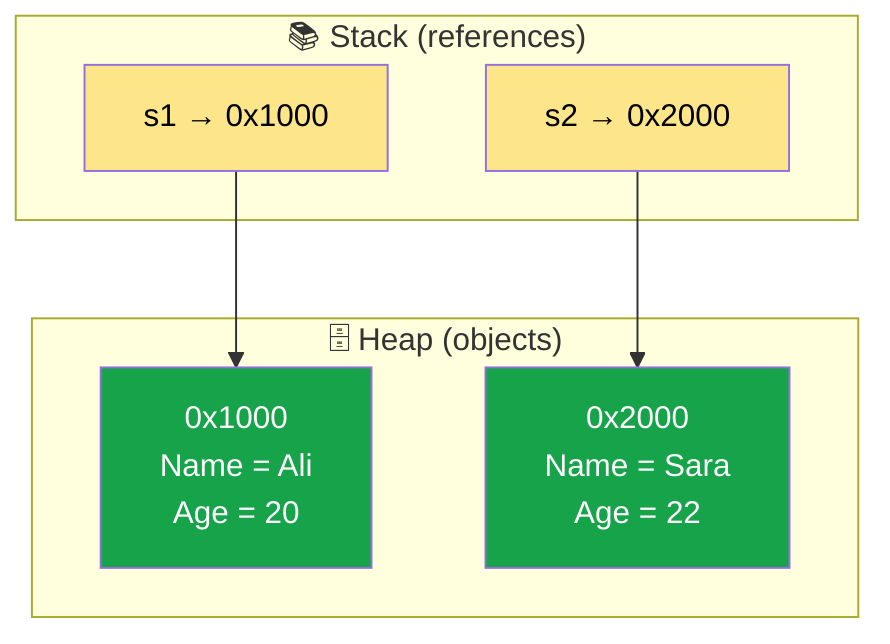

### D. Simple C# Example

```csharp
class Program
{
    static void Main()
    {
        Student s1 = new Student();   // Line 1
        s1.Name = "Ali";              // Line 2
        s1.Age = 20;                  // Line 3

        Student s2 = new Student();   // Line 4
        s2.Name = "Sara";
        s2.Age = 22;

        s1.Introduce();               // Line 5
        s2.Introduce();

        Student s3 = s1;              // Line 6
        s3.Name = "Changed";
        Console.WriteLine(s1.Name);   // Line 7
    }
}
```

**Output:**
```
Hi, I am Ali and I am 20 years old.
Hi, I am Sara and I am 22 years old.
Changed
```

### E. Line-by-Line Explanation

1. `Student s1` declares a variable that *can refer* to a student. `new Student()` creates the object. `=` stores the reference in `s1`.
2–3. Set the object's fields using the **dot operator**.
4. A second, completely separate object.
5. Each object introduces itself using its **own** data.
6. ⚠️ `s3 = s1` does **not** copy the object. It copies the **reference**. Both variables now point to the **same** object.
7. So changing `s3.Name` also changes what `s1` sees → prints `Changed`.

### F. How It Works Internally

When `new Student()` runs:
1. The CLR calculates the size needed (fields + object header + method-table pointer).
2. Memory is allocated on the **managed heap**.
3. All fields are set to default values (`null`, `0`, `false`).
4. The constructor runs.
5. A reference to the memory is returned.

When no variable refers to the object anymore, the **Garbage Collector (GC)** eventually frees it.

### G. Common Mistakes

- Using an object before creating it:
  ```csharp
  Student s;              // not created
  s.Name = "Ali";         // ❌ compile error: use of unassigned variable
  Student t = null;
  t.Name = "Ali";         // ❌ runtime NullReferenceException
  ```
- Thinking `a = b` copies an object (it copies the reference for classes).
- Comparing objects with `==` and expecting value comparison (by default `==` on classes compares references).

### H. Interview Questions

1. **What is an object?** → An instance of a class with its own state, behavior, and identity.
2. **How do you create an object in C#?** → With the `new` keyword: `var s = new Student();`
3. **Where are objects stored?** → On the managed heap; references to them may live on the stack or inside other objects.
4. **What happens when you assign one object variable to another?** → Both refer to the same object (reference copy).
5. **Difference between class and object?** → Class = blueprint (defined once, logical); object = instance (created many times, physical memory).
6. **(Medium) What is a NullReferenceException?** → Thrown when you access a member through a reference that is `null`.
7. **(Hard) How is an object destroyed in C#?** → You don't destroy it manually. The GC reclaims memory when it's unreachable. For unmanaged resources (files, DB connections), implement `IDisposable` and use `using`.

---

## 5. Fields

### A. Simple Definition

> **A field is a variable declared directly inside a class that stores the data (state) of an object.**

### Detailed explanation

- **Instance fields** belong to each object (each student has their own `name`).
- **Static fields** belong to the class itself, shared by all objects (covered later).
- **readonly fields** can only be set at declaration or in a constructor.
- **const fields** are compile-time constants and implicitly static.

By convention, fields should be **private** and named in `camelCase` or `_camelCase`.

### B. Real-Life Example

On a student ID card, "Name", "Roll Number", and "Date of Birth" are fields. Each card has its own values.

### C. Visual Diagram

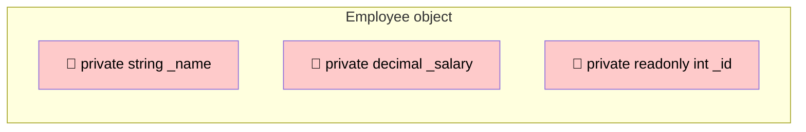

### D. Simple C# Example

```csharp
public class Employee
{
    private string _name;                 // instance field
    private decimal _salary;              // instance field
    private readonly int _id;             // can only be set once
    public const string CompanyName = "Contoso"; // compile-time constant

    public Employee(int id, string name, decimal salary)
    {
        _id = id;                         // allowed: inside constructor
        _name = name;
        _salary = salary;
    }

    public void Print()
    {
        Console.WriteLine(_id + " | " + _name + " | " + _salary + " | " + CompanyName);
    }
}

// Usage
var e = new Employee(1, "Ali", 5000m);
e.Print();
```

**Output:**
```
1 | Ali | 5000 | Contoso
```

### E. Line-by-Line Explanation

- `private string _name;` — only this class can read/write `_name`.
- `private readonly int _id;` — after the constructor finishes, `_id` can never change.
- `public const string CompanyName` — value is baked in at compile time; accessed as `Employee.CompanyName`.
- The constructor assigns values to fields.
- `Print()` reads the fields.

### F. How It Works Internally

- Each instance field takes space inside every object on the heap.
- Uninitialized fields get **default values** automatically (`0`, `null`, `false`) — unlike local variables, which must be assigned.
- `const` values are copied into the calling code at compile time; `readonly` values are read at runtime.

### G. Common Mistakes

- Making fields `public` (breaks encapsulation — use properties).
- Confusing `const` and `readonly`: changing a `const` in a library requires recompiling all consumers, because the value was copied into them.
- Forgetting that `readonly` on a reference type only prevents re-assigning the reference, not modifying the object's contents:
  ```csharp
  private readonly List<string> _items = new List<string>();
  _items.Add("x");             // ✅ allowed
  // _items = new List<string>(); // ❌ not allowed (outside constructor)
  ```

### H. Interview Questions

1. **What is a field?** → A variable declared in a class that holds object or class data.
2. **Default value of an uninitialized int field?** → `0`. For reference types → `null`.
3. **Difference between `const` and `readonly`?**

| const | readonly |
|-------|----------|
| Compile-time constant | Runtime constant |
| Must be assigned at declaration | Declaration or constructor |
| Implicitly static | Instance or static |
| Only primitive types/string/null | Any type |

4. **(Hard) Why should fields be private?** → To enforce invariants, allow validation, and allow changing internal representation without breaking callers.

---

## 6. Properties

### A. Simple Definition

> **A property is a class member that provides controlled read/write access to a private field using `get` and `set` accessors.**

### Detailed explanation

A property *looks like* a field to the user (`person.Age = 20`) but *works like* methods internally. This lets you add validation or logic without the caller knowing.

Types of properties:
| Type | Syntax | Use |
|------|--------|-----|
| Full property | explicit backing field + get/set | when you need validation |
| Auto-property | `public string Name { get; set; }` | simple data |
| Read-only | `{ get; }` | set only in constructor |
| Private setter | `{ get; private set; }` | readable by all, changeable only inside |
| Computed | `{ get { return A + B; } }` | derived values |
| Expression-bodied | `public int X => _x;` | short read-only |

### B. Real-Life Example

A **bank teller** is a property. You can't walk into the vault (field) directly; you ask the teller (property), who checks your request before giving or accepting money.

### C. Visual Diagram

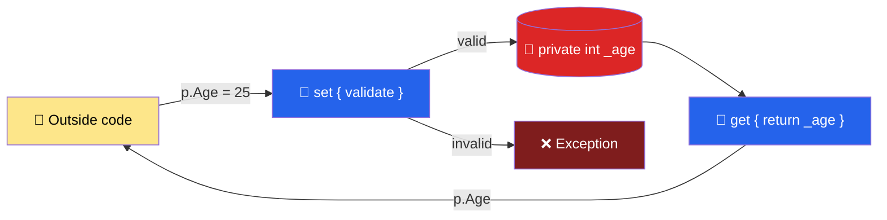

### D. Simple C# Example

```csharp
public class Person
{
    private int _age;                          // backing field

    public string Name { get; set; }           // auto-property

    public int Age                             // full property
    {
        get { return _age; }
        set
        {
            if (value < 0 || value > 150)
                throw new ArgumentException("Age must be between 0 and 150");
            _age = value;                      // 'value' = what the caller assigned
        }
    }

    public bool IsAdult { get { return _age >= 18; } }   // computed, read-only

    public DateTime CreatedOn { get; } = DateTime.Now;   // read-only auto-property (C# 6)
}

// Usage
var p = new Person();
p.Name = "Ali";
p.Age = 25;
Console.WriteLine(p.Name + " is adult? " + p.IsAdult);
try { p.Age = -5; }
catch (ArgumentException ex) { Console.WriteLine(ex.Message); }
```

**Output:**
```
Ali is adult? True
Age must be between 0 and 150
```

### E. Line-by-Line Explanation

- `private int _age;` — the real storage, hidden.
- `public string Name { get; set; }` — the compiler creates a hidden backing field for you.
- `get { return _age; }` — runs when someone reads `p.Age`.
- `set { ... _age = value; }` — runs when someone writes `p.Age = 25`. `value` is a hidden parameter holding 25.
- `IsAdult` has only `get` → read-only; it calculates its value each time.
- `CreatedOn { get; }` can only be set by its initializer or constructor.

### F. How It Works Internally

The compiler converts a property into **two methods**:
```csharp
public int get_Age() { return _age; }
public void set_Age(int value) { ... }
```
So `p.Age = 25;` becomes `p.set_Age(25);`. That's why a property can contain logic and why changing a field to a property is a **binary breaking change** for compiled consumers.

### G. Common Mistakes

- **Infinite recursion:**
  ```csharp
  public int Age { get { return Age; } }  // ❌ StackOverflowException — calls itself
  ```
- Putting slow/heavy logic in a getter (callers expect properties to be fast).
- Using `public` fields instead of properties.
- Forgetting that auto-property `{ get; set; }` has no validation.

### H. Interview Questions

1. **What is a property?** → A member that exposes a private field through get/set accessors with optional logic.
2. **Difference between field and property?** → A field stores data directly; a property is a pair of methods controlling access to data and can include validation.
3. **What is an auto-implemented property?** → `{ get; set; }` where the compiler generates the backing field.
4. **What is the `value` keyword?** → The implicit parameter in a `set` accessor holding the assigned value.
5. **How do you make a read-only property?** → Only `get`, or `get; private set;`.
6. **(Hard) Can properties be virtual/abstract/in interfaces?** → Yes, all three.
7. **(Hard) What is an `init` accessor?** → *(C# 9+, newer than 7.3)* allows setting a property only during object initialization. In C# 7.3, use a `get`-only property set via constructor.

---

## 7. Methods

### A. Simple Definition

> **A method is a block of code inside a class that performs an action or calculation, and can take inputs (parameters) and return an output.**

### Detailed explanation

Method structure:
```
[access] [modifiers] returnType MethodName(parameters)
{
    body
}
```
- **Instance methods** work on a specific object's data.
- **Static methods** belong to the class (no object needed).
- Parameters can be passed **by value** (default), by **ref**, **out**, or **in** (C# 7.2+), or with **params** (variable count), **optional** (default values), and **named** arguments.

### B. Real-Life Example

A **coffee machine** has a method `MakeCoffee(size, sugar)`. You give inputs, it returns coffee.

### C. Visual Diagram

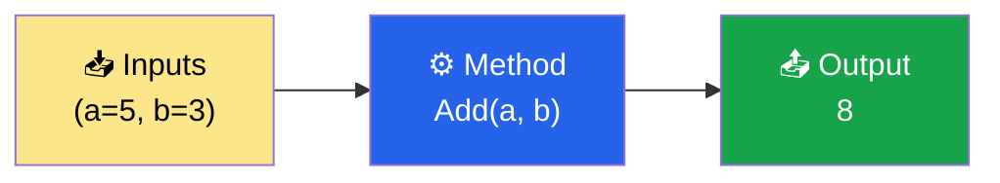

### D. Simple C# Example

```csharp
public class Calculator
{
    public int Add(int a, int b)                 // returns a value
    {
        return a + b;
    }

    public void PrintResult(int result)          // returns nothing
    {
        Console.WriteLine("Result: " + result);
    }

    public bool TryDivide(int a, int b, out int result)   // out parameter
    {
        if (b == 0) { result = 0; return false; }
        result = a / b;
        return true;
    }

    public void Double(ref int number)           // ref parameter
    {
        number = number * 2;
    }

    public int Sum(params int[] numbers)         // variable arguments
    {
        int total = 0;
        foreach (int n in numbers) total += n;
        return total;
    }

    public string Greet(string name, string greeting = "Hello")  // optional
    {
        return greeting + ", " + name;
    }
}

// Usage
var calc = new Calculator();
calc.PrintResult(calc.Add(5, 3));

int q;
if (calc.TryDivide(10, 2, out q)) Console.WriteLine("10/2 = " + q);

int x = 7;
calc.Double(ref x);
Console.WriteLine("x = " + x);

Console.WriteLine(calc.Sum(1, 2, 3, 4));
Console.WriteLine(calc.Greet("Ali"));
Console.WriteLine(calc.Greet(greeting: "Welcome", name: "Sara"));  // named args
```

**Output:**
```
Result: 8
10/2 = 5
x = 14
10
Hello, Ali
Welcome, Sara
```

### E. Line-by-Line Explanation

- `int Add(int a, int b)` — takes two ints, `return` sends back the sum.
- `void` — returns nothing.
- `out int result` — the method **must** assign `result`; caller receives it.
- `ref int number` — the method works on the **caller's variable** directly, so `x` changes to 14.
- `params int[]` — caller can pass any number of ints.
- `greeting = "Hello"` — optional; if not passed, "Hello" is used.
- Named arguments let you pass parameters in any order.

### F. How It Works Internally

- Each method call creates a **stack frame** holding parameters and local variables. When the method returns, the frame is removed.
- Instance methods receive a hidden first parameter: `this` (the object).
- By default, arguments are **copied** (pass-by-value). For reference types, the *reference* is copied — so the method can modify the object's contents but not replace the caller's reference (unless `ref` is used).

### G. Common Mistakes

- Thinking passing an object to a method copies the object.
- Forgetting to assign an `out` parameter (compile error).
- Methods that do too many things — a method should do **one** thing.
- Using `ref` when a return value would be clearer.

### H. Interview Questions

1. **What is a method?** → A code block that performs an action, optionally with parameters and a return value.
2. **Difference between `ref` and `out`?** → `ref` must be initialized before passing; `out` need not be, but must be assigned inside the method.
3. **What is `params`?** → Allows a variable number of arguments as an array; must be the last parameter.
4. **What are optional and named parameters?** → Optional parameters have default values; named arguments specify the parameter name at call site.
5. **(Hard) If you pass a reference-type object to a method without `ref` and the method does `obj = new X()`, does the caller see it?** → No. The method only changed its local copy of the reference. But `obj.Name = "x"` *would* be visible.
6. **(Hard) What is the `in` modifier?** → (C# 7.2) passes by reference but read-only; useful for large structs to avoid copies.

---

## 8. Constructors

### A. Simple Definition

> **A constructor is a special method that runs automatically when an object is created, used to initialize the object. It has the same name as the class and no return type.**

### Detailed explanation

Types of constructors in C#:

| Type | Description |
|------|-------------|
| Default (parameterless) | No parameters. Compiler provides one **only if you write no constructor**. |
| Parameterized | Takes parameters to set initial values. |
| Overloaded | Multiple constructors with different parameters. |
| Constructor chaining | One constructor calls another using `: this(...)`. |
| Static constructor | Runs **once** per class, before first use. No parameters, no access modifier. |
| Private constructor | Prevents creating objects from outside (Singleton, static utility). |
| Copy constructor | Takes another object of the same type to copy its values (you write it manually). |

### B. Real-Life Example

When you buy a new phone, it comes **set up** (language, time, default apps). That factory setup is the constructor. You can also order a custom phone (parameterized constructor).

### C. Visual Diagram

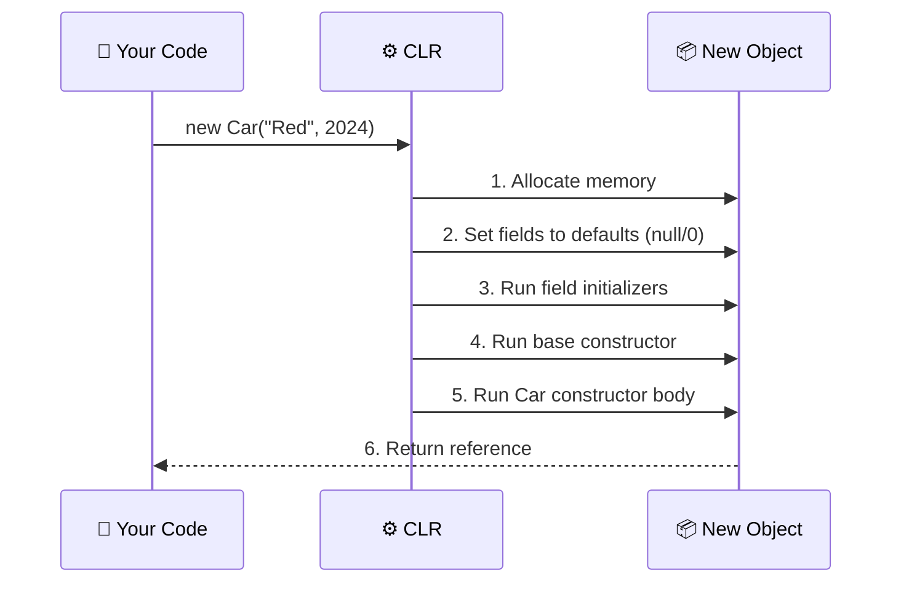

### D. Simple C# Example

```csharp
public class Car
{
    public string Color { get; private set; }
    public int Year { get; private set; }
    public static int TotalCars { get; private set; }

    static Car()                                  // static constructor
    {
        Console.WriteLine("[Static ctor] Car class loaded");
    }

    public Car() : this("White", 2020)            // chaining to another ctor
    {
        Console.WriteLine("[Default ctor]");
    }

    public Car(string color, int year)            // parameterized
    {
        Color = color;
        Year = year;
        TotalCars++;
        Console.WriteLine("[Param ctor] " + color + " " + year);
    }

    public Car(Car other) : this(other.Color, other.Year)   // copy constructor
    {
        Console.WriteLine("[Copy ctor]");
    }
}

// Usage
var c1 = new Car();
var c2 = new Car("Red", 2024);
var c3 = new Car(c2);
Console.WriteLine("Total: " + Car.TotalCars);
```

**Output:**
```
[Static ctor] Car class loaded
[Param ctor] White 2020
[Default ctor]
[Param ctor] Red 2024
[Param ctor] Red 2024
[Copy ctor]
Total: 3
```

### E. Line-by-Line Explanation

- `static Car()` — runs once, the first time `Car` is used. Printed first.
- `public Car() : this("White", 2020)` — before its own body, it calls the parameterized constructor. That's why `[Param ctor]` prints **before** `[Default ctor]`.
- `public Car(string color, int year)` — sets properties and increments a shared counter.
- `public Car(Car other)` — creates a *new* object with copied values.

### F. How It Works Internally

Order of execution for `new Derived()`:
1. Memory allocated, fields zeroed.
2. **Derived field initializers** run.
3. **Base field initializers** run.
4. **Base constructor** body runs.
5. **Derived constructor** body runs.

The static constructor is guaranteed to run at most once, and it is thread-safe (the CLR locks it).

### G. Common Mistakes

- Adding a return type: `public void Car()` → that's a *method*, not a constructor!
- Writing a parameterized constructor and then calling `new Car()` → compile error, because the compiler no longer generates the default one.
- Calling virtual methods in a constructor (derived class may not be initialized yet).
- Doing heavy work (DB calls, network) in constructors.

### H. Interview Questions

1. **What is a constructor?** → A special method with the class name, no return type, that initializes a new object.
2. **Can a constructor return a value?** → No.
3. **What is a default constructor?** → A parameterless constructor; the compiler adds one only if no constructor is defined.
4. **What is constructor overloading?** → Multiple constructors with different parameter lists.
5. **What is constructor chaining?** → Calling one constructor from another using `this(...)` or `base(...)`.
6. **What is a static constructor? When is it called?** → Initializes static data; called automatically once before the first instance is created or any static member is accessed. It cannot have parameters or access modifiers.
7. **Can a constructor be private? Why?** → Yes — for Singleton, factory methods, or classes with only static members.
8. **(Hard) Can a constructor be inherited?** → No. Derived classes must define their own and can call base constructors with `base(...)`.
9. **(Hard) Can a constructor be virtual or abstract?** → No.
10. **(Hard) What is a destructor/finalizer?** → `~ClassName()`, called by GC before reclaiming memory. Non-deterministic; prefer `IDisposable`.

---

## 9. The `this` Keyword

### A. Simple Definition

> **`this` refers to the current object — the instance whose method or constructor is currently running.**

### Detailed explanation

Uses of `this`:
1. Distinguish fields from parameters with the same name: `this.name = name;`
2. Pass the current object to another method: `printer.Print(this);`
3. Constructor chaining: `: this(...)`
4. Return the current object for method chaining (fluent API): `return this;`
5. Indexers: `public int this[int i]`
6. Extension methods: `static void Foo(this string s)`

`this` **cannot** be used in static members (there is no current object).

### B. Real-Life Example

When you say "**my** name is Ali", "my" refers to *you*, the person speaking. `this` is the object saying "my".

### C. Visual Diagram

```mermaid
flowchart LR
    A["obj1.SetName('Ali')"]:::call --> T1["this → obj1"]:::obj
    B["obj2.SetName('Sara')"]:::call --> T2["this → obj2"]:::obj
    classDef call fill:#fde68a,color:#000
    classDef obj fill:#16a34a,color:#fff
```

### D. Simple C# Example

```csharp
public class Pizza
{
    private string size;
    private readonly List<string> toppings = new List<string>();

    public Pizza(string size)
    {
        this.size = size;               // this.size = field, size = parameter
    }

    public Pizza AddTopping(string topping)
    {
        toppings.Add(topping);
        return this;                    // return current object → chaining
    }

    public void Print()
    {
        Console.WriteLine(size + " pizza with: " + string.Join(", ", toppings));
    }
}

// Usage
new Pizza("Large")
    .AddTopping("Cheese")
    .AddTopping("Olives")
    .Print();
```

**Output:**
```
Large pizza with: Cheese, Olives
```

### E. Line-by-Line Explanation

- Without `this`, `size = size;` would assign the parameter to itself (the field stays `null`).
- `return this;` returns the same pizza object, so the next `.AddTopping` works on it.

### F. How It Works Internally

Every instance method secretly receives the object as a hidden first argument. `pizza.AddTopping("Cheese")` compiles to something like `Pizza.AddTopping(pizza, "Cheese")`. Inside, that hidden argument is `this`.

### G. Common Mistakes

- Using `this` in a `static` method → compile error.
- Forgetting `this.` when parameter names match field names → field never gets assigned (the compiler warns about self-assignment).

### H. Interview Questions

1. **What is `this`?** → Reference to the current instance.
2. **Can `this` be used in a static method?** → No.
3. **Name uses of `this`.** → Disambiguation, chaining constructors, passing self, fluent return, indexers, extension methods.
4. **(Hard) Can you assign to `this`?** → Not in classes. In structs, yes, inside constructors/methods (because `this` is a `ref` to the struct).

---

# Part 2 — The Four Pillars

## 10. Access Modifiers

> We learn access modifiers *before* encapsulation because encapsulation is built on them.

### A. Simple Definition

> **Access modifiers are keywords that control *who* can see and use a class or its members.**

### Detailed explanation

| Modifier | Same class | Derived class (same assembly) | Other class (same assembly) | Derived class (other assembly) | Other class (other assembly) |
|----------|:---:|:---:|:---:|:---:|:---:|
| `public` | ✅ | ✅ | ✅ | ✅ | ✅ |
| `private` | ✅ | ❌ | ❌ | ❌ | ❌ |
| `protected` | ✅ | ✅ | ❌ | ✅ | ❌ |
| `internal` | ✅ | ✅ | ✅ | ❌ | ❌ |
| `protected internal` | ✅ | ✅ | ✅ | ✅ | ❌ |
| `private protected` (C# 7.2) | ✅ | ✅ | ❌ | ❌ | ❌ |

> **Assembly** = one compiled project (.dll or .exe).

**Defaults:**
- Top-level class/struct/interface → `internal`
- Class members → `private`
- Interface members → `public`
- Enum members → `public`

**Memory trick:**
- `private` → "only me"
- `protected` → "me and my children"
- `internal` → "my project"
- `protected internal` → "my project **OR** my children anywhere"
- `private protected` → "my children **AND** only in my project"
- `public` → "everyone"

### B. Real-Life Example

In a house:
- **public** → the front yard (anyone can see)
- **internal** → the living room (family and guests in the house)
- **protected** → family heirlooms (passed to children)
- **private** → your personal diary

### C. Visual Diagram

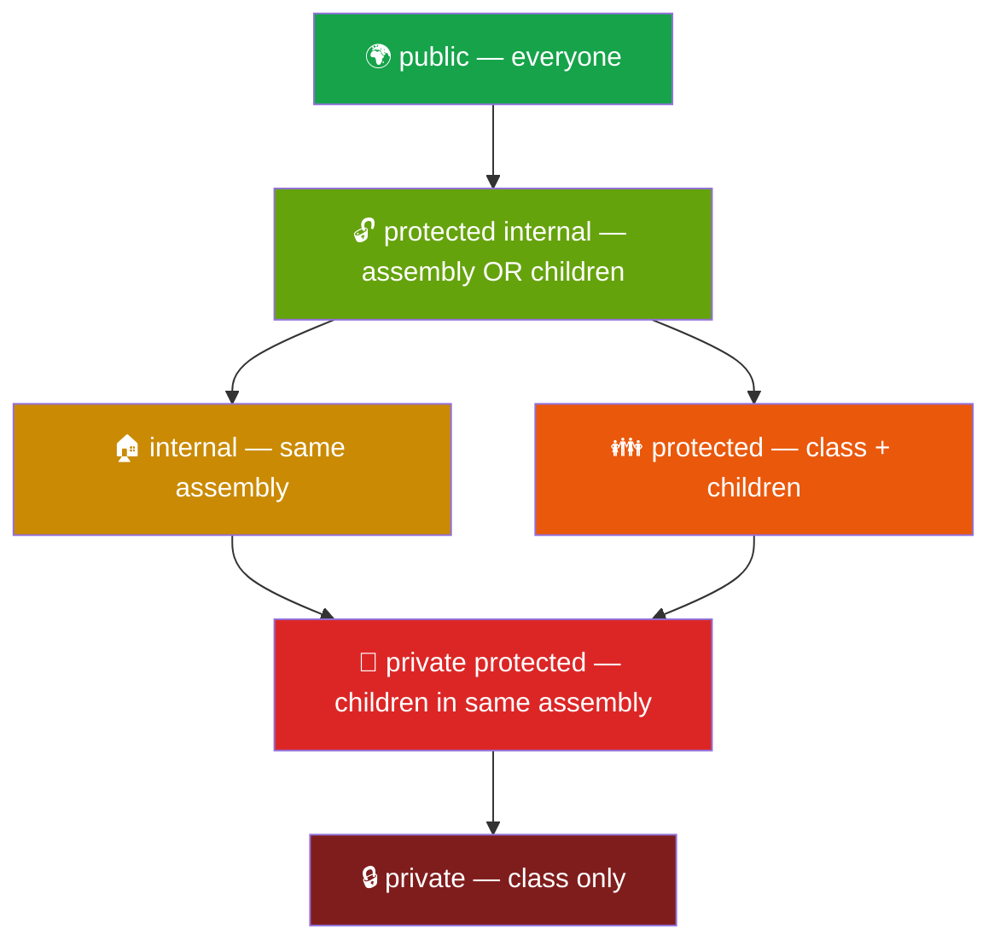

### D. Simple C# Example

```csharp
public class Animal
{
    public string Name = "Tiger";          // everyone
    private int secretId = 42;             // only Animal
    protected int energy = 100;            // Animal + children
    internal string zoo = "City Zoo";      // same project

    public void ShowSecret()
    {
        Console.WriteLine("Secret: " + secretId);   // ✅ inside class
    }
}

public class Cat : Animal
{
    public void Play()
    {
        energy -= 10;                       // ✅ protected accessible in child
        // secretId = 1;                    // ❌ private — compile error
        Console.WriteLine(Name + " energy: " + energy);
    }
}

// In Main
var cat = new Cat();
cat.Play();
cat.ShowSecret();
Console.WriteLine(cat.zoo);                 // ✅ same assembly
// cat.energy = 5;                          // ❌ protected — not accessible here
```

**Output:**
```
Tiger energy: 90
Secret: 42
City Zoo
```

### E. Line-by-Line Explanation

- `Name` is public — accessible everywhere.
- `secretId` is private — only `Animal`'s own methods can use it. `Cat` inherits it (it exists in memory) but cannot touch it.
- `energy` is protected — `Cat` can use it, `Main` cannot.
- `zoo` is internal — anything in the same project can use it.

### F. How It Works Internally

Access checks happen at **compile time** by the C# compiler and are also stored in metadata so the CLR verifies them at runtime (e.g., when loading other assemblies). Private members still exist in the object's memory — they are just inaccessible by name. (Reflection can bypass them, which is why access modifiers are about *design safety*, not *security*.)

### G. Common Mistakes

- Thinking `private` members are not inherited. They **are** inherited (they're in memory) but not **accessible**.
- Making everything `public` "to make it work".
- Confusing `protected internal` (OR) with `private protected` (AND).
- Trying to make a top-level class `private` or `protected` → compile error (only `public` or `internal` allowed).

### H. Interview Questions

1. **What are access modifiers?** → Keywords controlling visibility: public, private, protected, internal, protected internal, private protected.
2. **Default access modifier for class members?** → `private`.
3. **Default for a class?** → `internal`.
4. **Difference between protected and internal?** → protected: accessible in derived classes; internal: accessible within the same assembly.
5. **(Medium) protected internal vs private protected?** → protected internal = same assembly OR derived anywhere; private protected = derived classes in the same assembly only.
6. **(Hard) Can a derived class increase the accessibility of an overridden member?** → No. An override must keep the same access modifier as the base member.
7. **(Hard) Can a public class have a public method that returns an internal type?** → No — "inconsistent accessibility" compile error.

---

## 11. Encapsulation

### A. Simple Definition

> **Encapsulation is the bundling of data and the methods that operate on that data into a single unit (class), and restricting direct access to the data from outside — allowing access only through controlled methods or properties.**

Short version for interviews: **"Data hiding + controlled access."**

### Detailed explanation

Encapsulation has two parts:
1. **Bundling** — data and behavior live together in one class.
2. **Hiding** — data is `private`; outside code uses public methods/properties that **enforce rules** (called *invariants*, e.g., "balance can never be negative").

Benefits:
- Prevents invalid state
- You can change internal implementation without breaking callers
- Easier debugging (only one place changes the data)

### B. Real-Life Example

A **medicine capsule**: the powder (data) is wrapped inside a shell. You take the capsule as a whole; you don't handle the powder directly.

An **ATM**: you can't open the cash box. You use the screen (public interface), which checks your PIN and balance (rules) before giving money.

### C. Visual Diagram

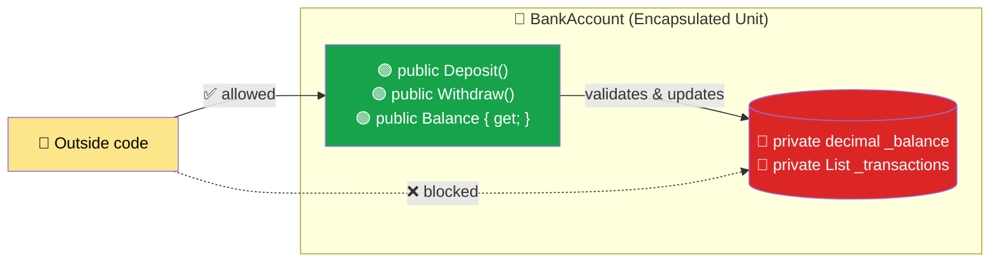

**Encapsulation = Data + Methods + Controlled Access**

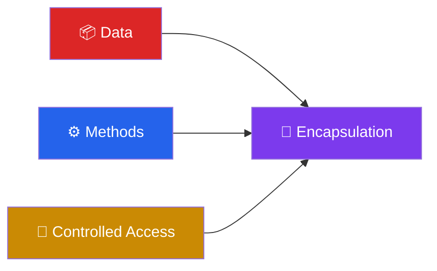

### D. Simple C# Example

**❌ Step 1: No encapsulation**
```csharp
public class BankAccount
{
    public decimal Balance;
}
var acc = new BankAccount();
acc.Balance = -1000;   // Nothing stops this! Invalid state.
```

**✅ Step 2: Encapsulated**
```csharp
public class BankAccount
{
    private decimal _balance;                              // hidden

    public string AccountNumber { get; private set; }      // read-only to outside
    public decimal Balance { get { return _balance; } }    // read-only view

    public BankAccount(string accountNumber, decimal initialDeposit)
    {
        if (initialDeposit < 0)
            throw new ArgumentException("Initial deposit cannot be negative.");
        AccountNumber = accountNumber;
        _balance = initialDeposit;
    }

    public void Deposit(decimal amount)
    {
        if (amount <= 0)
            throw new ArgumentException("Deposit must be positive.");
        _balance += amount;
    }

    public bool Withdraw(decimal amount)
    {
        if (amount <= 0 || amount > _balance)
            return false;                                  // rule enforced
        _balance -= amount;
        return true;
    }
}

// Usage
var acc = new BankAccount("ACC-001", 100);
acc.Deposit(50);
Console.WriteLine(acc.Withdraw(500));   // False
Console.WriteLine(acc.Withdraw(30));    // True
Console.WriteLine(acc.Balance);         // 120
// acc.Balance = 99999;                 // ❌ compile error: read-only
```

**Output:**
```
False
True
120
```

**✅ Step 3: More realistic — with transaction history (still encapsulated)**
```csharp
public class Transaction
{
    public DateTime Date { get; private set; }
    public string Type { get; private set; }
    public decimal Amount { get; private set; }

    public Transaction(string type, decimal amount)
    {
        Date = DateTime.Now; Type = type; Amount = amount;
    }
}

public class BankAccountV3
{
    private decimal _balance;
    private readonly List<Transaction> _transactions = new List<Transaction>();

    public decimal Balance { get { return _balance; } }

    // Expose a READ-ONLY view — callers can't Add/Remove
    public IReadOnlyList<Transaction> Transactions { get { return _transactions.AsReadOnly(); } }

    public void Deposit(decimal amount)
    {
        if (amount <= 0) throw new ArgumentException("Amount must be positive");
        _balance += amount;
        _transactions.Add(new Transaction("Deposit", amount));
    }
}
```

### E. Line-by-Line Explanation

- `private decimal _balance;` — nobody outside can change it directly.
- `public decimal Balance { get { ... } }` — outsiders can **read** but not **write**.
- `AccountNumber { get; private set; }` — set once in the constructor, read by anyone.
- Constructor validates the starting state → the object is **never invalid**, even at birth.
- `Deposit`/`Withdraw` are the only doors to change the balance, and they enforce rules.
- `IReadOnlyList<Transaction>` — exposing `List<T>` directly would let callers call `.Clear()`, breaking encapsulation. `AsReadOnly()` protects it.

### F. How It Works Internally

The compiler rejects any outside code accessing private members. Since only the class's own methods touch `_balance`, the class can **guarantee its invariants** — a promise that holds true for the entire life of the object.

### G. Common Mistakes

- Thinking "private field + public get/set with no logic" is full encapsulation. It's better than a public field, but real encapsulation means **behavior-rich methods** (`Deposit`) instead of raw setters (`SetBalance`).
- Returning internal mutable collections (`public List<T> Items { get; }`) — callers can modify them.
- Confusing encapsulation with abstraction (see comparison below).

### H. Interview Questions

1. **What is encapsulation?** → Wrapping data and methods into a single unit and restricting direct access to data.
2. **How is encapsulation achieved in C#?** → Using private fields, public properties/methods, and access modifiers.
3. **What is data hiding?** → Making fields private so outside code cannot access them directly — a part of encapsulation.
4. **Give a real example.** → BankAccount with private balance and Deposit/Withdraw methods that validate.
5. **(Medium) Encapsulation vs Abstraction?**

| Encapsulation | Abstraction |
|---------------|-------------|
| **Hides data** (how data is stored) | **Hides complexity** (how work is done) |
| Implementation level | Design level |
| Achieved by access modifiers | Achieved by abstract classes/interfaces |
| "Protect the data" | "Show only what's needed" |
| Example: private `_balance` | Example: `IPaymentGateway.Pay()` |

6. **(Hard) Is a class with public getters and setters for every field encapsulated?** → Technically partially, but it's an "anemic" model — any caller can put the object in an invalid state. True encapsulation exposes intention-revealing behavior and enforces invariants.
7. **(Hard) How do you prevent a caller from modifying a list returned by a property?** → Return `IReadOnlyList<T>`/`IReadOnlyCollection<T>` via `AsReadOnly()`, or return a copy.

---

## 12. Inheritance (Base & Derived Classes)

### A. Simple Definition

> **Inheritance is a mechanism where a new class (derived/child) acquires the fields, properties, and methods of an existing class (base/parent), allowing code reuse and an "is-a" relationship.**

### Detailed explanation

- **Base class** (parent / superclass) — the class being inherited from.
- **Derived class** (child / subclass) — the class that inherits.
- Syntax: `class Dog : Animal`
- Represents an **"IS-A"** relationship: a Dog **is an** Animal.
- The child can **add** new members and **override** (change) inherited behavior.

**Types of inheritance:**

| Type | Description | Supported in C# classes? |
|------|-------------|:---:|
| Single | B : A | ✅ |
| Multilevel | C : B : A | ✅ |
| Hierarchical | B : A, C : A | ✅ |
| Multiple | C : A, B | ❌ (use interfaces) |
| Hybrid | combination | ⚠️ only via interfaces |

**Why no multiple class inheritance?** The **Diamond Problem**: if B and C both inherit A and override `Foo()`, and D inherits both B and C, which `Foo()` does D get? C# avoids this ambiguity.

Every class in C# implicitly inherits from `System.Object`.

### B. Real-Life Example

A **child inherits** eye color and surname from parents, and also has their own talents.

A **Smartphone** is a **Mobile Phone** — it can call and text (inherited) and also browse the internet (new).

### C. Visual Diagram

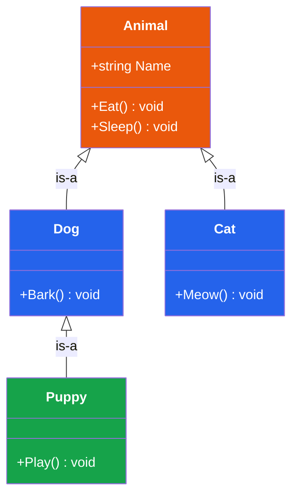

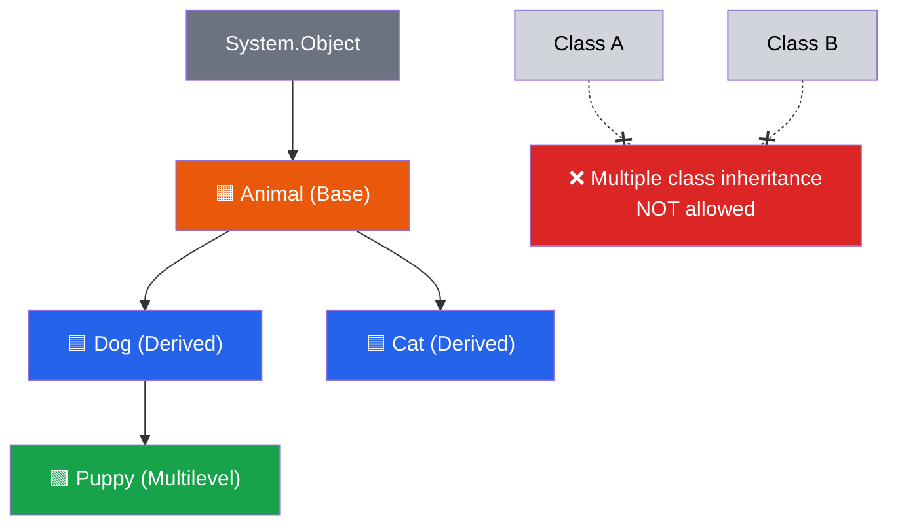

### D. Simple C# Example

**Step 1: Simplest**
```csharp
public class Animal                           // Base class
{
    public string Name { get; set; }

    public void Eat()
    {
        Console.WriteLine(Name + " is eating.");
    }
}

public class Dog : Animal                     // Dog inherits Animal
{
    public void Bark()
    {
        Console.WriteLine(Name + " says Woof!");
    }
}

// Usage
Dog d = new Dog();
d.Name = "Rex";        // inherited property
d.Eat();               // inherited method
d.Bark();              // own method
```

**Output:**
```
Rex is eating.
Rex says Woof!
```

**Step 2: Realistic — Employee hierarchy with constructors**
```csharp
public class Employee
{
    public int Id { get; private set; }
    public string Name { get; private set; }
    public decimal BaseSalary { get; protected set; }

    public Employee(int id, string name, decimal baseSalary)
    {
        Id = id; Name = name; BaseSalary = baseSalary;
        Console.WriteLine("Employee ctor");
    }

    public decimal GetAnnualSalary()
    {
        return BaseSalary * 12;
    }
}

public class Manager : Employee
{
    public int TeamSize { get; private set; }

    public Manager(int id, string name, decimal baseSalary, int teamSize)
        : base(id, name, baseSalary)                // call parent ctor
    {
        TeamSize = teamSize;
        Console.WriteLine("Manager ctor");
    }

    public void ConductMeeting()
    {
        Console.WriteLine(Name + " is meeting with " + TeamSize + " people.");
    }
}

// Usage
var m = new Manager(1, "Sara", 8000m, 5);
m.ConductMeeting();
Console.WriteLine(m.GetAnnualSalary());

Employee e = m;              // upcasting: a Manager IS an Employee
Console.WriteLine(e.Name);
// e.ConductMeeting();       // ❌ compile error: Employee type doesn't know this method
```

**Output:**
```
Employee ctor
Manager ctor
Sara is meeting with 5 people.
96000
Sara
```

### E. Line-by-Line Explanation

- `class Dog : Animal` — the colon means "inherits from".
- `d.Name` and `d.Eat()` — Dog didn't declare them, but has them through inheritance.
- `: base(id, name, baseSalary)` — Manager's constructor first calls Employee's constructor. **Base constructor always runs first** ("Employee ctor" printed before "Manager ctor").
- `protected set` — Manager could change `BaseSalary`, outsiders cannot.
- `Employee e = m;` — **upcasting** (child → parent reference) is always safe and implicit.
- Through `e` you can only see members **declared in Employee**, because the variable's type decides what's visible at compile time.

**Downcasting** (parent → child) needs an explicit cast and may fail:
```csharp
Employee e2 = new Employee(2, "Ali", 3000);
Manager mm = e2 as Manager;          // as → returns null if it fails
Console.WriteLine(mm == null);       // True
if (e is Manager mgr)                // C# 7 pattern matching
    mgr.ConductMeeting();
// Manager bad = (Manager)e2;        // throws InvalidCastException at runtime
```

### F. How It Works Internally

- A `Manager` object in memory contains **all fields of Employee + all fields of Manager** in one block.
- Its method table points to its base type's method table, forming a chain up to `System.Object`.
- When you call `m.GetAnnualSalary()`, the method is found in Employee's code; the `this` reference is the Manager object.

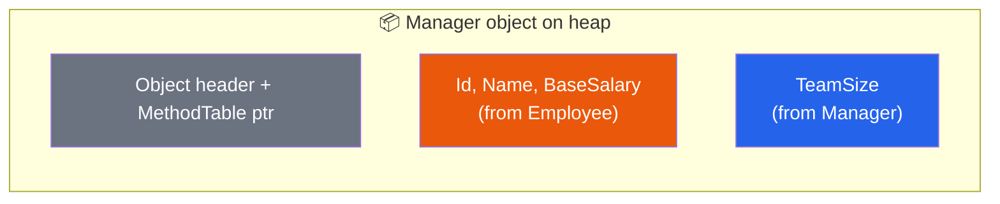

### G. Common Mistakes

- Using inheritance only to reuse code when there is **no "is-a"** relationship (e.g., `class Car : Engine` ❌ — a car *has* an engine; use composition).
- Deep hierarchies (5+ levels) → fragile, hard to understand.
- Forgetting to call a base constructor that has parameters → compile error: "There is no argument given that corresponds to the required parameter...".
- Expecting to call child methods through a parent reference.

### H. Interview Questions

1. **What is inheritance?** → A mechanism where a derived class acquires members of a base class; represents an is-a relationship.
2. **What are base and derived classes?** → Base = parent being inherited; derived = child that inherits.
3. **Does C# support multiple inheritance?** → Not for classes; a class can implement multiple interfaces.
4. **Why not?** → To avoid the diamond problem and complexity.
5. **Which class is the ultimate base of all classes?** → `System.Object`.
6. **Are constructors inherited?** → No.
7. **Are private members inherited?** → They exist in the derived object but are not accessible.
8. **(Medium) Order of constructor execution in inheritance?** → Base constructor first, then derived. (Field initializers: derived first, then base.)
9. **(Medium) Upcasting vs downcasting?** → Upcasting: child → parent (implicit, safe). Downcasting: parent → child (explicit, may throw).
10. **(Medium) `is` vs `as`?** → `is` checks type and returns bool (C# 7 can also declare a variable); `as` attempts a cast and returns `null` on failure (reference/nullable types only).
11. **(Hard) Can a struct inherit from a class?** → No. Structs implicitly inherit `System.ValueType` and can only implement interfaces.
12. **(Hard) What is the fragile base class problem?** → Changes in a base class can unexpectedly break derived classes.

---

## 13. The `base` Keyword

### A. Simple Definition

> **`base` is used inside a derived class to access members of its immediate parent class — to call the parent's constructor or the parent's version of a method.**

### Detailed explanation

Two main uses:
1. **Call base constructor:** `public Child(...) : base(...)`
2. **Call base method (usually an overridden one):** `base.Method();`

`base` cannot be used in static methods.

### B. Real-Life Example

A chef learns a family recipe from their mother (`base.Cook()`), follows it, and then adds their own special sauce.

### C. Visual Diagram

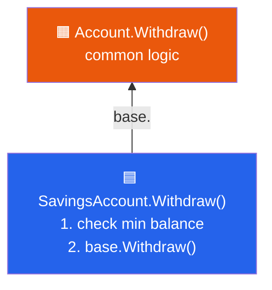

### D. Simple C# Example

```csharp
public class Logger
{
    public Logger(string source)
    {
        Console.WriteLine("Logger created for " + source);
    }

    public virtual void Log(string message)
    {
        Console.WriteLine("[LOG] " + message);
    }
}

public class TimestampLogger : Logger
{
    public TimestampLogger() : base("TimestampLogger")   // 1. base constructor
    {
    }

    public override void Log(string message)
    {
        Console.Write(DateTime.Now.ToString("HH:mm") + " ");
        base.Log(message);                                // 2. reuse parent logic
    }
}

// Usage
var logger = new TimestampLogger();
logger.Log("Server started");
```

**Output (time varies):**
```
Logger created for TimestampLogger
10:30 [LOG] Server started
```

### E. Line-by-Line Explanation

- `: base("TimestampLogger")` — passes a value to the parent constructor.
- `base.Log(message)` — calls the parent's *original* `Log`, avoiding duplicated code; the child adds a timestamp first.

### F. How It Works Internally

`base.Log()` is compiled as a **non-virtual call** directly to `Logger.Log`, ignoring any override. That's how it avoids calling itself recursively.

### G. Common Mistakes

- Calling `Log(message)` instead of `base.Log(message)` inside the override → infinite recursion → `StackOverflowException`.
- Using `base` to reach a grandparent — `base` only goes up **one** level (though if the parent didn't override it, the grandparent's version is what you get).

### H. Interview Questions

1. **What is `base`?** → Keyword for accessing parent class members/constructors.
2. **How do you call a parent constructor?** → `: base(args)` after the child constructor signature.
3. **(Medium) Can you call `base.base.Method()`?** → No.
4. **(Hard) If you don't write `: base(...)`, what happens?** → The compiler calls the base's parameterless constructor; if none exists → compile error.

---

## 14. Polymorphism

### A. Simple Definition

> **Polymorphism means "many forms": the same method name or reference can behave differently depending on the object or the parameters.**

### Detailed explanation

Two types in C#:

| Type | Also called | How | Decided at |
|------|-------------|-----|-----------|
| **Compile-time** | Static polymorphism, early binding | **Method overloading**, operator overloading | Compile time |
| **Runtime** | Dynamic polymorphism, late binding | **Method overriding** (`virtual`/`override`), interfaces, abstract | Runtime |

The key power of runtime polymorphism: you write code against a **base type**, and it automatically works with **any** new child type — without changing that code.

### B. Real-Life Example

- A **person** behaves as a *student* in class, an *employee* at work, and a *customer* in a shop — same person, different forms.
- The word "**open**": open a door, open a file, open a bank account — same word, different actions.
- A **"Speak"** command: a dog barks, a cat meows, a cow moos.

### C. Visual Diagram

```mermaid
flowchart LR
    R["Shape shape = ...<br/>shape.Draw()"]:::call
    R -->|"object is Circle"| C["⭕ Circle.Draw()"]:::c
    R -->|"object is Square"| S["⬛ Square.Draw()"]:::s
    R -->|"object is Triangle"| T["🔺 Triangle.Draw()"]:::t
    classDef call fill:#7c3aed,color:#fff
    classDef c fill:#2563eb,color:#fff
    classDef s fill:#16a34a,color:#fff
    classDef t fill:#ea580c,color:#fff
```

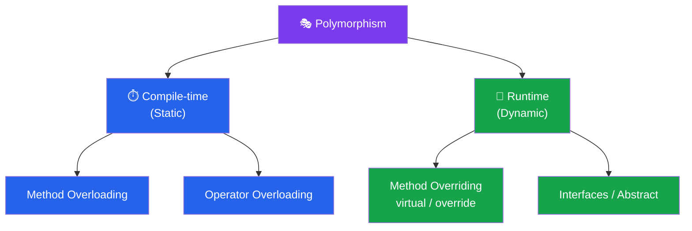

### D. Simple C# Example

```csharp
public class Shape
{
    public virtual void Draw() { Console.WriteLine("Drawing a shape"); }
}
public class Circle : Shape
{
    public override void Draw() { Console.WriteLine("Drawing a circle ⭕"); }
}
public class Square : Shape
{
    public override void Draw() { Console.WriteLine("Drawing a square ⬛"); }
}

// Usage
List<Shape> shapes = new List<Shape> { new Circle(), new Square(), new Shape() };
foreach (Shape s in shapes)
{
    s.Draw();          // same call — different behavior
}
```

**Output:**
```
Drawing a circle ⭕
Drawing a square ⬛
Drawing a shape
```

### E. Line-by-Line Explanation

- The list is of type `Shape`, but holds `Circle`, `Square`, and `Shape` objects.
- `s.Draw()` is the **same line of code**; the actual method chosen depends on the **real object type** at runtime.
- To add `Triangle`, you create a new class — the `foreach` loop **never changes**. This is the **Open/Closed Principle** in action.

### F. How It Works Internally

See the virtual method table (vtable) explanation in section 16.

### G. Common Mistakes

- Thinking overloading and overriding are the same.
- Forgetting `virtual` in the base → you can't `override`.
- Using `if (obj is Circle) ... else if (obj is Square) ...` chains instead of polymorphism.

### H. Interview Questions

1. **What is polymorphism?** → The ability of one interface/method name to take many forms.
2. **Types of polymorphism in C#?** → Compile-time (overloading) and runtime (overriding).
3. **What is early vs late binding?** → Early: method chosen at compile time. Late: chosen at runtime based on the actual object.
4. **(Hard) How does polymorphism support the Open/Closed Principle?** → New behavior is added by new subclasses; existing code that uses the base type doesn't change.

---

## 15. Method Overloading (Compile-time Polymorphism)

### A. Simple Definition

> **Method overloading means having multiple methods with the same name in the same class but with different parameter lists (number, type, or order of parameters).**

### Detailed explanation

Valid ways to overload:
- Different **number** of parameters
- Different **types** of parameters
- Different **order** of parameter types
- Different `ref`/`out`/`in` modifiers (but not *only* `ref` vs `out` difference)

❌ **Return type alone does NOT count.**

### B. Real-Life Example

A **"Pay"** counter: you can pay by cash, by card, or by card + PIN. Same action name "Pay", different inputs.

### C. Visual Diagram

```mermaid
flowchart LR
    Call1["Add(2, 3)"]:::call --> M1["Add(int, int)"]:::m
    Call2["Add(2.5, 3.1)"]:::call --> M2["Add(double, double)"]:::m
    Call3["Add(1, 2, 3)"]:::call --> M3["Add(int, int, int)"]:::m
    classDef call fill:#fde68a,color:#000
    classDef m fill:#2563eb,color:#fff
```

### D. Simple C# Example

```csharp
public class MathHelper
{
    public int Add(int a, int b)            { return a + b; }
    public int Add(int a, int b, int c)     { return a + b + c; }
    public double Add(double a, double b)   { return a + b; }
    public string Add(string a, string b)   { return a + b; }
    // public double Add(int a, int b) { }   // ❌ ERROR: differs only by return type
}

var m = new MathHelper();
Console.WriteLine(m.Add(2, 3));
Console.WriteLine(m.Add(1, 2, 3));
Console.WriteLine(m.Add(2.5, 3.1));
Console.WriteLine(m.Add("Hello ", "World"));
```

**Output:**
```
5
6
5.6
Hello World
```

**Realistic example — notification sender:**
```csharp
public class Notifier
{
    public void Send(string message)                       { Send(message, "admin@site.com"); }
    public void Send(string message, string to)            { Send(message, to, false); }
    public void Send(string message, string to, bool urgent)
    {
        Console.WriteLine((urgent ? "[URGENT] " : "") + "To " + to + ": " + message);
    }
}
```

### E. Line-by-Line Explanation

- All methods are named `Add`; the compiler uses the **signature** (name + parameter types) to tell them apart.
- `m.Add(2, 3)` → both args are `int` → picks `Add(int, int)`.
- `m.Add(2.5, 3.1)` → doubles → picks `Add(double, double)`.
- In the Notifier, simpler overloads delegate to the full version — avoids duplicated logic.

### F. How It Works Internally

The compiler performs **overload resolution** at compile time, picking the "best match" (exact match > implicit conversion). In the compiled IL, each call is fixed to a specific method — no runtime decision.

### G. Common Mistakes

- Overloading only by return type.
- Ambiguous calls: `Print(int, double)` and `Print(double, int)` called with `Print(1, 1)` → compile error "ambiguous call".
- Combining overloads with optional parameters in confusing ways.

### H. Interview Questions

1. **What is method overloading?** → Same method name, different parameters, same class.
2. **Can you overload by return type?** → No.
3. **Is overloading compile-time or runtime?** → Compile-time.
4. **Can constructors be overloaded?** → Yes.
5. **(Hard) Can static methods be overloaded?** → Yes.
6. **(Hard) Can you overload methods differing only by `ref` vs `out`?** → No (compile error); but `ref` vs no modifier is allowed.

---

## 16. virtual / override (Method Overriding)

### A. Simple Definition

> **Method overriding means a derived class provides its own implementation of a method that is already defined in the base class with the same signature. In C#, the base method must be marked `virtual` (or `abstract`), and the derived method must use `override`.**

### Detailed explanation

| Keyword | Where | Meaning |
|---------|-------|---------|
| `virtual` | Base class | "Children **may** replace this method." |
| `override` | Derived class | "I **am** replacing the parent's method." |
| `abstract` | Base class | "Children **must** replace this method." (no body) |
| `sealed override` | Derived | "I replaced it, and no one below me can replace it again." |

Rules:
- Same name, same parameters, same return type, same access modifier.
- Cannot override `static`, non-virtual, or `private` methods.
- Properties can also be `virtual`/`override`.

### B. Real-Life Example

All employees get a **salary**, but *how* it's calculated differs: full-time (monthly), part-time (hourly), contractor (per project). The company calls `CalculatePay()` for everyone.

### C. Visual Diagram

```mermaid
classDiagram
    class Employee {
        +virtual CalculatePay() decimal
    }
    class FullTime {
        +override CalculatePay() decimal
    }
    class PartTime {
        +override CalculatePay() decimal
    }
    Employee <|-- FullTime
    Employee <|-- PartTime
    style Employee fill:#ea580c,color:#fff
    style FullTime fill:#2563eb,color:#fff
    style PartTime fill:#2563eb,color:#fff
```

### D. Simple C# Example

```csharp
public class Employee
{
    public string Name { get; set; }

    public virtual decimal CalculatePay()             // can be overridden
    {
        return 1000m;
    }
}

public class FullTimeEmployee : Employee
{
    public decimal MonthlySalary { get; set; }

    public override decimal CalculatePay()            // replaces parent version
    {
        return MonthlySalary;
    }
}

public class PartTimeEmployee : Employee
{
    public int Hours { get; set; }
    public decimal HourlyRate { get; set; }

    public override decimal CalculatePay()
    {
        return Hours * HourlyRate;
    }
}

// Usage
List<Employee> staff = new List<Employee>
{
    new FullTimeEmployee { Name = "Ali",  MonthlySalary = 5000 },
    new PartTimeEmployee { Name = "Sara", Hours = 80, HourlyRate = 25 },
    new Employee         { Name = "Omar" }
};

decimal total = 0;
foreach (Employee e in staff)
{
    decimal pay = e.CalculatePay();                   // runtime decides
    Console.WriteLine(e.Name + ": " + pay);
    total += pay;
}
Console.WriteLine("Total payroll: " + total);
```

**Output:**
```
Ali: 5000
Sara: 2000
Omar: 1000
Total payroll: 8000
```

### E. Line-by-Line Explanation

- `public virtual decimal CalculatePay()` — the base provides a default and **allows** replacement.
- `public override decimal CalculatePay()` — child replaces it.
- `new FullTimeEmployee { Name = "Ali", ... }` — **object initializer** syntax (C# 3): calls the constructor, then sets properties.
- `e.CalculatePay()` — `e` is typed `Employee`, but the **actual object** decides which method runs.

### F. How It Works Internally — The vtable

Each class has a **Method Table** containing a **virtual method table (vtable)** — a list of slots, each pointing to the actual method code.

```mermaid
flowchart LR
    subgraph EmpVT["Employee vtable"]
        E1["slot: CalculatePay → Employee.CalculatePay"]:::base
    end
    subgraph FTVT["FullTimeEmployee vtable"]
        F1["slot: CalculatePay → FullTime.CalculatePay"]:::der
    end
    subgraph PTVT["PartTimeEmployee vtable"]
        P1["slot: CalculatePay → PartTime.CalculatePay"]:::der
    end
    classDef base fill:#ea580c,color:#fff
    classDef der fill:#2563eb,color:#fff
```

A call `e.CalculatePay()` compiles to the IL instruction `callvirt`, which:
1. Looks at the object's real type (via its method-table pointer),
2. Finds the `CalculatePay` slot in *that* vtable,
3. Jumps to that code.

`override` **reuses the same slot**, replacing the pointer. That's why the base reference still reaches the child method.

### G. Common Mistakes

- Forgetting `virtual` → compile error "cannot override because it is not marked virtual, abstract, or override".
- Forgetting `override` in the child → you get **method hiding** with a warning (next section).
- Changing the signature (e.g., adding a parameter) → that's a new overload, not an override.
- Calling a virtual method from a base constructor → the child override runs before the child's constructor has initialized its fields.

### H. Interview Questions

1. **What is method overriding?** → Redefining a base-class virtual method in a derived class with the same signature.
2. **What is a virtual method?** → A method that can be overridden in derived classes.
3. **Can we override a non-virtual method?** → No. We can only hide it using `new`.
4. **Can we override static methods?** → No; static methods are not polymorphic.
5. **Can we override private methods?** → No; `virtual` members can't be private.
6. **(Medium) Overloading vs Overriding?**

| Overloading | Overriding |
|-------------|-----------|
| Same class (or inherited) | Base and derived class |
| Different parameters | Same signature |
| Compile-time | Runtime |
| No keywords needed | `virtual` + `override` |
| Return type may differ | Return type must match (C# 9 adds covariant returns) |

7. **(Hard) How does runtime polymorphism work internally?** → Through the vtable and the `callvirt` instruction.
8. **(Hard) What happens if a base constructor calls a virtual method overridden in the derived class?** → The derived override runs, but derived constructor code hasn't run yet, so fields may be default/null.

---

## 17. Method Hiding with `new`

### A. Simple Definition

> **Method hiding happens when a derived class declares a method with the same name as a base method without overriding it. The `new` keyword makes this intentional. The method called depends on the *reference type*, not the object type.**

### B. Real-Life Example

A child makes their own "family recipe" but only uses it when people *know* they're asking the child. If someone asks "the family", they still get the old recipe.

### C. Visual Diagram

```mermaid
flowchart LR
    subgraph Override["override → object type wins"]
        A1["Base b = new Derived()"]:::c --> A2["b.Show() → Derived.Show ✅"]:::g
    end
    subgraph Hiding["new → reference type wins"]
        B1["Base b = new Derived()"]:::c --> B2["b.Show() → Base.Show ⚠️"]:::o
    end
    classDef c fill:#fde68a,color:#000
    classDef g fill:#16a34a,color:#fff
    classDef o fill:#ea580c,color:#fff
```

### D. Simple C# Example

```csharp
public class Parent
{
    public virtual void A() { Console.WriteLine("Parent.A"); }
    public void B()         { Console.WriteLine("Parent.B"); }
}

public class Child : Parent
{
    public override void A() { Console.WriteLine("Child.A"); }   // overriding
    public new void B()      { Console.WriteLine("Child.B"); }   // hiding
}

Parent p = new Child();
p.A();      // Child.A   (override: object type decides)
p.B();      // Parent.B  (hiding: reference type decides)

Child c = new Child();
c.A();      // Child.A
c.B();      // Child.B
```

**Output:**
```
Child.A
Parent.B
Child.A
Child.B
```

### E. Line-by-Line Explanation

- `p` is declared as `Parent` but points to a `Child`.
- `A()` is overridden → vtable slot replaced → Child's version runs.
- `B()` is hidden → Child's `B` is a **completely separate method**; through a `Parent` reference, the compiler picks `Parent.B`.

### F. How It Works Internally

`new` creates a **new slot** instead of reusing the parent's vtable slot. The compiler binds the call based on the static (declared) type.

### G. Common Mistakes

- Forgetting `override` and getting hiding by accident (compiler warning CS0108/CS0114). **Always read warnings!**
- Using `new` to "fix" a warning without understanding the behavior change.

### H. Interview Questions

1. **What is method hiding?** → Redefining a base method in a derived class using `new`; resolution is by reference type.
2. **(Medium) Difference between `override` and `new`?** → `override` extends the vtable slot (runtime decision by object type); `new` creates a separate method (compile-time decision by reference type).
3. **(Hard) What if you omit both `new` and `override`?** → It hides the method and the compiler shows a warning.

---

## 18. Sealed Classes and Methods

### A. Simple Definition

> **`sealed` prevents further inheritance: a sealed class cannot be inherited, and a sealed method (a `sealed override`) cannot be overridden again by further derived classes.**

### Detailed explanation

Why seal?
- **Security/correctness:** prevent others from changing critical behavior (e.g., payment validation).
- **Design intent:** "this class is not designed for extension."
- **Performance:** the JIT can **devirtualize** calls on sealed types (small speedup).

Examples in .NET: `System.String` is sealed.

### B. Real-Life Example

A **sealed envelope** — once sealed, you can't add anything. A **final exam paper** — no further changes allowed.

### C. Visual Diagram

```mermaid
flowchart TB
    A["Payment"]:::base --> B["CardPayment<br/>🔒 sealed override Validate()"]:::der
    B --> C["PremiumCardPayment<br/>❌ cannot override Validate()"]:::err
    S["🔒 sealed class Utility"]:::sealed -.-x D["❌ class MyUtil : Utility"]:::err
    classDef base fill:#ea580c,color:#fff
    classDef der fill:#2563eb,color:#fff
    classDef err fill:#dc2626,color:#fff
    classDef sealed fill:#374151,color:#fff
```

### D. Simple C# Example

```csharp
public sealed class PasswordHasher              // sealed class
{
    public string Hash(string input) { return "HASH(" + input + ")"; }
}
// public class MyHasher : PasswordHasher { }   // ❌ cannot derive from sealed type

public class Payment
{
    public virtual bool Validate() { return true; }
}

public class CardPayment : Payment
{
    public sealed override bool Validate()      // sealed method
    {
        Console.WriteLine("Card validated");
        return true;
    }
}

public class PremiumCardPayment : CardPayment
{
    // public override bool Validate() { ... }  // ❌ cannot override sealed member
}
```

### E. Line-by-Line Explanation

- `sealed class PasswordHasher` — no class can inherit it.
- `sealed override` — only valid on an **override**; it stops the override chain here.

### F. How It Works Internally

The compiler marks the type/method as `final` in metadata. The JIT knows there are no subclasses, so it can call methods directly instead of through the vtable.

### G. Common Mistakes

- Writing `sealed` on a method that isn't an `override` → compile error.
- Sealing too early and blocking legitimate extension (or not sealing security-critical logic).

### H. Interview Questions

1. **What is a sealed class?** → A class that cannot be inherited.
2. **Can a sealed class be instantiated?** → Yes.
3. **Can we seal a method?** → Only an overriding method: `sealed override`.
4. **Example from .NET?** → `string`.
5. **(Medium) Can an abstract class be sealed?** → No — contradiction (abstract needs inheritance).
6. **(Hard) Sealed vs static class vs private constructor?** → sealed: instantiable, not inheritable. static: not instantiable, not inheritable, only static members. private constructor: not instantiable from outside, but nested classes could inherit.

---

## 19. Abstraction

### A. Simple Definition

> **Abstraction is the process of hiding the complex implementation details and showing only the essential features (what an object does, not how it does it).**

### Detailed explanation

Abstraction answers "**What** can I do?" while hiding "**How** is it done?".

In C#, abstraction is achieved with:
1. **Abstract classes** — partial abstraction (can have both implemented and unimplemented members).
2. **Interfaces** — define a contract (what must be done).
3. Even **ordinary methods and encapsulation** provide abstraction (you call `list.Sort()` without knowing the algorithm).

### B. Real-Life Example

**Driving a car**: you use the steering wheel, pedals, and gear. You don't need to know how fuel injection, the ignition system, or the transmission work.

**Coffee machine**: press "Latte". You don't see water heating, grinding, milk frothing.

### C. Visual Diagram

```mermaid
flowchart TB
    U["👤 User sees"]:::user --> I["🎛️ StartEngine()<br/>Accelerate()<br/>Brake()"]:::abs
    I -.->|"hidden"| H["🔧 Fuel injection<br/>🔧 Spark timing<br/>🔧 ABS sensors<br/>🔧 Transmission logic"]:::hidden
    classDef user fill:#fde68a,color:#000
    classDef abs fill:#7c3aed,color:#fff
    classDef hidden fill:#9ca3af,color:#000
```

### D. Simple C# Example

```csharp
public abstract class EmailService                     // abstraction
{
    public void SendEmail(string to, string body)      // simple public API
    {
        Connect();
        Authenticate();
        Transmit(to, body);
        Disconnect();
    }
    private void Connect()      { Console.WriteLine("Connecting to SMTP..."); }
    private void Authenticate() { Console.WriteLine("Authenticating..."); }
    protected abstract void Transmit(string to, string body);
    private void Disconnect()   { Console.WriteLine("Disconnected."); }
}

public class GmailService : EmailService
{
    protected override void Transmit(string to, string body)
    {
        Console.WriteLine("Gmail sending to " + to + ": " + body);
    }
}

// Usage — caller only knows SendEmail
EmailService svc = new GmailService();
svc.SendEmail("ali@x.com", "Hello!");
```

**Output:**
```
Connecting to SMTP...
Authenticating...
Gmail sending to ali@x.com: Hello!
Disconnected.
```

### E. Line-by-Line Explanation

- The caller calls **one** method, `SendEmail`. All complex steps are hidden (private).
- `Transmit` is `abstract` → each provider decides how to send.
- This is also the **Template Method pattern**: a fixed algorithm in the base, customizable steps in children.

### F. How It Works Internally

`EmailService` cannot be instantiated. The abstract `Transmit` has a vtable slot with no implementation; the concrete child fills it.

### G. Common Mistakes

- Thinking abstraction means only "abstract classes". It's a **concept**; abstract classes and interfaces are **tools**.
- Leaking details (e.g., `SendEmail(to, body, smtpHost, port, retryCount)`) → poor abstraction.

### H. Interview Questions

1. **What is abstraction?** → Hiding implementation details and showing only essential functionality.
2. **How is abstraction achieved in C#?** → Abstract classes and interfaces.
3. **Real-world example?** → Car driving, ATM, TV remote.
4. **(Medium) Abstraction vs encapsulation?** → See table in section 11. Abstraction = hide complexity (design); encapsulation = hide data (implementation).

---

## 20. Abstract Classes

### A. Simple Definition

> **An abstract class is a class marked with `abstract` that cannot be instantiated and is meant to be inherited. It can contain both abstract members (no body — must be implemented by children) and concrete members (with body).**

### Detailed explanation

- `abstract class Shape { }` — cannot do `new Shape()`.
- **Abstract method**: `public abstract double Area();` — no body, implicitly virtual. Children **must** `override`.
- Can have: fields, constructors, properties, concrete methods, static members.
- A derived class that doesn't implement all abstract members must itself be abstract.

Use it when classes share **common code AND a common identity** ("is-a"), but some behavior differs.

### B. Real-Life Example

"**Vehicle**" — you never buy just "a vehicle"; you buy a car or a bike. But all vehicles have a registration number (shared data) and must be able to move (each in its own way).

### C. Visual Diagram

```mermaid
classDiagram
    class Shape {
        <<abstract>>
        +string Name
        +Shape(name)
        +Area()* double
        +Perimeter()* double
        +Describe() void
    }
    class Circle {
        +double Radius
        +Area() double
        +Perimeter() double
    }
    class Rectangle {
        +double Width
        +double Height
        +Area() double
        +Perimeter() double
    }
    Shape <|-- Circle
    Shape <|-- Rectangle
    style Shape fill:#7c3aed,color:#fff
    style Circle fill:#2563eb,color:#fff
    style Rectangle fill:#2563eb,color:#fff
```

### D. Simple C# Example

```csharp
public abstract class Shape
{
    public string Name { get; private set; }

    protected Shape(string name)          // abstract classes CAN have constructors
    {
        Name = name;
    }

    public abstract double Area();        // no body — children must implement
    public abstract double Perimeter();

    public void Describe()                // concrete — shared by all
    {
        Console.WriteLine(Name + ": Area = " + Area().ToString("F2")
                          + ", Perimeter = " + Perimeter().ToString("F2"));
    }
}

public class Circle : Shape
{
    public double Radius { get; private set; }
    public Circle(double r) : base("Circle") { Radius = r; }

    public override double Area()      { return Math.PI * Radius * Radius; }
    public override double Perimeter() { return 2 * Math.PI * Radius; }
}

public class Rectangle : Shape
{
    public double Width { get; private set; }
    public double Height { get; private set; }
    public Rectangle(double w, double h) : base("Rectangle") { Width = w; Height = h; }

    public override double Area()      { return Width * Height; }
    public override double Perimeter() { return 2 * (Width + Height); }
}

// Usage
// Shape s = new Shape("x");     // ❌ cannot create instance of abstract class
Shape[] shapes = { new Circle(1), new Rectangle(2, 3) };
foreach (var s in shapes) s.Describe();
```

**Output:**
```
Circle: Area = 3.14, Perimeter = 6.28
Rectangle: Area = 6.00, Perimeter = 10.00
```

### E. Line-by-Line Explanation

- `abstract class Shape` — a concept, not a concrete thing.
- `protected Shape(string name)` — only children can call it (via `base`).
- `public abstract double Area();` — a **promise**: every shape will have an area.
- `Describe()` — concrete method that **calls abstract methods**; the correct child implementation runs at runtime.
- `Shape[] shapes = {...}` — an abstract type can be used as a **variable type**, just not instantiated.

### F. How It Works Internally

The type is marked `abstract` in metadata; the CLR refuses to create instances. Abstract methods are virtual slots without code; the compiler forces concrete children to fill every slot.

### G. Common Mistakes

- Trying to instantiate an abstract class.
- Giving an abstract method a body → compile error.
- Declaring an abstract method in a non-abstract class → compile error.
- Making abstract members `private` → not allowed (children couldn't implement them).

### H. Interview Questions

1. **What is an abstract class?** → A class that can't be instantiated, may contain abstract and concrete members, and is designed as a base class.
2. **Can an abstract class have a constructor?** → Yes; it's called by derived constructors.
3. **Can an abstract class have non-abstract methods?** → Yes.
4. **Can we create an object of an abstract class?** → No, but we can use it as a reference type.
5. **Can an abstract method be private/static?** → No.
6. **(Medium) Abstract method vs virtual method?** → Abstract: no body, must override. Virtual: has body, may override.
7. **(Hard) Can an abstract class have no abstract members?** → Yes — it just prevents direct instantiation.
8. **(Hard) Can an abstract class inherit from a concrete class?** → Yes. It can even override a virtual method as `abstract` again.

---

## 21. Interfaces

### A. Simple Definition

> **An interface is a contract that defines a set of members (methods, properties, events, indexers) without implementation. Any class or struct that implements the interface must provide the implementation for all its members.**

### Detailed explanation

- Declared with `interface`; names start with **I** by convention (`IPayment`).
- Members are **public** by default (and in C# 7.3 cannot have access modifiers or bodies).
- A class can implement **multiple** interfaces → C#'s way of achieving multiple inheritance of *type*.
- Represents a **"CAN-DO"** relationship: a `Duck` *can* `IFly`, `ISwim`.
- Interfaces **cannot** have fields, constructors, or (in C# 7.3) implementations.
- Interfaces can inherit from other interfaces.

> **Newer feature note:** C# 8.0+ allows **default interface methods** (bodies inside interfaces), and C# 11 adds static abstract members. These are *not* available in C# 7.3.

**Explicit interface implementation:** used when two interfaces have the same member name, or to hide a member from the class's public API.

### B. Real-Life Example

A **power socket** is an interface. Any device (phone charger, laptop, TV) that has the correct plug can use it. The socket doesn't care *what* the device is — only that it follows the plug **contract**.

A **job description** ("must be able to drive, must speak English") — any person meeting it can do the job.

### C. Visual Diagram

```mermaid
classDiagram
    class IPayment {
        <<interface>>
        +Pay(decimal amount) bool
    }
    class IRefundable {
        <<interface>>
        +Refund(decimal amount) void
    }
    class CreditCardPayment
    class PayPalPayment
    class CashPayment
    IPayment <|.. CreditCardPayment : implements
    IPayment <|.. PayPalPayment : implements
    IPayment <|.. CashPayment : implements
    IRefundable <|.. CreditCardPayment : implements
    IRefundable <|.. PayPalPayment : implements
    style IPayment fill:#7c3aed,color:#fff
    style IRefundable fill:#7c3aed,color:#fff
    style CreditCardPayment fill:#16a34a,color:#fff
    style PayPalPayment fill:#16a34a,color:#fff
    style CashPayment fill:#16a34a,color:#fff
```

```mermaid
flowchart LR
    I["🟪 Interface<br/>(Contract: WHAT)"]:::i -->|"implemented by"| C1["🟩 Class A<br/>(HOW #1)"]:::c
    I -->|"implemented by"| C2["🟩 Class B<br/>(HOW #2)"]:::c
    classDef i fill:#7c3aed,color:#fff
    classDef c fill:#16a34a,color:#fff
```

### D. Simple C# Example

**Step 1: Simple**
```csharp
public interface IPayment
{
    bool Pay(decimal amount);       // no body, no access modifier (public by default)
}

public class CreditCardPayment : IPayment
{
    public bool Pay(decimal amount)
    {
        Console.WriteLine("Paid " + amount + " by credit card");
        return true;
    }
}

public class PayPalPayment : IPayment
{
    public bool Pay(decimal amount)
    {
        Console.WriteLine("Paid " + amount + " via PayPal");
        return true;
    }
}

// Usage — code depends on the INTERFACE, not the class
IPayment payment = new PayPalPayment();
payment.Pay(99.99m);
```

**Output:**
```
Paid 99.99 via PayPal
```

**Step 2: Multiple interfaces + checkout that doesn't care about concrete types**
```csharp
public interface IRefundable
{
    void Refund(decimal amount);
}

public class CardPayment : IPayment, IRefundable      // multiple interfaces
{
    public bool Pay(decimal amount)     { Console.WriteLine("Card paid " + amount); return true; }
    public void Refund(decimal amount)  { Console.WriteLine("Card refunded " + amount); }
}

public class CashPayment : IPayment
{
    public bool Pay(decimal amount)     { Console.WriteLine("Cash paid " + amount); return true; }
}

public class Checkout
{
    private readonly IPayment _payment;              // depends on abstraction

    public Checkout(IPayment payment) { _payment = payment; }   // injected

    public void Complete(decimal total)
    {
        if (_payment.Pay(total))
            Console.WriteLine("Order complete!");
    }

    public void Cancel(decimal total)
    {
        IRefundable refundable = _payment as IRefundable;       // check capability
        if (refundable != null) refundable.Refund(total);
        else Console.WriteLine("This payment method does not support refunds.");
    }
}

// Usage
var c1 = new Checkout(new CardPayment());
c1.Complete(50); c1.Cancel(50);
var c2 = new Checkout(new CashPayment());
c2.Complete(20); c2.Cancel(20);
```

**Output:**
```
Card paid 50
Order complete!
Card refunded 50
Cash paid 20
Order complete!
This payment method does not support refunds.
```

**Step 3: Explicit interface implementation**
```csharp
public interface IPrinter { void Print(); }
public interface IScanner { void Print(); }   // same name!

public class OfficeMachine : IPrinter, IScanner
{
    void IPrinter.Print() { Console.WriteLine("Printing document"); }
    void IScanner.Print() { Console.WriteLine("Printing scan preview"); }
}

var m = new OfficeMachine();
// m.Print();                      // ❌ not accessible through class reference
((IPrinter)m).Print();             // Printing document
((IScanner)m).Print();             // Printing scan preview
```

### E. Line-by-Line Explanation

- `interface IPayment { bool Pay(decimal amount); }` — defines **what**, not **how**.
- `class CreditCardPayment : IPayment` — the class signs the contract and **must** implement `Pay` as `public`.
- `IPayment payment = new PayPalPayment();` — variable of interface type; can hold any implementation.
- `Checkout` receives `IPayment` in the constructor → **Dependency Injection**. `Checkout` never changes when a new payment type is added.
- `_payment as IRefundable` — checks if this object *also* has the refund capability.
- Explicit implementation `void IPrinter.Print()` — no access modifier; only reachable via the interface type.

### F. How It Works Internally

Each class has an **interface map** in its method table that maps each interface method to the class's actual implementation. A call through an interface reference uses **interface dispatch** (the runtime uses stubs/caches to find the right method quickly). Interface methods implemented in a class are implicitly `virtual sealed` unless you mark them `virtual`.

### G. Common Mistakes

- Implementing an interface method as non-public (implicit implementations must be `public`).
- Adding fields to an interface → compile error.
- Creating "fat" interfaces with 20 methods → violates Interface Segregation Principle.
- Adding a new member to a published interface breaks every implementer (in C# 7.3 — the reason default interface methods were introduced in C# 8).

### H. Interview Questions

1. **What is an interface?** → A contract of members with no implementation that implementing types must fulfill.
2. **Can we create an instance of an interface?** → No.
3. **Can a class implement multiple interfaces?** → Yes.
4. **Can an interface have fields?** → No. (Properties yes.)
5. **Can an interface have constructors?** → No.
6. **Default access modifier of interface members?** → public.
7. **(Medium) Abstract class vs interface?**

| Feature | Abstract Class | Interface (C# 7.3) |
|---------|----------------|--------------------|
| Instantiable | No | No |
| Implementation | Can have | Cannot have |
| Fields | Yes | No |
| Constructors | Yes | No |
| Access modifiers on members | Any | Always public |
| Multiple inheritance | No (one base class) | Yes (many interfaces) |
| Relationship | "is-a" | "can-do" |
| Use when | Related classes share code | Unrelated classes share capability |
| Versioning | Add concrete method without breaking | Adding member breaks implementers |

8. **(Medium) When would you choose an interface over an abstract class?** → When unrelated classes need the same capability, when you need multiple inheritance of type, or for dependency injection/testing.
9. **(Hard) What is explicit interface implementation? Why use it?** → Implementing a member as `IInterface.Member`; resolves name conflicts and hides members from the public class API.
10. **(Hard) Can an interface inherit another interface? A class?** → Another interface, yes (even multiple). A class, no.
11. **(Hard) What changed for interfaces in C# 8?** → Default implementations, access modifiers, static members. Not usable in C# 7.3.


---

# Part 3 — Beyond the Pillars

## 22. Static Members

### A. Simple Definition

> **A static member belongs to the class itself, not to any individual object. There is only one copy, shared by all objects, and it is accessed using the class name.**

### Detailed explanation

- **Static field** — one shared value (e.g., counter of all objects).
- **Static method** — can be called without creating an object (`Math.Max`). It can only use static members directly (no `this`).
- **Static property** — shared property.
- **Static constructor** — initializes static data once.
- **Static class** — cannot be instantiated or inherited; can only contain static members (e.g., `Math`, `Console`). Used for utility/helper methods and extension methods.

### B. Real-Life Example

In a classroom, each student has their own notebook (instance), but there is **one whiteboard** (static) that everyone shares.

### C. Visual Diagram

```mermaid
flowchart TB
    S["🟦 Class Student<br/>static int Count = 3<br/>static string School = 'ABC'"]:::cls
    O1["🟩 Ali<br/>Name, Age"]:::obj
    O2["🟩 Sara<br/>Name, Age"]:::obj
    O3["🟩 Omar<br/>Name, Age"]:::obj
    O1 -.shares.-> S
    O2 -.shares.-> S
    O3 -.shares.-> S
    classDef cls fill:#2563eb,color:#fff
    classDef obj fill:#16a34a,color:#fff
```

### D. Simple C# Example

```csharp
public class Student
{
    public static int Count;                         // shared by all
    public static string SchoolName = "Green Valley";
    public string Name { get; private set; }         // per object

    public Student(string name)
    {
        Name = name;
        Count++;                                     // instance code CAN use static
    }

    public static void PrintCount()                  // static method
    {
        Console.WriteLine("Total students: " + Count);
        // Console.WriteLine(Name);                  // ❌ no 'this' in static method
    }
}

public static class TemperatureConverter             // static class
{
    public static double CToF(double c) { return c * 9 / 5 + 32; }
}

// Usage
new Student("Ali"); new Student("Sara"); new Student("Omar");
Student.PrintCount();                                // via class name
Console.WriteLine(Student.SchoolName);
Console.WriteLine(TemperatureConverter.CToF(100));
```

**Output:**
```
Total students: 3
Green Valley
212
```

### E. Line-by-Line Explanation

- `public static int Count;` — one variable for the class; every `new Student` increments the **same** counter.
- `Student.PrintCount()` — no object needed.
- Static methods cannot use `Name` because there is no particular student.
- `static class` — you cannot do `new TemperatureConverter()`.

### F. How It Works Internally

Static fields are stored with the **type** (in a special area associated with the type, per AppDomain), not inside objects. They live for the lifetime of the application — they are never garbage-collected while the type is loaded.

### G. Common Mistakes

- Using static fields to hold per-user data in web apps → data shared across all users! (and thread-safety problems)
- Overusing static → hard to test and mock, creates hidden global state.
- Accessing static members through an instance (`s.Count`) → compile error in C#.

### H. Interview Questions

1. **What is a static member?** → A member belonging to the type rather than instances.
2. **Can a static method access instance members?** → Not directly; only through an object reference.
3. **What is a static class?** → A class with only static members; cannot be instantiated or inherited (sealed + abstract in IL).
4. **Can a static class have a constructor?** → Only a static constructor.
5. **(Medium) Can static methods be overridden?** → No.
6. **(Hard) Static class vs Singleton?** → Singleton is an object: can implement interfaces, be passed as a parameter, lazily created, mocked. Static class cannot.
7. **(Hard) Are static fields thread-safe?** → No. Access must be synchronized if modified by multiple threads (only the static constructor is guaranteed thread-safe).

---

## 23. Object Relationships Overview

Objects in real programs work **together**. There are two families of relationships:

| Relationship | Meaning | Strength | Example | UML symbol |
|-------------|---------|----------|---------|-----------|
| **Inheritance** | IS-A | Strongest (compile-time) | Dog is an Animal | `<|--` hollow triangle |
| **Realization** | CAN-DO | Strong | Card implements IPayment | `<|..` dashed triangle |
| **Composition** | PART-OF (owns, lifecycle bound) | Strong | House has Rooms | `*--` filled diamond |
| **Aggregation** | HAS-A (shared, independent lifecycle) | Medium | Team has Players | `o--` hollow diamond |
| **Association** | USES/KNOWS (long-term link) | Weak | Teacher ↔ Student | `--` line |
| **Dependency** | USES temporarily (parameter, local) | Weakest | Order uses Printer in a method | `..>` dashed arrow |

```mermaid
flowchart LR
    DEP["Dependency<br/>(uses briefly)"]:::d --> ASSOC["Association<br/>(knows)"]:::a --> AGG["Aggregation<br/>(has, shared)"]:::ag --> COMP["Composition<br/>(owns, part-of)"]:::c --> INH["Inheritance<br/>(is-a)"]:::i
    classDef d fill:#bbf7d0,color:#000
    classDef a fill:#86efac,color:#000
    classDef ag fill:#fde047,color:#000
    classDef c fill:#fb923c,color:#000
    classDef i fill:#dc2626,color:#fff
```
*Left = loose coupling, Right = tight coupling.*

```mermaid
classDiagram
    Animal <|-- Dog : Inheritance
    IPayment <|.. Card : Realization
    House *-- Room : Composition
    Team o-- Player : Aggregation
    Teacher -- Student : Association
    Order ..> Printer : Dependency
```

---

## 24. Association

### A. Simple Definition

> **Association is a general relationship where one object knows about or uses another object, and both have their own independent lifecycles. Neither owns the other.**

### Detailed explanation

- Can be **one-to-one**, **one-to-many**, **many-to-many**.
- Can be **unidirectional** (A knows B) or **bidirectional** (both know each other).
- Aggregation and composition are **special kinds** of association.

### B. Real-Life Example

A **Doctor** and a **Patient**. A doctor treats many patients; a patient can see many doctors. If the doctor retires, patients still exist, and vice versa.

### C. Visual Diagram

```mermaid
classDiagram
    class Doctor { +string Name }
    class Patient { +string Name }
    Doctor "1..*" -- "0..*" Patient : treats
    style Doctor fill:#2563eb,color:#fff
    style Patient fill:#16a34a,color:#fff
```

### D. Simple C# Example

```csharp
public class Patient
{
    public string Name { get; private set; }
    public Patient(string name) { Name = name; }
}

public class Doctor
{
    public string Name { get; private set; }
    public Doctor(string name) { Name = name; }

    public void Treat(Patient patient)           // associates with patient
    {
        Console.WriteLine("Dr. " + Name + " treats " + patient.Name);
    }
}

var p = new Patient("Ali");
var d1 = new Doctor("Khan");
var d2 = new Doctor("Smith");
d1.Treat(p);
d2.Treat(p);
```

**Output:**
```
Dr. Khan treats Ali
Dr. Smith treats Ali
```

### E. Line-by-Line Explanation

- `Patient` and `Doctor` are created independently.
- Neither creates nor destroys the other; they just interact.

### F. How It Works Internally

Association is just a **reference** — either passed as a parameter or stored as a field. No lifecycle control.

### G. Common Mistakes

- Treating every "uses" relationship as composition.
- Bidirectional associations without care → circular references, harder to maintain.

### H. Interview Questions

1. **What is association?** → A relationship between two independent objects where one uses/knows the other.
2. **(Medium) Association vs aggregation vs composition?** → Association is general; aggregation is "has-a" with independent lifecycle; composition is "part-of" with dependent lifecycle.

---

## 25. Aggregation

### A. Simple Definition

> **Aggregation is a "HAS-A" relationship where one object (the whole) contains references to other objects (parts), but the parts can exist independently of the whole.**

Also called **weak "has-a"**.

### B. Real-Life Example

A **Department has Employees**. If the department is closed, employees still exist (they move elsewhere). A **Playlist has Songs** — deleting the playlist doesn't delete the songs.

### C. Visual Diagram

```mermaid
classDiagram
    class Department {
        +string Name
        +AddEmployee(Employee)
    }
    class Employee {
        +string Name
    }
    Department o-- "0..*" Employee : has (shared)
    style Department fill:#ca8a04,color:#fff
    style Employee fill:#16a34a,color:#fff
```

### D. Simple C# Example

```csharp
public class Employee
{
    public string Name { get; private set; }
    public Employee(string name) { Name = name; }
}

public class Department
{
    public string Name { get; private set; }
    private readonly List<Employee> _employees = new List<Employee>();

    public Department(string name) { Name = name; }

    public void AddEmployee(Employee e) { _employees.Add(e); }   // created OUTSIDE

    public void Show()
    {
        Console.WriteLine(Name + ": " + string.Join(", ", _employees.Select(x => x.Name)));
    }
}

// Usage (requires using System.Linq;)
var ali = new Employee("Ali");                    // exists on its own
var sara = new Employee("Sara");

var it = new Department("IT");
it.AddEmployee(ali); it.AddEmployee(sara);
it.Show();

it = null;                                        // department gone
Console.WriteLine(ali.Name + " still exists");    // employee still alive
```

**Output:**
```
IT: Ali, Sara
Ali still exists
```

### E. Line-by-Line Explanation

- Employees are created **outside** the department and **passed in**.
- The department holds references but doesn't control their lifetime.
- The same `ali` could also be added to another department.

### F. How It Works Internally

The whole holds a list of **references**. The GC frees a part only when *no* object refers to it.

### G. Common Mistakes

- Confusing with composition. **Key test:** *"Does the part make sense and survive without the whole?"* Yes → aggregation.

### H. Interview Questions

1. **What is aggregation?** → A weak has-a relationship where parts have independent lifecycles.
2. **Example?** → Team–Player, Department–Employee, Library–Book (when books are shared).
3. **UML symbol?** → Hollow diamond on the whole's side.

---

## 26. Composition

### A. Simple Definition

> **Composition is a strong "HAS-A" / "PART-OF" relationship where the whole object owns its parts, creates them, and the parts cannot exist independently. When the whole is destroyed, its parts are destroyed too.**

### Detailed explanation

- The whole usually **creates the parts inside itself** (often in its constructor).
- Parts are usually `private` and not shared.
- Composition is the foundation of the principle **"Favor composition over inheritance."**

### B. Real-Life Example

A **House has Rooms**. If the house is demolished, its rooms don't exist anymore.
A **Car has an Engine** (in a design where the engine is built for and owned by the car).
A **Human has a Heart**.

### C. Visual Diagram

```mermaid
classDiagram
    class Car {
        -Engine _engine
        -Wheel[] _wheels
        +Start() void
    }
    class Engine {
        +Start() void
    }
    class Wheel {
        +Rotate() void
    }
    Car *-- "1" Engine : owns
    Car *-- "4" Wheel : owns
    style Car fill:#ea580c,color:#fff
    style Engine fill:#2563eb,color:#fff
    style Wheel fill:#2563eb,color:#fff
```

### D. Simple C# Example

```csharp
public class Engine
{
    public int HorsePower { get; private set; }
    public Engine(int hp) { HorsePower = hp; }
    public void Start() { Console.WriteLine("Engine (" + HorsePower + " HP) started"); }
}

public class Wheel
{
    public string Position { get; private set; }
    public Wheel(string pos) { Position = pos; }
}

public class Car
{
    private readonly Engine _engine;                 // part
    private readonly List<Wheel> _wheels;            // parts

    public string Model { get; private set; }

    public Car(string model, int hp)
    {
        Model = model;
        _engine = new Engine(hp);                    // whole CREATES its parts
        _wheels = new List<Wheel>
        {
            new Wheel("FL"), new Wheel("FR"), new Wheel("RL"), new Wheel("RR")
        };
    }

    public void Start()
    {
        _engine.Start();                             // delegation
        Console.WriteLine(Model + " ready with " + _wheels.Count + " wheels");
    }
}

// Usage
var car = new Car("Civic", 180);
car.Start();
```

**Output:**
```
Engine (180 HP) started
Civic ready with 4 wheels
```

### E. Line-by-Line Explanation

- `Car` creates its `Engine` and `Wheel`s itself — outsiders never get these objects.
- `Start()` **delegates** to the engine: `Car` reuses `Engine` behavior *without inheriting* from it.
- When `car` is no longer referenced, the engine and wheels also become unreachable → collected together.

### F. How It Works Internally

In .NET, "destroyed together" means: the parts are only referenced by the whole, so when the whole becomes unreachable, so do the parts, and the GC collects them all.

### G. Common Mistakes

- Exposing parts publicly (`public Engine Engine { get; set; }`) → others can share/replace them, turning composition into aggregation.
- Using inheritance (`class Car : Engine`) — a car is **not** an engine.

### H. Interview Questions

1. **What is composition?** → A strong has-a relationship where the whole owns the parts and controls their lifecycle.
2. **Composition vs aggregation?**

| Composition | Aggregation |
|-------------|-------------|
| Strong "part-of" | Weak "has-a" |
| Part cannot exist without whole | Part can exist independently |
| Whole creates parts | Parts created outside and passed in |
| Filled diamond ◆ | Hollow diamond ◇ |
| House–Room | Team–Player |

3. **(Hard) The same code can be composition or aggregation — how?** → It depends on ownership: if `Car` receives an `Engine` via constructor that other cars can share, it's aggregation; if it creates and hides it, composition. (With DI we often inject parts but still treat them as owned — the *intent* matters.)

---

## 27. Dependency

### A. Simple Definition

> **Dependency is the weakest relationship, where one class uses another class temporarily — typically as a method parameter, local variable, or return value — without storing it as a field.**

### Detailed explanation

"Class A depends on B" means a change in B might require changes in A. Good OOP design **minimizes dependencies on concrete classes** and prefers depending on **interfaces** (Dependency Inversion Principle).

**Dependency Injection (DI)** — instead of a class *creating* what it needs (`new SmtpClient()`), the needed objects are **given** to it (usually via constructor). This makes code flexible and testable.

### B. Real-Life Example

A **customer uses a taxi** to go somewhere. After the ride, there's no lasting relationship.

### C. Visual Diagram

```mermaid
classDiagram
    class ReportGenerator {
        +Generate(IPrinter printer) void
    }
    class IPrinter {
        <<interface>>
        +Print(string)
    }
    ReportGenerator ..> IPrinter : uses temporarily
    style ReportGenerator fill:#2563eb,color:#fff
    style IPrinter fill:#7c3aed,color:#fff
```

```mermaid
flowchart LR
    subgraph Bad["❌ Tight coupling"]
        A1["OrderService"]:::bad -->|"new SqlDatabase()"| B1["SqlDatabase"]:::bad
    end
    subgraph Good["✅ Dependency Injection"]
        A2["OrderService"]:::good -->|"depends on"| I2["IDatabase"]:::iface
        B2["SqlDatabase"]:::good -.implements.-> I2
        C2["FakeDatabase (tests)"]:::good -.implements.-> I2
    end
    classDef bad fill:#dc2626,color:#fff
    classDef good fill:#16a34a,color:#fff
    classDef iface fill:#7c3aed,color:#fff
```

### D. Simple C# Example

```csharp
public interface IPrinter { void Print(string text); }
public class ConsolePrinter : IPrinter
{
    public void Print(string text) { Console.WriteLine("[Console] " + text); }
}

public class ReportGenerator
{
    public void Generate(string data, IPrinter printer)    // dependency via parameter
    {
        string report = "REPORT: " + data.ToUpper();       // local work
        printer.Print(report);                             // uses, doesn't store
    }
}

// Constructor injection (long-lived dependency)
public interface IDatabase { void Save(string item); }
public class SqlDatabase : IDatabase
{
    public void Save(string item) { Console.WriteLine("Saved to SQL: " + item); }
}
public class OrderService
{
    private readonly IDatabase _db;
    public OrderService(IDatabase db) { _db = db; }         // injected
    public void PlaceOrder(string item) { _db.Save(item); }
}

// Usage
new ReportGenerator().Generate("sales q1", new ConsolePrinter());
new OrderService(new SqlDatabase()).PlaceOrder("Laptop");
```

**Output:**
```
[Console] REPORT: SALES Q1
Saved to SQL: Laptop
```

### E. Line-by-Line Explanation

- `Generate(..., IPrinter printer)` — uses the printer only during the call.
- `OrderService(IDatabase db)` — receives a database instead of creating one. In unit tests, we pass a fake.

### F. How It Works Internally

Nothing special — it's just a reference passed in. The design value is that `OrderService` compiles against `IDatabase` only; it doesn't even know `SqlDatabase` exists.

### G. Common Mistakes

- `new`-ing concrete dependencies inside business classes → impossible to swap/test.
- Injecting too many dependencies (8+ constructor parameters) → class does too much (SRP violation).

### H. Interview Questions

1. **What is dependency?** → A temporary "uses" relationship.
2. **What is Dependency Injection?** → Supplying a class's dependencies from outside (constructor, property, or method injection).
3. **(Medium) Benefits of DI?** → Loose coupling, testability, flexibility.
4. **(Hard) DI vs DIP vs IoC?** → DIP (principle): depend on abstractions. IoC (idea): framework controls object creation/flow. DI (technique): pass dependencies in — one way to achieve IoC and follow DIP.

---

## 28. Composition vs Inheritance

### A. Simple Definition

> **Inheritance reuses code through an "is-a" relationship; composition reuses code by containing other objects ("has-a"). The common guideline is "favor composition over inheritance" because it is more flexible and less tightly coupled.**

### B. Real-Life Example

Instead of making a `FlyingSwimmingRobotDuck` class inherit from 3 parents (impossible anyway), you **give** a Duck a `FlyBehavior` and a `SwimBehavior` object.

### C. Visual Diagram

```mermaid
flowchart TB
    subgraph Inh["❌ Inheritance explosion"]
        B["Bird"]:::o --> FB["FlyingBird"]:::o
        B --> NFB["NonFlyingBird"]:::o
        FB --> FSB["FlyingSwimmingBird"]:::o
        NFB --> NFSB["NonFlyingSwimmingBird"]:::o
    end
    subgraph Comp["✅ Composition"]
        D["Bird"]:::g --> F["IFlyBehavior"]:::i
        D --> S["ISwimBehavior"]:::i
        F --> F1["CanFly / CannotFly"]:::g
        S --> S1["CanSwim / CannotSwim"]:::g
    end
    classDef o fill:#ea580c,color:#fff
    classDef g fill:#16a34a,color:#fff
    classDef i fill:#7c3aed,color:#fff
```

### D. Simple C# Example

```csharp
public interface IFlyBehavior { void Fly(); }
public class CanFly : IFlyBehavior    { public void Fly() { Console.WriteLine("Flying high!"); } }
public class CannotFly : IFlyBehavior { public void Fly() { Console.WriteLine("I can't fly."); } }

public class Bird
{
    private IFlyBehavior _fly;
    public string Name { get; private set; }

    public Bird(string name, IFlyBehavior fly) { Name = name; _fly = fly; }

    public void PerformFly() { Console.Write(Name + ": "); _fly.Fly(); }

    public void SetFlyBehavior(IFlyBehavior fly) { _fly = fly; }   // change at runtime!
}

var eagle = new Bird("Eagle", new CanFly());
var penguin = new Bird("Penguin", new CannotFly());
eagle.PerformFly();
penguin.PerformFly();

var injured = new Bird("Sparrow", new CanFly());
injured.SetFlyBehavior(new CannotFly());   // behavior swapped at runtime
injured.PerformFly();
```

**Output:**
```
Eagle: Flying high!
Penguin: I can't fly.
Sparrow: I can't fly.
```

This is the **Strategy pattern**.

### E/F. Explanation

Behavior is an object that can be **swapped at runtime** — inheritance is fixed at compile time. We avoid a class explosion, and each behavior is testable separately.

### G. Comparison

| Aspect | Inheritance | Composition |
|--------|-------------|-------------|
| Relationship | is-a | has-a |
| Binding | Compile time (fixed) | Runtime (swappable) |
| Coupling | Tight (child knows parent internals) | Loose (via interfaces) |
| Reuse | White-box (sees protected) | Black-box (public API only) |
| Multiple sources | Only one base class | Any number of components |
| Risk | Fragile base class, deep hierarchies | More small classes/wiring |
| Use when | True is-a, shared identity, polymorphism | Reusing behavior, flexibility |

### H. Interview Questions

1. **Why favor composition over inheritance?** → Looser coupling, runtime flexibility, avoids fragile hierarchies and class explosion, works around single inheritance.
2. **When is inheritance the right choice?** → When there's a genuine is-a relationship and substitutability (LSP) holds.
3. **(Hard) Give an example where inheritance goes wrong.** → `Stack : List` exposes `Insert(index)`, breaking stack rules; `Square : Rectangle` violates LSP.

---

## 29. SOLID Principles

SOLID is a set of 5 design principles (by Robert C. Martin) that make OOP code **maintainable, flexible, and testable**.

```mermaid
flowchart LR
    S["S<br/>Single<br/>Responsibility"]:::s --- O["O<br/>Open/<br/>Closed"]:::o --- L["L<br/>Liskov<br/>Substitution"]:::l --- I["I<br/>Interface<br/>Segregation"]:::i --- D["D<br/>Dependency<br/>Inversion"]:::d
    classDef s fill:#dc2626,color:#fff
    classDef o fill:#ea580c,color:#fff
    classDef l fill:#ca8a04,color:#fff
    classDef i fill:#16a34a,color:#fff
    classDef d fill:#2563eb,color:#fff
```

### 29.1 S — Single Responsibility Principle (SRP)

**Definition:** *A class should have only one reason to change* — i.e., one job.

**Real life:** A chef cooks; a waiter serves; a cashier bills. One person doing all three is a bottleneck.

**❌ Violation:**
```csharp
public class Invoice
{
    public decimal Amount { get; set; }
    public decimal CalculateTax() { return Amount * 0.05m; }
    public void SaveToDatabase() { /* SQL code */ }
    public void SendEmail()      { /* SMTP code */ }
    public void PrintPdf()       { /* PDF code */ }
}
```
Four reasons to change: tax rules, database, email, PDF format.

**✅ Fixed:**
```csharp
public class Invoice
{
    public decimal Amount { get; set; }
    public decimal CalculateTax() { return Amount * 0.05m; }
}
public class InvoiceRepository { public void Save(Invoice i) { Console.WriteLine("Saved"); } }
public class InvoiceEmailer    { public void Send(Invoice i) { Console.WriteLine("Emailed"); } }
public class InvoicePrinter    { public void Print(Invoice i) { Console.WriteLine("Printed"); } }
```

### 29.2 O — Open/Closed Principle (OCP)

**Definition:** *Software entities should be open for extension but closed for modification.* Add new behavior by adding new code, not by editing working code.

**❌ Violation:**
```csharp
public class DiscountCalculator
{
    public decimal Calculate(string customerType, decimal amount)
    {
        if (customerType == "Regular") return amount * 0.05m;
        if (customerType == "Premium") return amount * 0.10m;
        // every new type → edit this method
        return 0;
    }
}
```

**✅ Fixed (polymorphism):**
```csharp
public interface IDiscount { decimal Calculate(decimal amount); }
public class RegularDiscount : IDiscount { public decimal Calculate(decimal a) { return a * 0.05m; } }
public class PremiumDiscount : IDiscount { public decimal Calculate(decimal a) { return a * 0.10m; } }
public class VipDiscount     : IDiscount { public decimal Calculate(decimal a) { return a * 0.20m; } } // new — no edits elsewhere

public class Checkout
{
    public decimal Total(decimal amount, IDiscount discount) { return amount - discount.Calculate(amount); }
}
```

### 29.3 L — Liskov Substitution Principle (LSP)

**Definition:** *Objects of a derived class must be replaceable for objects of the base class without breaking the program.* A child must honor the parent's promises.

**Classic ❌ violation — Square/Rectangle:**
```csharp
public class Rectangle
{
    public virtual int Width { get; set; }
    public virtual int Height { get; set; }
    public int Area() { return Width * Height; }
}
public class Square : Rectangle
{
    public override int Width  { get { return base.Width; }  set { base.Width = value; base.Height = value; } }
    public override int Height { get { return base.Height; } set { base.Width = value; base.Height = value; } }
}

Rectangle r = new Square();
r.Width = 5;
r.Height = 4;
Console.WriteLine(r.Area());   // Expected 20 for a rectangle, prints 16 ❌
```

**Another ❌ violation:**
```csharp
public class Bird { public virtual void Fly() { } }
public class Ostrich : Bird
{
    public override void Fly() { throw new NotSupportedException(); }   // breaks callers
}
```

**✅ Fix:** redesign the hierarchy.
```csharp
public abstract class Shape { public abstract int Area(); }
public class Rect : Shape   { public int W, H; public override int Area() { return W * H; } }
public class Sq : Shape     { public int Side; public override int Area() { return Side * Side; } }

public abstract class Bird { }
public interface IFlyable { void Fly(); }
public class Sparrow : Bird, IFlyable { public void Fly() { } }
public class Ostrich : Bird { }        // simply not IFlyable
```

**LSP signals of violation:** `NotImplementedException`/`NotSupportedException` in overrides; `if (x is SpecificChild)` checks in client code; stronger preconditions or weaker postconditions in the child.

### 29.4 I — Interface Segregation Principle (ISP)

**Definition:** *Clients should not be forced to depend on methods they do not use.* Prefer many small, specific interfaces over one fat interface.

**❌ Violation:**
```csharp
public interface IWorker { void Work(); void Eat(); void Sleep(); }
public class Robot : IWorker
{
    public void Work()  { }
    public void Eat()   { throw new NotImplementedException(); }  // forced!
    public void Sleep() { throw new NotImplementedException(); }
}
```

**✅ Fixed:**
```csharp
public interface IWorkable { void Work(); }
public interface IEatable  { void Eat(); }
public class Human : IWorkable, IEatable { public void Work() { } public void Eat() { } }
public class Robot : IWorkable           { public void Work() { } }
```

### 29.5 D — Dependency Inversion Principle (DIP)

**Definition:** *High-level modules should not depend on low-level modules; both should depend on abstractions. Abstractions should not depend on details; details should depend on abstractions.*

**❌ Violation:**
```csharp
public class EmailSender { public void Send(string m) { } }
public class NotificationService
{
    private EmailSender _sender = new EmailSender();   // hard-wired to a concrete class
    public void Notify(string m) { _sender.Send(m); }
}
```

**✅ Fixed:**
```csharp
public interface IMessageSender { void Send(string message); }
public class EmailSender : IMessageSender { public void Send(string m) { Console.WriteLine("Email: " + m); } }
public class SmsSender   : IMessageSender { public void Send(string m) { Console.WriteLine("SMS: " + m); } }

public class NotificationService
{
    private readonly IMessageSender _sender;
    public NotificationService(IMessageSender sender) { _sender = sender; }
    public void Notify(string m) { _sender.Send(m); }
}

new NotificationService(new SmsSender()).Notify("Your OTP is 1234");
```

```mermaid
flowchart TB
    subgraph Before["❌ Before DIP"]
        H1["NotificationService<br/>(high-level)"]:::h --> L1["EmailSender<br/>(low-level)"]:::l
    end
    subgraph After["✅ After DIP"]
        H2["NotificationService"]:::h --> A2["IMessageSender<br/>(abstraction)"]:::a
        L2["EmailSender"]:::l --> A2
        L3["SmsSender"]:::l --> A2
    end
    classDef h fill:#2563eb,color:#fff
    classDef l fill:#ea580c,color:#fff
    classDef a fill:#7c3aed,color:#fff
```

### SOLID ↔ OOP Concept Map

| Principle | Main OOP tool |
|-----------|---------------|
| SRP | Classes / encapsulation |
| OCP | Polymorphism, abstraction, interfaces |
| LSP | Correct inheritance |
| ISP | Small interfaces |
| DIP | Interfaces + dependency injection |

### SOLID Interview Questions

1. **What is SOLID?** → Five design principles: SRP, OCP, LSP, ISP, DIP.
2. **Explain SRP with an example.** → Invoice class split into Invoice, Repository, Emailer.
3. **How does OCP relate to polymorphism?** → New subclasses extend behavior without editing existing code.
4. **What's the Square–Rectangle problem?** → Square subclass breaks rectangle's independent width/height contract → LSP violation.
5. **ISP vs SRP?** → SRP is about classes having one reason to change; ISP is about clients not depending on unused interface methods.
6. **(Hard) Is DIP the same as DI?** → No — DIP is a principle; DI is a technique to implement it.
7. **(Hard) Can following SOLID be harmful?** → Over-application leads to too many tiny classes and abstractions ("interface for everything"). Apply where change is likely.

---

## 30. Real-World OOP Design Process

Follow these steps when you get any design problem (in interviews, too):

```mermaid
flowchart TB
    A["1️⃣ Understand requirements<br/>Ask clarifying questions"]:::s --> B["2️⃣ Find NOUNS → classes & properties"]:::s
    B --> C["3️⃣ Find VERBS → methods"]:::s
    C --> D["4️⃣ Find relationships<br/>is-a / has-a / uses"]:::s
    D --> E["5️⃣ Find what VARIES → interfaces/abstract"]:::s
    E --> F["6️⃣ Draw class diagram"]:::s
    F --> G["7️⃣ Implement simple version"]:::s
    G --> H["8️⃣ Refactor with SOLID"]:::s
    H --> I["9️⃣ Handle edge cases & errors"]:::s
    classDef s fill:#2563eb,color:#fff
```

**Noun/verb technique example:** *"A customer places an order containing products and pays with a card."*
- Nouns → `Customer`, `Order`, `Product`, `Card/Payment`
- Verbs → `PlaceOrder()`, `Pay()`, `AddProduct()`
- What varies? → payment method → `IPaymentMethod`

**Design checklist:**
- ✅ Every class has one responsibility
- ✅ Fields are private; state changes only through methods that enforce rules
- ✅ Things that vary are behind interfaces
- ✅ Dependencies are injected
- ✅ Inheritance only for true is-a
- ✅ No `if/switch` on type names (use polymorphism)


---

# Part 4 — Scenario-Based Examples

Each scenario follows: **Requirement → Classes → Properties → Methods → Relationships → Class Diagram → Simple Version → Improved Version → Why these OOP concepts.**

> All snippets assume `using System; using System.Collections.Generic; using System.Linq;`

---

## Level 1 – Beginner Scenarios

### Scenario 1.1 — Mobile / Smartphone

**Requirement:** Model basic mobile phones that can call and send SMS. Smartphones can do everything a mobile can, plus browse the internet and install apps. Every phone has a battery that drains on use.

| Item | Details |
|------|---------|
| Classes | `Mobile`, `SmartPhone` |
| Properties | Brand, Model, BatteryLevel; InstalledApps (smartphone) |
| Methods | Call(), SendSms(), Charge(); Browse(), InstallApp() |
| Relationships | SmartPhone **is-a** Mobile (inheritance) |

```mermaid
classDiagram
    class Mobile {
        +string Brand
        +string Model
        +int BatteryLevel
        +Call(string number) void
        +SendSms(string number, string text) void
        +Charge() void
        #UseBattery(int amount) bool
    }
    class SmartPhone {
        -List~string~ _apps
        +Browse(string url) void
        +InstallApp(string app) void
        +Call(string number) void
    }
    Mobile <|-- SmartPhone
    style Mobile fill:#ea580c,color:#fff
    style SmartPhone fill:#2563eb,color:#fff
```

**Simple version:**
```csharp
public class Mobile
{
    public string Brand;
    public void Call(string number) { Console.WriteLine(Brand + " calling " + number); }
}
public class SmartPhone : Mobile
{
    public void Browse(string url) { Console.WriteLine(Brand + " browsing " + url); }
}
```

**Improved version:**
```csharp
public class Mobile
{
    public string Brand { get; private set; }
    public string Model { get; private set; }
    public int BatteryLevel { get; private set; }

    public Mobile(string brand, string model)
    {
        Brand = brand; Model = model; BatteryLevel = 100;
    }

    protected bool UseBattery(int amount)                      // encapsulated rule
    {
        if (BatteryLevel < amount) { Console.WriteLine("Battery too low!"); return false; }
        BatteryLevel -= amount;
        return true;
    }

    public virtual void Call(string number)
    {
        if (UseBattery(5)) Console.WriteLine(Brand + " " + Model + " calling " + number);
    }

    public void SendSms(string number, string text)
    {
        if (UseBattery(1)) Console.WriteLine("SMS to " + number + ": " + text);
    }

    public void Charge() { BatteryLevel = 100; Console.WriteLine("Fully charged"); }
}

public class SmartPhone : Mobile
{
    private readonly List<string> _apps = new List<string>();
    public IReadOnlyList<string> Apps { get { return _apps.AsReadOnly(); } }

    public SmartPhone(string brand, string model) : base(brand, model) { }

    public void Browse(string url) { if (UseBattery(10)) Console.WriteLine("Browsing " + url); }

    public void InstallApp(string app)
    {
        if (_apps.Contains(app)) { Console.WriteLine(app + " already installed"); return; }
        _apps.Add(app);
        Console.WriteLine(app + " installed");
    }

    public override void Call(string number)                  // polymorphism
    {
        Console.Write("[HD Voice] ");
        base.Call(number);
    }
}

// Usage
Mobile[] phones = { new Mobile("Nokia", "3310"), new SmartPhone("Samsung", "S24") };
foreach (var p in phones) p.Call("555-1234");
var sp = (SmartPhone)phones[1];
sp.InstallApp("WhatsApp");
sp.Browse("example.com");
Console.WriteLine("Battery: " + sp.BatteryLevel);
```

**Output:**
```
Nokia 3310 calling 555-1234
[HD Voice] Samsung S24 calling 555-1234
WhatsApp installed
Browsing example.com
Battery: 85
```

**Why these concepts:** Inheritance (smartphone reuses calling/SMS), encapsulation (battery can't be set from outside), `protected` (children can use `UseBattery`), polymorphism (`Call` overridden), `base` (reuse parent call logic).

---

### Scenario 1.2 — Bank Account

**Requirement:** Create an account with owner and number; deposit, withdraw (no overdraft), check balance, view history.

| Item | Details |
|------|---------|
| Classes | `BankAccount`, `Transaction` |
| Properties | AccountNumber, Owner, Balance, Transactions |
| Methods | Deposit(), Withdraw(), PrintStatement() |
| Relationships | BankAccount **composes** Transactions |

```mermaid
classDiagram
    class BankAccount {
        -decimal _balance
        -List~Transaction~ _history
        +string AccountNumber
        +string Owner
        +decimal Balance
        +Deposit(decimal) void
        +Withdraw(decimal) bool
        +PrintStatement() void
    }
    class Transaction {
        +DateTime Date
        +string Type
        +decimal Amount
        +decimal BalanceAfter
    }
    BankAccount *-- Transaction
    style BankAccount fill:#2563eb,color:#fff
    style Transaction fill:#16a34a,color:#fff
```

**Simple version:** see Section 11 (Encapsulation).

**Improved version:**
```csharp
public class Transaction
{
    public DateTime Date { get; private set; }
    public string Type { get; private set; }
    public decimal Amount { get; private set; }
    public decimal BalanceAfter { get; private set; }

    public Transaction(string type, decimal amount, decimal balanceAfter)
    {
        Date = DateTime.Now; Type = type; Amount = amount; BalanceAfter = balanceAfter;
    }

    public override string ToString()
    {
        return string.Format("{0:yyyy-MM-dd} {1,-10} {2,10:N2} {3,12:N2}", Date, Type, Amount, BalanceAfter);
    }
}

public class BankAccount
{
    private static int _nextNumber = 1000;
    private decimal _balance;
    private readonly List<Transaction> _history = new List<Transaction>();

    public string AccountNumber { get; private set; }
    public string Owner { get; private set; }
    public decimal Balance { get { return _balance; } }

    public BankAccount(string owner, decimal initialDeposit)
    {
        if (string.IsNullOrWhiteSpace(owner)) throw new ArgumentException("Owner required");
        Owner = owner;
        AccountNumber = "ACC" + (_nextNumber++);
        if (initialDeposit > 0) Deposit(initialDeposit);
    }

    public void Deposit(decimal amount)
    {
        if (amount <= 0) throw new ArgumentOutOfRangeException("amount", "Must be positive");
        _balance += amount;
        _history.Add(new Transaction("Deposit", amount, _balance));
    }

    public bool Withdraw(decimal amount)
    {
        if (amount <= 0) throw new ArgumentOutOfRangeException("amount", "Must be positive");
        if (amount > _balance) { Console.WriteLine("Insufficient funds"); return false; }
        _balance -= amount;
        _history.Add(new Transaction("Withdraw", amount, _balance));
        return true;
    }

    public void PrintStatement()
    {
        Console.WriteLine("Statement for " + AccountNumber + " (" + Owner + ")");
        foreach (var t in _history) Console.WriteLine(t);
    }
}

// Usage
var acc = new BankAccount("Ali", 500);
acc.Deposit(200);
acc.Withdraw(1000);
acc.Withdraw(100);
acc.PrintStatement();
```

**Output (date varies):**
```
Insufficient funds
Statement for ACC1000 (Ali)
2026-09-25 Deposit        500.00       500.00
2026-09-25 Deposit        200.00       700.00
2026-09-25 Withdraw       100.00       600.00
```

**Why:** Encapsulation (balance only changes via methods), composition (account owns its history), static field (unique numbers), `ToString()` override (polymorphism from `System.Object`).

---

### Scenario 1.3 — Student

**Requirement:** Store student info and marks per subject; calculate average and grade.

| Item | Details |
|------|---------|
| Classes | `Student` |
| Properties | Id, Name, Marks (subject → score) |
| Methods | AddMark(), GetAverage(), GetGrade(), PrintReport() |

```mermaid
classDiagram
    class Student {
        +int Id
        +string Name
        -Dictionary~string,int~ _marks
        +AddMark(string subject, int score) void
        +GetAverage() double
        +GetGrade() string
        +PrintReport() void
    }
    style Student fill:#2563eb,color:#fff
```

```csharp
public class Student
{
    private readonly Dictionary<string, int> _marks = new Dictionary<string, int>();

    public int Id { get; private set; }
    public string Name { get; private set; }

    public Student(int id, string name) { Id = id; Name = name; }

    public void AddMark(string subject, int score)
    {
        if (score < 0 || score > 100) throw new ArgumentOutOfRangeException("score");
        _marks[subject] = score;                       // add or update
    }

    public double GetAverage()
    {
        return _marks.Count == 0 ? 0 : _marks.Values.Average();
    }

    public string GetGrade()
    {
        double avg = GetAverage();
        if (avg >= 90) return "A";
        if (avg >= 75) return "B";
        if (avg >= 60) return "C";
        return "F";
    }

    public void PrintReport()
    {
        Console.WriteLine("Report: " + Name + " (#" + Id + ")");
        foreach (var kv in _marks) Console.WriteLine("  " + kv.Key + ": " + kv.Value);
        Console.WriteLine("  Average: " + GetAverage().ToString("F1") + " Grade: " + GetGrade());
    }
}

var s = new Student(1, "Sara");
s.AddMark("Math", 95); s.AddMark("Science", 88); s.AddMark("English", 79);
s.PrintReport();
```

**Output:**
```
Report: Sara (#1)
  Math: 95
  Science: 88
  English: 79
  Average: 87.3 Grade: B
```

**Why:** Encapsulation + validation; computed behavior belongs with the data it uses.

---

### Scenario 1.4 — Employee

**Requirement:** Different employee types (permanent, contract, intern) calculate salary differently. Print payroll for everyone.

```mermaid
classDiagram
    class Employee {
        <<abstract>>
        +int Id
        +string Name
        +CalculateSalary()* decimal
        +PrintPaySlip() void
    }
    class PermanentEmployee { +decimal MonthlySalary +decimal Bonus }
    class ContractEmployee { +decimal HourlyRate +int Hours }
    class Intern { +decimal Stipend }
    Employee <|-- PermanentEmployee
    Employee <|-- ContractEmployee
    Employee <|-- Intern
    style Employee fill:#7c3aed,color:#fff
```

```csharp
public abstract class Employee
{
    public int Id { get; private set; }
    public string Name { get; private set; }

    protected Employee(int id, string name) { Id = id; Name = name; }

    public abstract decimal CalculateSalary();

    public virtual string Type { get { return "Employee"; } }

    public void PrintPaySlip()
    {
        Console.WriteLine(string.Format("{0,-4}{1,-8}{2,-12}{3,10:N2}", Id, Name, Type, CalculateSalary()));
    }
}

public class PermanentEmployee : Employee
{
    private readonly decimal _monthly, _bonus;
    public PermanentEmployee(int id, string name, decimal monthly, decimal bonus) : base(id, name)
    { _monthly = monthly; _bonus = bonus; }
    public override decimal CalculateSalary() { return _monthly + _bonus; }
    public override string Type { get { return "Permanent"; } }
}

public class ContractEmployee : Employee
{
    private readonly decimal _rate; private readonly int _hours;
    public ContractEmployee(int id, string name, decimal rate, int hours) : base(id, name)
    { _rate = rate; _hours = hours; }
    public override decimal CalculateSalary() { return _rate * _hours; }
    public override string Type { get { return "Contract"; } }
}

public class Intern : Employee
{
    private readonly decimal _stipend;
    public Intern(int id, string name, decimal stipend) : base(id, name) { _stipend = stipend; }
    public override decimal CalculateSalary() { return _stipend; }
    public override string Type { get { return "Intern"; } }
}

var staff = new List<Employee>
{
    new PermanentEmployee(1, "Ali", 5000, 500),
    new ContractEmployee(2, "Sara", 40, 120),
    new Intern(3, "Omar", 800)
};
staff.ForEach(e => e.PrintPaySlip());
Console.WriteLine("Total: " + staff.Sum(e => e.CalculateSalary()).ToString("N2"));
```

**Output:**
```
1   Ali     Permanent     5,500.00
2   Sara    Contract      4,800.00
3   Omar    Intern          800.00
Total: 11,100.00
```

**Why:** Abstract class (shared Id/Name + forced salary logic), polymorphism (one loop for all types), OCP (add `Freelancer` without touching payroll).

---

### Scenario 1.5 — Car

**Requirement:** A car has an engine and fuel tank. It can start (only with fuel), drive a distance (consumes fuel), and stop.

```mermaid
classDiagram
    class Car {
        +string Make
        -Engine _engine
        -FuelTank _tank
        +Start() void
        +Drive(int km) void
        +Stop() void
    }
    class Engine { +bool IsRunning +Start() +Stop() }
    class FuelTank { +double Liters +Consume(double) bool +Refill(double) }
    Car *-- Engine
    Car *-- FuelTank
    style Car fill:#2563eb,color:#fff
    style Engine fill:#16a34a,color:#fff
    style FuelTank fill:#16a34a,color:#fff
```

```csharp
public class Engine
{
    public bool IsRunning { get; private set; }
    public void Start() { IsRunning = true;  Console.WriteLine("Engine on"); }
    public void Stop()  { IsRunning = false; Console.WriteLine("Engine off"); }
}

public class FuelTank
{
    public double Capacity { get; private set; }
    public double Liters { get; private set; }
    public FuelTank(double capacity) { Capacity = capacity; Liters = capacity; }
    public bool Consume(double l) { if (l > Liters) return false; Liters -= l; return true; }
    public void Refill() { Liters = Capacity; }
}

public class Car
{
    private readonly Engine _engine = new Engine();
    private readonly FuelTank _tank;
    private const double LitersPerKm = 0.08;

    public string Make { get; private set; }

    public Car(string make, double tankCapacity) { Make = make; _tank = new FuelTank(tankCapacity); }

    public void Start()
    {
        if (_tank.Liters <= 0) { Console.WriteLine("No fuel!"); return; }
        _engine.Start();
    }

    public void Drive(int km)
    {
        if (!_engine.IsRunning) { Console.WriteLine("Start the car first"); return; }
        if (!_tank.Consume(km * LitersPerKm)) { Console.WriteLine("Not enough fuel for " + km + " km"); return; }
        Console.WriteLine(Make + " drove " + km + " km. Fuel left: " + _tank.Liters.ToString("F1") + " L");
    }

    public void Stop() { _engine.Stop(); }
}

var car = new Car("Toyota", 40);
car.Drive(10);
car.Start();
car.Drive(100);
car.Drive(500);
car.Stop();
```

**Output:**
```
Start the car first
Engine on
Toyota drove 100 km. Fuel left: 32.0 L
Not enough fuel for 500 km
Engine off
```

**Why:** Composition (car owns engine and tank), SRP (each part has one job), encapsulation (fuel rules inside `FuelTank`).

---

## Level 2 – Intermediate Scenarios

### Scenario 2.1 — Payment System

**Requirement:** Support Credit Card, PayPal, and UPI payments. Each validates differently. Adding a new method must not change the checkout code. Some methods support refunds.

| Item | Details |
|------|---------|
| Classes | `IPaymentMethod`, `IRefundable`, `PaymentBase`, `CreditCardPayment`, `PayPalPayment`, `UpiPayment`, `PaymentResult`, `PaymentProcessor` |
| Relationships | Concrete payments **implement** interfaces and **inherit** base; processor **depends on** `IPaymentMethod` |

```mermaid
classDiagram
    class IPaymentMethod {
        <<interface>>
        +string Name
        +Pay(decimal) PaymentResult
    }
    class IRefundable {
        <<interface>>
        +Refund(string txnId, decimal) bool
    }
    class PaymentBase {
        <<abstract>>
        +Pay(decimal) PaymentResult
        #Validate(decimal)* bool
        #Execute(decimal)* string
    }
    class CreditCardPayment
    class PayPalPayment
    class UpiPayment
    class PaymentProcessor {
        +Process(IPaymentMethod, decimal) PaymentResult
    }
    IPaymentMethod <|.. PaymentBase
    PaymentBase <|-- CreditCardPayment
    PaymentBase <|-- PayPalPayment
    PaymentBase <|-- UpiPayment
    IRefundable <|.. CreditCardPayment
    IRefundable <|.. PayPalPayment
    PaymentProcessor ..> IPaymentMethod
    style IPaymentMethod fill:#7c3aed,color:#fff
    style IRefundable fill:#7c3aed,color:#fff
    style PaymentBase fill:#ea580c,color:#fff
```

**Simple version:**
```csharp
public interface IPayment { void Pay(decimal amount); }
public class CardPay : IPayment { public void Pay(decimal a) { Console.WriteLine("Card " + a); } }
public class UpiPay  : IPayment { public void Pay(decimal a) { Console.WriteLine("UPI " + a); } }
```

**Improved version (Template Method + interfaces):**
```csharp
public class PaymentResult
{
    public bool Success { get; private set; }
    public string TransactionId { get; private set; }
    public string Message { get; private set; }
    public PaymentResult(bool success, string txnId, string message)
    { Success = success; TransactionId = txnId; Message = message; }
}

public interface IPaymentMethod
{
    string Name { get; }
    PaymentResult Pay(decimal amount);
}

public interface IRefundable
{
    bool Refund(string transactionId, decimal amount);
}

public abstract class PaymentBase : IPaymentMethod
{
    public abstract string Name { get; }

    public PaymentResult Pay(decimal amount)              // template method (fixed flow)
    {
        if (amount <= 0) return new PaymentResult(false, null, "Invalid amount");
        if (!Validate(amount)) return new PaymentResult(false, null, Name + " validation failed");
        string txn = Execute(amount);
        return new PaymentResult(true, txn, Name + " payment of " + amount + " succeeded");
    }

    protected abstract bool Validate(decimal amount);      // varies
    protected abstract string Execute(decimal amount);     // varies

    protected string NewTxnId(string prefix) { return prefix + "-" + Guid.NewGuid().ToString("N").Substring(0, 8); }
}

public class CreditCardPayment : PaymentBase, IRefundable
{
    private readonly string _cardNumber;
    private readonly decimal _limit;
    public CreditCardPayment(string cardNumber, decimal limit) { _cardNumber = cardNumber; _limit = limit; }
    public override string Name { get { return "CreditCard"; } }
    protected override bool Validate(decimal amount) { return _cardNumber.Length == 16 && amount <= _limit; }
    protected override string Execute(decimal amount) { return NewTxnId("CC"); }
    public bool Refund(string txnId, decimal amount) { Console.WriteLine("Refunded " + amount + " to card for " + txnId); return true; }
}

public class PayPalPayment : PaymentBase, IRefundable
{
    private readonly string _email;
    public PayPalPayment(string email) { _email = email; }
    public override string Name { get { return "PayPal"; } }
    protected override bool Validate(decimal amount) { return _email.Contains("@"); }
    protected override string Execute(decimal amount) { return NewTxnId("PP"); }
    public bool Refund(string txnId, decimal amount) { Console.WriteLine("Refunded " + amount + " to PayPal for " + txnId); return true; }
}

public class UpiPayment : PaymentBase
{
    private readonly string _upiId;
    public UpiPayment(string upiId) { _upiId = upiId; }
    public override string Name { get { return "UPI"; } }
    protected override bool Validate(decimal amount) { return _upiId.Contains("@") && amount <= 100000; }
    protected override string Execute(decimal amount) { return NewTxnId("UPI"); }
}

public class PaymentProcessor
{
    public PaymentResult Process(IPaymentMethod method, decimal amount)
    {
        var result = method.Pay(amount);
        Console.WriteLine((result.Success ? "✔ " : "✘ ") + result.Message);
        return result;
    }

    public void RefundIfPossible(IPaymentMethod method, PaymentResult result, decimal amount)
    {
        var r = method as IRefundable;
        if (r != null && result.Success) r.Refund(result.TransactionId, amount);
        else Console.WriteLine(method.Name + " does not support refunds");
    }
}

// Usage
var processor = new PaymentProcessor();
IPaymentMethod[] methods =
{
    new CreditCardPayment("4111111111111111", 1000),
    new PayPalPayment("ali@mail.com"),
    new UpiPayment("ali@bank")
};
foreach (var m in methods)
{
    var res = processor.Process(m, 250);
    processor.RefundIfPossible(m, res, 250);
}
processor.Process(new CreditCardPayment("123", 1000), 50);
```

**Output (transaction IDs vary):**
```
✔ CreditCard payment of 250 succeeded
Refunded 250 to card for CC-1a2b3c4d
✔ PayPal payment of 250 succeeded
Refunded 250 to PayPal for PP-5e6f7a8b
✔ UPI payment of 250 succeeded
UPI does not support refunds
✘ CreditCard validation failed
```

**Why:** Interfaces (contract), abstract class (shared workflow = Template Method), polymorphism, ISP (`IRefundable` separate), OCP (add `CryptoPayment` without modifying `PaymentProcessor`), DIP (processor depends on `IPaymentMethod`).

---

### Scenario 2.2 — Notification System

**Requirement:** Send notifications via Email, SMS, Push. A user may choose multiple channels. Adding a channel must be easy.

```mermaid
classDiagram
    class INotificationChannel {
        <<interface>>
        +string ChannelName
        +Send(User, string) bool
    }
    class EmailChannel
    class SmsChannel
    class PushChannel
    class User { +string Name +string Email +string Phone +string DeviceToken }
    class NotificationService {
        -List~INotificationChannel~ _channels
        +Notify(User, string) void
    }
    INotificationChannel <|.. EmailChannel
    INotificationChannel <|.. SmsChannel
    INotificationChannel <|.. PushChannel
    NotificationService o-- INotificationChannel
    NotificationService ..> User
    style INotificationChannel fill:#7c3aed,color:#fff
    style NotificationService fill:#2563eb,color:#fff
```

```csharp
public class User
{
    public string Name { get; set; }
    public string Email { get; set; }
    public string Phone { get; set; }
    public string DeviceToken { get; set; }
}

public interface INotificationChannel
{
    string ChannelName { get; }
    bool Send(User user, string message);
}

public class EmailChannel : INotificationChannel
{
    public string ChannelName { get { return "Email"; } }
    public bool Send(User u, string msg)
    {
        if (string.IsNullOrEmpty(u.Email)) return false;
        Console.WriteLine("📧 To " + u.Email + ": " + msg); return true;
    }
}

public class SmsChannel : INotificationChannel
{
    public string ChannelName { get { return "SMS"; } }
    public bool Send(User u, string msg)
    {
        if (string.IsNullOrEmpty(u.Phone)) return false;
        string text = msg.Length > 160 ? msg.Substring(0, 157) + "..." : msg;
        Console.WriteLine("📱 To " + u.Phone + ": " + text); return true;
    }
}

public class PushChannel : INotificationChannel
{
    public string ChannelName { get { return "Push"; } }
    public bool Send(User u, string msg)
    {
        if (string.IsNullOrEmpty(u.DeviceToken)) return false;
        Console.WriteLine("🔔 Push to device " + u.DeviceToken + ": " + msg); return true;
    }
}

public class NotificationService
{
    private readonly List<INotificationChannel> _channels;
    public NotificationService(IEnumerable<INotificationChannel> channels)
    { _channels = new List<INotificationChannel>(channels); }

    public void Notify(User user, string message)
    {
        foreach (var ch in _channels)
        {
            bool ok = ch.Send(user, message);
            if (!ok) Console.WriteLine("   (skipped " + ch.ChannelName + " for " + user.Name + ")");
        }
    }
}

var service = new NotificationService(new INotificationChannel[]
    { new EmailChannel(), new SmsChannel(), new PushChannel() });
service.Notify(new User { Name = "Ali", Email = "ali@x.com", Phone = "+971500000000" }, "Your order shipped!");
```

**Output:**
```
📧 To ali@x.com: Your order shipped!
📱 To +971500000000: Your order shipped!
   (skipped Push for Ali)
```

**Why:** Interface per channel (polymorphism, OCP), aggregation (service holds channels created outside), DI for testability.

---

### Scenario 2.3 — Employee Management

**Requirement:** Add/remove employees, find by ID, list by department, give raises, and compute department payroll.

```mermaid
classDiagram
    class Employee {
        +int Id
        +string Name
        +string Department
        +decimal Salary
        +GiveRaise(decimal percent) void
    }
    class IEmployeeRepository {
        <<interface>>
        +Add(Employee)
        +Remove(int id) bool
        +GetById(int id) Employee
        +GetAll() IEnumerable~Employee~
    }
    class InMemoryEmployeeRepository
    class EmployeeService {
        +Hire(...) Employee
        +Fire(int id) void
        +GiveDepartmentRaise(string, decimal) void
        +Payroll(string dept) decimal
    }
    IEmployeeRepository <|.. InMemoryEmployeeRepository
    EmployeeService --> IEmployeeRepository
    InMemoryEmployeeRepository o-- Employee
    style IEmployeeRepository fill:#7c3aed,color:#fff
    style EmployeeService fill:#2563eb,color:#fff
```

```csharp
public class Employee
{
    public int Id { get; private set; }
    public string Name { get; private set; }
    public string Department { get; private set; }
    public decimal Salary { get; private set; }

    public Employee(int id, string name, string dept, decimal salary)
    { Id = id; Name = name; Department = dept; Salary = salary; }

    public void GiveRaise(decimal percent)
    {
        if (percent <= 0 || percent > 50) throw new ArgumentOutOfRangeException("percent");
        Salary += Salary * percent / 100;
    }

    public override string ToString() { return Id + " " + Name + " (" + Department + ") " + Salary.ToString("N0"); }
}

public interface IEmployeeRepository
{
    void Add(Employee e);
    bool Remove(int id);
    Employee GetById(int id);
    IEnumerable<Employee> GetAll();
}

public class InMemoryEmployeeRepository : IEmployeeRepository
{
    private readonly Dictionary<int, Employee> _store = new Dictionary<int, Employee>();
    public void Add(Employee e) { _store.Add(e.Id, e); }
    public bool Remove(int id) { return _store.Remove(id); }
    public Employee GetById(int id) { Employee e; return _store.TryGetValue(id, out e) ? e : null; }
    public IEnumerable<Employee> GetAll() { return _store.Values; }
}

public class EmployeeService
{
    private readonly IEmployeeRepository _repo;
    private int _nextId = 1;
    public EmployeeService(IEmployeeRepository repo) { _repo = repo; }

    public Employee Hire(string name, string dept, decimal salary)
    {
        var e = new Employee(_nextId++, name, dept, salary);
        _repo.Add(e);
        return e;
    }

    public void Fire(int id)
    {
        if (!_repo.Remove(id)) Console.WriteLine("Employee " + id + " not found");
    }

    public void GiveDepartmentRaise(string dept, decimal percent)
    {
        foreach (var e in _repo.GetAll().Where(x => x.Department == dept)) e.GiveRaise(percent);
    }

    public decimal Payroll(string dept)
    {
        return _repo.GetAll().Where(x => x.Department == dept).Sum(x => x.Salary);
    }

    public void PrintAll() { foreach (var e in _repo.GetAll()) Console.WriteLine(e); }
}

var svc = new EmployeeService(new InMemoryEmployeeRepository());
svc.Hire("Ali", "IT", 5000); svc.Hire("Sara", "IT", 6000); svc.Hire("Omar", "HR", 4000);
svc.GiveDepartmentRaise("IT", 10);
svc.Fire(3); svc.Fire(99);
svc.PrintAll();
Console.WriteLine("IT payroll: " + svc.Payroll("IT").ToString("N0"));
```

**Output:**
```
Employee 99 not found
1 Ali (IT) 5,500
2 Sara (IT) 6,600
IT payroll: 12,100
```

**Why:** Repository pattern (SRP: storage vs business logic), DIP (swap for a SQL repository later), encapsulation (salary only changes via `GiveRaise`).

---

### Scenario 2.4 — Shopping Cart

**Requirement:** Add/remove products with quantity, compute subtotal, apply a discount strategy, compute tax, show total.

```mermaid
classDiagram
    class Product { +string Sku +string Name +decimal Price }
    class CartItem { +Product Product +int Quantity +LineTotal decimal }
    class ShoppingCart {
        -List~CartItem~ _items
        +Add(Product, int) void
        +Remove(string sku) void
        +Subtotal decimal
        +GetTotal(IDiscountStrategy) decimal
    }
    class IDiscountStrategy { <<interface>> +Apply(decimal) decimal }
    class NoDiscount
    class PercentageDiscount
    class FlatDiscount
    ShoppingCart *-- CartItem
    CartItem o-- Product
    IDiscountStrategy <|.. NoDiscount
    IDiscountStrategy <|.. PercentageDiscount
    IDiscountStrategy <|.. FlatDiscount
    ShoppingCart ..> IDiscountStrategy
    style ShoppingCart fill:#2563eb,color:#fff
    style IDiscountStrategy fill:#7c3aed,color:#fff
```

```csharp
public class Product
{
    public string Sku { get; private set; }
    public string Name { get; private set; }
    public decimal Price { get; private set; }
    public Product(string sku, string name, decimal price)
    {
        if (price < 0) throw new ArgumentException("Price cannot be negative");
        Sku = sku; Name = name; Price = price;
    }
}

public class CartItem
{
    public Product Product { get; private set; }
    public int Quantity { get; private set; }
    public CartItem(Product p, int qty) { Product = p; Quantity = qty; }
    public void Increase(int qty) { Quantity += qty; }
    public decimal LineTotal { get { return Product.Price * Quantity; } }
}

public interface IDiscountStrategy { decimal Apply(decimal subtotal); }
public class NoDiscount : IDiscountStrategy { public decimal Apply(decimal s) { return 0; } }
public class PercentageDiscount : IDiscountStrategy
{
    private readonly decimal _pct;
    public PercentageDiscount(decimal pct) { _pct = pct; }
    public decimal Apply(decimal s) { return s * _pct / 100; }
}
public class FlatDiscount : IDiscountStrategy
{
    private readonly decimal _amount, _minSpend;
    public FlatDiscount(decimal amount, decimal minSpend) { _amount = amount; _minSpend = minSpend; }
    public decimal Apply(decimal s) { return s >= _minSpend ? Math.Min(_amount, s) : 0; }
}

public class ShoppingCart
{
    private readonly List<CartItem> _items = new List<CartItem>();
    private const decimal TaxRate = 0.05m;

    public void Add(Product p, int qty)
    {
        if (qty <= 0) throw new ArgumentException("Quantity must be positive");
        var existing = _items.FirstOrDefault(i => i.Product.Sku == p.Sku);
        if (existing != null) existing.Increase(qty);
        else _items.Add(new CartItem(p, qty));
    }

    public void Remove(string sku) { _items.RemoveAll(i => i.Product.Sku == sku); }

    public decimal Subtotal { get { return _items.Sum(i => i.LineTotal); } }

    public decimal GetTotal(IDiscountStrategy discount)
    {
        decimal afterDiscount = Subtotal - discount.Apply(Subtotal);
        return Math.Round(afterDiscount * (1 + TaxRate), 2);
    }

    public void Print(IDiscountStrategy discount)
    {
        foreach (var i in _items)
            Console.WriteLine(string.Format("{0,-10} x{1,-3} {2,8:N2}", i.Product.Name, i.Quantity, i.LineTotal));
        Console.WriteLine("Subtotal: " + Subtotal.ToString("N2"));
        Console.WriteLine("Discount: " + discount.Apply(Subtotal).ToString("N2"));
        Console.WriteLine("Total (incl. 5% tax): " + GetTotal(discount).ToString("N2"));
    }
}

var cart = new ShoppingCart();
var mouse = new Product("P1", "Mouse", 25);
cart.Add(mouse, 2);
cart.Add(new Product("P2", "Keyboard", 75), 1);
cart.Add(mouse, 1);
cart.Print(new PercentageDiscount(10));
```

**Output:**
```
Mouse      x3      75.00
Keyboard   x1      75.00
Subtotal: 150.00
Discount: 15.00
Total (incl. 5% tax): 141.75
```

**Why:** Composition (cart owns items), aggregation (items reference shared products), Strategy pattern for discounts (OCP), computed properties.

---

### Scenario 2.5 — Order Management

**Requirement:** An order moves through states: Created → Paid → Shipped → Delivered, or Cancelled (only before shipping). Invalid transitions must be rejected.

```mermaid
stateDiagram-v2
    [*] --> Created
    Created --> Paid : Pay()
    Created --> Cancelled : Cancel()
    Paid --> Shipped : Ship()
    Paid --> Cancelled : Cancel() + refund
    Shipped --> Delivered : Deliver()
    Delivered --> [*]
    Cancelled --> [*]
```

```csharp
public enum OrderStatus { Created, Paid, Shipped, Delivered, Cancelled }

public class OrderLine
{
    public string Product { get; private set; }
    public int Qty { get; private set; }
    public decimal UnitPrice { get; private set; }
    public OrderLine(string p, int q, decimal u) { Product = p; Qty = q; UnitPrice = u; }
    public decimal Total { get { return Qty * UnitPrice; } }
}

public class Order
{
    private readonly List<OrderLine> _lines = new List<OrderLine>();
    private readonly List<string> _log = new List<string>();

    public int Id { get; private set; }
    public string Customer { get; private set; }
    public OrderStatus Status { get; private set; }
    public decimal Total { get { return _lines.Sum(l => l.Total); } }

    public Order(int id, string customer) { Id = id; Customer = customer; Status = OrderStatus.Created; Log("Created"); }

    public void AddLine(string product, int qty, decimal price)
    {
        EnsureStatus(OrderStatus.Created, "add items");
        _lines.Add(new OrderLine(product, qty, price));
    }

    public void Pay()     { EnsureStatus(OrderStatus.Created, "pay"); if (Total == 0) throw new InvalidOperationException("Empty order"); Move(OrderStatus.Paid); }
    public void Ship()    { EnsureStatus(OrderStatus.Paid, "ship"); Move(OrderStatus.Shipped); }
    public void Deliver() { EnsureStatus(OrderStatus.Shipped, "deliver"); Move(OrderStatus.Delivered); }

    public void Cancel()
    {
        if (Status != OrderStatus.Created && Status != OrderStatus.Paid)
            throw new InvalidOperationException("Cannot cancel an order that is " + Status);
        if (Status == OrderStatus.Paid) Log("Refund issued: " + Total);
        Move(OrderStatus.Cancelled);
    }

    private void EnsureStatus(OrderStatus expected, string action)
    {
        if (Status != expected)
            throw new InvalidOperationException("Cannot " + action + " when order is " + Status);
    }

    private void Move(OrderStatus to) { Log(Status + " → " + to); Status = to; }
    private void Log(string s) { _log.Add(s); }
    public void PrintLog() { Console.WriteLine("Order #" + Id + ": " + string.Join(" | ", _log)); }
}

var o = new Order(1, "Ali");
o.AddLine("Book", 2, 15);
o.Pay(); o.Ship();
try { o.Cancel(); } catch (InvalidOperationException ex) { Console.WriteLine(ex.Message); }
o.Deliver();
o.PrintLog();
```

**Output:**
```
Cannot cancel an order that is Shipped
Order #1: Created | Created → Paid | Paid → Shipped | Shipped → Delivered
```

**Why:** Encapsulation of a **state machine** — the only way to change status is through methods that enforce valid transitions. The object protects its own invariants. (An advanced version would use the **State pattern** with one class per state.)

---

## Level 3 – Advanced Scenarios

> Advanced scenarios combine many patterns. Code is complete but kept focused on OOP design.

### Scenario 3.1 — Banking System

**Requirement:**
- Customers own multiple accounts (Savings, Current, FixedDeposit).
- Savings: minimum balance 500, earns interest. Current: overdraft limit. FixedDeposit: no withdrawals before maturity.
- Transfers between accounts must be atomic (both succeed or neither).
- Every operation is audited; notifications are sent on large transactions.

**Classes & relationships:**

```mermaid
classDiagram
    class Customer {
        +string Id
        +string Name
        -List~Account~ _accounts
        +OpenAccount(Account) void
    }
    class Account {
        <<abstract>>
        +string Number
        +decimal Balance
        +Deposit(decimal) void
        +Withdraw(decimal) void
        #CanWithdraw(decimal)* bool
        #Record(string, decimal) void
    }
    class SavingsAccount { +decimal InterestRate +ApplyInterest() }
    class CurrentAccount { +decimal OverdraftLimit }
    class FixedDepositAccount { +DateTime MaturityDate }
    class IInterestBearing { <<interface>> +ApplyInterest() void }
    class Bank {
        -Dictionary accounts
        +Transfer(from, to, amount) void
    }
    class IAuditLog { <<interface>> +Write(string) }
    class ITransactionNotifier { <<interface>> +OnTransaction(Account, string, decimal) }
    Customer "1" o-- "*" Account
    Account <|-- SavingsAccount
    Account <|-- CurrentAccount
    Account <|-- FixedDepositAccount
    IInterestBearing <|.. SavingsAccount
    IInterestBearing <|.. FixedDepositAccount
    Bank o-- Account
    Bank --> IAuditLog
    Bank --> ITransactionNotifier
    style Account fill:#ea580c,color:#fff
    style IInterestBearing fill:#7c3aed,color:#fff
    style IAuditLog fill:#7c3aed,color:#fff
    style ITransactionNotifier fill:#7c3aed,color:#fff
    style Bank fill:#2563eb,color:#fff
```

**Simple version:** one `Account` class with `Deposit`/`Withdraw` (see Scenario 1.2).

**Realistic version:**
```csharp
public class InsufficientFundsException : Exception
{
    public InsufficientFundsException(string msg) : base(msg) { }
}

public interface IAuditLog { void Write(string entry); }
public class ConsoleAuditLog : IAuditLog
{
    public void Write(string entry) { Console.WriteLine("[AUDIT] " + entry); }
}

public interface IInterestBearing { void ApplyInterest(); }

public abstract class Account
{
    private readonly object _lock = new object();
    public string Number { get; private set; }
    public string OwnerId { get; private set; }
    public decimal Balance { get; protected set; }

    public event Action<Account, string, decimal> TransactionMade;   // observer hook

    protected Account(string number, string ownerId) { Number = number; OwnerId = ownerId; }

    public void Deposit(decimal amount)
    {
        if (amount <= 0) throw new ArgumentOutOfRangeException("amount");
        lock (_lock) { Balance += amount; }
        Raise("Deposit", amount);
    }

    public void Withdraw(decimal amount)
    {
        if (amount <= 0) throw new ArgumentOutOfRangeException("amount");
        lock (_lock)
        {
            if (!CanWithdraw(amount))
                throw new InsufficientFundsException(GetType().Name + " " + Number + ": cannot withdraw " + amount);
            Balance -= amount;
        }
        Raise("Withdraw", amount);
    }

    protected abstract bool CanWithdraw(decimal amount);

    protected void Raise(string type, decimal amount)
    {
        var handler = TransactionMade;
        if (handler != null) handler(this, type, amount);
    }
}

public class SavingsAccount : Account, IInterestBearing
{
    public const decimal MinimumBalance = 500m;
    public decimal InterestRate { get; private set; }
    public SavingsAccount(string no, string owner, decimal rate) : base(no, owner) { InterestRate = rate; }
    protected override bool CanWithdraw(decimal amount) { return Balance - amount >= MinimumBalance; }
    public void ApplyInterest()
    {
        decimal interest = Math.Round(Balance * InterestRate / 12, 2);
        if (interest > 0) { Balance += interest; Raise("Interest", interest); }
    }
}

public class CurrentAccount : Account
{
    public decimal OverdraftLimit { get; private set; }
    public CurrentAccount(string no, string owner, decimal overdraft) : base(no, owner) { OverdraftLimit = overdraft; }
    protected override bool CanWithdraw(decimal amount) { return Balance - amount >= -OverdraftLimit; }
}

public class FixedDepositAccount : Account, IInterestBearing
{
    public DateTime MaturityDate { get; private set; }
    private readonly decimal _rate;
    public FixedDepositAccount(string no, string owner, DateTime maturity, decimal rate) : base(no, owner)
    { MaturityDate = maturity; _rate = rate; }
    protected override bool CanWithdraw(decimal amount) { return DateTime.Today >= MaturityDate && amount <= Balance; }
    public void ApplyInterest() { decimal i = Math.Round(Balance * _rate / 12, 2); Balance += i; Raise("Interest", i); }
}

public class Customer
{
    private readonly List<Account> _accounts = new List<Account>();
    public string Id { get; private set; }
    public string Name { get; private set; }
    public IReadOnlyList<Account> Accounts { get { return _accounts.AsReadOnly(); } }
    public Customer(string id, string name) { Id = id; Name = name; }
    internal void Attach(Account a) { _accounts.Add(a); }
    public decimal NetWorth { get { return _accounts.Sum(a => a.Balance); } }
}

public class Bank
{
    private readonly Dictionary<string, Account> _accounts = new Dictionary<string, Account>();
    private readonly IAuditLog _audit;
    private readonly decimal _alertThreshold;
    private int _seq = 1;

    public Bank(IAuditLog audit, decimal alertThreshold) { _audit = audit; _alertThreshold = alertThreshold; }

    public T Open<T>(Customer c, Func<string, string, T> factory, decimal initialDeposit) where T : Account
    {
        string number = "BNK" + (_seq++).ToString("D5");
        T acc = factory(number, c.Id);
        acc.TransactionMade += OnTransaction;
        _accounts.Add(number, acc);
        c.Attach(acc);
        if (initialDeposit > 0) acc.Deposit(initialDeposit);
        return acc;
    }

    private void OnTransaction(Account a, string type, decimal amount)
    {
        _audit.Write(a.Number + " " + type + " " + amount + " → balance " + a.Balance);
        if (amount >= _alertThreshold) Console.WriteLine("  ⚠️ ALERT: large " + type + " on " + a.Number);
    }

    public bool Transfer(string fromNo, string toNo, decimal amount)
    {
        Account from, to;
        if (!_accounts.TryGetValue(fromNo, out from) || !_accounts.TryGetValue(toNo, out to))
            throw new ArgumentException("Account not found");
        try
        {
            from.Withdraw(amount);           // if this throws, nothing changed
            to.Deposit(amount);
            _audit.Write("Transfer " + amount + " " + fromNo + " → " + toNo + " OK");
            return true;
        }
        catch (InsufficientFundsException ex)
        {
            _audit.Write("Transfer FAILED: " + ex.Message);
            return false;
        }
    }

    public void MonthEnd()
    {
        foreach (var ib in _accounts.Values.OfType<IInterestBearing>()) ib.ApplyInterest();
    }
}

// Usage
var bank = new Bank(new ConsoleAuditLog(), 10000);
var ali = new Customer("C1", "Ali");
var sav = bank.Open(ali, (n, o) => new SavingsAccount(n, o, 0.06m), 2000);
var cur = bank.Open(ali, (n, o) => new CurrentAccount(n, o, 1000), 100);
bank.Transfer(sav.Number, cur.Number, 1800);   // would break minimum balance
bank.Transfer(sav.Number, cur.Number, 1000);
cur.Withdraw(1800);                            // uses overdraft
bank.MonthEnd();
Console.WriteLine(ali.Name + " net worth: " + ali.NetWorth);
```

**Output:**
```
[AUDIT] BNK00001 Deposit 2000 → balance 2000
[AUDIT] BNK00002 Deposit 100 → balance 100
[AUDIT] Transfer FAILED: SavingsAccount BNK00001: cannot withdraw 1800
[AUDIT] BNK00001 Withdraw 1000 → balance 1000
[AUDIT] BNK00002 Deposit 1000 → balance 1100
[AUDIT] Transfer 1000 BNK00001 → BNK00002 OK
[AUDIT] BNK00002 Withdraw 1800 → balance -700
[AUDIT] BNK00001 Interest 5.00 → balance 1005.00
Ali net worth: 305.00
```

**Why each concept is used:**

| Concept | Where | Why |
|---------|-------|-----|
| Abstract class | `Account` | Shared deposit/withdraw workflow, withdrawal rule varies |
| Template Method | `Withdraw` calls `CanWithdraw` | Fixed algorithm, variable step |
| Interface | `IInterestBearing` | Only some accounts earn interest (ISP) |
| Encapsulation | `Balance` protected set, `lock` | Invariants + thread safety |
| Events (Observer) | `TransactionMade` | Bank reacts without Account knowing about audit/alerts |
| DIP | `IAuditLog` | Swap console for DB logging |
| Aggregation | Customer–Account | Accounts registered in bank, also referenced by customer |
| Generics + factory delegate | `Open<T>` | Create any account type uniformly |
| Custom exception | `InsufficientFundsException` | Meaningful domain errors |

> **Improvement ideas:** real transactions with rollback (Unit of Work), `IClock` abstraction to test `FixedDeposit`, `decimal` money value object, per-account locking order to avoid deadlocks.

---

### Scenario 3.2 — E-commerce System

**Requirement:** Catalog with inventory, customer cart → order placement: validate stock, reserve inventory, apply pricing rules (discount + tax + shipping), take payment, confirm, and notify. If payment fails, release inventory.

```mermaid
flowchart LR
    Cart["🛒 Cart"]:::a --> OS["OrderService.PlaceOrder()"]:::s
    OS --> INV["📦 IInventoryService<br/>Reserve / Release"]:::i
    OS --> PR["💲 IPricingEngine<br/>(rules chain)"]:::i
    OS --> PAY["💳 IPaymentMethod"]:::i
    OS --> REPO["🗄️ IOrderRepository"]:::i
    OS --> NOTIF["🔔 INotifier"]:::i
    classDef a fill:#16a34a,color:#fff
    classDef s fill:#2563eb,color:#fff
    classDef i fill:#7c3aed,color:#fff
```

```mermaid
classDiagram
    class IPricingRule { <<interface>> +Apply(PricingContext) void }
    class PercentOffRule
    class ShippingRule
    class TaxRule
    class PricingEngine { -List~IPricingRule~ _rules +Calculate(Cart) PricingContext }
    IPricingRule <|.. PercentOffRule
    IPricingRule <|.. ShippingRule
    IPricingRule <|.. TaxRule
    PricingEngine o-- IPricingRule
    style IPricingRule fill:#7c3aed,color:#fff
```

```csharp
// ---- Domain ----
public class Product
{
    public string Sku { get; private set; }
    public string Name { get; private set; }
    public decimal Price { get; private set; }
    public Product(string sku, string name, decimal price) { Sku = sku; Name = name; Price = price; }
}

public class CartLine
{
    public Product Product { get; private set; }
    public int Qty { get; private set; }
    public CartLine(Product p, int q) { Product = p; Qty = q; }
    public decimal Total { get { return Product.Price * Qty; } }
}

public class Cart
{
    private readonly List<CartLine> _lines = new List<CartLine>();
    public string CustomerEmail { get; private set; }
    public Cart(string email) { CustomerEmail = email; }
    public void Add(Product p, int q) { _lines.Add(new CartLine(p, q)); }
    public IReadOnlyList<CartLine> Lines { get { return _lines.AsReadOnly(); } }
    public decimal Subtotal { get { return _lines.Sum(l => l.Total); } }
}

// ---- Pricing (Chain of rules / OCP) ----
public class PricingContext
{
    public decimal Subtotal { get; set; }
    public decimal Discount { get; set; }
    public decimal Shipping { get; set; }
    public decimal Tax { get; set; }
    public decimal Total { get { return Subtotal - Discount + Shipping + Tax; } }
}
public interface IPricingRule { void Apply(PricingContext ctx); }
public class PercentOffRule : IPricingRule
{
    private readonly decimal _pct, _min;
    public PercentOffRule(decimal pct, decimal min) { _pct = pct; _min = min; }
    public void Apply(PricingContext c) { if (c.Subtotal >= _min) c.Discount += c.Subtotal * _pct / 100; }
}
public class ShippingRule : IPricingRule
{
    public void Apply(PricingContext c) { c.Shipping = (c.Subtotal - c.Discount) >= 100 ? 0 : 15; }
}
public class TaxRule : IPricingRule
{
    private readonly decimal _rate;
    public TaxRule(decimal rate) { _rate = rate; }
    public void Apply(PricingContext c) { c.Tax = Math.Round((c.Subtotal - c.Discount) * _rate, 2); }
}
public class PricingEngine
{
    private readonly List<IPricingRule> _rules;
    public PricingEngine(params IPricingRule[] rules) { _rules = rules.ToList(); }
    public PricingContext Calculate(Cart cart)
    {
        var ctx = new PricingContext { Subtotal = cart.Subtotal };
        foreach (var r in _rules) r.Apply(ctx);   // order matters
        return ctx;
    }
}

// ---- Inventory ----
public interface IInventoryService
{
    bool Reserve(string sku, int qty);
    void Release(string sku, int qty);
}
public class InMemoryInventory : IInventoryService
{
    private readonly Dictionary<string, int> _stock = new Dictionary<string, int>();
    public void Set(string sku, int qty) { _stock[sku] = qty; }
    public bool Reserve(string sku, int qty)
    {
        int have; if (!_stock.TryGetValue(sku, out have) || have < qty) return false;
        _stock[sku] = have - qty; return true;
    }
    public void Release(string sku, int qty) { _stock[sku] += qty; }
    public int Get(string sku) { return _stock[sku]; }
}

// ---- Payment & notification ----
public interface IPaymentGateway { bool Charge(string email, decimal amount); }
public class FakeGateway : IPaymentGateway
{
    private readonly decimal _maxAllowed;
    public FakeGateway(decimal maxAllowed) { _maxAllowed = maxAllowed; }
    public bool Charge(string email, decimal amount) { return amount <= _maxAllowed; }
}
public interface INotifier { void Notify(string to, string msg); }
public class ConsoleNotifier : INotifier { public void Notify(string to, string m) { Console.WriteLine("✉ " + to + ": " + m); } }

// ---- Application service (orchestration) ----
public class PlacedOrder
{
    public Guid Id { get; private set; }
    public decimal Total { get; private set; }
    public PlacedOrder(decimal total) { Id = Guid.NewGuid(); Total = total; }
}

public class OrderService
{
    private readonly IInventoryService _inventory;
    private readonly PricingEngine _pricing;
    private readonly IPaymentGateway _payment;
    private readonly INotifier _notifier;

    public OrderService(IInventoryService inv, PricingEngine pricing, IPaymentGateway pay, INotifier notifier)
    { _inventory = inv; _pricing = pricing; _payment = pay; _notifier = notifier; }

    public PlacedOrder PlaceOrder(Cart cart)
    {
        var reserved = new List<CartLine>();
        foreach (var line in cart.Lines)
        {
            if (!_inventory.Reserve(line.Product.Sku, line.Qty))
            {
                Rollback(reserved);
                throw new InvalidOperationException("Out of stock: " + line.Product.Name);
            }
            reserved.Add(line);
        }

        var price = _pricing.Calculate(cart);
        if (!_payment.Charge(cart.CustomerEmail, price.Total))
        {
            Rollback(reserved);
            throw new InvalidOperationException("Payment declined");
        }

        var order = new PlacedOrder(price.Total);
        _notifier.Notify(cart.CustomerEmail, "Order confirmed. Total " + price.Total.ToString("N2"));
        return order;
    }

    private void Rollback(IEnumerable<CartLine> lines)
    {
        foreach (var l in lines) _inventory.Release(l.Product.Sku, l.Qty);
    }
}

// Usage
var inv = new InMemoryInventory();
inv.Set("B1", 5); inv.Set("P1", 1);
var pricing = new PricingEngine(new PercentOffRule(10, 100), new ShippingRule(), new TaxRule(0.05m));
var svc = new OrderService(inv, pricing, new FakeGateway(500), new ConsoleNotifier());

var cart = new Cart("ali@x.com");
cart.Add(new Product("B1", "Book", 40), 3);
var order = svc.PlaceOrder(cart);
Console.WriteLine("Books left: " + inv.Get("B1"));

var cart2 = new Cart("sara@x.com");
cart2.Add(new Product("B1", "Book", 40), 1);
cart2.Add(new Product("P1", "Phone", 900), 1);
try { svc.PlaceOrder(cart2); } catch (Exception ex) { Console.WriteLine("❌ " + ex.Message); }
Console.WriteLine("Books left after failed order: " + inv.Get("B1") + ", Phones: " + inv.Get("P1"));
```

**Output:**
```
✉ ali@x.com: Order confirmed. Total 113.40
Books left: 2
❌ Payment declined
Books left after failed order: 2, Phones: 1
```

**Pricing check:** subtotal 120 → 10% off = 12 → 108 → free shipping (≥100) → tax 5.40 → **113.40** ✔

**Why:** Each responsibility is behind an interface (SRP + DIP), pricing rules are pluggable (OCP / Chain pattern), rollback keeps the system consistent, `OrderService` only orchestrates.

---

### Scenario 3.3 — Notification Engine

**Requirement:** Beyond Scenario 2.2: templates with placeholders, user channel preferences, retry on failure, priority (critical messages go through all channels), and pluggable channels via a factory.

```mermaid
flowchart TB
    E["📨 NotificationEngine.Send(request)"]:::s --> T["📝 ITemplateRenderer"]:::i
    E --> P["⚙️ IPreferenceStore"]:::i
    E --> F["🏭 ChannelFactory"]:::s
    F --> C1["EmailChannel"]:::c
    F --> C2["SmsChannel"]:::c
    F --> C3["PushChannel"]:::c
    E --> R["🔁 RetryingChannel (Decorator)"]:::d
    classDef s fill:#2563eb,color:#fff
    classDef i fill:#7c3aed,color:#fff
    classDef c fill:#16a34a,color:#fff
    classDef d fill:#ea580c,color:#fff
```

```csharp
public enum ChannelType { Email, Sms, Push }
public enum Priority { Normal, Critical }

public class NotificationRequest
{
    public string UserId { get; set; }
    public string TemplateKey { get; set; }
    public Dictionary<string, string> Data { get; set; }
    public Priority Priority { get; set; }
}

public interface IChannel
{
    ChannelType Type { get; }
    void Send(string userId, string message);      // throws on failure
}

public class EmailCh : IChannel
{
    public ChannelType Type { get { return ChannelType.Email; } }
    public void Send(string u, string m) { Console.WriteLine("  EMAIL → " + u + ": " + m); }
}

public class FlakySmsCh : IChannel                  // fails the first time
{
    private int _calls;
    public ChannelType Type { get { return ChannelType.Sms; } }
    public void Send(string u, string m)
    {
        if (++_calls == 1) throw new TimeoutException("SMS gateway timeout");
        Console.WriteLine("  SMS → " + u + ": " + m);
    }
}

public class PushCh : IChannel
{
    public ChannelType Type { get { return ChannelType.Push; } }
    public void Send(string u, string m) { Console.WriteLine("  PUSH → " + u + ": " + m); }
}

// Decorator: adds retry to ANY channel without changing it
public class RetryingChannel : IChannel
{
    private readonly IChannel _inner; private readonly int _max;
    public RetryingChannel(IChannel inner, int max) { _inner = inner; _max = max; }
    public ChannelType Type { get { return _inner.Type; } }
    public void Send(string u, string m)
    {
        for (int attempt = 1; ; attempt++)
        {
            try { _inner.Send(u, m); return; }
            catch (Exception ex) when (attempt < _max)          // C# 6 exception filter
            {
                Console.WriteLine("  retry " + attempt + " for " + Type + " (" + ex.Message + ")");
            }
        }
    }
}

public interface ITemplateRenderer { string Render(string key, Dictionary<string, string> data); }
public class SimpleTemplateRenderer : ITemplateRenderer
{
    private readonly Dictionary<string, string> _templates = new Dictionary<string, string>
    {
        { "otp", "Your code is {code}" },
        { "welcome", "Welcome {name}!" }
    };
    public string Render(string key, Dictionary<string, string> data)
    {
        string t = _templates[key];
        foreach (var kv in data) t = t.Replace("{" + kv.Key + "}", kv.Value);
        return t;
    }
}

public interface IPreferenceStore { IEnumerable<ChannelType> GetChannels(string userId); }
public class InMemoryPreferences : IPreferenceStore
{
    public IEnumerable<ChannelType> GetChannels(string userId)
    { return userId == "u1" ? new[] { ChannelType.Email } : new[] { ChannelType.Push }; }
}

public class NotificationEngine
{
    private readonly Dictionary<ChannelType, IChannel> _channels;
    private readonly ITemplateRenderer _renderer;
    private readonly IPreferenceStore _prefs;

    public NotificationEngine(IEnumerable<IChannel> channels, ITemplateRenderer renderer, IPreferenceStore prefs)
    {
        _channels = channels.ToDictionary(c => c.Type, c => (IChannel)new RetryingChannel(c, 3));
        _renderer = renderer; _prefs = prefs;
    }

    public void Send(NotificationRequest req)
    {
        string msg = _renderer.Render(req.TemplateKey, req.Data);
        IEnumerable<ChannelType> targets = req.Priority == Priority.Critical
            ? _channels.Keys
            : _prefs.GetChannels(req.UserId);
        Console.WriteLine("Sending '" + req.TemplateKey + "' (" + req.Priority + ") to " + req.UserId);
        foreach (var t in targets)
        {
            try { _channels[t].Send(req.UserId, msg); }
            catch (Exception ex) { Console.WriteLine("  ✘ " + t + " failed permanently: " + ex.Message); }
        }
    }
}

// Usage
var engine = new NotificationEngine(
    new IChannel[] { new EmailCh(), new FlakySmsCh(), new PushCh() },
    new SimpleTemplateRenderer(), new InMemoryPreferences());

engine.Send(new NotificationRequest { UserId = "u1", TemplateKey = "welcome",
    Data = new Dictionary<string, string> { { "name", "Ali" } }, Priority = Priority.Normal });
engine.Send(new NotificationRequest { UserId = "u2", TemplateKey = "otp",
    Data = new Dictionary<string, string> { { "code", "4821" } }, Priority = Priority.Critical });
```

**Output:**
```
Sending 'welcome' (Normal) to u1
  EMAIL → u1: Welcome Ali!
Sending 'otp' (Critical) to u2
  EMAIL → u2: Your code is 4821
  retry 1 for Sms (SMS gateway timeout)
  SMS → u2: Your code is 4821
  PUSH → u2: Your code is 4821
```

**Why:** **Decorator** adds retry to every channel with zero changes to them; interfaces for templates/preferences; the engine follows SRP by delegating.

---

### Scenario 3.4 — Document Management

**Requirement:** Store documents of different types (PDF, Word, Spreadsheet), version them, organize in folders (folders contain documents and sub-folders), and control permissions (Owner/Editor/Viewer).

```mermaid
classDiagram
    class FileSystemItem {
        <<abstract>>
        +string Name
        +GetSize()* long
        +Print(int indent)* void
    }
    class Folder { -List~FileSystemItem~ _children +Add(FileSystemItem) }
    class Document {
        <<abstract>>
        -List~DocumentVersion~ _versions
        +string Owner
        +Update(string user, string content)
        +CanEdit(string user) bool
        +Preview()* string
    }
    class PdfDocument
    class WordDocument
    class DocumentVersion { +int Number +string Content +string Author }
    FileSystemItem <|-- Folder
    FileSystemItem <|-- Document
    Document <|-- PdfDocument
    Document <|-- WordDocument
    Folder o-- FileSystemItem : children
    Document *-- DocumentVersion
    style FileSystemItem fill:#7c3aed,color:#fff
    style Document fill:#ea580c,color:#fff
    style Folder fill:#2563eb,color:#fff
```

```csharp
public enum Role { Viewer, Editor, Owner }

public abstract class FileSystemItem                     // Composite pattern
{
    public string Name { get; private set; }
    protected FileSystemItem(string name) { Name = name; }
    public abstract long GetSize();
    public abstract void Print(int indent);
}

public class DocumentVersion
{
    public int Number { get; private set; }
    public string Content { get; private set; }
    public string Author { get; private set; }
    public DocumentVersion(int n, string content, string author) { Number = n; Content = content; Author = author; }
}

public abstract class Document : FileSystemItem
{
    private readonly List<DocumentVersion> _versions = new List<DocumentVersion>();
    private readonly Dictionary<string, Role> _acl = new Dictionary<string, Role>();

    public string Owner { get; private set; }
    public DocumentVersion Current { get { return _versions.Last(); } }
    public int VersionCount { get { return _versions.Count; } }

    protected Document(string name, string owner, string initialContent) : base(name)
    {
        Owner = owner;
        _acl[owner] = Role.Owner;
        _versions.Add(new DocumentVersion(1, initialContent, owner));
    }

    public void Share(string byUser, string withUser, Role role)
    {
        Demand(byUser, Role.Owner);
        _acl[withUser] = role;
    }

    public void Update(string user, string newContent)
    {
        Demand(user, Role.Editor);
        _versions.Add(new DocumentVersion(_versions.Count + 1, newContent, user));
    }

    public void Rollback(string user, int version)
    {
        Demand(user, Role.Owner);
        var v = _versions.First(x => x.Number == version);
        _versions.Add(new DocumentVersion(_versions.Count + 1, v.Content, user));
    }

    public string Read(string user) { Demand(user, Role.Viewer); return Preview(); }

    private void Demand(string user, Role needed)
    {
        Role r;
        if (!_acl.TryGetValue(user, out r) || r < needed)
            throw new UnauthorizedAccessException(user + " needs " + needed + " on " + Name);
    }

    protected abstract string Preview();                  // varies by type
    public override long GetSize() { return Current.Content.Length; }
    public override void Print(int indent)
    { Console.WriteLine(new string(' ', indent) + "📄 " + Name + " v" + VersionCount + " (" + GetSize() + " B)"); }
}

public class PdfDocument : Document
{
    public PdfDocument(string n, string o, string c) : base(n, o, c) { }
    protected override string Preview() { return "[PDF] " + Current.Content; }
}

public class WordDocument : Document
{
    public WordDocument(string n, string o, string c) : base(n, o, c) { }
    protected override string Preview() { return "[DOCX] " + Current.Content.Substring(0, Math.Min(20, Current.Content.Length)); }
}

public class Folder : FileSystemItem
{
    private readonly List<FileSystemItem> _children = new List<FileSystemItem>();
    public Folder(string name) : base(name) { }
    public Folder Add(FileSystemItem item) { _children.Add(item); return this; }
    public override long GetSize() { return _children.Sum(c => c.GetSize()); }   // recursive
    public override void Print(int indent)
    {
        Console.WriteLine(new string(' ', indent) + "📁 " + Name + " (" + GetSize() + " B)");
        foreach (var c in _children) c.Print(indent + 2);
    }
}

// Usage
var contract = new PdfDocument("Contract.pdf", "ali", "Terms v1");
var plan = new WordDocument("Plan.docx", "ali", "Quarterly plan draft");
contract.Share("ali", "sara", Role.Editor);
contract.Update("sara", "Terms v2 - updated");
try { plan.Update("sara", "hack"); } catch (UnauthorizedAccessException ex) { Console.WriteLine("⛔ " + ex.Message); }
contract.Rollback("ali", 1);
Console.WriteLine(contract.Read("sara"));

var root = new Folder("Root").Add(new Folder("Legal").Add(contract)).Add(plan);
root.Print(0);
```

**Output:**
```
⛔ sara needs Editor on Plan.docx
[PDF] Terms v1
📁 Root (28 B)
  📁 Legal (8 B)
    📄 Contract.pdf v3 (8 B)
  📄 Plan.docx v1 (20 B)
```

**Why:** **Composite pattern** (folders and documents treated uniformly through `FileSystemItem`), composition for versions (owned history), encapsulated ACL, abstract `Preview` for type-specific behavior.

---

### Scenario 3.5 — Authentication / Authorization

**Requirement:** Users log in with password or OTP (pluggable authenticators). Passwords are hashed. Roles grant permissions. Protected operations check permissions. Lock account after 3 failed attempts.

```mermaid
classDiagram
    class IAuthenticator { <<interface>> +Authenticate(User, string credential) bool }
    class PasswordAuthenticator
    class OtpAuthenticator
    class IPasswordHasher { <<interface>> +Hash(string) string +Verify(string, string) bool }
    class User { +string Username +string PasswordHash +bool IsLocked +RecordFailure() +ResetFailures() }
    class Role { +string Name +HashSet~string~ Permissions }
    class AuthService { +Login(user, method, credential) Session }
    class Session { +User User +HasPermission(string) bool }
    class AuthorizationGuard { +Demand(Session, string) }
    IAuthenticator <|.. PasswordAuthenticator
    IAuthenticator <|.. OtpAuthenticator
    PasswordAuthenticator --> IPasswordHasher
    User o-- Role
    AuthService --> IAuthenticator
    Session --> User
    style IAuthenticator fill:#7c3aed,color:#fff
    style IPasswordHasher fill:#7c3aed,color:#fff
```

```csharp
using System.Security.Cryptography;
using System.Text;

public interface IPasswordHasher { string Hash(string password); bool Verify(string password, string hash); }

public class Sha256Hasher : IPasswordHasher     // demo only — use PBKDF2/bcrypt/Argon2 in production
{
    public string Hash(string p)
    {
        using (var sha = SHA256.Create())
            return Convert.ToBase64String(sha.ComputeHash(Encoding.UTF8.GetBytes(p)));
    }
    public bool Verify(string p, string h) { return Hash(p) == h; }
}

public class Role
{
    public string Name { get; private set; }
    private readonly HashSet<string> _perms;
    public Role(string name, params string[] perms) { Name = name; _perms = new HashSet<string>(perms); }
    public bool Grants(string perm) { return _perms.Contains(perm); }
}

public class User
{
    private const int MaxFailures = 3;
    private int _failures;
    private readonly List<Role> _roles = new List<Role>();

    public string Username { get; private set; }
    public string PasswordHash { get; private set; }
    public string PendingOtp { get; set; }
    public bool IsLocked { get { return _failures >= MaxFailures; } }
    public IEnumerable<Role> Roles { get { return _roles; } }

    public User(string username, string passwordHash) { Username = username; PasswordHash = passwordHash; }
    public void AddRole(Role r) { _roles.Add(r); }
    public void RecordFailure() { _failures++; }
    public void ResetFailures() { _failures = 0; }
}

public interface IAuthenticator { string Method { get; } bool Authenticate(User user, string credential); }

public class PasswordAuthenticator : IAuthenticator
{
    private readonly IPasswordHasher _hasher;
    public PasswordAuthenticator(IPasswordHasher h) { _hasher = h; }
    public string Method { get { return "password"; } }
    public bool Authenticate(User u, string c) { return _hasher.Verify(c, u.PasswordHash); }
}

public class OtpAuthenticator : IAuthenticator
{
    public string Method { get { return "otp"; } }
    public bool Authenticate(User u, string c)
    {
        bool ok = u.PendingOtp != null && u.PendingOtp == c;
        u.PendingOtp = null;                      // one-time use
        return ok;
    }
}

public class Session
{
    public User User { get; private set; }
    public DateTime ExpiresAt { get; private set; }
    public Session(User u, TimeSpan ttl) { User = u; ExpiresAt = DateTime.UtcNow.Add(ttl); }
    public bool IsValid { get { return DateTime.UtcNow < ExpiresAt; } }
    public bool HasPermission(string p) { return User.Roles.Any(r => r.Grants(p)); }
}

public class AuthService
{
    private readonly Dictionary<string, IAuthenticator> _auth;
    public AuthService(IEnumerable<IAuthenticator> auths) { _auth = auths.ToDictionary(a => a.Method); }

    public Session Login(User user, string method, string credential)
    {
        if (user.IsLocked) throw new UnauthorizedAccessException("Account locked");
        IAuthenticator a;
        if (!_auth.TryGetValue(method, out a)) throw new NotSupportedException(method);
        if (!a.Authenticate(user, credential))
        {
            user.RecordFailure();
            throw new UnauthorizedAccessException("Invalid credentials" + (user.IsLocked ? " — account now locked" : ""));
        }
        user.ResetFailures();
        return new Session(user, TimeSpan.FromMinutes(30));
    }
}

public static class Guard
{
    public static void Demand(Session s, string permission)
    {
        if (s == null || !s.IsValid) throw new UnauthorizedAccessException("Not logged in");
        if (!s.HasPermission(permission)) throw new UnauthorizedAccessException("Missing permission: " + permission);
    }
}

// Usage
var hasher = new Sha256Hasher();
var admin = new Role("Admin", "users.read", "users.delete");
var viewer = new Role("Viewer", "users.read");
var ali = new User("ali", hasher.Hash("P@ss1"));  ali.AddRole(viewer);
var auth = new AuthService(new IAuthenticator[] { new PasswordAuthenticator(hasher), new OtpAuthenticator() });

var session = auth.Login(ali, "password", "P@ss1");
Guard.Demand(session, "users.read");
Console.WriteLine("✔ ali can read users");
try { Guard.Demand(session, "users.delete"); } catch (UnauthorizedAccessException ex) { Console.WriteLine("⛔ " + ex.Message); }

for (int i = 0; i < 3; i++)
    try { auth.Login(ali, "password", "wrong"); } catch (UnauthorizedAccessException ex) { Console.WriteLine("⛔ " + ex.Message); }

ali.PendingOtp = "9911";
try { auth.Login(ali, "otp", "9911"); } catch (UnauthorizedAccessException ex) { Console.WriteLine("⛔ " + ex.Message); }
```

**Output:**
```
✔ ali can read users
⛔ Missing permission: users.delete
⛔ Invalid credentials
⛔ Invalid credentials
⛔ Invalid credentials — account now locked
⛔ Account locked
```

**Why:** Strategy (`IAuthenticator`), DIP (`IPasswordHasher` can be swapped for a strong algorithm), encapsulated lockout rules inside `User`, RBAC via composition of roles.

---

### Scenario 3.6 — Payment Gateway

**Requirement:** A gateway routes payments to providers (Stripe-like, PayPal-like) based on currency/availability, supports idempotency (same request ID processed once), fraud check before charging, fallback to secondary provider on failure, and records all transactions.

```mermaid
sequenceDiagram
    participant C as Client
    participant G as PaymentGateway
    participant I as IdempotencyStore
    participant F as IFraudCheck
    participant R as IProviderRouter
    participant P1 as Primary Provider
    participant P2 as Fallback Provider
    C->>G: Charge(request)
    G->>I: seen(requestId)?
    alt already processed
        I-->>G: previous result
        G-->>C: same result
    else new
        G->>F: IsSuspicious?
        F-->>G: ok
        G->>R: providers for currency
        G->>P1: Charge
        P1-->>G: ❌ failure
        G->>P2: Charge
        P2-->>G: ✅ success
        G->>I: store result
        G-->>C: success
    end
```

```csharp
public class ChargeRequest
{
    public string RequestId { get; set; }       // idempotency key
    public decimal Amount { get; set; }
    public string Currency { get; set; }
    public string CustomerId { get; set; }
}

public class ChargeResult
{
    public bool Success { get; private set; }
    public string Provider { get; private set; }
    public string Reference { get; private set; }
    public string Error { get; private set; }
    public static ChargeResult Ok(string provider, string reference)
    { return new ChargeResult { Success = true, Provider = provider, Reference = reference }; }
    public static ChargeResult Fail(string error) { return new ChargeResult { Success = false, Error = error }; }
}

public interface IPaymentProvider
{
    string Name { get; }
    bool Supports(string currency);
    ChargeResult Charge(ChargeRequest req);
}

public abstract class PaymentProviderBase : IPaymentProvider
{
    private readonly HashSet<string> _currencies;
    protected PaymentProviderBase(params string[] currencies) { _currencies = new HashSet<string>(currencies); }
    public abstract string Name { get; }
    public bool Supports(string c) { return _currencies.Contains(c); }
    public ChargeResult Charge(ChargeRequest req)
    {
        try { return ChargeCore(req); }
        catch (Exception ex) { return ChargeResult.Fail(Name + ": " + ex.Message); }
    }
    protected abstract ChargeResult ChargeCore(ChargeRequest req);
}

public class StripeLikeProvider : PaymentProviderBase
{
    public bool Down { get; set; }
    public StripeLikeProvider() : base("USD", "EUR", "AED") { }
    public override string Name { get { return "StripeLike"; } }
    protected override ChargeResult ChargeCore(ChargeRequest r)
    {
        if (Down) throw new InvalidOperationException("service unavailable");
        return ChargeResult.Ok(Name, "st_" + r.RequestId);
    }
}

public class PayPalLikeProvider : PaymentProviderBase
{
    public PayPalLikeProvider() : base("USD", "EUR") { }
    public override string Name { get { return "PayPalLike"; } }
    protected override ChargeResult ChargeCore(ChargeRequest r) { return ChargeResult.Ok(Name, "pp_" + r.RequestId); }
}

public interface IFraudCheck { bool IsSuspicious(ChargeRequest req); }
public class AmountFraudCheck : IFraudCheck
{
    public bool IsSuspicious(ChargeRequest r) { return r.Amount > 10000; }
}

public interface IProviderRouter { IEnumerable<IPaymentProvider> Route(ChargeRequest req); }
public class PriorityRouter : IProviderRouter
{
    private readonly List<IPaymentProvider> _ordered;
    public PriorityRouter(params IPaymentProvider[] ordered) { _ordered = ordered.ToList(); }
    public IEnumerable<IPaymentProvider> Route(ChargeRequest r) { return _ordered.Where(p => p.Supports(r.Currency)); }
}

public class PaymentGateway
{
    private readonly IProviderRouter _router;
    private readonly IFraudCheck _fraud;
    private readonly Dictionary<string, ChargeResult> _idempotency = new Dictionary<string, ChargeResult>();
    private readonly object _sync = new object();

    public PaymentGateway(IProviderRouter router, IFraudCheck fraud) { _router = router; _fraud = fraud; }

    public ChargeResult Charge(ChargeRequest req)
    {
        lock (_sync)
        {
            ChargeResult previous;
            if (_idempotency.TryGetValue(req.RequestId, out previous)) return previous;

            ChargeResult result = Execute(req);
            _idempotency[req.RequestId] = result;
            return result;
        }
    }

    private ChargeResult Execute(ChargeRequest req)
    {
        if (req.Amount <= 0) return ChargeResult.Fail("Invalid amount");
        if (_fraud.IsSuspicious(req)) return ChargeResult.Fail("Blocked by fraud check");

        var errors = new List<string>();
        foreach (var provider in _router.Route(req))
        {
            var r = provider.Charge(req);
            if (r.Success) return r;
            errors.Add(r.Error);
        }
        return ChargeResult.Fail(errors.Count == 0 ? "No provider for " + req.Currency : string.Join("; ", errors));
    }
}

// Usage
var stripe = new StripeLikeProvider();
var gateway = new PaymentGateway(new PriorityRouter(stripe, new PayPalLikeProvider()), new AmountFraudCheck());

Action<ChargeResult> show = r => Console.WriteLine(r.Success ? "✅ " + r.Provider + " " + r.Reference : "❌ " + r.Error);

show(gateway.Charge(new ChargeRequest { RequestId = "r1", Amount = 50, Currency = "USD" }));
stripe.Down = true;
show(gateway.Charge(new ChargeRequest { RequestId = "r2", Amount = 70, Currency = "USD" }));
show(gateway.Charge(new ChargeRequest { RequestId = "r1", Amount = 50, Currency = "USD" }));  // duplicate
show(gateway.Charge(new ChargeRequest { RequestId = "r3", Amount = 20, Currency = "AED" }));
show(gateway.Charge(new ChargeRequest { RequestId = "r4", Amount = 50000, Currency = "USD" }));
```

**Output:**
```
✅ StripeLike st_r1
✅ PayPalLike pp_r2
✅ StripeLike st_r1
❌ StripeLike: service unavailable
❌ Blocked by fraud check
```

**Why:** Provider abstraction (OCP), template method for error handling, router strategy, idempotency encapsulated in gateway, fraud check injected (DIP), static factory methods (`Ok`/`Fail`) for clear result creation.


---

# Part 5 — Coding Problems (Simple → Complex)

> **How to practice:** Read the problem, requirements and hints. **Close the solution** and code it yourself (20–60 minutes). Then compare. Each problem is intentionally a *variation* of earlier examples, so you must think rather than copy.

---

## 🟢 Beginner Problems

### Problem B1 — Create a Student Class

**Problem statement:** Create a `Student` class that stores a roll number, name, and up to 5 marks, and can report the percentage and pass/fail.

**Requirements:**
- Roll number and name are set in the constructor and cannot change.
- `AddMark(int)` accepts 0–100; reject more than 5 marks.
- `Percentage` property; `IsPassed` true if percentage ≥ 40 and no mark < 33.
- Override `ToString()`.

**Expected behavior:**
```
101 - Ali: 72.5% PASS
102 - Sara: 55.0% FAIL (a subject below 33)
```

**Hints:** Use a private `List<int>`; `readonly`/private setters; LINQ `Average()` and `Any()`.

**OOP concepts:** Class, object, constructor, encapsulation, properties, `ToString` override.

**Solution:**
```csharp
using System;
using System.Collections.Generic;
using System.Linq;

public class Student
{
    private const int MaxMarks = 5;
    private readonly List<int> _marks = new List<int>();

    public int RollNo { get; private set; }
    public string Name { get; private set; }

    public Student(int rollNo, string name)
    {
        if (string.IsNullOrWhiteSpace(name)) throw new ArgumentException("Name is required");
        RollNo = rollNo;
        Name = name;
    }

    public void AddMark(int mark)
    {
        if (mark < 0 || mark > 100) throw new ArgumentOutOfRangeException("mark", "0-100 only");
        if (_marks.Count >= MaxMarks) throw new InvalidOperationException("Maximum 5 marks");
        _marks.Add(mark);
    }

    public double Percentage { get { return _marks.Count == 0 ? 0 : _marks.Average(); } }

    public bool IsPassed { get { return Percentage >= 40 && !_marks.Any(m => m < 33); } }

    public override string ToString()
    {
        string status = IsPassed ? "PASS" : (_marks.Any(m => m < 33) ? "FAIL (a subject below 33)" : "FAIL");
        return RollNo + " - " + Name + ": " + Percentage.ToString("F1") + "% " + status;
    }
}

class Program
{
    static void Main()
    {
        var a = new Student(101, "Ali");
        foreach (var m in new[] { 70, 80, 65, 75 }) a.AddMark(m);
        var s = new Student(102, "Sara");
        foreach (var m in new[] { 90, 30, 45 }) s.AddMark(m);
        Console.WriteLine(a);
        Console.WriteLine(s);
    }
}
```

**Explanation:** Data is private; the only way to add marks is `AddMark`, which validates. Computed properties always reflect current data. `ToString()` override gives a natural print.

**Possible improvements:** Subject names (`Dictionary<string,int>`), grade calculation strategy, `IComparable<Student>` for ranking.

**Interview follow-ups:**
1. Why not make `_marks` a public property? → Callers could add invalid marks.
2. Why is `Percentage` a property, not a method? → It's cheap, has no side effects, and reads like data.
3. How would you sort students by percentage? → Implement `IComparable<Student>` or use `OrderByDescending`.

---

### Problem B2 — Create a BankAccount

**Problem statement:** Implement a `BankAccount` with a daily withdrawal limit.

**Requirements:**
- Account number auto-generated (static counter).
- Deposit > 0; Withdraw > 0 and ≤ balance and total withdrawn today ≤ 1000.
- `Balance` is read-only from outside.

**Expected behavior:**
```
Withdraw 600: OK
Withdraw 500: Daily limit exceeded
Balance: 400
```

**Hints:** Track `_withdrawnToday` and `_lastWithdrawDate`; reset when the date changes.

**OOP concepts:** Encapsulation, static members, validation, constants.

**Solution:**
```csharp
public class BankAccount
{
    private static int _counter = 1;
    private const decimal DailyLimit = 1000m;
    private decimal _withdrawnToday;
    private DateTime _lastWithdrawDate = DateTime.MinValue;

    public string AccountNumber { get; private set; }
    public decimal Balance { get; private set; }

    public BankAccount(decimal opening)
    {
        AccountNumber = "AC" + (_counter++).ToString("D4");
        if (opening > 0) Balance = opening;
    }

    public void Deposit(decimal amount)
    {
        if (amount <= 0) throw new ArgumentException("Deposit must be positive");
        Balance += amount;
    }

    public string Withdraw(decimal amount)
    {
        if (amount <= 0) return "Invalid amount";
        if (_lastWithdrawDate != DateTime.Today) { _withdrawnToday = 0; _lastWithdrawDate = DateTime.Today; }
        if (amount > Balance) return "Insufficient funds";
        if (_withdrawnToday + amount > DailyLimit) return "Daily limit exceeded";
        Balance -= amount;
        _withdrawnToday += amount;
        return "OK";
    }
}

// Main
var acc = new BankAccount(1000);
Console.WriteLine("Withdraw 600: " + acc.Withdraw(600));
Console.WriteLine("Withdraw 500: " + acc.Withdraw(500));
Console.WriteLine("Balance: " + acc.Balance);
```

**Explanation:** Rules live next to the data. The static counter is shared by all accounts, so numbers are unique.

**Possible improvements:** Inject an `IClock` for testing date logic; return a result object instead of strings; thread safety with `lock`.

**Interview follow-ups:**
1. How would you unit-test the "new day resets limit" rule? → Abstract time behind `IClock`.
2. Is the static counter thread-safe? → No; use `Interlocked.Increment`.
3. Why `decimal` instead of `double` for money? → `decimal` is base-10 and avoids rounding errors like 0.1+0.2.

---

### Problem B3 — Create an Employee

**Problem statement:** Create an `Employee` with name, base salary, and years of experience. Compute annual salary with an experience bonus and support salary raises.

**Requirements:**
- Bonus = 2% of base per year of experience, max 20%.
- `Raise(percent)` only 1–30%.
- Two constructors: (name, salary) and (name, salary, years), chained.

**Expected behavior:**
```
Ali: annual = 61,200.00
Sara (12 yrs): annual = 72,000.00
```

**Hints:** Constructor chaining with `: this(...)`; `Math.Min` for the cap.

**OOP concepts:** Constructor overloading/chaining, encapsulation, methods.

**Solution:**
```csharp
public class Employee
{
    public string Name { get; private set; }
    public decimal MonthlySalary { get; private set; }
    public int Years { get; private set; }

    public Employee(string name, decimal salary) : this(name, salary, 0) { }

    public Employee(string name, decimal salary, int years)
    {
        if (salary <= 0) throw new ArgumentException("Salary must be positive");
        Name = name; MonthlySalary = salary; Years = years;
    }

    public decimal BonusPercent { get { return Math.Min(Years * 2, 20); } }

    public decimal AnnualSalary()
    {
        decimal yearly = MonthlySalary * 12;
        return yearly + yearly * BonusPercent / 100;
    }

    public void Raise(decimal percent)
    {
        if (percent < 1 || percent > 30) throw new ArgumentOutOfRangeException("percent");
        MonthlySalary += MonthlySalary * percent / 100;
    }
}

// Main
var ali = new Employee("Ali", 5000, 1);
var sara = new Employee("Sara", 5000, 12);
Console.WriteLine("Ali: annual = " + ali.AnnualSalary().ToString("N2"));
Console.WriteLine("Sara (12 yrs): annual = " + sara.AnnualSalary().ToString("N2"));
```

**Explanation:** The shorter constructor delegates to the full one — validation lives in one place. Bonus cap ensures 12 years gives 20%, not 24%.

**Possible improvements:** Inheritance for Manager (extra allowance); pluggable bonus policy (`IBonusPolicy`).

**Interview follow-ups:**
1. What's the benefit of constructor chaining? → Single source of initialization logic.
2. Should `AnnualSalary` be a property? → Either is fine; method signals calculation.

---

### Problem B4 — Create a Car

**Problem statement:** Build a `Car` with speed control.

**Requirements:**
- `Start()`, `Stop()`, `Accelerate(int)`, `Brake(int)`.
- Can't accelerate unless started. Speed between 0 and MaxSpeed. Can't stop while speed > 0.
- `Car` **has an** `Engine` (composition).

**Expected behavior:**
```
Cannot accelerate: engine off
Engine started
Speed: 120 (max reached)
Cannot stop while moving
Speed: 0
Engine stopped
```

**Hints:** Keep `Engine` private; clamp values with `Math.Min`/`Math.Max`.

**OOP concepts:** Composition, encapsulation, state validation.

**Solution:**
```csharp
public class Engine
{
    public bool Running { get; private set; }
    public void On()  { Running = true;  Console.WriteLine("Engine started"); }
    public void Off() { Running = false; Console.WriteLine("Engine stopped"); }
}

public class Car
{
    private readonly Engine _engine = new Engine();
    public int MaxSpeed { get; private set; }
    public int Speed { get; private set; }

    public Car(int maxSpeed) { MaxSpeed = maxSpeed; }

    public void Start() { if (!_engine.Running) _engine.On(); }

    public void Accelerate(int by)
    {
        if (!_engine.Running) { Console.WriteLine("Cannot accelerate: engine off"); return; }
        Speed = Math.Min(Speed + by, MaxSpeed);
        Console.WriteLine("Speed: " + Speed + (Speed == MaxSpeed ? " (max reached)" : ""));
    }

    public void Brake(int by)
    {
        Speed = Math.Max(Speed - by, 0);
        Console.WriteLine("Speed: " + Speed);
    }

    public void Stop()
    {
        if (Speed > 0) { Console.WriteLine("Cannot stop while moving"); return; }
        _engine.Off();
    }
}

// Main
var car = new Car(120);
car.Accelerate(50); car.Start(); car.Accelerate(200); car.Stop(); car.Brake(500); car.Stop();
```

**Explanation:** The car delegates on/off to its engine; outsiders never touch the engine directly.

**Possible improvements:** `ElectricCar`/`PetrolCar` with different engines via `IEngine`; events for speed warnings.

**Interview follow-ups:**
1. Why composition and not `Car : Engine`? → A car is not an engine; it *has* one.
2. How to support electric engines? → Introduce `IEngine` and inject it.

---

### Problem B5 — Create a Mobile and SmartPhone

**Problem statement:** Model `Mobile` and `SmartPhone : Mobile`. Both show a description. SmartPhone overrides it and adds camera functionality.

**Requirements:**
- `Mobile(brand, price)`; `virtual string Describe()`.
- `SmartPhone(brand, price, cameraMp)` using `base(...)`; `override Describe()` reusing `base.Describe()`.
- `TakePhoto()` only in SmartPhone.
- Loop over a `List<Mobile>` and call `Describe()`; take photos only where possible.

**Expected behavior:**
```
Nokia - $50
Apple - $999 | Camera: 48MP
📸 Apple took a 48MP photo
```

**Hints:** Use `is` pattern matching (C# 7) to detect smartphones.

**OOP concepts:** Inheritance, `base`, `virtual/override`, upcasting/downcasting.

**Solution:**
```csharp
public class Mobile
{
    public string Brand { get; private set; }
    public decimal Price { get; private set; }
    public Mobile(string brand, decimal price) { Brand = brand; Price = price; }
    public virtual string Describe() { return Brand + " - $" + Price; }
}

public class SmartPhone : Mobile
{
    public int CameraMp { get; private set; }
    public SmartPhone(string brand, decimal price, int mp) : base(brand, price) { CameraMp = mp; }
    public override string Describe() { return base.Describe() + " | Camera: " + CameraMp + "MP"; }
    public void TakePhoto() { Console.WriteLine("📸 " + Brand + " took a " + CameraMp + "MP photo"); }
}

// Main
var phones = new List<Mobile> { new Mobile("Nokia", 50), new SmartPhone("Apple", 999, 48) };
foreach (var p in phones) Console.WriteLine(p.Describe());
foreach (var p in phones)
    if (p is SmartPhone sp) sp.TakePhoto();
```

**Explanation:** `Describe()` resolves at runtime; `base.Describe()` avoids duplicating the base text; `is SmartPhone sp` safely downcasts.

**Possible improvements:** Replace type checks with an `ICamera` interface; add `FoldablePhone`.

**Interview follow-ups:**
1. What if `Describe` wasn't virtual and you used `new`? → The list loop would print the base description for smartphones.
2. Is checking `is SmartPhone` a code smell? → Often; prefer polymorphism or capability interfaces (`ICamera`).

---

## 🟡 Intermediate Problems

### Problem I1 — Employee Management System

**Problem statement:** Build a console-level employee system supporting Managers and Developers with a reporting hierarchy.

**Requirements:**
- Abstract `Employee` (Id, Name, BaseSalary, abstract `CalculatePay()`).
- `Developer`: pay = base + 500 per completed project.
- `Manager`: pay = base + 10% of the total base salary of direct reports; can `AddReport(Employee)`.
- `Company`: hire, find by id, print org chart (recursive), total payroll.

**Expected behavior:**
```
Sara (Manager) 9,700.00
  Ali (Developer) 6,000.00
  Omar (Developer) 5,000.00
Total payroll: 20,700.00
```

**Hints:** Manager **aggregates** employees; recursion for org chart; LINQ `Sum`.

**OOP concepts:** Abstract class, inheritance, polymorphism, aggregation, recursion.

**Solution:**
```csharp
public abstract class Employee
{
    public int Id { get; private set; }
    public string Name { get; private set; }
    public decimal BaseSalary { get; private set; }
    protected Employee(int id, string name, decimal baseSalary) { Id = id; Name = name; BaseSalary = baseSalary; }
    public abstract decimal CalculatePay();
    public virtual void Print(int indent)
    {
        Console.WriteLine(new string(' ', indent) + Name + " (" + GetType().Name + ") " + CalculatePay().ToString("N2"));
    }
}

public class Developer : Employee
{
    public int ProjectsCompleted { get; private set; }
    public Developer(int id, string name, decimal b, int projects) : base(id, name, b) { ProjectsCompleted = projects; }
    public override decimal CalculatePay() { return BaseSalary + 500 * ProjectsCompleted; }
}

public class Manager : Employee
{
    private readonly List<Employee> _reports = new List<Employee>();
    public Manager(int id, string name, decimal b) : base(id, name, b) { }
    public void AddReport(Employee e)
    {
        if (e == this) throw new InvalidOperationException("Cannot report to self");
        _reports.Add(e);
    }
    public IReadOnlyList<Employee> Reports { get { return _reports.AsReadOnly(); } }
    public override decimal CalculatePay() { return BaseSalary + _reports.Sum(r => r.BaseSalary) * 0.10m; }
    public override void Print(int indent)
    {
        base.Print(indent);
        foreach (var r in _reports) r.Print(indent + 2);
    }
}

public class Company
{
    private readonly Dictionary<int, Employee> _all = new Dictionary<int, Employee>();
    public void Hire(Employee e) { _all.Add(e.Id, e); }
    public Employee Find(int id) { Employee e; return _all.TryGetValue(id, out e) ? e : null; }
    public decimal TotalPayroll() { return _all.Values.Sum(e => e.CalculatePay()); }
    public void PrintOrgChart(Manager top) { top.Print(0); }
}

// Main
var company = new Company();
var sara = new Manager(1, "Sara", 8700);
var ali = new Developer(2, "Ali", 5000, 2);
var omar = new Developer(3, "Omar", 5000, 0);
company.Hire(sara); company.Hire(ali); company.Hire(omar);
sara.AddReport(ali); sara.AddReport(omar);
company.PrintOrgChart(sara);
Console.WriteLine("Total payroll: " + company.TotalPayroll().ToString("N2"));
```

**Explanation:** Sara's pay = 8700 + 10% × (5000 + 5000) = **9,700**. Ali = 5000 + 2×500 = 6,000. Every type computes its own pay, and `Company.TotalPayroll()` doesn't care which type it is (polymorphism). `Manager.Print` overrides and extends the base printing to recurse into reports.

**Possible improvements:** Composite pattern (Manager and Developer share `IOrgMember`); cycle detection in reporting; `IPayPolicy` strategy.

**Interview follow-ups:**
1. How would you prevent circular reporting (A→B→A)? → Walk up the chain before adding.
2. Why is `Print` virtual? → Manager extends it to print reports.
3. What's the pattern when a Manager contains Employees, including other Managers? → Composite.

---

### Problem I2 — Shopping Cart

**Problem statement:** Build a cart that supports coupon codes and product categories with category-specific tax.

**Requirements:**
- `Product(name, price, Category)`; categories: Food (0% tax), Electronics (15%), Clothing (5%).
- Cart: add/update quantity/remove; subtotal; tax per line; coupon via `ICoupon` (e.g., "SAVE10" = 10% off; "FLAT50" = 50 off if subtotal ≥ 200).
- Only one coupon; invalid code → message.

**Expected behavior:**
```
Subtotal: 330.00
Tax: 30.50
Coupon SAVE10: -33.00
Total: 327.50
```

**Hints:** Dictionary of coupon code → `ICoupon`; tax lookup by enum.

**OOP concepts:** Enums, interfaces, strategy, composition, encapsulation.

**Solution:**
```csharp
public enum Category { Food, Electronics, Clothing }

public class Product
{
    public string Name { get; private set; }
    public decimal Price { get; private set; }
    public Category Category { get; private set; }
    public Product(string n, decimal p, Category c) { Name = n; Price = p; Category = c; }
}

public interface ICoupon { string Code { get; } decimal DiscountFor(decimal subtotal); }
public class PercentCoupon : ICoupon
{
    private readonly decimal _pct;
    public PercentCoupon(string code, decimal pct) { Code = code; _pct = pct; }
    public string Code { get; private set; }
    public decimal DiscountFor(decimal s) { return s * _pct / 100; }
}
public class FlatCoupon : ICoupon
{
    private readonly decimal _amount, _min;
    public FlatCoupon(string code, decimal amount, decimal min) { Code = code; _amount = amount; _min = min; }
    public string Code { get; private set; }
    public decimal DiscountFor(decimal s) { return s >= _min ? _amount : 0; }
}

public class Cart
{
    private static readonly Dictionary<Category, decimal> TaxRates = new Dictionary<Category, decimal>
    { { Category.Food, 0m }, { Category.Electronics, 0.15m }, { Category.Clothing, 0.05m } };

    private readonly Dictionary<Product, int> _lines = new Dictionary<Product, int>();
    private readonly Dictionary<string, ICoupon> _availableCoupons;
    private ICoupon _coupon;

    public Cart(IEnumerable<ICoupon> coupons)
    { _availableCoupons = coupons.ToDictionary(c => c.Code, StringComparer.OrdinalIgnoreCase); }

    public void Add(Product p, int qty)
    {
        int cur; _lines.TryGetValue(p, out cur);
        _lines[p] = cur + qty;
    }

    public void UpdateQuantity(Product p, int qty) { if (qty <= 0) _lines.Remove(p); else _lines[p] = qty; }

    public bool ApplyCoupon(string code)
    {
        ICoupon c;
        if (!_availableCoupons.TryGetValue(code, out c)) { Console.WriteLine("Invalid coupon: " + code); return false; }
        _coupon = c; return true;
    }

    public decimal Subtotal { get { return _lines.Sum(l => l.Key.Price * l.Value); } }
    public decimal Tax { get { return _lines.Sum(l => l.Key.Price * l.Value * TaxRates[l.Key.Category]); } }
    public decimal Discount { get { return _coupon == null ? 0 : _coupon.DiscountFor(Subtotal); } }
    public decimal Total { get { return Subtotal + Tax - Discount; } }

    public void PrintSummary()
    {
        Console.WriteLine("Subtotal: " + Subtotal.ToString("N2"));
        Console.WriteLine("Tax: " + Tax.ToString("N2"));
        if (_coupon != null) Console.WriteLine("Coupon " + _coupon.Code + ": -" + Discount.ToString("N2"));
        Console.WriteLine("Total: " + Total.ToString("N2"));
    }
}

// Main
var cart = new Cart(new ICoupon[] { new PercentCoupon("SAVE10", 10), new FlatCoupon("FLAT50", 50, 200) });
cart.Add(new Product("Headphones", 200, Category.Electronics), 1);   // tax 30
cart.Add(new Product("T-Shirt", 10, Category.Clothing), 1);          // tax 0.50
cart.Add(new Product("Rice", 60, Category.Food), 2);                 // tax 0
cart.ApplyCoupon("BOGUS");
cart.ApplyCoupon("save10");
cart.PrintSummary();
```

**Output:**
```
Invalid coupon: BOGUS
Subtotal: 330.00
Tax: 30.50
Coupon SAVE10: -33.00
Total: 327.50
```

**Explanation:** Taxes vary by category (data-driven lookup); coupons vary by behavior (strategy objects). The cart just combines them.

**Possible improvements:** Coupon expiry dates; stackable coupon rules; tax strategy per region; use `Sku` as dictionary key instead of object reference.

**Interview follow-ups:**
1. Using `Product` as a dictionary key — any risk? → Default reference equality; two identical products with different instances are different keys. Override `Equals`/`GetHashCode` or key by SKU.
2. How do you add a "Buy 1 Get 1" coupon? → New `ICoupon` implementation needing line-level info → redesign interface to receive the cart lines (ISP/OCP trade-off).

---

### Problem I3 — Payment System

**Problem statement:** Implement payments with fees, where each method charges a different processing fee, and produce a receipt.

**Requirements:**
- Abstract `Payment` with `Amount`, abstract `Fee`, `Total = Amount + Fee`, `Process()` returns `Receipt`.
- `CardPayment` fee 2.5%, `WalletPayment` flat 1, `BankTransfer` free but only for amount ≥ 100.
- Process a list; print receipts; failures produce failed receipts.

**Expected behavior:**
```
✔ Card     100.00 fee 2.50 total 102.50
✔ Wallet    40.00 fee 1.00 total 41.00
✘ Bank      50.00 : Minimum 100 for bank transfer
```

**Hints:** Template method: `Process()` calls `virtual Validate()`.

**OOP concepts:** Abstract class, template method, polymorphism, immutable result objects.

**Solution:**
```csharp
public class Receipt
{
    public bool Ok { get; private set; }
    public string Text { get; private set; }
    public Receipt(bool ok, string text) { Ok = ok; Text = text; }
}

public abstract class Payment
{
    public decimal Amount { get; private set; }
    protected Payment(decimal amount) { Amount = amount; }

    public abstract string Method { get; }
    public abstract decimal Fee { get; }
    public decimal Total { get { return Amount + Fee; } }

    protected virtual string Validate() { return Amount > 0 ? null : "Amount must be positive"; }

    public Receipt Process()
    {
        string error = Validate();
        if (error != null) return new Receipt(false, string.Format("✘ {0,-8}{1,7:N2} : {2}", Method, Amount, error));
        return new Receipt(true, string.Format("✔ {0,-8}{1,7:N2} fee {2:N2} total {3:N2}", Method, Amount, Fee, Total));
    }
}

public class CardPayment : Payment
{
    public CardPayment(decimal a) : base(a) { }
    public override string Method { get { return "Card"; } }
    public override decimal Fee { get { return Math.Round(Amount * 0.025m, 2); } }
}

public class WalletPayment : Payment
{
    public WalletPayment(decimal a) : base(a) { }
    public override string Method { get { return "Wallet"; } }
    public override decimal Fee { get { return 1m; } }
}

public class BankTransfer : Payment
{
    public BankTransfer(decimal a) : base(a) { }
    public override string Method { get { return "Bank"; } }
    public override decimal Fee { get { return 0m; } }
    protected override string Validate()
    {
        string baseError = base.Validate();
        if (baseError != null) return baseError;
        return Amount >= 100 ? null : "Minimum 100 for bank transfer";
    }
}

// Main
var payments = new List<Payment> { new CardPayment(100), new WalletPayment(40), new BankTransfer(50) };
foreach (var p in payments) Console.WriteLine(p.Process().Text);
```

**Explanation:** `Process()` is identical for everyone (template); each child supplies fee and extra validation. `BankTransfer.Validate` reuses the base rule via `base.Validate()`.

**Possible improvements:** Interface `IPayment` above the abstract class; currency; async processing; fee strategy separate from payment type.

**Interview follow-ups:**
1. What pattern is `Process()`? → Template Method.
2. Could fee be a constructor parameter instead of an abstract property? → Yes; trade-off between flexibility and type-specific logic.

---

### Problem I4 — Notification System

**Problem statement:** Build a notification system where users **subscribe** to topics and get notified through their preferred channel (Observer pattern).

**Requirements:**
- `INotifier` with `Notify(string)`; `EmailNotifier`, `SmsNotifier` (with address/phone).
- `Topic` with `Subscribe(INotifier)`, `Unsubscribe`, `Publish(message)`.
- Each subscriber receives the message once, formatted by its channel.

**Expected behavior:**
```
[Email to ali@x.com] Sale starts now!
[SMS to 0501234567] Sale starts now!
[Email to ali@x.com] Sale ends tonight
```

**Hints:** `Topic` holds a `List<INotifier>`; guard against duplicate subscriptions.

**OOP concepts:** Interfaces, Observer pattern, aggregation.

**Solution:**
```csharp
public interface INotifier { void Notify(string message); }

public class EmailNotifier : INotifier
{
    private readonly string _email;
    public EmailNotifier(string email) { _email = email; }
    public void Notify(string m) { Console.WriteLine("[Email to " + _email + "] " + m); }
}

public class SmsNotifier : INotifier
{
    private readonly string _phone;
    public SmsNotifier(string phone) { _phone = phone; }
    public void Notify(string m) { Console.WriteLine("[SMS to " + _phone + "] " + m); }
}

public class Topic
{
    private readonly List<INotifier> _subscribers = new List<INotifier>();
    public string Name { get; private set; }
    public Topic(string name) { Name = name; }

    public void Subscribe(INotifier n) { if (!_subscribers.Contains(n)) _subscribers.Add(n); }
    public void Unsubscribe(INotifier n) { _subscribers.Remove(n); }

    public void Publish(string message)
    {
        foreach (var s in _subscribers.ToList())    // copy protects against changes during loop
            s.Notify(message);
    }
}

// Main
var deals = new Topic("Deals");
var email = new EmailNotifier("ali@x.com");
var sms = new SmsNotifier("0501234567");
deals.Subscribe(email); deals.Subscribe(sms); deals.Subscribe(email);
deals.Publish("Sale starts now!");
deals.Unsubscribe(sms);
deals.Publish("Sale ends tonight");
```

**Explanation:** The topic doesn't know concrete channel types — only the interface. Subscribers are created outside (aggregation).

**Possible improvements:** Use C# `event`s; async delivery; per-subscriber filters.

**Interview follow-ups:**
1. What pattern is this? → Observer (publish–subscribe).
2. Why iterate over `ToList()`? → A subscriber might unsubscribe during notification, which would throw "collection was modified".
3. How do C# events relate? → Events are built-in observer support using delegates.

---

### Problem I5 — Library Management System

**Problem statement:** Design a library where members borrow and return items.

**Requirements:**
- Items: `Book` (14-day loan) and `Dvd` (3-day loan), both `LibraryItem` with Id, Title, abstract `LoanDays`, `IsAvailable`.
- `Member` (Regular: max 3 items; Premium: max 10 items, no fines) — use polymorphism.
- `Library`: `AddItem`, `Register`, `Checkout(memberId, itemId)`, `Return(itemId, returnDate)`; fine = 1/day late (not for premium).
- Clear errors for unavailable items and limits.

**Expected behavior:**
```
Ali borrowed 'C# in Depth' due 2026-01-15
Ali borrowed 'Inception' due 2026-01-04
'Inception' is not available
Returned 'Inception' 2 day(s) late. Fine: 2
Sara borrowed 'C# Basics' due 2026-01-15
Sara (Premium) returned 'C# Basics' 5 day(s) late. Fine: 0
```

**Hints:** `Loan` class links member + item + due date (association). Pass dates in to make it testable.

**OOP concepts:** Abstract classes, inheritance, polymorphism, association, encapsulation.

**Solution:**
```csharp
public abstract class LibraryItem
{
    public int Id { get; private set; }
    public string Title { get; private set; }
    public bool IsAvailable { get; internal set; }
    protected LibraryItem(int id, string title) { Id = id; Title = title; IsAvailable = true; }
    public abstract int LoanDays { get; }
}

public class Book : LibraryItem
{
    public string Author { get; private set; }
    public Book(int id, string title, string author) : base(id, title) { Author = author; }
    public override int LoanDays { get { return 14; } }
}

public class Dvd : LibraryItem
{
    public Dvd(int id, string title) : base(id, title) { }
    public override int LoanDays { get { return 3; } }
}

public abstract class Member
{
    public int Id { get; private set; }
    public string Name { get; private set; }
    public int ActiveLoans { get; internal set; }
    protected Member(int id, string name) { Id = id; Name = name; }
    public abstract int MaxItems { get; }
    public virtual decimal FinePerDay { get { return 1m; } }
    public virtual string Label { get { return Name; } }
}

public class RegularMember : Member
{
    public RegularMember(int id, string name) : base(id, name) { }
    public override int MaxItems { get { return 3; } }
}

public class PremiumMember : Member
{
    public PremiumMember(int id, string name) : base(id, name) { }
    public override int MaxItems { get { return 10; } }
    public override decimal FinePerDay { get { return 0m; } }
    public override string Label { get { return Name + " (Premium)"; } }
}

public class Loan
{
    public Member Member { get; private set; }
    public LibraryItem Item { get; private set; }
    public DateTime DueDate { get; private set; }
    public Loan(Member m, LibraryItem i, DateTime borrowedOn) { Member = m; Item = i; DueDate = borrowedOn.AddDays(i.LoanDays); }
}

public class Library
{
    private readonly Dictionary<int, LibraryItem> _items = new Dictionary<int, LibraryItem>();
    private readonly Dictionary<int, Member> _members = new Dictionary<int, Member>();
    private readonly Dictionary<int, Loan> _activeLoans = new Dictionary<int, Loan>();   // by itemId

    public void AddItem(LibraryItem i) { _items.Add(i.Id, i); }
    public void Register(Member m) { _members.Add(m.Id, m); }

    public bool Checkout(int memberId, int itemId, DateTime today)
    {
        var m = _members[memberId]; var item = _items[itemId];
        if (!item.IsAvailable) { Console.WriteLine("'" + item.Title + "' is not available"); return false; }
        if (m.ActiveLoans >= m.MaxItems) { Console.WriteLine(m.Name + " reached the limit of " + m.MaxItems); return false; }

        var loan = new Loan(m, item, today);
        _activeLoans.Add(itemId, loan);
        item.IsAvailable = false;
        m.ActiveLoans++;
        Console.WriteLine(m.Name + " borrowed '" + item.Title + "' due " + loan.DueDate.ToString("yyyy-MM-dd"));
        return true;
    }

    public decimal Return(int itemId, DateTime returnDate)
    {
        Loan loan;
        if (!_activeLoans.TryGetValue(itemId, out loan)) throw new InvalidOperationException("Item is not on loan");
        _activeLoans.Remove(itemId);
        loan.Item.IsAvailable = true;
        loan.Member.ActiveLoans--;

        int lateDays = Math.Max(0, (returnDate.Date - loan.DueDate.Date).Days);
        decimal fine = lateDays * loan.Member.FinePerDay;
        string who = loan.Member is PremiumMember ? loan.Member.Label + " returned" : "Returned";
        Console.WriteLine(who + " '" + loan.Item.Title + "' " + lateDays + " day(s) late. Fine: " + fine);
        return fine;
    }
}

// Main
var lib = new Library();
lib.AddItem(new Book(1, "C# in Depth", "Skeet"));
lib.AddItem(new Dvd(2, "Inception"));
lib.AddItem(new Book(3, "C# Basics", "Anon"));
lib.Register(new RegularMember(10, "Ali"));
lib.Register(new PremiumMember(11, "Sara"));

var day1 = new DateTime(2026, 1, 1);
lib.Checkout(10, 1, day1);
lib.Checkout(10, 2, day1);
lib.Checkout(11, 2, day1);
lib.Return(2, day1.AddDays(5));
lib.Checkout(11, 3, day1);
lib.Return(3, day1.AddDays(19));
```

**Output:**
```
Ali borrowed 'C# in Depth' due 2026-01-15
Ali borrowed 'Inception' due 2026-01-04
'Inception' is not available
Returned 'Inception' 2 day(s) late. Fine: 2
Sara borrowed 'C# Basics' due 2026-01-15
Sara (Premium) returned 'C# Basics' 5 day(s) late. Fine: 0
```

**Explanation:** Items and members vary by type (polymorphic `LoanDays`, `MaxItems`, `FinePerDay`) — no `if (type == ...)` in `Library`. `Loan` is an association object linking a member and an item. `internal set` lets `Library` (same assembly) update availability while hiding it from outside consumers.

**Possible improvements:** Reservations queue; `IFinePolicy`; repository interfaces; events on overdue.

**Interview follow-ups:**
1. Why is `Loan` a separate class? → It models the relationship with its own data (due date) — association class.
2. How would you add `Magazine` that can't be borrowed? → Don't put it under a borrowable abstraction; split `LibraryItem` and `IBorrowable` (LSP).
3. How to make it testable with dates? → Pass dates or inject `IClock`.

---

## 🔴 Advanced Problems

> For advanced problems, focus on **design**. Interviewers care about classes, responsibilities, interfaces and extension points more than every line of code.

### Problem A1 — Design a Payment Gateway

**Problem statement:** Design a gateway that supports multiple providers, payment lifecycle (Authorize → Capture → Refund), and partial refunds.

**Requirements:**
- A payment goes: `Created → Authorized → Captured → (Partially)Refunded`, or `Voided` if cancelled after authorization.
- Refund total ≤ captured amount.
- Providers pluggable (`IPaymentProvider`).
- Every state change is recorded.

**Expected behavior:**
```
Authorized 100 via MockPay
Captured 100
Refunded 30 (remaining refundable 70)
Refund of 80 rejected: exceeds refundable amount 70
Status: PartiallyRefunded
```

**Hints:** Put state rules in a `Payment` aggregate; gateway orchestrates; provider only talks to the "bank".

**OOP concepts:** Encapsulation (state machine), interfaces (DIP), enums, SRP.

**Solution:**
```csharp
public enum PaymentStatus { Created, Authorized, Captured, PartiallyRefunded, Refunded, Voided }

public interface IPaymentProvider
{
    string Name { get; }
    string Authorize(decimal amount);          // returns auth code
    void Capture(string authCode, decimal amount);
    void Refund(string authCode, decimal amount);
    void Void(string authCode);
}

public class MockPayProvider : IPaymentProvider
{
    public string Name { get { return "MockPay"; } }
    public string Authorize(decimal amount) { return "AUTH-" + amount; }
    public void Capture(string c, decimal a) { }
    public void Refund(string c, decimal a) { }
    public void Void(string c) { }
}

public class Payment                                // aggregate: owns all rules
{
    private readonly List<string> _history = new List<string>();
    public Guid Id { get; private set; }
    public decimal Amount { get; private set; }
    public decimal Refunded { get; private set; }
    public PaymentStatus Status { get; private set; }
    public string AuthCode { get; private set; }
    public decimal RefundableAmount { get { return Status == PaymentStatus.Captured || Status == PaymentStatus.PartiallyRefunded ? Amount - Refunded : 0; } }
    public IEnumerable<string> History { get { return _history; } }

    public Payment(decimal amount)
    {
        if (amount <= 0) throw new ArgumentOutOfRangeException("amount");
        Id = Guid.NewGuid(); Amount = amount; Status = PaymentStatus.Created; Record("Created");
    }

    internal void MarkAuthorized(string code) { Require(PaymentStatus.Created); AuthCode = code; Move(PaymentStatus.Authorized); }
    internal void MarkCaptured()              { Require(PaymentStatus.Authorized); Move(PaymentStatus.Captured); }
    internal void MarkVoided()                { Require(PaymentStatus.Authorized); Move(PaymentStatus.Voided); }

    internal void EnsureCanRefund(decimal amount)
    {
        if (amount <= 0) throw new ArgumentOutOfRangeException("amount");
        if (amount > RefundableAmount)
            throw new InvalidOperationException("exceeds refundable amount " + RefundableAmount);
    }

    internal void MarkRefunded(decimal amount)
    {
        EnsureCanRefund(amount);
        Refunded += amount;
        Move(Refunded == Amount ? PaymentStatus.Refunded : PaymentStatus.PartiallyRefunded);
    }

    private void Require(PaymentStatus s)
    { if (Status != s) throw new InvalidOperationException("Expected " + s + " but was " + Status); }
    private void Move(PaymentStatus to) { Record(Status + " -> " + to); Status = to; }
    private void Record(string s) { _history.Add(DateTime.UtcNow.ToString("HH:mm:ss") + " " + s); }
}

public class PaymentGateway
{
    private readonly IPaymentProvider _provider;
    public PaymentGateway(IPaymentProvider provider) { _provider = provider; }

    public Payment Authorize(decimal amount)
    {
        var p = new Payment(amount);
        p.MarkAuthorized(_provider.Authorize(amount));
        Console.WriteLine("Authorized " + amount + " via " + _provider.Name);
        return p;
    }

    public void Capture(Payment p)
    {
        _provider.Capture(p.AuthCode, p.Amount);
        p.MarkCaptured();
        Console.WriteLine("Captured " + p.Amount);
    }

    public void Void(Payment p) { _provider.Void(p.AuthCode); p.MarkVoided(); }

    public bool Refund(Payment p, decimal amount)
    {
        try
        {
            p.EnsureCanRefund(amount);                  // validate BEFORE calling external provider
            _provider.Refund(p.AuthCode, amount);
            p.MarkRefunded(amount);
            Console.WriteLine("Refunded " + amount + " (remaining refundable " + p.RefundableAmount + ")");
            return true;
        }
        catch (InvalidOperationException ex)
        {
            Console.WriteLine("Refund of " + amount + " rejected: " + ex.Message);
            return false;
        }
    }
}

// Main
var gw = new PaymentGateway(new MockPayProvider());
var pay = gw.Authorize(100);
gw.Capture(pay);
gw.Refund(pay, 30);
gw.Refund(pay, 80);
Console.WriteLine("Status: " + pay.Status);
```

**Explanation:** The `Payment` object guards its lifecycle (can't capture twice, can't over-refund). The gateway coordinates with the provider. `internal` state transitions prevent external code from forcing states.

**Possible improvements:** State pattern classes; idempotency keys; multi-provider routing (Scenario 3.6); persistence; async/retries; webhooks for provider callbacks; currency/Money value object.

**Interview follow-ups:**
1. Why validate refund before calling the provider? → Avoid external side effects that we'd need to undo.
2. How do you handle "provider succeeded but our DB save failed"? → Idempotency keys, outbox pattern, reconciliation jobs.
3. How would you implement the State pattern here? → `IPaymentState` with `Capture/Refund/Void` methods; each state class allows/denies transitions.

---

### Problem A2 — Design a Notification Engine

**Problem statement:** Design an engine that processes notifications with **rate limiting** per user and **fallback channels**.

**Requirements:**
- Channels implement `IChannel` with `bool TrySend(...)`.
- Each user has an ordered preference list (e.g., Push → SMS → Email): try in order until one succeeds.
- Max N notifications per user per minute (rate limiter as its own class).
- Pipeline of pre-send filters (e.g., quiet hours, duplicate suppression) via `INotificationFilter`.

**Expected behavior:**
```
u1: Push failed, SMS delivered: Hello
u1: blocked by DuplicateFilter
u1: Push failed, SMS delivered: Second
u1: rate limit exceeded
```

**Hints:** Chain of Responsibility for filters; Strategy for channels; inject `IClock`.

**OOP concepts:** Interfaces, SRP, Chain of Responsibility, DIP.

**Solution:**
```csharp
public interface IClock { DateTime UtcNow { get; } }
public class FakeClock : IClock { public DateTime UtcNow { get; set; } }

public class Message
{
    public string UserId { get; set; }
    public string Text { get; set; }
}

public interface IChannel { string Name { get; } bool TrySend(Message m); }
public class FailingPush : IChannel { public string Name { get { return "Push"; } } public bool TrySend(Message m) { return false; } }
public class SmsChannel2 : IChannel { public string Name { get { return "SMS"; } } public bool TrySend(Message m) { return true; } }
public class EmailChannel2 : IChannel { public string Name { get { return "Email"; } } public bool TrySend(Message m) { return true; } }

public interface INotificationFilter { string Name { get; } bool Allow(Message m); }

public class DuplicateFilter : INotificationFilter
{
    private readonly HashSet<string> _seen = new HashSet<string>();
    public string Name { get { return "DuplicateFilter"; } }
    public bool Allow(Message m) { return _seen.Add(m.UserId + "|" + m.Text); }
}

public class RateLimiter
{
    private readonly int _max; private readonly TimeSpan _window; private readonly IClock _clock;
    private readonly Dictionary<string, Queue<DateTime>> _hits = new Dictionary<string, Queue<DateTime>>();
    public RateLimiter(int max, TimeSpan window, IClock clock) { _max = max; _window = window; _clock = clock; }

    public bool TryAcquire(string userId)
    {
        Queue<DateTime> q;
        if (!_hits.TryGetValue(userId, out q)) { q = new Queue<DateTime>(); _hits[userId] = q; }
        var now = _clock.UtcNow;
        while (q.Count > 0 && now - q.Peek() > _window) q.Dequeue();
        if (q.Count >= _max) return false;
        q.Enqueue(now); return true;
    }
}

public class NotificationEngine2
{
    private readonly Dictionary<string, IChannel> _channels;
    private readonly Func<string, IEnumerable<string>> _preferences;
    private readonly IEnumerable<INotificationFilter> _filters;
    private readonly RateLimiter _limiter;

    public NotificationEngine2(IEnumerable<IChannel> channels, Func<string, IEnumerable<string>> preferences,
                               IEnumerable<INotificationFilter> filters, RateLimiter limiter)
    {
        _channels = channels.ToDictionary(c => c.Name);
        _preferences = preferences; _filters = filters; _limiter = limiter;
    }

    public void Send(Message m)
    {
        var blocking = _filters.FirstOrDefault(f => !f.Allow(m));
        if (blocking != null) { Console.WriteLine(m.UserId + ": blocked by " + blocking.Name); return; }
        if (!_limiter.TryAcquire(m.UserId)) { Console.WriteLine(m.UserId + ": rate limit exceeded"); return; }

        var failed = new List<string>();
        foreach (var name in _preferences(m.UserId))
        {
            if (_channels[name].TrySend(m))
            {
                string prefix = failed.Count > 0 ? string.Join(", ", failed.Select(f => f + " failed")) + ", " : "";
                Console.WriteLine(m.UserId + ": " + prefix + name + " delivered: " + m.Text);
                return;
            }
            failed.Add(name);
        }
        Console.WriteLine(m.UserId + ": all channels failed");
    }
}

// Main
var clock = new FakeClock { UtcNow = DateTime.UtcNow };
var engine = new NotificationEngine2(
    new IChannel[] { new FailingPush(), new SmsChannel2(), new EmailChannel2() },
    user => new[] { "Push", "SMS", "Email" },
    new INotificationFilter[] { new DuplicateFilter() },
    new RateLimiter(2, TimeSpan.FromMinutes(1), clock));

engine.Send(new Message { UserId = "u1", Text = "Hello" });
engine.Send(new Message { UserId = "u1", Text = "Hello" });
engine.Send(new Message { UserId = "u1", Text = "Second" });
engine.Send(new Message { UserId = "u1", Text = "Third" });
```

**Output:**
```
u1: Push failed, SMS delivered: Hello
u1: blocked by DuplicateFilter
u1: Push failed, SMS delivered: Second
u1: rate limit exceeded
```

**Dry run:** the limit is 2/minute. "Hello" uses slot 1; the duplicate is blocked by the filter *before* touching the limiter; "Second" uses slot 2; "Third" is rejected.

**Explanation:** Every concern — filtering, rate limiting, delivery, preferences — is a separate component. The engine only orchestrates, so adding a "QuietHoursFilter" or "WhatsAppChannel" requires no engine change.

**Possible improvements:** Async queue + worker; persistent storage for the limiter (Redis); templating (Scenario 3.3); retries with backoff (Decorator).

**Interview follow-ups:**
1. Why inject `IClock`? → Deterministic tests for time-based rules.
2. Where would you put this in a distributed system? → Behind a message queue; rate limiter state in a shared store.
3. Which patterns did you use? → Strategy (channels), Chain of Responsibility (filters), DI.

---

### Problem A3 — Design an E-commerce Order System

**Problem statement:** Design the order side of an e-commerce platform with multiple shipping options and order events.

**Requirements:**
- `Order` aggregate with lines, `ShippingMethod` (Standard/Express via `IShippingCalculator`), status transitions.
- Domain events raised on `OrderPlaced`, `OrderShipped`; handlers (email, analytics) subscribe without the order knowing them.
- Stock validated through `IInventory`.

**Expected behavior:**
```
[Email] Order placed: total 95.00
[Analytics] revenue += 95.00
[Email] Order shipped via Express
```

**Hints:** Keep a simple in-process event dispatcher: `Dictionary<Type, List<Action<object>>>`.

**OOP concepts:** Aggregates, domain events (Observer), strategy, DIP, generics.

**Solution:**
```csharp
public interface IDomainEvent { }
public class OrderPlaced : IDomainEvent { public decimal Total { get; set; } }
public class OrderShipped : IDomainEvent { public string Method { get; set; } }

public class EventBus
{
    private readonly Dictionary<Type, List<Action<IDomainEvent>>> _handlers = new Dictionary<Type, List<Action<IDomainEvent>>>();
    public void Subscribe<T>(Action<T> handler) where T : IDomainEvent
    {
        List<Action<IDomainEvent>> list;
        if (!_handlers.TryGetValue(typeof(T), out list)) { list = new List<Action<IDomainEvent>>(); _handlers[typeof(T)] = list; }
        list.Add(e => handler((T)e));
    }
    public void Publish(IDomainEvent e)
    {
        List<Action<IDomainEvent>> list;
        if (_handlers.TryGetValue(e.GetType(), out list)) foreach (var h in list) h(e);
    }
}

public interface IShippingCalculator { string Name { get; } decimal Cost(decimal subtotal); }
public class StandardShipping : IShippingCalculator { public string Name { get { return "Standard"; } } public decimal Cost(decimal s) { return s >= 50 ? 0 : 5; } }
public class ExpressShipping : IShippingCalculator  { public string Name { get { return "Express"; } }  public decimal Cost(decimal s) { return 15; } }

public interface IInventory { bool InStock(string sku, int qty); }
public class AlwaysInStock : IInventory { public bool InStock(string sku, int qty) { return true; } }

public enum OrderState { Draft, Placed, Shipped }

public class EcomOrder
{
    private readonly List<Tuple<string, int, decimal>> _lines = new List<Tuple<string, int, decimal>>();
    private readonly List<IDomainEvent> _events = new List<IDomainEvent>();
    private IShippingCalculator _shipping;

    public OrderState State { get; private set; }
    public IReadOnlyList<IDomainEvent> PendingEvents { get { return _events.AsReadOnly(); } }

    public void AddLine(string sku, int qty, decimal price)
    {
        if (State != OrderState.Draft) throw new InvalidOperationException("Order locked");
        _lines.Add(Tuple.Create(sku, qty, price));
    }

    public void ChooseShipping(IShippingCalculator s) { _shipping = s; }

    public decimal Subtotal { get { return _lines.Sum(l => l.Item2 * l.Item3); } }
    public decimal Total { get { return Subtotal + (_shipping == null ? 0 : _shipping.Cost(Subtotal)); } }

    public void Place(IInventory inventory)
    {
        if (State != OrderState.Draft) throw new InvalidOperationException("Already placed");
        if (_lines.Count == 0) throw new InvalidOperationException("Empty order");
        if (_shipping == null) throw new InvalidOperationException("Choose shipping");
        foreach (var l in _lines)
            if (!inventory.InStock(l.Item1, l.Item2)) throw new InvalidOperationException("Out of stock: " + l.Item1);
        State = OrderState.Placed;
        _events.Add(new OrderPlaced { Total = Total });
    }

    public void Ship()
    {
        if (State != OrderState.Placed) throw new InvalidOperationException("Not placed");
        State = OrderState.Shipped;
        _events.Add(new OrderShipped { Method = _shipping.Name });
    }

    public void ClearEvents() { _events.Clear(); }
}

public class OrderAppService
{
    private readonly IInventory _inv; private readonly EventBus _bus;
    public OrderAppService(IInventory inv, EventBus bus) { _inv = inv; _bus = bus; }
    public void Place(EcomOrder o) { o.Place(_inv); Dispatch(o); }
    public void Ship(EcomOrder o) { o.Ship(); Dispatch(o); }
    private void Dispatch(EcomOrder o) { foreach (var e in o.PendingEvents) _bus.Publish(e); o.ClearEvents(); }
}

// Main
var bus = new EventBus();
bus.Subscribe<OrderPlaced>(e => Console.WriteLine("[Email] Order placed: total " + e.Total.ToString("N2")));
bus.Subscribe<OrderPlaced>(e => Console.WriteLine("[Analytics] revenue += " + e.Total.ToString("N2")));
bus.Subscribe<OrderShipped>(e => Console.WriteLine("[Email] Order shipped via " + e.Method));

var app = new OrderAppService(new AlwaysInStock(), bus);
var order = new EcomOrder();
order.AddLine("SKU1", 2, 40);
order.ChooseShipping(new ExpressShipping());
app.Place(order);
app.Ship(order);
```

**Output:**
```
[Email] Order placed: total 95.00
[Analytics] revenue += 95.00
[Email] Order shipped via Express
```

**Explanation:** The order records *what happened* (events) but doesn't know who cares. The application service dispatches events after state changes. New reactions (loyalty points, SMS) are new subscribers — OCP.

**Possible improvements:** Replace `Tuple` with an `OrderLine` class (readability), async handlers, outbox pattern for reliability, `Money` value object.

**Interview follow-ups:**
1. Why not call email directly from `Order.Place`? → Couples domain to infrastructure; violates SRP/DIP.
2. What if a handler throws? → Decide: isolate handlers (try/catch per handler), or process asynchronously via queue.
3. What's an aggregate? → A cluster of objects treated as one unit for consistency, accessed via a root (Order).

---

### Problem A4 — Design a Banking System

**Problem statement:** Extend Scenario 3.1 with **standing instructions** (scheduled recurring transfers) and **statement generation in multiple formats**.

**Requirements:**
- `StandingInstruction(from, to, amount, dayOfMonth)`; `Scheduler.Run(date)` executes all due instructions.
- Failed instructions are reported, not crash the batch.
- Statements exported by `IStatementFormatter` (Text, CSV).

**Expected behavior:**
```
SI #1 executed: 200 A1 → A2
SI #2 failed: Insufficient funds in A3
--- CSV ---
Account,Balance
A1,800
A2,1200
A3,50
```

**Hints:** Reuse a simple `Account` with `Withdraw` throwing on insufficient funds.

**OOP concepts:** SRP, strategy (formatters), exception handling, composition.

**Solution:**
```csharp
public class Acct
{
    public string No { get; private set; }
    public decimal Balance { get; private set; }
    public Acct(string no, decimal bal) { No = no; Balance = bal; }
    public void Deposit(decimal a) { Balance += a; }
    public void Withdraw(decimal a)
    {
        if (a > Balance) throw new InvalidOperationException("Insufficient funds in " + No);
        Balance -= a;
    }
}

public class TransferService
{
    public void Transfer(Acct from, Acct to, decimal amount) { from.Withdraw(amount); to.Deposit(amount); }
}

public class StandingInstruction
{
    private static int _seq = 1;
    public int Id { get; private set; }
    public Acct From { get; private set; }
    public Acct To { get; private set; }
    public decimal Amount { get; private set; }
    public int DayOfMonth { get; private set; }
    public StandingInstruction(Acct f, Acct t, decimal a, int day) { Id = _seq++; From = f; To = t; Amount = a; DayOfMonth = day; }
    public bool IsDue(DateTime d) { return d.Day == DayOfMonth; }
}

public class Scheduler
{
    private readonly List<StandingInstruction> _items = new List<StandingInstruction>();
    private readonly TransferService _transfers;
    public Scheduler(TransferService t) { _transfers = t; }
    public void Add(StandingInstruction si) { _items.Add(si); }
    public void Run(DateTime date)
    {
        foreach (var si in _items.Where(s => s.IsDue(date)))
        {
            try
            {
                _transfers.Transfer(si.From, si.To, si.Amount);
                Console.WriteLine("SI #" + si.Id + " executed: " + si.Amount + " " + si.From.No + " → " + si.To.No);
            }
            catch (InvalidOperationException ex) { Console.WriteLine("SI #" + si.Id + " failed: " + ex.Message); }
        }
    }
}

public interface IStatementFormatter { string Name { get; } string Format(IEnumerable<Acct> accounts); }
public class CsvFormatter : IStatementFormatter
{
    public string Name { get { return "CSV"; } }
    public string Format(IEnumerable<Acct> a)
    { return "Account,Balance" + Environment.NewLine + string.Join(Environment.NewLine, a.Select(x => x.No + "," + x.Balance)); }
}
public class TextFormatter : IStatementFormatter
{
    public string Name { get { return "Text"; } }
    public string Format(IEnumerable<Acct> a) { return string.Join(Environment.NewLine, a.Select(x => x.No.PadRight(6) + x.Balance.ToString("N2").PadLeft(10))); }
}

// Main
var a1 = new Acct("A1", 1000); var a2 = new Acct("A2", 1000); var a3 = new Acct("A3", 50);
var sched = new Scheduler(new TransferService());
sched.Add(new StandingInstruction(a1, a2, 200, 1));
sched.Add(new StandingInstruction(a3, a1, 500, 1));
sched.Run(new DateTime(2026, 10, 1));
IStatementFormatter fmt = new CsvFormatter();
Console.WriteLine("--- " + fmt.Name + " ---");
Console.WriteLine(fmt.Format(new[] { a1, a2, a3 }));
```

**Explanation:** Scheduling, transferring, and formatting are separate responsibilities. Batch continues even when one instruction fails. New output formats (PDF, JSON) = new formatter class.

**Possible improvements:** Transactional rollback, holidays/weekends handling, `IClock`, persisting instruction history.

**Interview follow-ups:**
1. How would you guarantee a transfer is atomic across two DB rows? → DB transaction / Unit of Work.
2. What if `DayOfMonth = 31` in February? → Business rule: run on last day of month; encapsulate in `IsDue`.

---

### Problem A5 — Design a Document Management System

**Problem statement:** Extend Scenario 3.4 with **workflow approval** and **document search**.

**Requirements:**
- Document states: Draft → InReview → Approved / Rejected (back to Draft).
- Only a reviewer different from the author can approve.
- Search by tag, title contains, or author using composable `ISpecification<Doc>`.

**Expected behavior:**
```
Policy.pdf submitted for review
⛔ Author cannot approve own document
Policy.pdf approved by sara
Search [tag=hr AND approved]: Policy.pdf
```

**Hints:** Specification pattern: `IsSatisfiedBy(Doc)`, plus an `And` combinator.

**OOP concepts:** Encapsulation, Specification pattern, interfaces, composition.

**Solution:**
```csharp
public enum DocState { Draft, InReview, Approved, Rejected }

public class Doc
{
    private readonly HashSet<string> _tags = new HashSet<string>(StringComparer.OrdinalIgnoreCase);
    public string Title { get; private set; }
    public string Author { get; private set; }
    public DocState State { get; private set; }
    public string ApprovedBy { get; private set; }
    public IEnumerable<string> Tags { get { return _tags; } }

    public Doc(string title, string author, params string[] tags)
    { Title = title; Author = author; State = DocState.Draft; foreach (var t in tags) _tags.Add(t); }

    public bool HasTag(string t) { return _tags.Contains(t); }

    public void Submit()
    {
        if (State != DocState.Draft && State != DocState.Rejected) throw new InvalidOperationException("Cannot submit from " + State);
        State = DocState.InReview;
        Console.WriteLine(Title + " submitted for review");
    }

    public void Approve(string reviewer)
    {
        if (State != DocState.InReview) throw new InvalidOperationException("Not in review");
        if (reviewer == Author) throw new UnauthorizedAccessException("Author cannot approve own document");
        State = DocState.Approved; ApprovedBy = reviewer;
        Console.WriteLine(Title + " approved by " + reviewer);
    }

    public void Reject(string reviewer, string reason)
    {
        if (State != DocState.InReview) throw new InvalidOperationException("Not in review");
        State = DocState.Rejected;
        Console.WriteLine(Title + " rejected: " + reason);
    }
}

public interface ISpecification<T>
{
    string Describe { get; }
    bool IsSatisfiedBy(T item);
}

public class TagSpec : ISpecification<Doc>
{
    private readonly string _tag;
    public TagSpec(string tag) { _tag = tag; }
    public string Describe { get { return "tag=" + _tag; } }
    public bool IsSatisfiedBy(Doc d) { return d.HasTag(_tag); }
}
public class StateSpec : ISpecification<Doc>
{
    private readonly DocState _s;
    public StateSpec(DocState s) { _s = s; }
    public string Describe { get { return _s.ToString().ToLower(); } }
    public bool IsSatisfiedBy(Doc d) { return d.State == _s; }
}
public class AndSpec<T> : ISpecification<T>
{
    private readonly ISpecification<T> _a, _b;
    public AndSpec(ISpecification<T> a, ISpecification<T> b) { _a = a; _b = b; }
    public string Describe { get { return _a.Describe + " AND " + _b.Describe; } }
    public bool IsSatisfiedBy(T x) { return _a.IsSatisfiedBy(x) && _b.IsSatisfiedBy(x); }
}

public class DocRepository
{
    private readonly List<Doc> _docs = new List<Doc>();
    public void Add(Doc d) { _docs.Add(d); }
    public IEnumerable<Doc> Find(ISpecification<Doc> spec) { return _docs.Where(spec.IsSatisfiedBy); }
}

// Main
var repo = new DocRepository();
var policy = new Doc("Policy.pdf", "ali", "hr", "policy");
var memo = new Doc("Memo.docx", "ali", "hr");
repo.Add(policy); repo.Add(memo);
policy.Submit();
try { policy.Approve("ali"); } catch (UnauthorizedAccessException ex) { Console.WriteLine("⛔ " + ex.Message); }
policy.Approve("sara");
var spec = new AndSpec<Doc>(new TagSpec("hr"), new StateSpec(DocState.Approved));
Console.WriteLine("Search [" + spec.Describe + "]: " + string.Join(", ", repo.Find(spec).Select(d => d.Title)));
```

**Explanation:** Workflow rules sit inside `Doc`; search criteria are objects that can be combined — new filters don't require new repository methods (OCP).

**Possible improvements:** `OrSpec`/`NotSpec`; multi-level approvals; audit log; full-text index.

**Interview follow-ups:**
1. Why use Specification instead of `FindByTagAndState(...)`? → Avoids method explosion; criteria become reusable, composable objects.
2. How to support 2-level approval? → State pattern or a list of required approvers.


---

# Part 6 — Interview Preparation

## Level 1 – Basic Questions (with model answers)

**Q1. What is OOP?**
> OOP is a programming paradigm that organizes software into objects that combine data (state) and behavior (methods). It is based on four pillars: encapsulation, inheritance, polymorphism, and abstraction. It improves reusability, maintainability, and models real-world problems naturally.

**Q2. What is a class?**
> A class is a blueprint or template that defines the fields, properties, methods, and events an object will have. It's a reference type. Example: `class Car { public string Color; public void Drive() {} }`.

**Q3. What is an object?**
> An object is an instance of a class, created with `new`, that lives on the managed heap and has its own state, shared behavior, and a unique identity.

**Q4. What is encapsulation?**
> Encapsulation is bundling data and the methods that operate on it into one unit and restricting direct access to the data using access modifiers. Example: a private `balance` field changed only via `Deposit`/`Withdraw` which validate input.

**Q5. What is inheritance?**
> Inheritance lets a derived class reuse and extend members of a base class, forming an is-a relationship (`class Dog : Animal`). C# supports single class inheritance and multiple interface implementation.

**Q6. What is polymorphism?**
> The ability of the same method call to behave differently depending on the object type (runtime, via overriding) or the arguments (compile-time, via overloading).

**Q7. What is abstraction?**
> Showing only the essential features and hiding implementation details, achieved in C# via abstract classes and interfaces.

**How to answer any definition question (the 4-step formula):**
1. **Definition** (one sentence)
2. **Why** it's useful
3. **How** in C# (keyword/syntax)
4. **Example** (real-life + code)

## Level 2 – Intermediate Questions

### Abstract class vs Interface

| | Abstract Class | Interface |
|--|--|--|
| Keyword | `abstract class` | `interface` |
| Instantiation | ❌ | ❌ |
| Method bodies | ✅ | ❌ (✅ from C# 8) |
| Fields | ✅ | ❌ |
| Constructors | ✅ | ❌ |
| Access modifiers | Any | public (implicit) |
| Inheritance count | One | Many |
| Relationship | is-a | can-do |
| Best for | Shared code among related types | Common capability among unrelated types; DI/testing |

**Model answer:** *"I use an abstract class when related classes share state or code and I want a common base, like `Shape` with a shared `Describe()`. I use an interface to define a capability or contract that unrelated classes can implement, like `IComparable` or `IPaymentMethod`, and for dependency injection. A class can implement many interfaces but inherit only one class. Often I combine them: an interface for the contract, an abstract base class for shared implementation."*

### Method overloading vs overriding

| | Overloading | Overriding |
|--|--|--|
| Where | Same class | Parent–child |
| Signature | Different parameters | Same signature |
| Binding | Compile-time | Runtime |
| Keywords | None | `virtual`/`abstract` + `override` |
| Purpose | Convenience (same operation, different inputs) | Specialize inherited behavior |

### Composition vs inheritance

| | Inheritance | Composition |
|--|--|--|
| Relationship | is-a | has-a |
| Coupling | Tight | Loose |
| Flexibility | Fixed at compile time | Swappable at runtime |
| Guideline | Use for true subtypes | **Prefer** for code reuse |

### virtual vs override (vs new vs abstract vs sealed)

| Keyword | Where | Has body? | Effect |
|---------|-------|-----------|--------|
| `virtual` | Base | Yes | May be overridden |
| `abstract` | Abstract base | No | Must be overridden |
| `override` | Derived | Yes | Replaces virtual/abstract (same vtable slot) |
| `new` | Derived | Yes | Hides base member (new slot, reference-type decides) |
| `sealed override` | Derived | Yes | Overrides and stops further overriding |

### this vs base

| `this` | `base` |
|--------|--------|
| Refers to current instance | Refers to parent part of current instance |
| `this.field = field` | `base.Method()` |
| `: this(...)` chains to own constructor | `: base(...)` chains to parent constructor |
| Can be passed/returned | Cannot be passed as a value |
| Not in static members | Not in static members |

## Level 3 – Advanced Questions (short answers)

1. **How does runtime polymorphism work internally?** → vtable per type + `callvirt` looks up the slot of the object's actual type.
2. **What is the diamond problem and how does C# avoid it?** → Ambiguity with multiple inheritance of implementation; C# allows only one base class.
3. **Explain LSP with an example.** → Square/Rectangle; Ostrich/Fly.
4. **What is covariance/contravariance in interfaces?** → `IEnumerable<out T>` lets `IEnumerable<Dog>` be used as `IEnumerable<Animal>`; `IComparer<in T>` the reverse.
5. **Why is `string` sealed and immutable?** → Security, thread-safety, hashing, interning; prevents subclasses from breaking guarantees.
6. **How do you make a class immutable in C# 7.3?** → Private readonly fields / get-only properties set in the constructor, no mutators, defensive copies of collections, sealed class.
7. **What's the difference between `Equals`, `==`, and `ReferenceEquals`?** → `ReferenceEquals` always compares references; `==` compares references for classes unless overloaded (string overloads it); `Equals` is virtual and can be overridden for value equality (override `GetHashCode` too).
8. **What is the Template Method pattern?** → Base class defines the algorithm skeleton, calling abstract/virtual steps implemented by subclasses.
9. **How do you avoid calling virtual members in constructors?** → Use factory methods or initialization after construction; make classes sealed.
10. **What is an anemic domain model?** → Classes with only getters/setters and all logic in services — loses encapsulation benefits.

---

# Part 7 — Common Interview Traps

## 7.1 Common Mistakes Beginners Make

| # | Mistake | Fix |
|---|---------|-----|
| 1 | Public fields everywhere | Private fields + properties/methods |
| 2 | `class Car : Engine` (inheritance for "has-a") | Composition |
| 3 | Forgetting `virtual` → can't override | Mark base `virtual` |
| 4 | Forgetting `override` → accidental hiding | Read compiler warnings |
| 5 | `if (x is A) ... else if (x is B)` chains | Polymorphism |
| 6 | Huge "Manager" / "Helper" God classes | SRP |
| 7 | Returning internal `List<T>` | Return `IReadOnlyList<T>` |
| 8 | Static state for per-user data | Instance state + DI |
| 9 | Throwing `NotImplementedException` in overrides | Rethink hierarchy (LSP/ISP) |
| 10 | `new`-ing dependencies inside classes | Constructor injection |
| 11 | Using `double` for money | `decimal` |
| 12 | Thinking `a = b` copies an object | It copies the reference |

## 7.2 Frequently Confused Concepts

| Pair | Key difference |
|------|----------------|
| Class vs Object | Blueprint vs instance |
| Class vs Struct | Reference vs value type; inheritance vs none |
| Field vs Property | Storage vs accessor methods |
| Encapsulation vs Abstraction | Hide data vs hide complexity |
| Abstract class vs Interface | Shared code + state vs pure contract |
| Overloading vs Overriding | Compile-time vs runtime |
| Override vs New (hiding) | Object type decides vs reference type decides |
| `const` vs `readonly` | Compile-time vs runtime constant |
| `static` class vs Singleton | No instance vs one instance (can implement interfaces) |
| Aggregation vs Composition | Independent vs dependent lifecycle |
| Association vs Dependency | Long-lived reference vs temporary use |
| `ref` vs `out` | Must initialize before vs must assign inside |
| `is` vs `as` | Type test (bool) vs safe cast (null on failure) |
| DIP vs DI vs IoC | Principle vs technique vs general concept |
| `protected internal` vs `private protected` | OR vs AND |

## 7.3 Tricky Interview Questions

1. **Can an abstract class have a constructor if it can't be instantiated?** → Yes; derived constructors call it to initialize base state.
2. **Can you create an object of an interface?** → No, but `IPayment p = new CardPayment();` is valid (reference of interface type).
3. **Can a class be both abstract and sealed?** → No (compile error). A `static class` is compiled as abstract+sealed in IL, but you can't write it manually.
4. **Can a private constructor class be inherited?** → Not from outside; nested classes can.
5. **Can we override a method that's not virtual?** → No; only hide with `new`.
6. **Can an overriding method change the access modifier?** → No.
7. **Can interfaces contain static methods in C# 7.3?** → No (C# 8+ yes).
8. **Is `System.Object` an abstract class?** → No; you can `new object()`.
9. **Do structs support inheritance?** → They can implement interfaces but not inherit classes/structs.
10. **Can a static class implement an interface?** → No.
11. **What's the output of calling a virtual method from a base constructor?** → The derived override runs (with derived fields not yet set by its constructor).
12. **If two interfaces declare the same method, how do you implement both differently?** → Explicit interface implementation.

## 7.4 "What happens if..." Questions

| What happens if... | Answer |
|--------------------|--------|
| ...you define a parameterized constructor and call `new X()`? | Compile error — no default constructor generated. |
| ...a derived class doesn't call `base(...)` and base has no parameterless ctor? | Compile error. |
| ...you forget `override` on a method with the same signature? | Hiding + warning CS0114; base reference calls base method. |
| ...you call a method on a `null` reference? | `NullReferenceException` at runtime. |
| ...you cast a base object to a derived type with `(Derived)`? | `InvalidCastException` if the object isn't really `Derived`. |
| ...you use `as` for a failed cast? | Returns `null`. |
| ...a property getter returns itself (`get { return Name; }`)? | Infinite recursion → `StackOverflowException`. |
| ...you modify a list while iterating with `foreach`? | `InvalidOperationException`. |
| ...a class doesn't implement all interface members? | Compile error (unless the class is abstract and declares them abstract). |
| ...you mark a method `sealed` without `override`? | Compile error. |
| ...you change a `const` in a library but don't rebuild consumers? | Consumers keep the old value. |
| ...two threads increment a static counter? | Race condition; lost updates. |

## 7.5 Code-Output Questions

**Q1.**
```csharp
class A { public A() { Console.Write("A "); } }
class B : A { public B() { Console.Write("B "); } }
class C : B { public C() { Console.Write("C "); } }
new C();
```
**Output:** `A B C` — base constructors run first.

**Q2.**
```csharp
class P { public virtual string Who() { return "P"; } }
class Q : P { public override string Who() { return "Q"; } }
class R : Q { public new string Who() { return "R"; } }
P x = new R();
Q y = new R();
R z = new R();
Console.WriteLine(x.Who() + y.Who() + z.Who());
```
**Output:** `QQR` — through `P`/`Q` references the vtable slot holds `Q.Who` (R's `new` method is a separate slot); through `R` reference, `R.Who` hides.

**Q3.**
```csharp
class Counter { public static int Count; public Counter() { Count++; } }
var a = new Counter(); var b = new Counter(); var c = b;
Console.WriteLine(Counter.Count);
```
**Output:** `2` — `c = b` doesn't create an object.

**Q4.**
```csharp
class Box { public int V; }
static void Change(Box b) { b.V = 10; b = new Box(); b.V = 20; }
var box = new Box { V = 1 };
Change(box);
Console.WriteLine(box.V);
```
**Output:** `10` — the method modified the shared object, then reassigned only its local copy of the reference.

**Q5.**
```csharp
struct Point { public int X; }
var p1 = new Point { X = 1 };
var p2 = p1;
p2.X = 99;
Console.WriteLine(p1.X);
```
**Output:** `1` — structs are copied by value.

**Q6.**
```csharp
class Base
{
    public Base() { Print(); }
    public virtual void Print() { Console.WriteLine("Base"); }
}
class Derived : Base
{
    private string _msg = "Hello";
    private readonly string _name;
    public Derived() { _name = "Derived"; }
    public override void Print() { Console.WriteLine(_msg + " " + (_name ?? "null")); }
}
new Derived();
```
**Output:** `Hello null` — field initializers (`_msg`) run before the base constructor, but the derived constructor body (`_name`) hasn't run yet.

**Q7.**
```csharp
class M
{
    public void Show(object o) { Console.WriteLine("object"); }
    public void Show(string s) { Console.WriteLine("string"); }
}
new M().Show(null);
```
**Output:** `string` — overload resolution picks the more specific type.

**Q8.**
```csharp
object o1 = new object(); object o2 = new object();
string s1 = "hi"; string s2 = "h" + "i";
Console.WriteLine((o1 == o2) + " " + (s1 == s2) + " " + ReferenceEquals(s1, s2));
```
**Output:** `False True True` — objects compare references; string `==` compares values; `"h" + "i"` is a compile-time constant, so it's interned (same reference).

## 7.6 Debugging Questions

**D1. Find the bug:**
```csharp
public class Person
{
    private string name;
    public Person(string name) { name = name; }
    public string Name { get { return name; } }
}
```
**Bug:** `name = name;` assigns the parameter to itself. Fix: `this.name = name;`.

**D2. Why does this crash?**
```csharp
public class Temp
{
    public double Celsius { get { return Celsius; } set { Celsius = value; } }
}
```
**Bug:** Property calls itself → `StackOverflowException`. Use a backing field or auto-property.

**D3. Why is the override never called?**
```csharp
class Animal { public void Speak() { Console.WriteLine("..."); } }
class Dog : Animal { public void Speak() { Console.WriteLine("Woof"); } }
Animal a = new Dog(); a.Speak();   // prints "..."
```
**Bug:** Base method not `virtual`; `Dog.Speak` hides it. Fix: `virtual` + `override`.

**D4. Why does encapsulation fail here?**
```csharp
public class Team
{
    public List<string> Players { get; private set; } = new List<string>();
}
team.Players.Clear();   // works!
```
**Bug:** `private set` protects the reference, not the list contents. Expose `IReadOnlyList<string>` and provide `AddPlayer()`.

**D5. Why does this throw?**
```csharp
foreach (var item in cart.Items)
    if (item.Qty == 0) cart.Items.Remove(item);
```
**Bug:** Modifying a collection during enumeration. Use `RemoveAll(i => i.Qty == 0)` or iterate over `ToList()`.

**D6. Compile error — why?**
```csharp
public class Vehicle { public Vehicle(string id) { } }
public class Bike : Vehicle { public Bike() { } }
```
**Bug:** `Bike()` implicitly calls `base()`, which doesn't exist. Fix: `public Bike() : base("BIKE") { }`.

---

# Part 8 — Final Interview Question Bank

> Difficulty: 🟢 easy · 🟡 medium · 🔴 hard. Answers are in the relevant sections above.

### Basic OOP Questions
1. 🟢 What is OOP?
2. 🟢 What are the four pillars of OOP?
3. 🟢 Advantages of OOP?
4. 🟢 Difference between procedural and OOP?
5. 🟡 Is C# fully object-oriented?
6. 🟡 Disadvantages of OOP?
7. 🔴 How does OOP relate to SOLID and design patterns?

### Class/Object Questions
1. 🟢 What is a class? What is an object?
2. 🟢 Difference between class and object?
3. 🟢 How do you create an object?
4. 🟡 Where are objects stored in memory?
5. 🟡 Class vs struct?
6. 🟡 What is a partial class?
7. 🟡 What is a nested class?
8. 🔴 What happens internally when `new` is called?
9. 🔴 What is object identity vs equality? How do you implement value equality?

### Constructor Questions
1. 🟢 What is a constructor?
2. 🟢 Types of constructors?
3. 🟢 Can a constructor return a value?
4. 🟡 What is constructor chaining?
5. 🟡 What is a static constructor? When does it run?
6. 🟡 Why make a constructor private?
7. 🟡 Order of constructor execution in inheritance?
8. 🔴 Order of field initializers vs constructors in inheritance?
9. 🔴 Why avoid calling virtual methods in constructors?
10. 🔴 Constructor vs finalizer vs `Dispose`?

### Encapsulation Questions
1. 🟢 What is encapsulation?
2. 🟢 How is it implemented in C#?
3. 🟡 Field vs property?
4. 🟡 Encapsulation vs abstraction?
5. 🟡 How do you make a property read-only?
6. 🔴 How do you protect collections exposed by a class?
7. 🔴 What is an invariant and how do objects protect it?

### Inheritance Questions
1. 🟢 What is inheritance? Types?
2. 🟢 Does C# support multiple inheritance?
3. 🟡 What is the diamond problem?
4. 🟡 Are constructors/private members inherited?
5. 🟡 Upcasting vs downcasting; `is` vs `as`?
6. 🔴 What is the fragile base class problem?
7. 🔴 When is inheritance a bad idea?

### Polymorphism Questions
1. 🟢 What is polymorphism? Types?
2. 🟢 What is method overloading?
3. 🟢 What is method overriding?
4. 🟡 Overloading vs overriding?
5. 🟡 Can we overload by return type?
6. 🟡 Override vs `new` (method hiding)?
7. 🔴 How does the vtable work?
8. 🔴 Is operator overloading polymorphism? Give an example.

### Abstraction Questions
1. 🟢 What is abstraction?
2. 🟢 What is an abstract class? Abstract method?
3. 🟡 Can abstract classes have constructors/fields/concrete methods?
4. 🟡 Abstract vs virtual method?
5. 🔴 Can an abstract class have zero abstract methods? Why do that?
6. 🔴 What is the Template Method pattern?

### Interface Questions
1. 🟢 What is an interface?
2. 🟢 Can a class implement multiple interfaces?
3. 🟡 Abstract class vs interface?
4. 🟡 What is explicit interface implementation?
5. 🟡 Can an interface inherit another interface?
6. 🔴 What changed in C# 8 for interfaces?
7. 🔴 What is a marker interface? Is it still useful?
8. 🔴 How do interfaces enable dependency injection and unit testing?

### Access Modifier Questions
1. 🟢 List the access modifiers.
2. 🟢 Default access for class and members?
3. 🟡 protected vs internal?
4. 🟡 protected internal vs private protected?
5. 🔴 What is "inconsistent accessibility"?
6. 🔴 Can reflection access private members? What does that mean for security?

### this / base Questions
1. 🟢 What is `this`? What is `base`?
2. 🟡 Uses of `this`?
3. 🟡 How do you call a parent constructor?
4. 🔴 Can `this` be used in a static method? Why?
5. 🔴 How do you implement a fluent API?

### Composition Questions
1. 🟢 What is composition?
2. 🟡 Composition vs aggregation vs association?
3. 🟡 Why favor composition over inheritance?
4. 🔴 Show a design where composition replaces a large inheritance tree.
5. 🔴 What is the Strategy pattern and how does it relate to composition?

### SOLID Questions
1. 🟢 What does SOLID stand for?
2. 🟡 Explain each principle with an example.
3. 🟡 Give an example of an SRP violation.
4. 🟡 How does OCP use polymorphism?
5. 🔴 Explain the Square–Rectangle LSP problem.
6. 🔴 DIP vs DI vs IoC.
7. 🔴 When would you *not* apply SOLID strictly?

### Scenario-Based Questions
1. 🟡 Design a parking lot.
2. 🟡 Design a library management system.
3. 🟡 Design an ATM.
4. 🟡 Design a vending machine (state-based).
5. 🔴 Design a payment gateway with multiple providers and refunds.
6. 🔴 Design a notification engine with retries and preferences.
7. 🔴 Design an e-commerce order flow.
8. 🔴 Design an elevator system.
9. 🔴 Design a role-based authorization system.
10. 🔴 Design a document management system with versioning.

### Code Output Questions
See [Part 7.5](#75-code-output-questions). Practice: constructor order, virtual vs new, static counters, reference vs value, virtual call in constructor, overload resolution with `null`, string interning.

### Coding Problems
1. 🟢 Student, BankAccount, Employee, Car, Mobile/SmartPhone
2. 🟡 Employee management, shopping cart, payment system, notification system, library
3. 🔴 Payment gateway, notification engine, e-commerce order, banking, DMS
*(All solved in [Part 5](#part-5--coding-problems-simple--complex).)*

### Advanced OOP Design Questions
1. 🔴 How do you design for extensibility without over-engineering?
2. 🔴 How would you refactor a 3000-line God class?
3. 🔴 How do you handle cross-cutting concerns (logging, retries) in OOP? (Decorator, middleware)
4. 🔴 Explain aggregates and domain events.
5. 🔴 How do you make objects thread-safe?
6. 🔴 Immutability — benefits and how to implement in C# 7.3?
7. 🔴 How do you design for testability?
8. 🔴 Which design patterns have you used and why? (Strategy, Template Method, Observer, Decorator, Composite, Factory, Repository, Singleton)

---

# Part 9 — Final Revision Section

## 9.1 One-Page OOP Cheat Sheet

```
┌──────────────────────────────── OOP in C# ────────────────────────────────┐
│ CLASS = blueprint          OBJECT = instance (new)     REFERENCE → heap   │
│ FIELD = data (private)     PROPERTY = get/set          METHOD = behavior  │
│ CONSTRUCTOR = init (same name, no return)   STATIC = belongs to class     │
├───────────────────────────── 4 PILLARS ───────────────────────────────────┤
│ ENCAPSULATION  → private data + public methods that enforce rules         │
│ INHERITANCE    → class Child : Parent    (is-a, single class only)        │
│ POLYMORPHISM   → overload (compile) / virtual+override (runtime)          │
│ ABSTRACTION    → abstract class / interface (what, not how)               │
├─────────────────────────── RELATIONSHIPS ─────────────────────────────────┤
│ is-a: inheritance | can-do: interface | part-of: composition ◆            │
│ has-a: aggregation ◇ | knows: association | uses briefly: dependency      │
├─────────────────────────────── SOLID ─────────────────────────────────────┤
│ S one reason to change | O extend, don't modify | L subtypes substitutable│
│ I small interfaces     | D depend on abstractions (inject them)           │
├─────────────────────────────── RULES ─────────────────────────────────────┤
│ Fields private • Favor composition • Program to interfaces • No type ifs  │
└───────────────────────────────────────────────────────────────────────────┘
```

## 9.2 Important Definitions

| Term | Definition |
|------|-----------|
| OOP | Paradigm organizing code into objects with data and behavior |
| Class | Blueprint defining data and behavior |
| Object | Instance of a class |
| Field | Variable in a class storing state |
| Property | Accessor methods (get/set) controlling access to data |
| Method | Function defined in a class |
| Constructor | Special method initializing a new object |
| Encapsulation | Bundling data + methods and restricting access |
| Inheritance | Deriving a class from another to reuse/extend it |
| Polymorphism | One interface, many forms |
| Abstraction | Hiding complexity, exposing essentials |
| Abstract class | Non-instantiable base class with abstract and concrete members |
| Interface | Contract of members without implementation (C# 7.3) |
| Composition | Strong ownership "part-of" relationship |
| Aggregation | Weak "has-a" relationship with independent lifecycles |
| Association | General relationship between independent objects |
| Dependency | Temporary use of another class |
| Static member | Belongs to the type, shared by all instances |
| Sealed | Prevents inheritance/overriding |
| Virtual | Member that can be overridden |
| Override | Replaces a virtual/abstract member |
| Method hiding | `new` member hides base member (reference type decides) |

## 9.3 Important Keywords

| Keyword | Purpose |
|---------|---------|
| `class` | Declare a class |
| `new` | Create object / hide member |
| `this` | Current instance / constructor chaining |
| `base` | Parent members / parent constructor |
| `public` `private` `protected` `internal` `protected internal` `private protected` | Access control |
| `static` | Type-level member / static class |
| `readonly` | Assign only at declaration or constructor |
| `const` | Compile-time constant |
| `virtual` | Allow overriding |
| `override` | Override base member |
| `abstract` | No instances / must implement |
| `sealed` | No inheritance / no further override |
| `interface` | Declare a contract |
| `partial` | Split class across files |
| `is` / `as` | Type check / safe cast |
| `ref` / `out` / `in` / `params` | Parameter modifiers |
| `get` / `set` / `value` | Property accessors |
| `event` / `delegate` | Observer support |

## 9.4 Important C# Syntax (C# 7.3)

```csharp
// Class with everything
public class Account : EntityBase, IAuditable          // inherit + implement
{
    private decimal _balance;                          // field
    private static int _count;                         // static field
    public const decimal MinBalance = 0;               // constant
    private readonly List<string> _log = new List<string>();

    public string Id { get; private set; }             // auto-property, private setter
    public decimal Balance { get { return _balance; } }// read-only property
    public bool IsEmpty => _balance == 0;              // expression-bodied (C# 6)

    static Account() { _count = 0; }                   // static constructor
    public Account(string id) : base(id) { Id = id; }  // call base ctor
    public Account() : this("NEW") { }                 // chain ctor

    public void Deposit(decimal amt) { _balance += amt; }            // method
    public void Deposit(decimal amt, string note) { Deposit(amt); }  // overload
    public override string ToString() { return Id; }                 // override Object
    public virtual decimal Fee() { return 1; }                       // virtual
    public void Audit() { }                                          // interface member
}

public abstract class EntityBase
{
    protected EntityBase(string key) { Key = key; }
    public string Key { get; private set; }
    public abstract void Validate();                   // wait—must implement in non-abstract child
}

public interface IAuditable { void Audit(); }
public sealed class Utility { }
public static class Helpers { public static int Twice(this int x) { return x * 2; } }  // extension method

// Usage
var a = new Account("A1");
IAuditable au = a;                                     // interface reference
if (au is Account acc) Console.WriteLine(acc.Id);      // pattern matching (C# 7)
var b = a as IAuditable;                               // safe cast
var (x, y) = (1, 2);                                   // tuples (C# 7)
```
> ⚠️ In the snippet above, `Account` must implement `Validate()` because `EntityBase` declares it abstract — spotting this is a common interview check! Add `public override void Validate() { }` to `Account`.

## 9.5 OOP Comparison Tables (Quick)

| Concept A | Concept B | One-line difference |
|-----------|-----------|---------------------|
| Class | Object | Blueprint vs instance |
| Class | Struct | Reference vs value type |
| Abstract class | Interface | Shared code/state vs pure contract; single vs multiple |
| Overloading | Overriding | Different params (compile) vs same signature (runtime) |
| Override | New | Object type decides vs reference type decides |
| Virtual | Abstract | Has body, optional override vs no body, mandatory |
| Encapsulation | Abstraction | Hide data vs hide complexity |
| Composition | Aggregation | Part dies with whole vs part lives independently |
| Composition | Inheritance | has-a, flexible vs is-a, rigid |
| const | readonly | Compile-time vs runtime |
| static class | Singleton | No instance vs single instance |
| this | base | Current object vs parent part |
| ref | out | Initialized before vs assigned inside |
| is | as | Bool check vs cast-or-null |
| == | Equals | Operator (reference by default) vs virtual method (overridable) |

## 9.6 Common Interview Differences — "Say it in one breath"

- **Abstract vs Interface:** "Abstract class = partial implementation for related types, single inheritance; interface = contract for any type, multiple implementation."
- **Overload vs Override:** "Overload = same name, different parameters, compile-time; override = same signature in child, runtime via virtual."
- **Composition vs Inheritance:** "Inheritance says *is-a* and couples tightly; composition says *has-a*, is swappable at runtime — prefer it for reuse."
- **Encapsulation vs Abstraction:** "Encapsulation hides the data; abstraction hides the complexity."
- **Aggregation vs Composition:** "If the part can live without the whole, it's aggregation; if not, composition."

## 9.7 Important Diagrams (Summary)

**The Four Pillars**
```mermaid
mindmap
  root((OOP))
    Encapsulation
      private fields
      properties
      validation
    Inheritance
      base / derived
      is-a
      single class
    Polymorphism
      overloading
      overriding
      interfaces
    Abstraction
      abstract class
      interface
```

**Class → Object**
```mermaid
flowchart LR
    C["🟦 Class"]:::c -->|new| O1["🟩 Object 1"]:::o
    C -->|new| O2["🟩 Object 2"]:::o
    classDef c fill:#2563eb,color:#fff
    classDef o fill:#16a34a,color:#fff
```

**Interface → Implementation, Base → Derived**
```mermaid
classDiagram
    class IShape { <<interface>> +Area() double }
    class ShapeBase { <<abstract>> +Name string }
    class Circle
    class Square
    IShape <|.. ShapeBase
    ShapeBase <|-- Circle
    ShapeBase <|-- Square
    style IShape fill:#7c3aed,color:#fff
    style ShapeBase fill:#ea580c,color:#fff
    style Circle fill:#2563eb,color:#fff
    style Square fill:#2563eb,color:#fff
```

**Relationship strength:** Dependency → Association → Aggregation ◇ → Composition ◆ → Inheritance ▲

## 9.8 Top 50 Interview Questions

1. What is OOP?
2. Four pillars of OOP?
3. What is a class?
4. What is an object?
5. Class vs object?
6. Class vs struct?
7. What is a constructor? Types?
8. Static constructor — when does it run?
9. Constructor chaining?
10. Private constructor — use cases?
11. What is `this`?
12. What is `base`?
13. Field vs property?
14. Auto-property?
15. `const` vs `readonly`?
16. What is encapsulation?
17. Encapsulation vs abstraction?
18. Access modifiers and defaults?
19. protected internal vs private protected?
20. What is inheritance?
21. Why no multiple inheritance of classes?
22. Order of constructor execution?
23. Upcasting vs downcasting?
24. `is` vs `as`?
25. What is polymorphism? Types?
26. Method overloading — rules?
27. Method overriding — rules?
28. Overloading vs overriding?
29. `virtual`, `override`, `new` differences?
30. How does runtime polymorphism work (vtable)?
31. What is a sealed class/method?
32. What is abstraction?
33. What is an abstract class?
34. Can abstract classes have constructors?
35. Abstract vs virtual method?
36. What is an interface?
37. Abstract class vs interface?
38. Explicit interface implementation?
39. Static members & static classes?
40. Static class vs singleton?
41. Association vs aggregation vs composition?
42. Composition over inheritance — why?
43. What is dependency injection?
44. SOLID — explain each.
45. LSP — Square/Rectangle example.
46. ISP vs SRP.
47. DIP vs DI vs IoC.
48. `==` vs `Equals` vs `ReferenceEquals`; why override `GetHashCode`?
49. How to make a class immutable?
50. Design a system (payment/parking/library) — walk me through classes and relationships.

## 9.9 Top Coding Problems

| # | Problem | Key concepts |
|---|---------|--------------|
| 1 | BankAccount with validation & history | Encapsulation, composition |
| 2 | Shape hierarchy with Area/Perimeter | Abstract class, polymorphism |
| 3 | Employee payroll (types) | Inheritance, override |
| 4 | Payment methods (Card/PayPal/UPI) | Interface, OCP, DIP |
| 5 | Shopping cart with discount strategy | Strategy, composition |
| 6 | Notification with subscribers | Observer |
| 7 | Library management | Polymorphism, association |
| 8 | Parking lot | Abstraction, composition, enums |
| 9 | Order state machine | Encapsulation, state |
| 10 | File system (folders/files) | Composite |
| 11 | Logger with decorators (timestamp, retry) | Decorator |
| 12 | Payment gateway with fallback & idempotency | Strategy, SRP, DIP |

## 9.10 Top Scenario-Based Questions

1. "Add a new payment method without modifying existing code — how?" → New class implementing `IPaymentMethod` (OCP).
2. "Some notification channels support attachments, others don't — design it." → Separate `IAttachmentCapable` (ISP).
3. "Premium users have different rules everywhere — how to avoid `if (isPremium)` everywhere?" → Polymorphic `Member`/policy objects.
4. "How would you unit-test a class that sends emails?" → Depend on `IEmailSender`, inject a fake.
5. "The `Order` class is 2000 lines. What do you do?" → Identify responsibilities; extract pricing, validation, persistence, notifications (SRP).
6. "A subclass throws `NotSupportedException` for an inherited method. What's wrong?" → LSP violation; restructure hierarchy.
7. "How would you support multiple databases?" → Repository interface + implementations (DIP).
8. "How to add logging/retry to all services without editing them?" → Decorators.
9. "Design undo/redo for a text editor." → Command pattern.
10. "Design an elevator / vending machine." → State pattern + encapsulated transitions.

## 9.11 Learning Roadmap: Beginner → Intermediate → Advanced → Expert

```mermaid
flowchart LR
    B["🟢 BEGINNER<br/>(Weeks 1-2)<br/>Class, Object, Fields,<br/>Properties, Methods,<br/>Constructors, this,<br/>Access modifiers"]:::b
    I["🟡 INTERMEDIATE<br/>(Weeks 3-5)<br/>Encapsulation, Inheritance,<br/>Polymorphism, Abstract,<br/>Interfaces, static, sealed,<br/>Relationships"]:::i
    A["🟠 ADVANCED<br/>(Weeks 6-8)<br/>SOLID, Composition over<br/>Inheritance, DI,<br/>Design Patterns,<br/>Scenario designs"]:::a
    E["🔴 EXPERT<br/>(Ongoing)<br/>DDD aggregates, events,<br/>Immutability, Thread-safety,<br/>Testability, Architecture,<br/>Refactoring legacy code"]:::e
    B --> I --> A --> E
    classDef b fill:#16a34a,color:#fff
    classDef i fill:#ca8a04,color:#fff
    classDef a fill:#ea580c,color:#fff
    classDef e fill:#dc2626,color:#fff
```

| Stage | Learn | Practice | You're ready when you can... |
|-------|-------|----------|------------------------------|
| 🟢 Beginner | Sections 1–10 | Problems B1–B5 | Write classes with constructors, properties and validation; explain class vs object |
| 🟡 Intermediate | Sections 11–28 | Problems I1–I5, Scenarios L1–L2 | Explain all four pillars with code; choose abstract vs interface; answer Part 6 Level 2 |
| 🟠 Advanced | Section 29–30, Scenarios L3 | Problems A1–A5 | Design a system from requirements with a class diagram; apply SOLID; name patterns |
| 🔴 Expert | Patterns (GoF), DDD, unit testing, concurrency | Refactor real code; review others' designs | Justify trade-offs, know when **not** to abstract, design for change and test |

**Daily practice routine (45 minutes):**
1. 10 min — revise one cheat-sheet table.
2. 20 min — code one problem without looking.
3. 10 min — answer 5 interview questions out loud.
4. 5 min — draw one class diagram from a real app you use (e.g., a food delivery app).

---

> 🎯 **Final tip:** In interviews, always go **definition → why → C# syntax → real example → trade-off**. Showing *why* and *when not to* is what separates a junior answer from a senior one.

**Happy learning! 🚀**
