# Value Types vs Reference Types — Full Visual Guide (C#)

> Simple English. This document is only about ONE topic: **what happens when you change a value type, compared to when you change a reference type.**
> This is one of the most asked interview questions in C#.

---

## 1. The Big Idea (In One Picture)

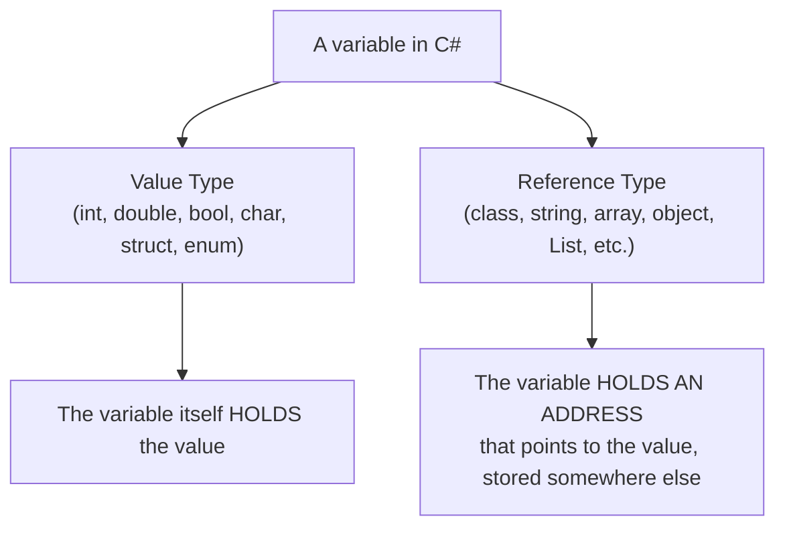

**Simple way to remember it:**
- **Value type** = the variable **IS** the box with the value inside it.
- **Reference type** = the variable **IS** a piece of paper with an address written on it. The real box is somewhere else (on the heap).

---

## 2. Value Types — Step by Step

### Code

```csharp
int x = 10;
int y = x;   // y gets its OWN COPY of the value
y = 20;      // change y only

Console.WriteLine(x); // 10
Console.WriteLine(y); // 20
```

### What happens in memory — step by step

**Step 1: `int x = 10;`**

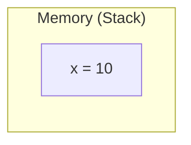

**Step 2: `int y = x;` — a full, separate copy is made**

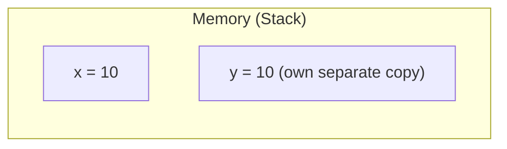

**Step 3: `y = 20;` — only `y`'s own box changes**

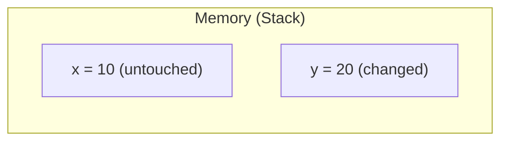

### Result

| Variable | Value |
|---|---|
| `x` | `10` — **unchanged** |
| `y` | `20` — **changed** |

**Why:** `y = x` made a **brand-new, separate copy** of the value. `x` and `y` are two completely separate boxes. Changing one never touches the other.

---

## 3. Reference Types — Step by Step

### Code

```csharp
Customer c1 = new Customer { Name = "Alice" };
Customer c2 = c1;          // c2 gets a COPY OF THE ADDRESS, not a new object
c2.Name = "Bob";           // change through c2

Console.WriteLine(c1.Name); // "Bob"  <-- changed too!
Console.WriteLine(c2.Name); // "Bob"
```

### What happens in memory — step by step

**Step 1: `Customer c1 = new Customer { Name = "Alice" };`**

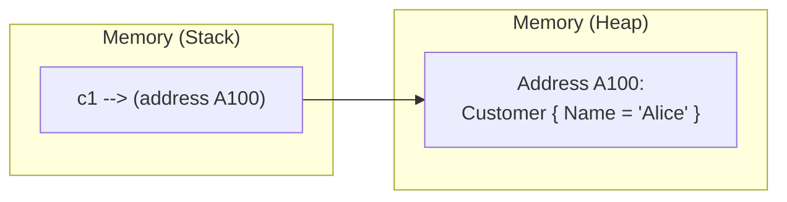

**Step 2: `Customer c2 = c1;` — the ADDRESS is copied, not the object**

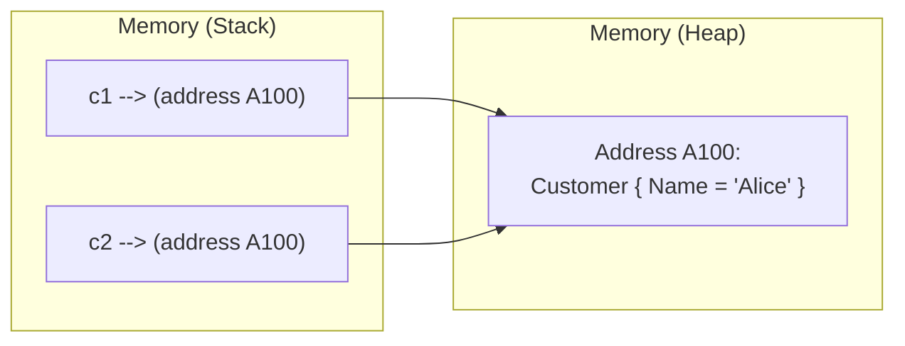

Notice: **there is still only ONE object.** Both `c1` and `c2` point at the exact same address.

**Step 3: `c2.Name = "Bob";` — the object itself is changed**

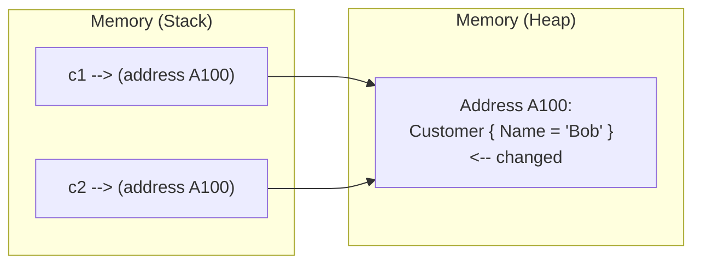

### Result

| Variable | `.Name` value |
|---|---|
| `c1.Name` | `"Bob"` — **changed, even though we only touched `c2`!** |
| `c2.Name` | `"Bob"` |

**Why:** `c2 = c1` copied the **address only**, not the object. `c1` and `c2` are two different pieces of paper, but they point at the **same house**. Changing something inside the house (`c2.Name = "Bob"`) means anyone holding the address to that house sees the change — including `c1`.

---

## 4. Side-by-Side Comparison

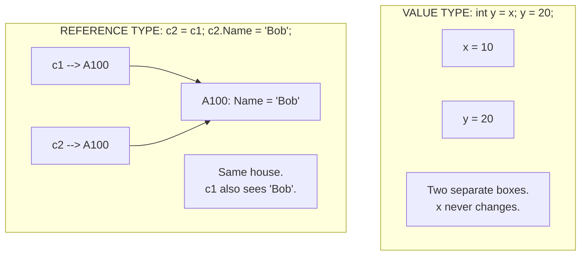

| | Value Type (`int`, `struct`, `bool`...) | Reference Type (`class`, `string` object, `List<T>`...) |
|---|---|---|
| What the variable holds | The actual value | An address pointing to the value |
| Assigning (`b = a`) | Makes a full, separate copy | Copies the address only — both point to the same object |
| Changing one variable's value | Only that variable changes | The object changes, so **every** variable pointing to it sees the change |
| Where it lives | Stack (usually) | Heap |

---

## 5. What Happens When You Pass Them Into a Method

This is where most confusion happens. Let's go very slowly.

### 5.1 Value type passed into a method (normal, "by value")

```csharp
void TryToChange(int number)
{
    number = 999;   // only changes the LOCAL copy inside this method
}

int myNumber = 5;
TryToChange(myNumber);
Console.WriteLine(myNumber); // still 5
```

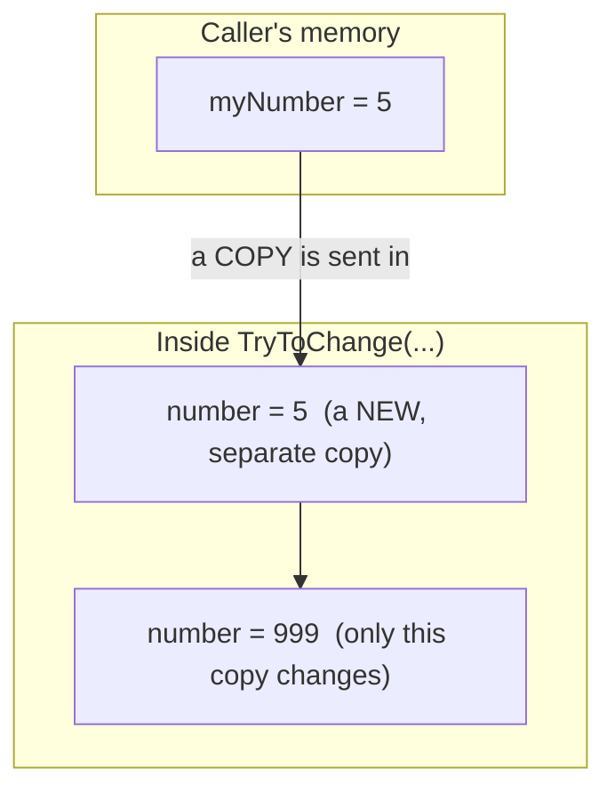

**Result:** `myNumber` is still `5`. The method only had a copy. Nothing about the original was touched.

---

### 5.2 Reference type passed into a method — changing its CONTENTS

```csharp
void AddItem(List<string> items)
{
    items.Add("New Item");   // changes the object itself, through the address
}

List<string> myList = new List<string> { "A", "B" };
AddItem(myList);
Console.WriteLine(myList.Count); // 3  <-- changed!
```

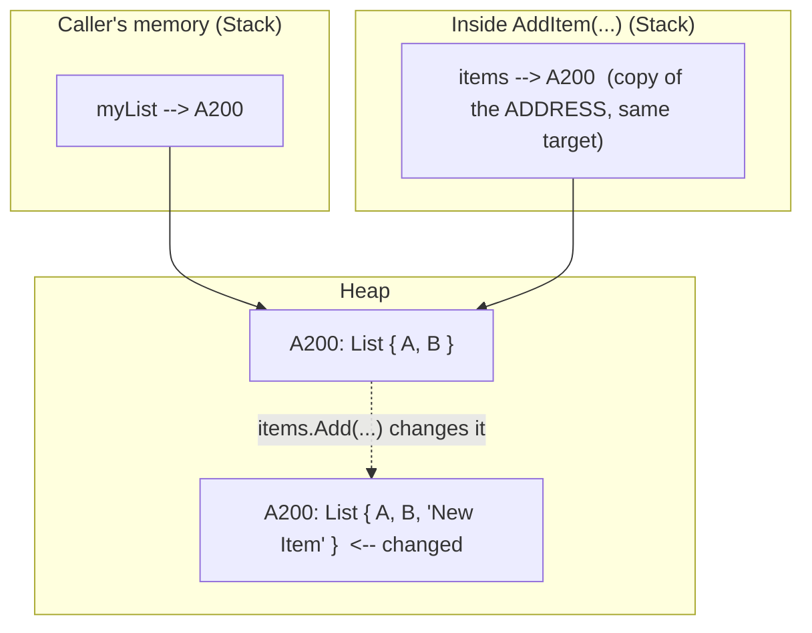

**Result:** `myList` now has 3 items too. Both `myList` and `items` pointed to the **same** list object. Changing the object's contents through `items` is visible through `myList` as well.

---

### 5.3 Reference type passed into a method — REPLACING it with a new object (a common trap!)

```csharp
void Replace(List<string> items)
{
    items = new List<string> { "Replaced" };  // items now points somewhere ELSE
    // this does NOT affect the caller at all
}

List<string> myList = new List<string> { "A", "B" };
Replace(myList);
Console.WriteLine(myList.Count); // still 2, NOT "Replaced"!
```

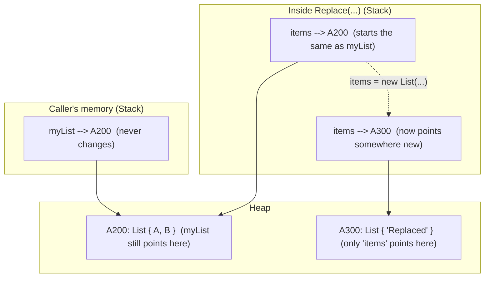

**Result:** `myList` is **unchanged** — still has `{ "A", "B" }`.

**Why:** `items = new List<string> { "Replaced" }` did not change the object. It made `items` point to a **completely new, different** object. `myList`, back in the caller, never knew about this — it still points to the old address (A200).

---

## 6. The Golden Rule (memorize this)

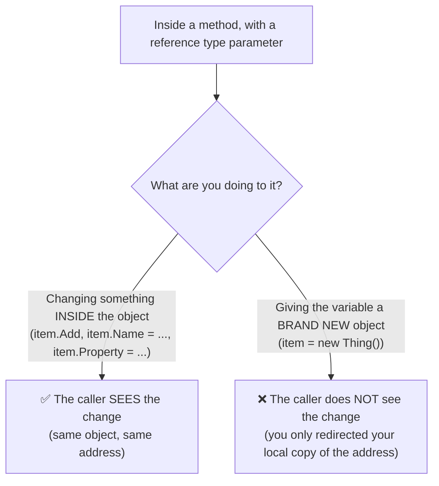

**In one sentence:**
> Changing the **inside** of an object is shared. Replacing the **whole object** is not shared.

This exact rule also applies to `struct` (value type) fields, but with one extra twist — see the next section.

---

## 7. Bonus: `ref` Makes a Value Type Behave Like It's Shared

Normally, value types are always copied. But you can force real sharing using the `ref` keyword.

```csharp
void DoubleIt(ref int number)
{
    number *= 2;   // this changes the CALLER's real variable, not a copy
}

int myNumber = 5;
DoubleIt(ref myNumber);
Console.WriteLine(myNumber); // 10  <-- changed!
```

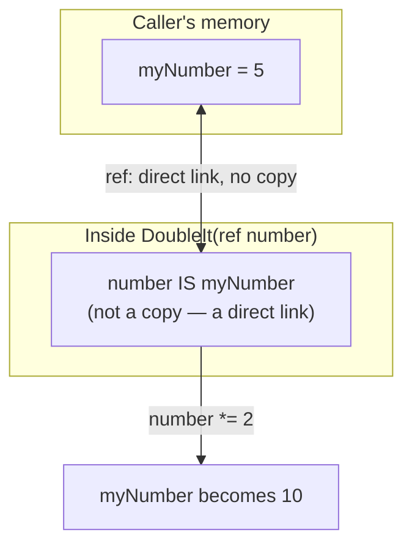

**Why this matters:** `ref` is the exception to the normal value-type rule. Without `ref`, value types are always copied. With `ref`, you are telling C# "do not copy — work directly on the caller's real variable."

---

## 8. Quick Reference Table — All Cases Together

| Scenario | Does the caller's original data change? |
|---|---|
| `int y = x; y = 99;` | ❌ No — `x` untouched, separate copies |
| `void M(int x) { x = 99; }` | ❌ No — method has its own copy |
| `void M(ref int x) { x = 99; }` | ✅ Yes — `ref` links directly to the caller's variable |
| `Customer c2 = c1; c2.Name = "Bob";` | ✅ Yes — `c1` and `c2` point to the same object |
| `void M(Customer c) { c.Name = "Bob"; }` | ✅ Yes — changing the object's contents is shared |
| `void M(Customer c) { c = new Customer(); }` | ❌ No — only redirected the local copy of the address |
| `void M(List<T> list) { list.Add(x); }` | ✅ Yes — changing the list's contents is shared |
| `void M(List<T> list) { list = new List<T>(); }` | ❌ No — only redirected the local copy of the address |

---

## 9. Why Backend Developers Must Know This

- **Entity Framework Core entities** are classes (reference types). If you load a `Customer` entity and pass it into three different service methods, and one of them changes `customer.Email`, **all three places** see the updated email — because they all point to the same object. This is often exactly what you want, but it can also cause bugs if you're not expecting it.
- **DTOs and value objects** are sometimes made as `struct` (value type) on purpose, exactly so that copies stay independent and nothing gets accidentally shared.
- Interviewers use this topic constantly to check if you truly understand memory behavior, not just syntax.

---

## 10. Try It Yourself — 5 Quick Questions (no answers given yet)

1. Predict the output:
```csharp
int a = 1;
int b = a;
b = 2;
Console.WriteLine(a);
```

2. Predict the output:
```csharp
List<int> list1 = new List<int> { 1, 2 };
List<int> list2 = list1;
list2.Add(3);
Console.WriteLine(list1.Count);
```

3. Predict the output:
```csharp
void Change(List<int> list)
{
    list = new List<int> { 99 };
}
List<int> numbers = new List<int> { 1, 2 };
Change(numbers);
Console.WriteLine(numbers.Count);
```

4. Predict the output:
```csharp
void Increase(ref int x)
{
    x = x + 10;
}
int value = 5;
Increase(ref value);
Console.WriteLine(value);
```

5. Explain, in your own words, why changing `.Name` on a passed-in `Customer` object updates the caller's object, but reassigning the parameter to `new Customer()` does not.

---

## 11. More Predict-the-Output Exercises (11–20)

Same style as before — read the code, predict the output, write down **why**, before checking with me.

6. Predict the output:
```csharp
struct Point { public int X; }

Point p1 = new Point { X = 5 };
Point p2 = p1;
p2.X = 100;
Console.WriteLine(p1.X);
Console.WriteLine(p2.X);
```

7. Predict the output:
```csharp
int[] numbers1 = { 1, 2, 3 };
int[] numbers2 = numbers1;
numbers2[0] = 999;
Console.WriteLine(numbers1[0]);
```
*(Hint: arrays are reference types, even arrays of value types like `int`!)*

8. Predict the output:
```csharp
void Modify(int[] arr)
{
    arr[0] = 111;        // changes contents
    arr = new int[] { 5, 5, 5 };  // then replaces the reference
}
int[] data = { 1, 2, 3 };
Modify(data);
Console.WriteLine(data[0]);
```

9. Predict the output:
```csharp
class Counter { public int Value; }

void Increment(Counter c)
{
    c.Value++;
}

Counter counter = new Counter { Value = 0 };
Increment(counter);
Increment(counter);
Increment(counter);
Console.WriteLine(counter.Value);
```

10. Predict the output:
```csharp
struct Counter { public int Value; }

void Increment(Counter c)
{
    c.Value++;
}

Counter counter = new Counter { Value = 0 };
Increment(counter);
Increment(counter);
Increment(counter);
Console.WriteLine(counter.Value);
```
*(Compare this to Question 9 — same code style, but `struct` instead of `class`. Why is the result different?)*

11. Predict the output:
```csharp
void Increment(ref Counter c)   // assume Counter is a struct, like Question 10
{
    c.Value++;
}
Counter counter = new Counter { Value = 0 };
Increment(ref counter);
Increment(ref counter);
Console.WriteLine(counter.Value);
```

12. Predict the output:
```csharp
List<int> original = new List<int> { 1, 2, 3 };
List<int> copy = new List<int>(original);   // this constructor makes a NEW list with the same items
copy.Add(4);
Console.WriteLine(original.Count);
Console.WriteLine(copy.Count);
```

13. Predict the output:
```csharp
string s1 = "Hello";
string s2 = s1;
s2 = s2 + " World";
Console.WriteLine(s1);
Console.WriteLine(s2);
```
*(Tricky! `string` is a reference type, but strings cannot be changed after creation. Why doesn't `s1` change here?)*

14. Predict the output:
```csharp
class Order { public List<string> Items = new List<string>(); }

void AddItem(Order order, string item)
{
    order.Items.Add(item);
}

Order o1 = new Order();
Order o2 = o1;   // o2 points to the SAME order
AddItem(o1, "Book");
AddItem(o2, "Pen");
Console.WriteLine(o1.Items.Count);
```

15. Predict the output:
```csharp
void SwapValues(int a, int b)
{
    int temp = a;
    a = b;
    b = temp;
}
int x = 1, y = 2;
SwapValues(x, y);
Console.WriteLine($"{x}, {y}");
```

---

## 12. Scenario-Based Practice Questions (10 Questions)

These are real backend-style situations. For each one: predict what happens, explain **why** using value-type/reference-type rules, and (where asked) fix the bug. Send me your answers and I will review them.

**Scenario 1 — The "Disappearing Discount" Bug**
Your `ApplyDiscount` method is supposed to reduce an order's total by 10%, but after calling it, the order's `Total` in the calling code never changes.
```csharp
class Order { public decimal Total; }

void ApplyDiscount(Order order)
{
    order = new Order { Total = order.Total * 0.9m };
}

Order myOrder = new Order { Total = 100m };
ApplyDiscount(myOrder);
Console.WriteLine(myOrder.Total); // still 100, not 90!
```
Explain exactly why this bug happens, and rewrite `ApplyDiscount` so it correctly updates `myOrder.Total` to 90.

---

**Scenario 2 — Shared Shopping Cart Surprise**
Two customer service reps in your app both hold a reference to the same `ShoppingCart` object by mistake (a bug elsewhere in the code gave them the same object instead of separate ones).
```csharp
class ShoppingCart { public List<string> Items = new List<string>(); }

ShoppingCart repACart = new ShoppingCart();
ShoppingCart repBCart = repACart;   // bug: should have been a new cart!

repACart.Items.Add("Laptop");
repBCart.Items.Add("Mouse");

Console.WriteLine(repACart.Items.Count);
```
What does this print, and why? Then explain how you would create `repBCart` as a **separate, independent** cart instead.

---

**Scenario 3 — The Loop Variable Trap**
You are building a list of `Employee` objects with different bonus values.
```csharp
class Employee { public string Name; public decimal Bonus; }

List<Employee> employees = new List<Employee>
{
    new Employee { Name = "Alice", Bonus = 0 },
    new Employee { Name = "Bob", Bonus = 0 }
};

void GiveBonus(Employee emp, decimal amount)
{
    emp.Bonus += amount;
}

foreach (var emp in employees)
{
    GiveBonus(emp, 500);
}

foreach (var emp in employees)
{
    Console.WriteLine($"{emp.Name}: {emp.Bonus}");
}
```
Predict the printed output. Explain why `GiveBonus` is able to update each employee correctly, using what you know about reference types.

---

**Scenario 4 — Struct in a List (a real trap)**
```csharp
struct Point { public int X; public int Y; }

List<Point> points = new List<Point> { new Point { X = 1, Y = 1 } };

void MovePoint(Point p)
{
    p.X += 10;
    p.Y += 10;
}

MovePoint(points[0]);
Console.WriteLine(points[0].X);
```
What gets printed, and why? Then explain what you would need to change (either the method, or how you call it) if you actually wanted `points[0]` to be updated.

---

**Scenario 5 — Config Object Shared Across Requests**
Imagine a (bad) singleton-style configuration object shared across an entire backend app:
```csharp
class AppConfig { public int MaxRetries; }

class RequestHandlerA
{
    private AppConfig _config;
    public RequestHandlerA(AppConfig config) { _config = config; }
    public void Handle() { _config.MaxRetries = 5; }
}

class RequestHandlerB
{
    private AppConfig _config;
    public RequestHandlerB(AppConfig config) { _config = config; }
    public void ReportRetries() { Console.WriteLine(_config.MaxRetries); }
}

AppConfig sharedConfig = new AppConfig { MaxRetries = 3 };
var handlerA = new RequestHandlerA(sharedConfig);
var handlerB = new RequestHandlerB(sharedConfig);

handlerA.Handle();
handlerB.ReportRetries();
```
What gets printed? Explain, using reference-type rules, why `RequestHandlerB` sees a value that `RequestHandlerA` set — even though they are different objects. Is sharing a single config object like this generally a good idea or a risky one in a real backend app? Why?

---

**Scenario 6 — Copying a Customer Before Editing**
You want to let a user preview changes to their profile before saving. You must NOT touch the original `Customer` object until the user confirms.
```csharp
class Customer { public string Name; public string Email; }

Customer original = new Customer { Name = "Alice", Email = "alice@old.com" };

// BUG: this does not actually create an independent preview copy
Customer preview = original;
preview.Email = "alice@new.com";

Console.WriteLine(original.Email);
```
Explain why `original.Email` gets changed too, even though we only touched `preview`. Then write a corrected version that creates a truly independent `preview` object, so `original.Email` stays `"alice@old.com"` until the user confirms.

---

**Scenario 7 — Passing a Struct vs a Class Into a Validation Method**
```csharp
struct Money { public decimal Amount; }
class Wallet { public decimal Balance; }

void Deduct(Money m, decimal amount) { m.Amount -= amount; }
void Deduct(Wallet w, decimal amount) { w.Balance -= amount; }

Money money = new Money { Amount = 100 };
Deduct(money, 30);
Console.WriteLine(money.Amount);

Wallet wallet = new Wallet { Balance = 100 };
Deduct(wallet, 30);
Console.WriteLine(wallet.Balance);
```
Predict both printed values. Explain why the two `Deduct` methods behave completely differently, even though they look almost identical.

---

**Scenario 8 — Resetting a List Between API Calls**
A method is supposed to clear out a list of error messages between requests, but the caller keeps seeing old errors pile up.
```csharp
class RequestContext { public List<string> Errors = new List<string>(); }

void ResetErrors(RequestContext ctx)
{
    ctx = new RequestContext();   // bug!
}

RequestContext context = new RequestContext();
context.Errors.Add("Old error 1");
context.Errors.Add("Old error 2");

ResetErrors(context);
Console.WriteLine(context.Errors.Count);
```
What gets printed, and why doesn't `ResetErrors` actually reset anything for the caller? Fix the method so calling it truly empties `context.Errors` for the caller.

---

**Scenario 9 — Array of Structs vs Array of Classes**
```csharp
struct Pixel { public int Brightness; }
class Cell { public int Value; }

Pixel[] pixels = new Pixel[3];         // 3 pixels, all Brightness = 0 by default
Cell[] cells = new Cell[3];            // 3 slots, but all NULL by default (not objects yet!)

pixels[0].Brightness = 50;             // does this work directly?
// cells[0].Value = 50;                // would this line even compile? why or why not?

Console.WriteLine(pixels[0].Brightness);
```
Explain why `pixels[0].Brightness = 50;` works directly, but the commented-out `cells[0].Value = 50;` line would actually crash (or not compile logically) unless you first do `cells[0] = new Cell();`. Connect this back to the default-value rules from Topic 1 and the value/reference rules from this document.

---

**Scenario 10 — Designing a Safe "UpdateProfile" Method**
You are asked to design a method for a real backend service:
```csharp
class UserProfile
{
    public string DisplayName;
    public string Bio;
}
```
Requirement: `UpdateProfile(UserProfile currentProfile, UserProfile newValues)` should apply only the non-null fields from `newValues` onto `currentProfile`, so the caller's original `currentProfile` object is correctly updated in place (not replaced with a new object).

Write this method correctly, using what you now know about reference types, so that after calling it, the caller's `currentProfile` object reflects the updates. Explain, in a short comment, why you must update `currentProfile`'s fields directly, rather than doing `currentProfile = newValues;` inside the method.

---

## 13. How We'll Review Your Answers

For each exercise and scenario, send me:
- Your **predicted output** (for the predict-the-output ones)
- Your **explanation**, in your own words, of why
- Your **fixed/corrected code**, where the scenario asks for one

I'll check your reasoning, correct any misunderstanding, and point out anything you should look at again before we move on.
